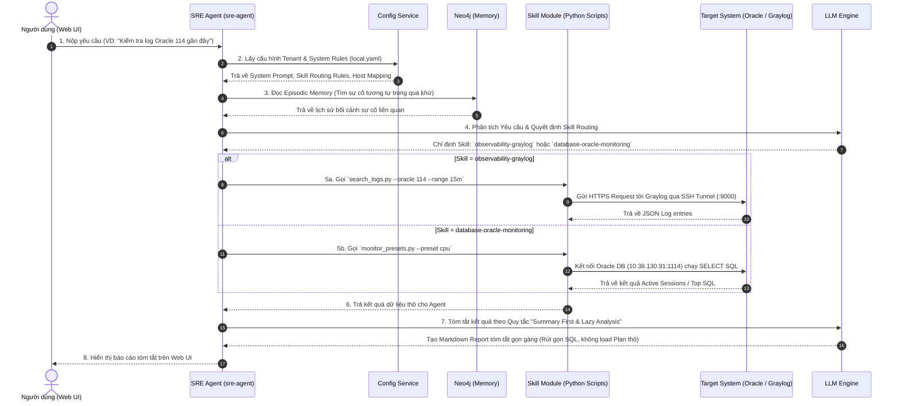
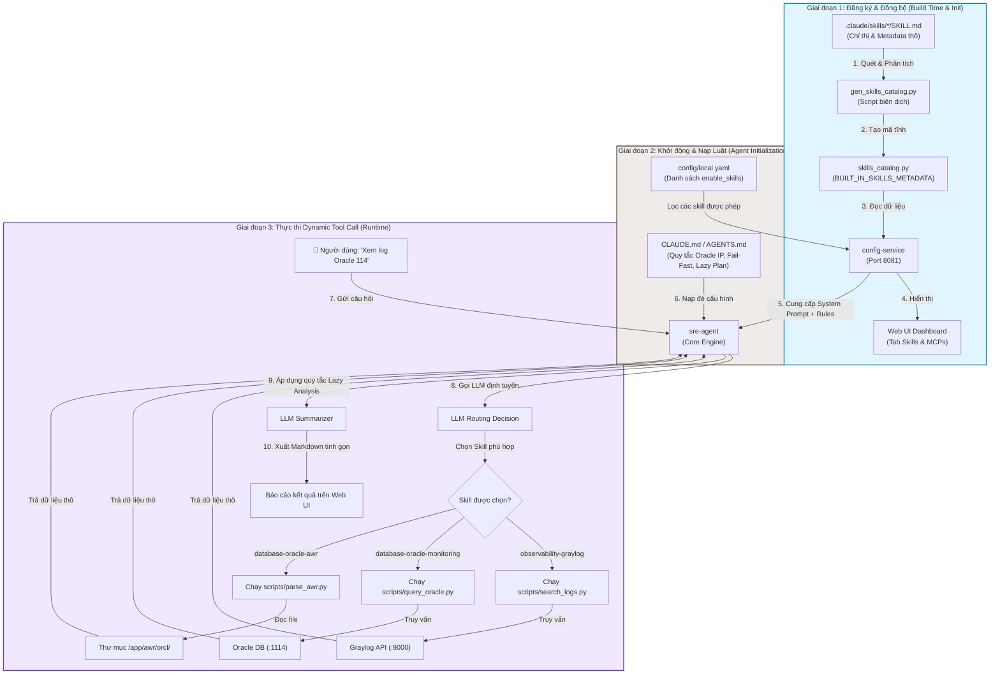

# Tài Liệu Kiến Trúc & Sơ Đồ Luồng Hoạt Động Nền Tảng OpenSRE

Tài liệu này mô tả chi tiết sơ đồ kiến trúc container, luồng xử lý dữ liệu hệ thống (Agentic Flow) và cơ chế vận hành của `CLAUDE.md` cùng các Skill Modules trong nền tảng **OpenSRE**.

---

## 1. Sơ Đồ Kiến Trúc Các Container & Luồng Kết Nối Mạng (Container Architecture Diagram)

Hệ thống OpenSRE được đóng gói theo mô hình Microservices bằng Docker Compose, bao gồm các thành phần cốt lõi và các kết nối tích hợp ngoại vi.

```mermaid
flowchart TB
    subgraph Client_Layer ["1. Client Layer"]
        User UI["👤 User / Browser"]
    end

    subgraph OpenSRE_Container_Stack ["2. OpenSRE Container Stack (Host: 10.38.130.95)"]
        direction TB
        WebUI["web-ui (Next.js)<br/>Port: 3002"]
        ConfigSVC["config-service (FastAPI)<br/>Port: 8081"]
        SREAgent["sre-agent (Claude Agent SDK Engine)<br/>Port: 8001"]
        
        subgraph Persistence ["Persistence Layer"]
            PostgreSQL[("opensre-postgres<br/>PostgreSQL 15<br/>Port: 5433")]
            Neo4j[("opensre-neo4j<br/>Knowledge Graph & Episodic Memory<br/>Port: 7475/7688")]
        end
    end

    subgraph Target_Infrastructure ["3. Target Infrastructure & Integrations"]
        OracleDB[("🗄️ Oracle DB (10.38.130.91:1114)<br/>Instance: orcl")]
        
        subgraph Tunnel_Bridge ["Local VPN Tunnel Bridge"]
            SSHTunnel["SSH Remote Tunnel<br/>(ssh -R 0.0.0.0:9000...)"]
            LocalVPN["Local Machine VPN<br/>(dongntp)"]
            GraylogServer[("📊 Graylog Server<br/>(graylog.onepay.vn:443)<br/>IP: 192.168.166.109")]
        end
        
        LLMProvider["🧠 LLM Engine / Proxy<br/>(vLLM / LiteLLM / Anthropic)"]
    end

    %% Flow Connections
    User UI -->|HTTP / Request| WebUI
    WebUI -->|REST API / Async Stream| SREAgent
    WebUI -->|Config REST API| ConfigSVC
    
    ConfigSVC -->|Save/Load Config| PostgreSQL
    ConfigSVC -->|Hot-Reload local.yaml| SREAgent
    
    SREAgent -->|Load System Rules & Prompts| ConfigSVC
    SREAgent -->|Query Episodic Memory & Graph| Neo4j
    SREAgent -->|Send Inference Prompts| LLMProvider
    
    SREAgent -->|Direct SQL / Python Driver| OracleDB
    SREAgent -->|https://host.docker.internal:9000| SSHTunnel
    SSHTunnel -->|Forward via Local VPN| LocalVPN
    LocalVPN -->|HTTPS 443| GraylogServer
```

---

## 2. Sơ Đồ Luồng Hoạt Động Xử Lý Sự Cố (Agentic Execution Sequence Diagram)

Sơ đồ thể hiện chuỗi hoạt động từ khi người dùng nhập câu hỏi trên Web UI cho đến khi AI Agent phân tích, gọi Skill, lấy dữ liệu và trả về kết quả tóm tắt.



---

## 3. Sơ Đồ & Cơ Chế Hoạt Động Của `CLAUDE.md` Và Skill Modules

Cơ chế vận hành của Skill Modules được phân tách thành 3 giai đoạn rõ rệt: Đăng ký thiết kế (Build time), Nạp cấu hình (Initialization), và Thực thi động (Runtime).



### 💡 Chi Tiết Cơ Chế Hoạt Động Của `CLAUDE.md` & Skill Modules:

1. **Khai báo & Khám phá Skill (Skill Discovery):**
   * Mỗi Skill được đóng gói riêng biệt trong thư mục `.claude/skills/<skill-name>/`.
   * File `SKILL.md` khai báo metadata bao gồm `name`, `description`, `allowed-tools` và các chỉ thị thực thi chuẩn.
   * Khi `sre-agent` khởi động, `SkillRegistry` tự động quét và nạp toàn bộ cấu hình từ các file `SKILL.md`.

2. **Ánh xạ Quy tắc (Rule Mapping & Enforcement):**
   * **`CLAUDE.md` / `AGENTS.md`** là cấp quy tắc cao nhất. Nó nạp vào System Prompt của Agent trước mọi phản hồi.
   * Khi người dùng hỏi *"Oracle 114 có lỗi gì không?"*:
     1. Agent đối chiếu quy tắc `CLAUDE.md`: `oracle 114` ➔ IP `10.36.88.114`.
     2. Agent đối chiếu chỉ thị Skill Routing: Câu hỏi về lỗi/log ➔ Chọn skill `observability-graylog`.
     3. Agent gọi script `search_logs.py --oracle 114 --range 15m`.
     4. Áp dụng quy tắc `Fail-Fast` và `Summary First` để trả về báo cáo tóm tắt trên Web UI.

---

## 4. Tóm Tắt Các Điểm Tối Ưu Hệ Thống Đã Áp Dụng

| Hạng Mục Tối Ưu | Trạng Thế Trước Đây | Cấu Hình Đã Tối Ưu Hiện Tại |
|---|---|---|
| **Kết nối Graylog qua Server 95** | Bị từ chối do `GatewayPorts no` và IP bị chặn port 443 | Bật `GatewayPorts yes` + Dùng SSH Tunnel `-R` bắc cầu qua VPN Máy Local |
| **Phân giải DNS Docker** | `host.docker.internal` không nhận ở ngoài Docker | Đã thêm `127.0.0.1 host.docker.internal` vào `/etc/hosts` server 95 |
| **Nạp cấu hình `.env` Docker** | Container ngậm config cũ 18h trước gây lỗi 404 | Đã thực thi `docker compose up -d --force-recreate` để nạp config chuẩn |
| **Xử lý Execution Plan / Long SQL** | AI tự động kéo Plan 182 dòng gây lặp loop và treo | Áp dụng quy tắc **Summary First & Lazy Analysis**: Tóm tắt trước, chỉ phân tích sâu khi user yêu cầu |
