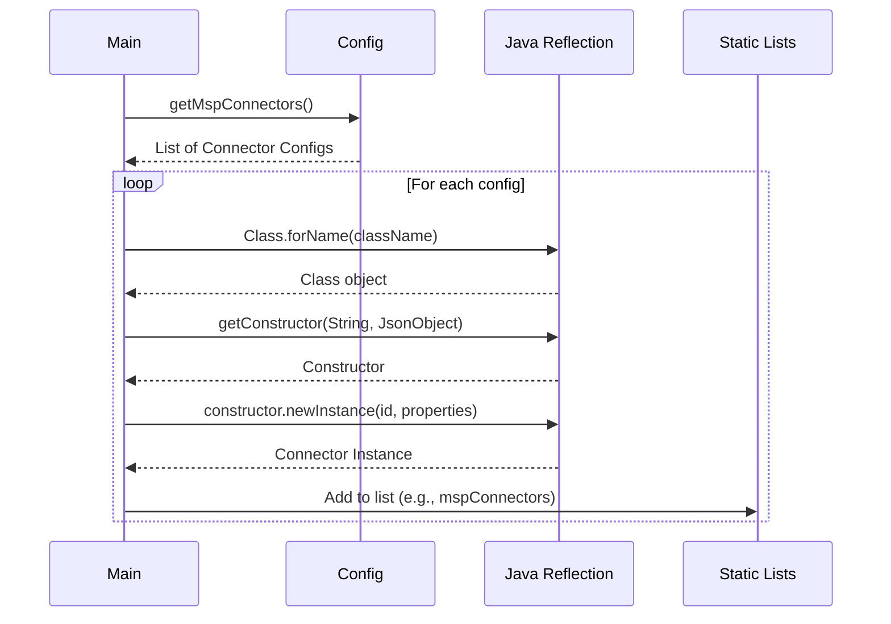
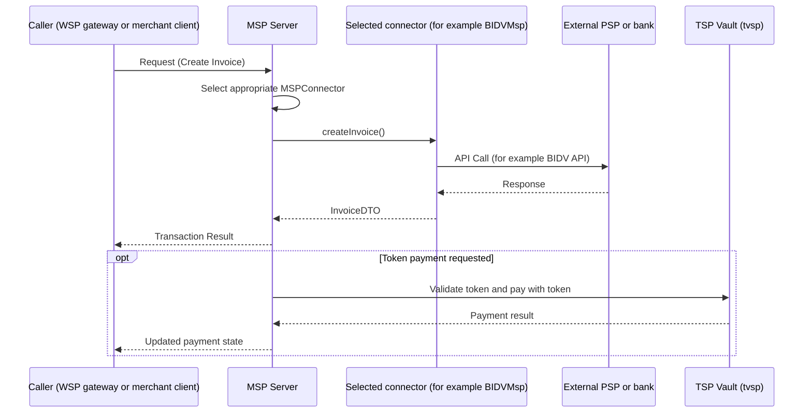

The MSP (Merchant Service Provider) system implements the Strategy Pattern to decouple payment processing logic from specific provider integrations. This architecture allows the system to support various third-party payment providers (PSPs), banks, and internal services through a pluggable and extensible architecture.

## Core Concept

The system defines a set of abstract connector classes (strategies) that outline the operations required for different stages of a transaction lifecycle. Concrete implementations of these classes encapsulate the specific logic for interacting with a particular provider.

This approach ensures that the core payment processing logic remains consistent, while integration details are isolated to new connector classes. New providers can be supported by simply adding new connector implementations without modifying the core engine.

## Abstract Connectors

The system defines several abstract connector classes in `src/main/java/vn/onepay/msp/connectors/`, each representing a specific role or operation type:

### MSPConnector
The primary interface for Merchant Service Providers. It handles the core creation and management of invoices and payments.
*   `createInvoice`: Initializes a new transaction.
*   `getInvoice`: Retrieves invoice details.
*   `createPayment`: Processes a payment for an existing invoice.
*   `updatePayment`: Updates the state of a payment (e.g., settlement, capture).

### RSPConnector (Refund Service Provider)
Handles refund operations.
*   `createRefund`: Initiates a refund.
*   `createRefund2`: Initiates a refund with additional PSP request parameters (optional override).
*   `enquiryRefund`: Checks the status of a refund.

### CSPConnector (Capture Service Provider)
Manages capture operations, typically used in delayed capture scenarios.
*   `createCapture`: Captures funds.
*   `enquiryCapture`: Checks capture status.
*   `retryCapture`: Retries a failed capture.

### PSPConnector (Payment Service Provider)
Deals with approval and OTP verification flows.
*   `approveOrder`: Approves an order.
*   `voidOrder`: Voids an order at the PSP level.
*   `verifyOTP`: Verifies a one-time password.

### VoidConnector
Handles void transactions.
*   `createVoid`: Initiates a void.
*   `enquiryVoid`: Checks void status.

### BillRspConnector
Handles refund operations specifically for billing integrations.
*   `createRefund`: Initiates a bill refund.

### MerchantConnector
Provides merchant-specific logic.
*   `checkInvoice`: Checks or validates invoice details against merchant-specific rules.

### ClientConnector
A base for client-specific logic.
*   `refund`: Provides a default no-op implementation for refunds unless overridden by a concrete client connector.

## Concrete Implementations

Concrete connectors are organized into subdirectories based on the provider type or category:

### `notonus/`
Contains implementations for external providers where OnePAY is not the merchant of record or for specific bank integrations.
*   **BIDV**: `BIDVMsp` (MSP), `BIDVRsp` (RSP) - BIDV Bank integration.
*   **E-Shop**: `EShopMsp` (MSP) - E-Service Provider integration.
*   **ESP**: `ESPMsp` (MSP) - ESP integration.
*   **VCB**: `VCBMsp` (MSP) - Vietcombank integration.
*   **OneComm**: `OnecommMsp` (MSP) - Internal OneComm integration.
*   **Momo**: `MoMoRsp`, `MoMoRspV2` (RSP) - MoMo integration.
*   **MSB**: `MsbRsp` (RSP) - MSB integration.
*   **ShopeePay**: `ShopeepayRsp` (RSP) - ShopeePay integration.
*   **SmartPay**: `SmartPayRsp` (RSP) - SmartPay integration.
*   **UnionPay**: `UnionpayQrRsp` (RSP), `UnionpayQrVoid` (Void) - UnionPay QR integration.
*   **VIB**: `VIBRsp` (RSP) - VIB integration.
*   **Vietin**: `VIETINQRRsp` (RSP) - VietinBank QR integration.
*   **ZaloPay**: `ZalopayRsp` (RSP) - ZaloPay integration.

### `onus/`
Contains implementations where OnePAY acts as the Merchant of Record or handles the core processing.
*   **OnePAY**: `OnePAYMsp` (MSP) - The primary internal connector for OnePAY transactions.
*   **OnePAY RSP**: `OnePAYRsp` (RSP) - Internal refund processing.
*   **OnePAY WSP**: `WSPRsp` (RSP), `WSPCsp` (CSP), `WSPVoid` (Void) - WSP specific integrations.

### `merchants/`
Contains connector implementations for specific merchant needs.
*   **ChuDu**: `ChuDu` (MerchantConnector) - Specific logic for the ChuDu merchant.

### `onebill/`
Contains implementations for specific billing integrations.
*   **VCB**: `VcbRsp` (BillRspConnector) - VCB billing refund connector.
*   `Convert` - Utility class for data conversion.

## Initialization and Injection

The system uses a dynamic initialization process in `Main.java` using reflection:

1.  **Configuration Loading**: Connector definitions are loaded from the configuration file (`config.json`). Each connector type has a corresponding configuration array (e.g., `mspConnectors`, `rspConnectors`).
2.  **Reflection-Based Instantiation**: The system iterates over the configuration array. For each entry, it reads the fully qualified class name (`class`), retrieves the constructor, and instantiates the connector, passing the `id` and `properties`.
3.  **Registry**: Instantiated connectors are stored in static lists within `Main` (e.g., `Main.mspConnectors`, `Main.rspConnectors`, `Main.cspConnectors`, etc.).

Caption: Main->>Config: getMspConnectors

*Startup sequence: Main instantiates each configured connector class via reflection and registers it in the static connector lists.*

## Usage in Processing Flow

When a request arrives (e.g., create invoice), the system iterates through the registered connectors to find one that can handle the specific request type or merchant configuration.

Caption: Caller->>Server: Request Create Invoice

*Request flow: an upstream caller reaches MSP, which selects a connector strategy to talk to the provider, and delegates tokenized payments to TSP Vault.*

This architecture enables the MSP system to scale and adapt to new payment methods or provider requirements with minimal changes to the core codebase.
