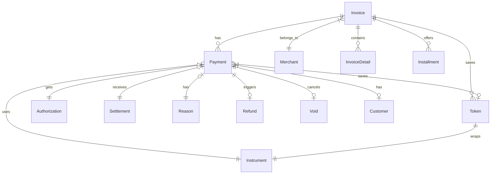

# Data Model & Schema

This document provides an overview of the core domain model used in the system. The model is primarily defined by Data Transfer Objects (DTOs) in the `vn.onepay.msp.dao` package.

## Core Entities

The system's data model revolves around several key entities that represent different stages and aspects of a payment transaction.

### Invoice

The `Invoice` entity represents a billing request or a shopping cart. It acts as the parent container for one or more payment attempts.

*   **Responsibility**: Represents the total amount to be paid, merchant details, and customer information for a transaction session.
*   **Key Fields**:
    *   `id`: Unique identifier.
    *   `state`: Current status (e.g., `created`, `pending`, `paid`, `unpaid`).
    *   `amount`: Total amount requested.
    *   `currencies`: Accepted currencies.
    *   `merchantId` / `merchant`: Associated merchant details.
    *   `payments`: A list of `Payment` objects associated with this invoice.
    *   `details`: A list of `InvoiceDetail` items (line items).
    *   `tokens`: A list of `Token` objects (saved payment instruments).
    *   `installments`: A list of `Installment` objects (installment plan configurations).
*   **Relationships**:
    *   Has many **Payments**.
    *   Belongs to a **Merchant**.
    *   Contains many **Invoice Details**.
    *   May contain **Tokens** (saved payment instruments).
    *   May contain **Installments** (installment plan configurations).

### Payment

The `Payment` entity represents a single attempt to pay an invoice. An invoice can have multiple payment attempts if the initial ones fail or are partial.

*   **Responsibility**: Tracks the lifecycle of a specific payment transaction, including the instrument used and the authorization status.
*   **Key Fields**:
    *   `id`: Unique identifier.
    *   `invoiceId`: Reference to the parent `Invoice`.
    *   `state`: Status (e.g., `created`, `pending`, `settled`, `authorized`, `captured`).
    *   `amount`: Amount for this specific payment.
    *   `currency`: Currency code.
    *   `instrument`: The `Instrument` used for payment (card, wallet, etc.).
    *   `authorization`: Authorization details if applicable.
    *   `settlement`: Settlement details after successful processing.
    *   `token`: Saved token used for this payment.
    *   `customer`: Customer details associated with this payment.
*   **Relationships**:
    *   Belongs to an **Invoice**.
    *   Has one **Instrument**.
    *   Has one **Authorization** (optional).
    *   Has one **Settlement** (optional).
    *   Has one **Token** (optional).
    *   Has one **Reason** (optional, for failure reasons).
    *   Has one **Refund** (optional, parent reference).
    *   Has one **Customer** (optional).

### Instrument

The `Instrument` entity represents the payment method used, such as a credit card, debit card, or digital wallet.

*   **Responsibility**: Stores details about the payment instrument, masking sensitive information where necessary.
*   **Key Fields**:
    *   `type`: Type of instrument (e.g., card, wallet).
    *   `number`: Masked card number or account identifier.
    *   `name`: Name on the card/account.
    *   `brandId` / `brandName`: Card brand (Visa, MasterCard, etc.).
    *   `issuerName` / `swiftCode`: Issuing bank details.
    *   `month` / `year`: Expiry date.
    *   `authType`: Authentication type used (3DS, etc.).
    *   `mobileNumber`: For mobile-based instruments.
    *   `challengeCode`: For 3D Secure challenges.
    *   `email`: Email address associated with the instrument.
    *   `cardId`: Unique identifier for the card.
    *   `cardNumId`: Identifier for the card number.
    *   `bankVersion`: Version of the bank's system.

### Merchant

The `Merchant` entity represents the business or organization accepting the payment.

*   **Responsibility**: Holds configuration and identity details for the merchant.
*   **Key Fields**:
    *   `id`: Unique identifier.
    *   `name`: Merchant name.
    *   `categoryCode`: Merchant Category Code (MCC).
    *   `countryCode`: Country of operation.
    *   `accessCode`: Security code.
    *   `logos`: URLs for merchant logos.
    *   `tokenSite`: Configuration for token storage location.
    *   `timeout`: Transaction timeout settings.
    *   `theme`: Visual theme for payment pages.
    *   `tokenGroup`: Group identifier for tokenization.
    *   `acceptInstruments`: List of accepted payment instruments.
    *   `avs`: Address Verification System setting.
    *   `tokenCvv`: Whether to request CVV for tokenized transactions.
    *   `failDelay`: Delay in seconds after a failed payment.
    *   `maxPayment`: Maximum number of payment attempts.
    *   `cardList`: Default list of cards (for migration).
    *   `returnFields`: Fields to return in the response.
    *   `sData`: Additional merchant data.
    *   `clientData`: Client-specific data.
    *   `referralProgram`: Referral program identifier.

### Supporting Entities

*   **Authorization**: Represents the authorization request and response details from the acquirer/issuer.
    *   **Key Fields**: `id`, `refId`, `paymentId`, `createTime`, `state`, `links`, `invoice`, `payment`.
*   **Settlement**: Represents the final settlement of the payment.
    *   **Key Fields**: `reference`, `currency`, `amount`, `settlementTime`, `authorizeId`, `pspResponseFields`.
*   **Refund**: Represents a refund operation linked to a payment.
    *   **Key Fields**: `id`, `paymentId`, `merchantId`, `state`, `createTime`, `updateTime`, `refundTime`, `amount`, `currency`, `clientId`, `clientRef`, `clientMerchantId`, `serverId`, `serverRef`, `serverMerchantId`, `description`, `parentId`, `dispute`, `direct`, `disputeReason`, `payment`, `settlement`, `reason`.
*   **Void**: Represents a void (cancellation) operation linked to a payment.
    *   **Key Fields**: `id`, `paymentId`, `merchantId`, `state`, `createTime`, `updateTime`, `voidTime`, `amount`, `currency`, `clientId`, `clientRef`, `clientMerchantId`, `serverId`, `serverRef`, `serverMerchantId`, `description`, `typeVoid`, `parentId`, `payment`, `settlement`, `reason`, `orgMerchTxnRef`.
*   **Token**: Represents a saved payment instrument for future use (tokenization).
    *   **Key Fields**: `id`, `number`, `expiryDate`, `initCVV`, `sequence`, `state`, `group`, `instrumentId`, `instrumentType`, `instrumentNumber`, `instrumentMonth`, `instrumentYear`, `instrumentUid`, `instrumentName`, `instrumentSwiftCode`, `instrumentBrandId`, `instrumentMobile`, `instrumentEmail`, `userId`, `userReference`, `userName`, `userEmail`, `userPhone`, `createTime`, `expiryTime`, `instrumentDTO`, `month`, `year`, `lastTime`, `data`, `jsonData`.
*   **Installment**: Represents installment plan options available for a payment.
    *   **Key Fields**: `id`, `createTime`, `updateTime`, `state`, `swiftCode`, `bins`, `times`, `fees`, `name`, `cancelDays`, `time`, `exceptBin`, `offset`, `feeAmount`, `minAmount`, `maxAmount`, `transactionId`, `itaId`, `hasVIS`.
*   **InvoiceDetail**: Represents a single line item within an invoice (e.g., product name, quantity, price).
    *   **Key Fields**: `id`, `invoiceId`, `item`, `quantity`, `price`, `total`.
*   **Reason**: Represents the reason for a payment failure or rejection.
    *   **Key Fields**: `name`, `message`, `responseCode`, `txnScopes`, `pspResponseFields`.
*   **Customer**: Represents customer details associated with a payment.
    *   **Key Fields**: `id`, `name`, `email`, `phone`.
*   **Fee**: Represents a fee associated with a payment.
    *   **Key Fields**: `type`, `fix`, `percent`, `desc`, `name`, `fee`, `collect`.
*   **Promotion**: Represents a promotion applied to a payment.
    *   **Key Fields**: `id`, `amount`.

## Relationships Diagram

Caption: Invoice ||--o{ Payment : has

*Entity relationships: Invoice, Payment, Instrument, Token, Merchant, and supporting entities as persisted by MSP.*

## State Transitions

The `state` field in both `Invoice` and `Payment` entities drives the workflow. Common transitions include:

*   **Invoice**: `created` -> `pending` -> `paid` / `unpaid` / `cancelled`.
*   **Payment**: `created` -> `pending` -> `authorized` -> `captured` / `settled` / `failed`.

## Data Serialization

The DTOs contain `toJsonObject()` methods that serialize the objects into a JSON format suitable for API responses. This serialization includes:
*   Formatting dates to ISO 8601.
*   Masking sensitive card information.
*   Constructing HATEOAS links (e.g., `self`, `update`, `cancel`).
*   Nesting related objects (e.g., embedding `instrument` details within a `payment` object).

## Evidence

*   `repo://src/main/java/vn/onepay/msp/dao/InvoiceDTO.java`
*   `repo://src/main/java/vn/onepay/msp/dao/PaymentDTO.java`
*   `repo://src/main/java/vn/onepay/msp/dao/InstrumentDTO.java`
*   `repo://src/main/java/vn/onepay/msp/dao/MerchantDTO.java`
*   `repo://src/main/java/vn/onepay/msp/dao/RefundDTO.java`
*   `repo://src/main/java/vn/onepay/msp/dao/VoidDTO.java`
*   `repo://src/main/java/vn/onepay/msp/dao/SettlementDTO.java`
*   `repo://src/main/java/vn/onepay/msp/dao/TokenDTO.java`
*   `repo://src/main/java/vn/onepay/msp/dao/InstallmentDTO.java`
*   `repo://src/main/java/vn/onepay/msp/dao/InvoiceDetailDTO.java`
*   `repo://src/main/java/vn/onepay/msp/dao/AuthorizationDTO.java`
*   `repo://src/main/java/vn/onepay/msp/dao/CustomerDTO.java`
*   `repo://src/main/java/vn/onepay/msp/dao/FeeDTO.java`
*   `repo://src/main/java/vn/onepay/msp/dao/ReasonDTO.java`
*   `repo://src/main/java/vn/onepay/msp/dao/PromotionDTO.java`
