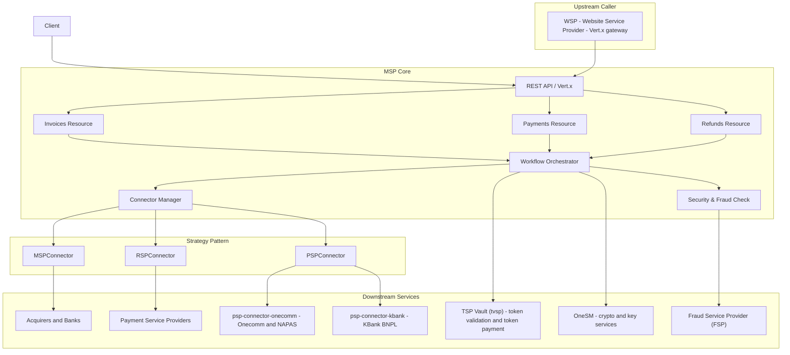

# Quickstart

Welcome to the MSP (Merchant Service Provider) codebase. This page serves as your entry point and task router. Before diving into specific areas, read this guide to understand the high-level architecture and know where to look for details on specific topics.

## System Overview

The MSP is a robust, Java-based payment orchestration platform built on Vert.x. It provides a comprehensive API for managing the full lifecycle of payment transactions, from invoice creation to settlement, refunds, and fraud detection.

The platform is designed for extensibility, using a **Strategy Pattern** (connectors) to integrate with various payment service providers (PSPs), banks, and internal services without modifying the core engine.

## Task Routing Map

Depending on your task, refer to the specific conceptual pages below:

### 1. Integrating a New Provider (Connectors)
If you are adding a new payment method, bank integration, or PSP:
*   **Go to**: [Connectors (Strategy Pattern)](/openwiki/concepts/connectors.md)
*   **What you'll learn**: The abstract connector classes (`MSPConnector`, `RSPConnector`, etc.), how to implement a concrete connector, and how the system discovers and loads them via reflection.

### 2. Understanding the Domain (Data Model)
If you need to understand the data structures, relationships, or state transitions of financial entities:
*   **Go to**: [Data Model & Schema](/openwiki/concepts/data-model.md)
*   **What you'll learn**: The structure of `Invoice`, `Payment`, `Instrument`, and `Merchant` objects, their relationships, and the lifecycle states they move through.

### 3. Processing Transactions (Core Workflows)
If you are implementing or debugging business logic for payments, refunds, or invoices:
*   **Go to**: [Core Workflows](/openwiki/workflows/core-workflows.md)
*   **What you'll learn**: The end-to-end flows for Invoice Creation, Payment Processing, Token-Based Payments, Refunds, and QR Code payments.

### 4. Securing and Trusting Transactions (Security & Fraud)
If you are working on authentication, authorization, or risk assessment:
*   **Go to**: [Security & Fraud](/openwiki/workflows/security-and-fraud.md)
*   **What you'll learn**: The OWS, VPC, and HTTP Signature authentication mechanisms, and how the system integrates with Fraud Service Providers (FSP) for real-time risk checks and post-transaction updates.

### 5. Configuring and Deploying (Operations)
If you are setting up the environment, changing runtime settings, or debugging deployment issues:
*   **Go to**: [Configuration & Operations](/openwiki/operations/configuration.md)
*   **What you'll learn**: The structure of `config.json`, database configuration, logging setup, credential management, and the CI/CD deployment pipeline.

## Architecture Snapshot

Caption: Client --> API[REST API / Vert.x]

*Architecture snapshot: WSP proxies merchant invoice, payment, refund, and QR requests into MSP, which drives connector strategies over downstream payment services, TSP Vault, OneSM, and fraud checks.*

## Next Steps

1.  **New Developers**: Start with [Data Model & Schema](/openwiki/concepts/data-model.md) to understand the core entities.
2.  **Backend Engineers**: Dive into [Core Workflows](/openwiki/workflows/core-workflows.md) to see how the code orchestrates transactions.
3.  **DevOps/SRE**: Review [Configuration & Operations](/openwiki/operations/configuration.md) for deployment and environment setup.
