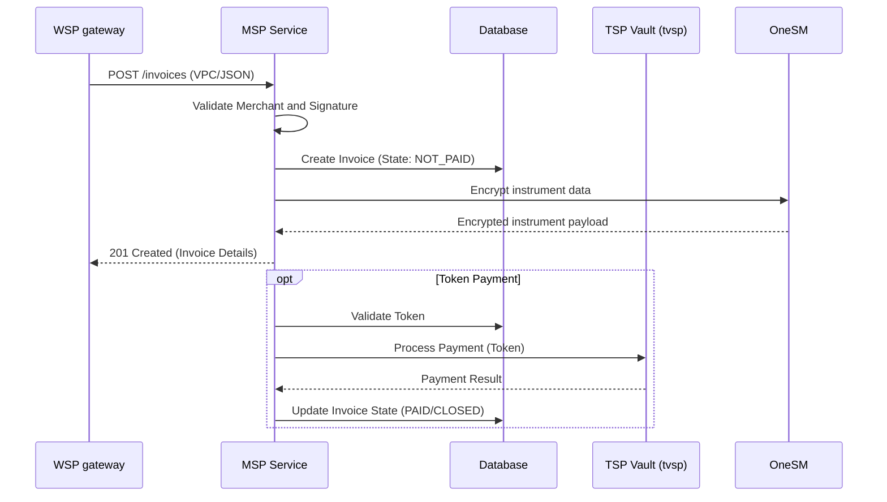
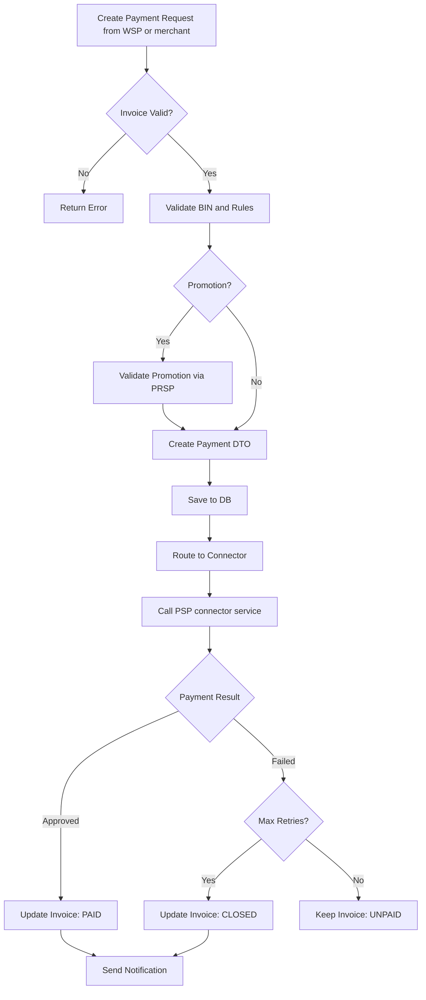
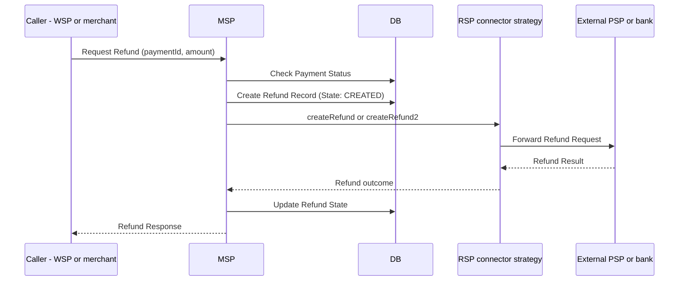

# Core Workflows

This page documents the end-to-end business flows implemented in the MSP (Merchant Service Provider) resources, primarily within `Invoices.java` and `Payments.java`. These workflows cover invoice creation, payment processing, token-based payments, and refund handling.

## 1. Invoice Creation Flow

Invoices represent the initial payment request created by a merchant. The creation process supports two main input formats: `JSON` (for e-wallets/e-shops) and `VPC` (Virtual Payment Client) for traditional card payments.

### Input Modes

- **JSON Input**: Routes to specific connectors like `ESP` (e-wallet) or `ESHOP` via `Main.mspConnectors`.
- **VPC Input**: Decodes Base64 merchant data, validates the merchant signature (HMAC), and extracts transaction details (amount, currency, merchant ID).

### Steps

1.  **Receive Request**: The system accepts a request via `Invoices.create` or `Invoices.vpcCreate`.
2.  **Input Processing**:
    *   **JSON Input**: Routes to specific connectors based on the `type` field ("ewallet" -> "ESP", "eshop" -> "ESHOP").
    *   **VPC Input**: Decodes Base64 merchant data, validates the merchant signature (HMAC), and extracts transaction details.
3.  **Validation**:
    *   Verifies merchant credentials and access codes.
    *   Checks currency support and amount validity.
    *   Validates installment parameters if provided (`isValidInstallment`).
4.  **Token Check**:
    *   If a token ID is provided in the request, the system validates the token (existence, group match, user reference, state).
    *   **Token Update**: If new instrument details (expiry, mobile) are provided with an existing token, the system flags it for update.
5.  **Persistence**:
    *   Creates the `InvoiceDTO` in the database (`InvoiceDB.createInvoice`).
    *   Sets initial state to `NOT_PAID`.
    *   Generates a unique `invoiceId`.
6.  **Immediate Token Payment**:
    *   If a valid token is present, the system automatically triggers a payment using `Invoices.createTspPayment`.
    *   This bypasses the need for the user to re-enter card details.
7.  **Notification**: Sends an `INVOICE_CREATED` notification to the merchant.
8.  **Response**: Returns the invoice details and a signed `merchReturnUrl` for redirecting the user.

Caption: WSP->>MSP: POST /invoices VPC/JSON

*Invoice creation: WSP forwards the merchant request to MSP, which validates and persists the invoice, encrypts instrument data through OneSM, and can immediately pay with a stored token via TSP Vault.*

## 2. Payment Creation Flow

Payments are created against an existing invoice. This flow handles instrument validation, fraud checks (for UPOS), and submission to the acquirer via connectors.

### Steps

1.  **Initiate Payment**: `Payments.create` is called with the `invoiceId` and `instrument` details (card number, expiry, etc.).
2.  **Invoice Validation**: Ensures the invoice exists and is in `NOT_PAID` or `UNPAID` state. Checks if `maxPayment` limit is reached.
3.  **Instrument Validation**:
    *   Extracts BIN and card brand.
    *   Checks `isBinAllow` against merchant-specific rules (block/allow lists).
4.  **Promotion & Fees**:
    *   If promotion details are present, calls `OnePAYPrsp` to validate and apply discounts.
    *   Calculates customer fees if applicable (`CustomerFee`).
5.  **Payment Creation**:
    *   Builds the `PaymentDTO`.
    *   Persists the payment via `DB.createPayment`.
    *   Unlocks the invoice (if it was locked).
6.  **Connector Routing**:
    *   Iterates through `Main.mspConnectors` to find the matching connector based on `mspId` (e.g., `ONUS`, `ONECREDIT`).
    *   Calls `connector.createPayment`.
7.  **Post-Payment Processing**:
    *   Updates the invoice state based on payment result (`PAID` if approved, `CLOSED` if failed/max retries).
    *   Generates a return URL for the merchant.
    *   Sends notifications (`PAYMENT_APPROVED` or `PAYMENT_FAILED`).

Caption: A[Create Payment Request from WSP or merchant] --> B{Invoice Valid?}

*Payment creation: MSP validates the invoice and instrument, persists the payment, then hands off to a connector strategy that calls a downstream PSP connector service before recording the outcome.*

## 3. Token-Based Payment Flow

This flow allows for recurring payments using stored tokens (e.g., "Remember Card" functionality).

### Steps

1.  **Request**: `Payments.paymentWithToken` is called with `invoiceId` and `tokenId`.
2.  **Token Validation**:
    *   Verifies token ownership and group.
    *   Checks token state (must be `APPROVED`).
3.  **CVV Generation**:
    *   Since the CVV is not stored, a dynamic CVV is generated using HMAC-SHA256 based on the token's secret and current timestamp/sequence (`generateCVV`).
4.  **TSP Call**:
    *   Calls `Invoices.createTspPayment` with the token details.
    *   The TSP (Token Service Provider) decrypts the token and processes the transaction with the bank.
5.  **Result Handling**:
    *   Updates the payment and invoice states in the database.
    *   Updates the token sequence number to prevent replay attacks.

## 4. Refund Workflow

Refunds allow merchants to return funds for settled payments.

### Steps

1.  **Initiate Refund**: `Refunds.create` or `Refunds.vpcCreate` is called with `paymentId` and `amount`.
2.  **Validation**:
    *   Verifies the payment exists and is `PAID` (`APPROVED`).
    *   Ensures refund amount does not exceed the original payment amount minus previous refunds.
3.  **Refund Creation**:
    *   Creates a `RefundDTO` with state `CREATED`.
    *   Persists it to the database (`DB.createRefund`).
4.  **Connector Routing**:
    *   Routes to the appropriate `RSPConnector` (Refund Service Provider).
5.  **Execution**:
    *   For VPC refunds, it might call an external `ma-service` (Managed Account) to execute the refund.
    *   Updates refund state to `APPROVED`, `REJECTED`, or `PENDING`.
6.  **Notification**: Notifies the merchant of the refund status.

Caption: Caller->>MSP: Request Refund paymentId, amount

*Refund flow: MSP validates the payment, records the refund, and delegates execution to a refund connector strategy that calls the external provider.*

## 5. QR Code Payment Workflow

QR Code payments allow merchants to generate QR codes for customers to scan and pay.

### Steps

1.  **Generate QR**: `QRService.create` is called with invoice details.
2.  **QR Data Creation**: The system generates QR data containing transaction information.
3.  **QR Code Display**: Returns the QR code image or data to the merchant for display.
4.  **Payment Processing**: When the customer scans and pays, the system processes the payment via the appropriate connector (e.g., NapasQR, MoMoQR).
5.  **Status Update**: Updates the invoice status based on the payment result.

## 6. Void/Cancellation Workflow

Voids allow merchants to cancel unsettled transactions.

### Steps

1.  **Initiate Void**: `Voids.create` is called with the transaction details.
2.  **Validation**: Verifies the transaction exists and is in a voidable state.
3.  **Void Processing**: Routes the void request to the appropriate connector.
4.  **Status Update**: Updates the transaction and invoice states accordingly.

## Key Implementation Details

### Merchant Data Handling

- **VPC Format**: Base64 encoded merchant data containing transaction details.
- **JSON Format**: Direct JSON object with transaction parameters.
- **Validation**: Merchant credentials and signatures are verified before processing.

### Connector Routing

The system uses a connector pattern to route transactions to different payment providers:

- **MSPConnectors**: Handle invoice creation and payment processing (ESP, ESHOP, ONUS, ONECREDIT).
- **RSPConnectors**: Handle refund processing.
- **MerchantConnectors**: Handle merchant-specific logic.

### Notification System

The MSP sends notifications at key points in the workflow:

- `INVOICE_CREATED`: When an invoice is successfully created.
- `PAYMENT_CREATED`: When a payment is initiated.
- `PAYMENT_APPROVED`: When a payment is successfully processed.
- `PAYMENT_FAILED`: When a payment fails.
- `REFUND_APPROVED`: When a refund is approved.
- `REFUND_FAILED`: When a refund fails.

### Fraud Detection

For UPOS (Unified Point of Sale) transactions, the system performs fraud checks:

- Validates transaction patterns.
- Checks for suspicious activity.
- Blocks fraudulent transactions before processing.

### Tokenization

The system supports tokenization for recurring payments:

- Tokens are stored securely with limited exposure.
- Dynamic CVV generation for token payments.
- Token validation includes group matching and user reference checks.
