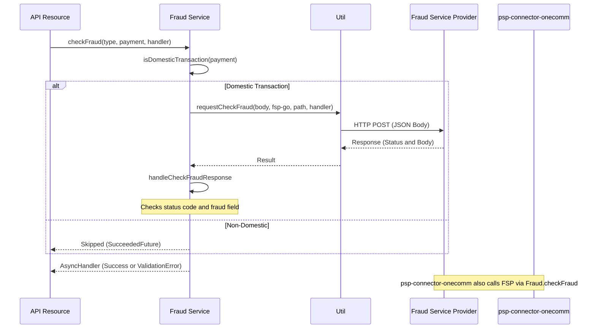
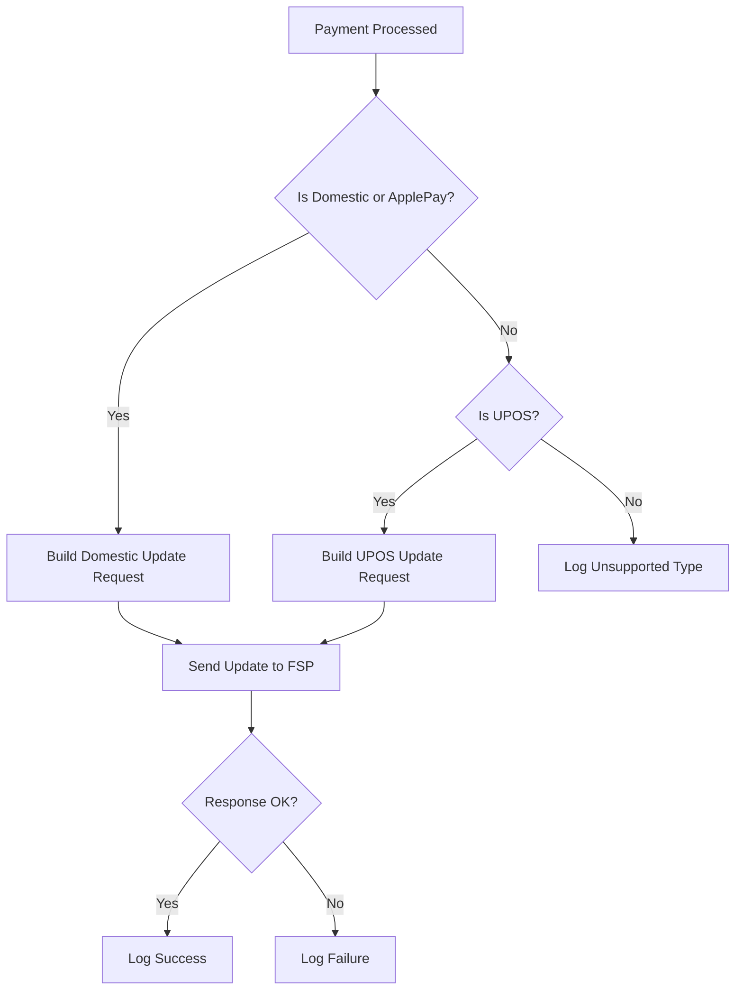

# Security & Fraud

Security and fraud prevention in the MSP are implemented through two primary mechanisms: request authorization (verifying identity and integrity) and fraud detection (assessing transaction risk against external rules).

## Authentication & Authorization

The system supports multiple authentication schemes to secure incoming API requests, ensuring only valid merchants and clients can access services.

-   **OWS (OneWaySecure)**: A signature-based authentication method for internal or server-to-server API calls. It uses a canonical string-to-sign construction involving HTTP method, path, query parameters, signed headers, and payload, signed with the client's secret key (`vn.onepay.msp.Util.checkOWSAuthorization`).
-   **VPC (Virtual Payment Client)**: An HMAC-based authentication scheme used primarily for merchant-facing interfaces (traditional card payments). It validates the `vpc_SecureHash` parameter against a merchant-specific access code and hash code (`vn.onepay.msp.Util.checkVpcAuthorization`).
-   **HTTP Signature**: A signature-based method using HMAC-SHA512, supporting signed headers and providing replay protection via expiration (`vn.onepay.msp.Util.checkHttpSignature`).

### Client Validation

For OWS requests, the system retrieves the client from a Guava cache (backed by the database) using the `accessKeyId`. It verifies the client exists and is in an `active` state before proceeding with signature verification (`vn.onepay.msp.Util.checkOWSAuthorization`).

### Token Management

Authorization tokens (MDES tokens) are securely handled. The system supports creating, validating, and managing tokens for recurring payments, ensuring sensitive card data is replaced with secure references (`vn.onepay.msp.resources.Tokens`).

## Fraud Detection

Fraud prevention is integrated via the **Fraud Service Provider (FSP)**, handling both **Check** (pre-transaction) and **Update** (post-transaction) operations.

### Fraud Check Flow

The `Fraud.checkFraud` method performs real-time risk assessment before a payment is finalized.

Caption: Res->>Fraud: checkFraudtype, payment, handler

*Figure 1: Real-time fraud check flow inside MSP, and the parallel FSP call made by psp-connector-onecomm*

**Key Logic**:
1.  **Type Determination**: The system checks if a transaction is "Domestic" using `isDomesticTransaction`. A transaction is domestic if the instrument type is `card` or `np_card` and the brand ID is `atm`.
2.  **Request Construction**: For domestic transactions, a specific request payload is built containing payment, instrument, and customer details (`buildCheckFraudDomesticRequest`).
3.  **Execution**: The request is sent asynchronously to the FSP via `Util.requestCheckFraud`. A non-200 response or a "fraud" string in the response body triggers a `VALIDATION_ERROR`.

### Fraud Update Flow

After a payment is processed (approved or failed), the system notifies the FSP to update the transaction state, enabling machine learning models to learn from outcomes.

Caption: A[Payment Processed] --> B{Is Domestic or ApplePay?}

*Figure 2: Fraud update logic, routing the post-transaction outcome from MSP to the Fraud Service Provider*

**Key Logic**:
1.  **Routing**: Updates are routed to different FSP endpoints based on transaction type:
    *   **Domestic / ApplePay Napas**: Uses the "fsp-go" service and domestic update path.
    *   **UPOS**: Uses the standard FSP service and UPOS-specific update path.
2.  **Payload**: The update payload includes the final payment state (e.g., `approved`, `failed`) and a special `fraud` state if the transaction was rejected due to fraud.
3.  **Asynchronous**: This is a fire-and-forget operation (`Util.requestUpdateFraud`); failure to update fraud records does not block the main transaction flow.

## Error Handling

Security and fraud errors are returned as standard API error responses:
-   `UNAUTHORIZED`: Invalid or missing credentials/signature.
-   `EXPIRED_AUTHORIZATION`: Request timestamp is too old.
-   `INVALID_AUTHORIZATION_SIGNATURE`: Signature mismatch.
-   `VALIDATION_ERROR`: Transaction flagged as fraud.
-   `INTERNAL_SERVER_ERROR`: FSP communication failure.
