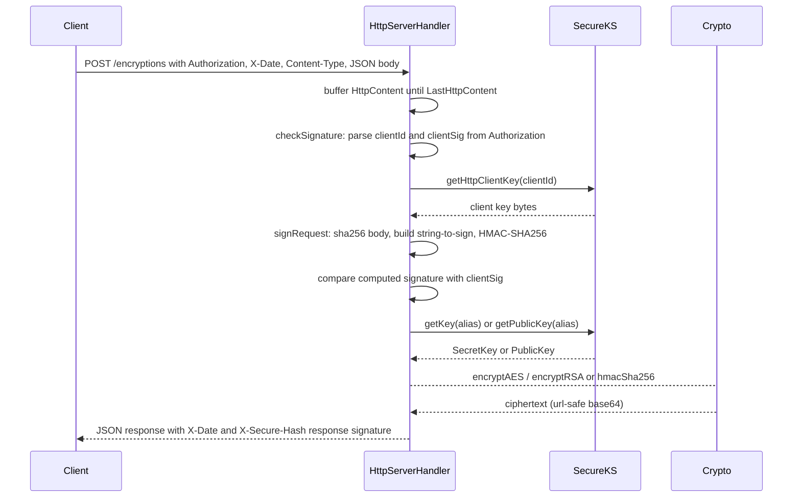

# System Overview

`onesm` (Maven artifact `com.onepay:onesm:1.20230312`) is a Java 11 HTTP crypto
service built on Netty. It exposes a small, HMAC-authenticated HTTP API that
encrypts and decrypts payloads using keys held in an encrypted JCEKS keystore.
The service is organized into four clear layers:

- **Crypto** — a stateless set of cryptographic primitive helpers
  (`src/main/java/com/onepay/onesm/Crypto.java`).
- **SecureKS** — the key and certificate store facade backed by the JCEKS
  keystore and Guava caches (`src/main/java/com/onepay/onesm/SecureKS.java`).
- **HttpServer** — the Netty HTTP transport and request handling
  (`src/main/java/com/onepay/onesm/http/`).
- **JMX** — management MBeans for deferred startup and cache inspection
  (`src/main/java/com/onepay/onesm/jmx/`).

See the related pages for the detailed behavior of each layer:
[`/openwiki/concepts/crypto-operations.md`](/openwiki/concepts/crypto-operations.md),
[`/openwiki/concepts/key-management.md`](/openwiki/concepts/key-management.md),
[`/openwiki/operations/deployment-and-startup.md`](/openwiki/operations/deployment-and-startup.md),
[`/openwiki/workflows/encryption-decryption-endpoints.md`](/openwiki/workflows/encryption-decryption-endpoints.md),
and
[`/openwiki/workflows/http-request-auth.md`](/openwiki/workflows/http-request-auth.md).

## Build and runtime shape

The Maven build compiles for Java 11 and packages dependencies into a
`target/lib` directory via the `maven-dependency-plugin` `copy-dependencies`
goal, so the service runs from `classes` plus a flat `lib` of jars
(`pom.xml`). Key libraries are Netty `4.1.89.Final`
(`netty-transport`, `netty-handler`, `netty-codec-http`), Guava, Gson,
commons-codec, and Log4j2 (with the LMAX Disruptor for async logging). Tests are
skipped in the build (`<skipTests>true</skipTests>`), and the test sources are
standalone `main()` utilities rather than a JUnit suite.

## Component boundaries

### Entry point: `Main`

`Main.main()` is the single entry point. It decides startup mode from the
`app.master_key` system property:

- If the master key is supplied, it calls `SecureKS.load(masterKey)` to open the
  keystore and then `startServers()`.
- If no master key is supplied, it registers a `ConsoleMXBean`
  (`com.onepay.onesm:type=Console`) on the platform MBean server and waits; an
  operator can later call `setMasterKey(...)` through JMX to trigger the same
  `SecureKS.load(...)` plus `startServers()` sequence and then the bean
  unregisters itself (`Main.java`, `ConsoleMXBeanImpl`).

`startServers()` reads `app.port`; when greater than zero it starts an
`HttpServer` on a dedicated thread. The main thread then blocks in a `wait()`
loop for the lifetime of the process. This is the deferred-startup pattern that
lets the master key be provisioned out-of-band via JMX instead of on the command
line.

### Transport: `HttpServer` and the Netty pipeline

`HttpServer` builds a Netty `ServerBootstrap` with a boss `NioEventLoopGroup` of
one thread and a default worker group, using `NioServerSocketChannel`, a
`LoggingHandler` at INFO on the server channel, and an `HttpServerInitializer`
as the child handler. It binds the configured port and blocks on the channel's
close future; on failure or shutdown both event loop groups are shut down
gracefully (`HttpServer.java`).

`HttpServerInitializer.initChannel` assembles the per-connection pipeline:
`HttpRequestDecoder`, `HttpResponseEncoder`, then a single `HttpServerHandler`
(`HttpServerInitializer.java`). Note that HTTP content is **not** aggregated
with `HttpObjectAggregator`; the handler buffers `HttpContent` chunks itself.

### Request handling: `HttpServerHandler`

`HttpServerHandler extends SimpleChannelInboundHandler`. In `channelRead0`
it captures the `HttpRequest` (method, URI, query params, and the relevant
headers) and then accumulates `HttpContent` chunks into a `StringBuilder` until
`LastHttpContent`. Only then does it call `processRequest()` with the full body.

`processRequest()` is the orchestrator:

1. It verifies the request signature with `checkSignature(...)`. A request that
   fails authentication produces `401 UNAUTHORIZED_ACCESS`.
2. On success it dispatches by URI and method to `/encryptions` or
   `/decryptions` and executes the crypto operation.
3. It writes a JSON response, signing it with `X-Secure-Hash` when the client
   key was resolved.

The signature scheme is covered in
[`/openwiki/workflows/http-request-auth.md`](/openwiki/workflows/http-request-auth.md) and
the endpoint contract in
[`/openwiki/workflows/encryption-decryption-endpoints.md`](/openwiki/workflows/encryption-decryption-endpoints.md).

### Keystore access: `SecureKS`

`SecureKS` loads a JCEKS `KeyStore` from the classpath resource
`/keystore.jceks` using the supplied master key. It maintains two Guava
`LoadingCache`s (keys and certificates) bounded at 1000 entries with a
5-minute `expireAfterAccess`, loading each entry lazily from the keystore
(`SecureKS.java`). Client request-signing keys are resolved by
`getHttpClientKey(clientId)`, which reads the alias `http_client.<clientId>`
with an empty password. The keys cache is exposed through JMX for monitoring
(`GuavaCacheMXBeanImpl.registerLoadingCacheInJMX("KeyStore", ...)`).

### Crypto primitives: `Crypto`

`Crypto` provides SHA-256 (url-safe base64), HMAC-SHA256, AES/CBC/PKCS5Padding
encryption/decryption (with the IV prepended to the ciphertext in the
no-IV-argument variant), RSA/ECB/PKCS1Padding, and hex helpers. Full details are
in [`/openwiki/concepts/crypto-operations.md`](/openwiki/concepts/crypto-operations.md).

### Management: JMX

Two MBean families exist:

- `ConsoleMXBean` (`com.onepay.onesm:type=Console`) enables deferred master-key
  startup.
- `GuavaCacheMXBean` (`com.onepay.onesm:type=Cache,name=KeyStore`) exposes Guava
  cache statistics (hit/miss rate, load counts, evictions, size) and operations
  (`cleanUp`, `invalidateAll`, `refreshAll`) over JMX.

## End-to-end request flow

The following diagram captures a single authenticated crypto request from the
client through the Netty handler to the keystore and crypto primitives, and back
as a signed response.

Caption: C->>H: POST /encryptions with Authorization, X-Date, Content-Type, JSON body

The response signature binds the request signature, status code, date, content
type, and body hash, so the client can verify the response matches the request
it sent.

## Invariants and failure semantics

- **Authentication is mandatory.** Every request must carry a valid
  `Authorization` header whose ID maps to an `http_client.*` alias and whose
  signature matches. Unparseable headers, unknown client IDs, and signature
  mismatches all yield `401`.
- **Algorithms are dispatched by key.** The key selected for the operation
  determines the primitive: a key whose algorithm is `HMACSHA256` produces an
  HMAC, `AES` an AES encryption, and an RSA key an RSA encryption. A key with
  an unsupported algorithm yields `400 ALGORITHM_NOT_SUPPORTED`; a missing key
  yields `400 INVALID_KEY`.
- **Decryption is AES-only.** `/decryptions` requires an AES secret key; any
  other key type yields `400 UNSUPPORTED_ALGORITHM`.
- **Strict media type and method.** Both endpoints require `POST` with
  `Content-Type: application/json`; anything else gets `405` or `415`. Unknown
  URIs yield `404`, malformed JSON yields `400`, and unexpected exceptions map
  to `500`.
- **The service holds the master key out of the request path.** Keys are never
  transmitted over HTTP; clients authenticate with their own derived
  `http_client.*` key and the service applies stored keys by alias.

## Operations notes

- Port and master key come from `app.port` and `app.master_key` system
  properties; see
  [`/openwiki/operations/deployment-and-startup.md`](/openwiki/operations/deployment-and-startup.md).
- Deployment packages the service as systemd (Linux), jsvc (macOS), or prunsrv
  (Windows) services, and `sync_prod` performs a `mvn clean package` and rsyncs
  the `classes` and `lib` artifacts to the target host.
