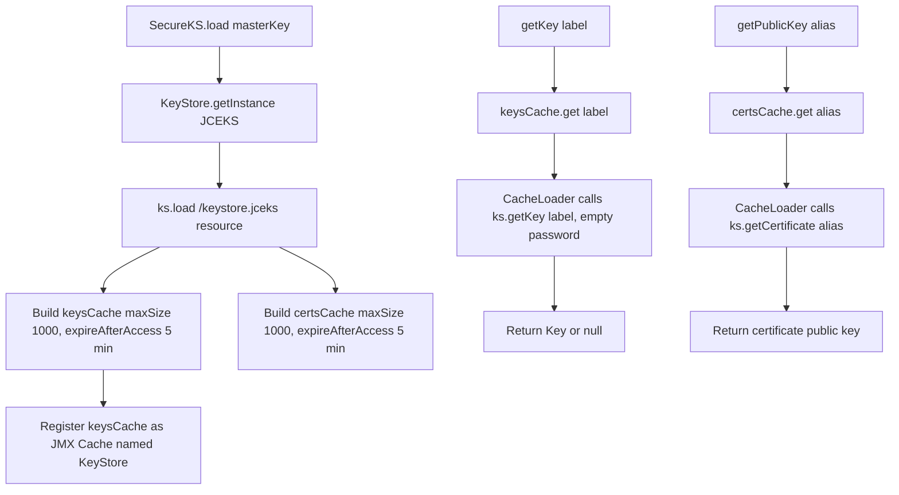
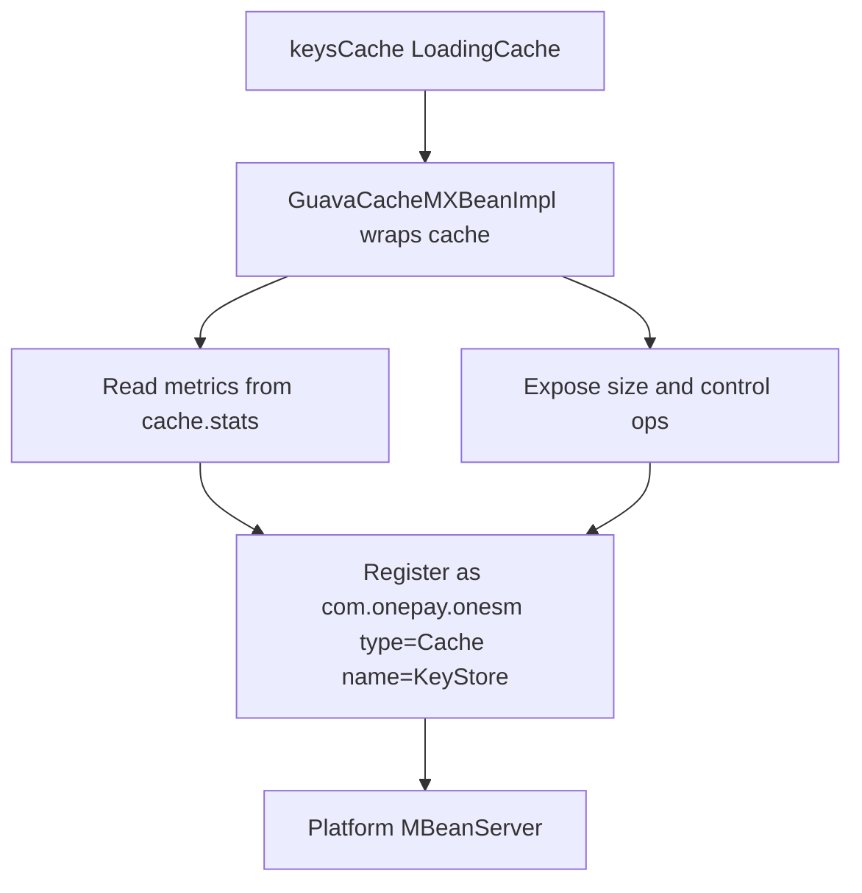

# Key Management and SecureKS

`com.onepay.onesm.SecureKS`
(`src/main/java/com/onepay/onesm/SecureKS.java`) is the single facade through
which all key and certificate material flows in `onesm`. It loads a
password-protected **JCEKS** `KeyStore` from the classpath, serves keys and
certificates through two Guava `LoadingCache`s with a bounded size and 5-minute
idle expiry, and exposes the key cache's statistics through the platform JMX
server. The cryptographic primitives that consume these keys are documented in
[Crypto Operations](/openwiki/concepts/crypto-operations.md); the HTTP
authentication flow that relies on the `http_client.*` aliases is covered in
[HTTP request auth](/openwiki/workflows/http-request-auth.md).

## Responsibilities

- **Keystore lifecycle**: open the JCEKS keystore once per process with the
  supplied master key and keep the in-memory `KeyStore` object as module state.
- **Lazy, cached key/cert resolution**: serve `SecretKey`/`PrivateKey` material
  and `PublicKey` (from certificates) through two Guava `LoadingCache`s that
  fetch entries from the keystore on first access.
- **Client authentication keys**: resolve per-client request-signing symmetric
  keys from `http_client.<clientId>` aliases using an empty keystore entry
  password.
- **Operational introspection**: register the key cache as a JMX MBean so cache
  hit/miss rates, load times, and evictions can be monitored, and expose
  runtime `cleanUp`/`invalidateAll`/`refreshAll` operations.

## Load path and startup

`SecureKS` holds four `static` fields `SecureKS.java`:

```java
private static KeyStore ks;
private static LoadingCache<String, Key> keysCache;
private static LoadingCache<String, Certificate> certsCache;
```

The entry point is the static `boolean load(String masterKey)`
(`SecureKS.java#L25-L70`):

1. Instantiate `KeyStore.getInstance("JCEKS")`.
2. Load it from the classpath resource `/keystore.jceks` (a `11969`-byte binary
   at `src/main/resources/keystore.jceks`) via
   `SecureKS.class.getResourceAsStream("/keystore.jceks")`, unlocking the store
   with the master key: `ks.load(stream, masterKey.toCharArray())`. (An earlier
   `FileInputStream`-based variant is commented out.)
3. Build the `keysCache` and `certsCache` Guava `LoadingCache`s.
4. Register `keysCache` with JMX and return `true`; any `Exception` (wrong
   master key password, missing resource, JCEKS not available) is logged at
   `SEVERE` and `load` returns `false`.

### Deferred startup via JMX

`load` is not only called from `Main.main()` when `app.master_key` is present on
the command line (`Main.java#L21-L24`). When no master key is supplied at
launch, `Main` registers a `ConsoleMXBean`
(`com.onepay.onesm:type=Console`) and waits. An operator later invokes
`ConsoleMXBeanImpl.setMasterKey(masterKey)` which calls `SecureKS.load(...)` and,
on success, starts the HTTP servers and unregisters the console bean
(`ConsoleMXBeanImpl.java#L12-L20`). This lets the master key be provisioned
out-of-band through JMX rather than on the command line.

## Caches and lifecycle

Both caches are built identically (`SecureKS.java#L31-L61`):

```java
CacheBuilder.newBuilder()
    .maximumSize(1000)
    .expireAfterAccess(5, TimeUnit.MINUTES)
```

- **Capacity**: at most **1000 entries** each, LRU-evicted via `maximumSize`.
- **Expiry**: `expireAfterAccess(5, TimeUnit.MINUTES)` — an entry is removed
  five minutes after its last read, so idle entries are dropped while actively
  used keys stay resident. A removal-listener hook is present in a commented-out
  `//.removalListener(MY_LISTENER)` line.
- **Lazy loading**: entries are fetched on demand by the `CacheLoader`. The
  key loader calls `ks.getKey(keyLabel, "".toCharArray())` with an **empty**
  password; the certificate loader calls `ks.getCertificate(alias)`. Either
  loader catches failures, logs at `SEVERE`, and returns `null` (so a miss on a
  bad alias yields a `null` entry rather than a propagating exception).

Cache state is process-global module state (`static` fields). Since entries
expire after idle access, re-reading a key guarantees the entry is either still
resident or freshly loaded from the keystore using the master key — the master
key must remain in memory (as the keystore is already unlocked) for the lifetime
of the process.


Caption: SecureKS keystore loading and the two Guava loading caches.

## Client-key accessors

### `getClient(clientId, password)` — `client.*` aliases

```java
public static byte[] getClient(String clientId, String password)
```

Reads the alias `"client." + clientId` **with a caller-supplied password** and
returns the key's raw encoded bytes (`SecureKS.java#L72-L82`). This accessor
**bypasses the cache** and reads the keystore directly through `ks.getKey`. It
is not referenced from any production source file, so in the current tree it is
effectively a dormant/latent API for a `client.*` alias family.

### `getHttpClientKey(clientId)` — `http_client.*` aliases

```java
public static byte[] getHttpClientKey(String clientId)
```

Reads the alias `"http_client." + clientId` from the keystore **directly (not
cached)** with an **empty** password and returns the raw encoded bytes
(`SecureKS.java#L84-L94`). This is the primary request-authentication lookup: in
`HttpServerHandler.checkSignature` the parsed `clientId` from the `Authorization`
header drives `SecureKS.getHttpClientKey(clientId)`, and the returned bytes
become the HMAC-SHA256 key used to sign requests and responses
(`HttpServerHandler.java#L236-L247`). A `null` result fails authentication.

Both client accessors differ from the general `getKey`/`getPublicKey` facade in
that they read the keystore directly, so they are **not** subject to the 5-minute
cache expiry and do not use the empty-password key cache.

## General key/cert accessors

- `getKey(String keyLabel)` returns a `Key` through `keysCache.get(keyLabel)`
  (`SecureKS.java#L96-L104`). This is the entry point for the `/encryptions` and
  `/decryptions` endpoints, which pass an alias like `onecredit.aes`,
  `tspvault.aes`, `tsp.hmac`, or other labels to resolve symmetric keys
  (`HttpServerHandler.java#L149`, `#L190`). The offline utilities use it with
  aliases such as `onecredit.aes`, `onecredit.hmac`, `tspvault.aes`,
  `tspvault.hmac`, `tsp.hmac`, and `aes256`.
- `getPublicKey(String alias)` returns the `PublicKey` of a cached certificate
  (`SecureKS.java#L106-L114`). It is used by `/encryptions` when the request
  names a `public_key` alias, enabling RSA public-key encryption
  (`HttpServerHandler.java#L151-L152`).

## JMX cache statistics

`secureks` exposes the **key** cache (not the certificate cache) through the
platform MBean server as
`com.onepay.onesm:type=Cache,name=KeyStore`
(`SecureKS.java#L63`, `GuavaCacheMXBeanImpl.java#L107-L122`).

The `GuavaCacheMXBean` interface
(`src/main/java/com/onepay/onesm/jmx/GuavaCacheMXBean.java`) mirrors Guava's
`CacheStats` plus cache-control operations (`GuavaCacheMXBeanImpl.java`):

- **Read-side metrics**: `getRequestCount`, `getHitCount`, `getHitRate`,
  `getMissCount`, `getMissRate` (from `cache.stats()`).
- **Load-side metrics**: `getLoadCount`, `getLoadSuccessCount`,
  `getLoadExceptionCount`, `getLoadExceptionRate`, `getTotalLoadTime`,
  `getAverageLoadPenalty`.
- **Eviction/size**: `getEvictionCount`, `getSize`.
- **Operations**: `cleanUp()`, `invalidateAll()`, and `refreshAll()` (which
  refreshes every key in the cache via `cache.refresh(key)`).

Registration is idempotent: if an MBean with the same `ObjectName` already
exists, `registerLoadingCacheInJMX` skips registration; any registration
exception is rethrown as `IllegalStateException`.


Caption: How the key cache statistics reach the JMX platform server.

## Invariants and failure semantics

- **Master key lifecycle**: `load` unlocks the keystore; after that, key
  retrieval (`ks.getKey`) uses an **empty password** — JCEKS entries are
  protected only by the keystore-level password once unlocked, so per-entry
  passwords are not used by the production paths (the cache loaders and
  `getHttpClientKey` both pass `""`).
- **Wrong/missing master key**: `load` catches the exception and returns
  `false`; startup proceeds only if the caller checks the return value
  (`Main`/`ConsoleMXBeanImpl` gate server startup on it).
- **Missing alias**: cache loaders log at `SEVERE` and return `null`; callers
  that check for `null` (the HTTP handler) respond with `400 INVALID_KEY`.
- **Cache invalidation**: idle expiry bounds staleness; operators can force
  `invalidateAll`/`refreshAll` through JMX. A `refresh` only runs if the entry
  is currently in the map, so an expired entry is re-loaded, not refreshed.
- **`getClient`/`getHttpClientKey` are un-cached**: their reads hit the
  keystore on every call, unlike `getKey`/`getPublicKey`.

## Configuration and operations

- **Keystore resource**: `/keystore.jceks`, packaged in
  `src/main/resources/` (BINARY, `11969` bytes).
- **Master key supply**: via the `app.master_key` system property at launch
  (`Main.java`), or deferred via the `ConsoleMXBean` `setMasterKey(...)` JMX
  operation.
- **Cache bounds**: fixed in code — `maximumSize(1000)`,
  `expireAfterAccess(5, TimeUnit.MINUTES)`. There are no external config
  overrides.
- **Monitoring**: the `KeyStore` cache MBean provides live hit/load/eviction
  statistics and administrative reset/refresh operations.

## Tests and utilities

There is no JUnit suite (the build runs with `<skipTests>true</skipTests>`); the
`src/test/java` files are standalone `main()` operator utilities. They exercise
`SecureKS` directly:

- `GenerateKey` provisions keys (wrapping generated master keys via the
  raw-byte AES variant).
- `Decrypt`, `DecryptList`, `DecryptTVSP`, `DecryptTokenData` call
  `SecureKS.load("4n8c8f5t")` and `SecureKS.getKey(...)` to decrypt legacy card
  and token data.
- `EncryptOnecommCards` and `TestCrypto` call `SecureKS.load(...)` plus
  `getKey` to seed one-way hashing and round-trip AES benchmarks.
