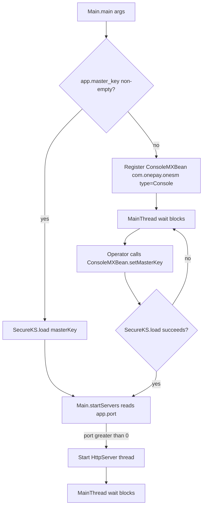

# Deployment and Startup

`onesm` launches through a single entry point, `com.onepay.onesm.Main`, which
chooses between two startup modes based on whether the `app.master_key` system
property is supplied. On Linux it ships as a systemd unit (`/service/onesm.service`
and a copy at `/src/main/service/onesm-server.service`); packaged variants for
macOS (jsvc) and Windows (prunsrv) exist under `/src/main/service/`. The master
key, HTTP port, log location, and the JUL-to-Log4j2 logging bridge are all
configured as JVM system properties in these descriptors.

## Startup modes

`Main.main()` (`Main.java#L20-L34`) branches on the `app.master_key` system
property:

- **Master-key start.** When `app.master_key` is present and non-empty,
  `Main` calls `SecureKS.load(masterKey)` to open the JCEKS keystore and then
  `startServers()` immediately. The HTTP server comes up as part of process
  startup.
- **Deferred JMX start.** When no `app.master_key` is set, `Main` registers a
  `ConsoleMXBean` on the platform MBean server under
  `com.onepay.onesm:type=Console` and does **not** start any server. An operator
  later invokes `ConsoleMXBeanImpl.setMasterKey(masterKey)`, which calls
  `SecureKS.load(...)` and, only on success, invokes `Main.startServers()` and
  unregisters the console bean (`ConsoleMXBeanImpl.java#L12-L20`). This lets the
  master key be provisioned out-of-band through JMX rather than on the process
  command line.

In both branches, `Main` then hands the process off to a `MainThread` that blocks
in `wait()` for the lifetime of the JVM (`Main.java#L36-L45`).

`startServers()` reads the `app.port` property (default `"0"`); when the value is
greater than zero it constructs an `HttpServer` and starts it on a dedicated
`HttpServer` thread (`Main.java#L47-L61`). A port of `0` or absent means no HTTP
server is started.

Caption: The two startup modes and how deferred JMX startup joins the normal
server start path.

## System properties

The service is configured entirely through JVM system properties passed on the
command line by the service descriptors:

- **`app.master_key`** — the JCEKS keystore master key. When set, startup is
  immediate; when absent, ownership falls to the deferred JMX `ConsoleMXBean`.
  All shipped packaging sets it to `4n8c8f5t`
  (`onesm.service#L12`, `onesm-server-install.bat#L6`,
  `onesm-server.jsvc#L58`, `onesm-server.osx#L5`).
- **`app.port`** — the HTTP listen port. All packaged variants set `8880`
  (`Main.java#L55`; `onesm.service#L11`). `startServers()` skips server startup
  when the value is not greater than zero.
- **`app.log`** — the Log4j2 rolling-file log path referenced by the
  `${sys:app.log}` placeholder in `src/main/resources/log4j2.xml#L4-L5` (both
  the active filename and the `.yyyy-MM-dd.gz` roll-over pattern come from it).
  The systemd units set it to `/var/log/onesm/onesm.log`
  (`onesm.service#L10`). The jsvc, macOS, and Windows descriptors supply the log
  path through a **different property name**, `-Dlog=...`, which does not match
  the Log4j2 `${sys:app.log}` placeholder (see Packaging matrix below).
- **`java.util.logging.manager`** — set to
  `org.apache.logging.log4j.jul.LogManager` in every descriptor so the
  `java.util.logging.Logger` instances used throughout the codebase
  (`Main`, `SecureKS`, `HttpServer`, `HttpServerHandler`) are routed through the
  Log4j2 async pipeline and rolling-file appender
  (`onesm.service#L9`, `onesm-server.jsvc#L50`, `onesm-server.osx#L6`,
  `onesm-server-install.bat#L6`).

The `log4j2.xml` configuration (packaged into `classes` by the Maven resources
plugin) declares the `RollingFile` appender with `fileName="${sys:app.log}"`,
the `filePattern` for `.gz`-compressed dated rolls, a `TimeBasedTriggeringPolicy`,
an `AsyncLogger` for the `com.onepay` package at `debug`, and an `AsyncRoot` at
`info` pointing at the rolling file (`log4j2.xml`). The LMAX Disruptor
(`disruptor`, `<lmax.version>` in `pom.xml`) backs the async loggers.

## Service packaging matrix

| Platform | Packaging | Property style | Run user | Notes |
| --- | --- | --- | --- | --- |
| Linux systemd | `/service/onesm.service`, `/src/main/service/onesm-server.service`, install via `onesm-server-install.sh` | `-Dapp.log=...` | `onesm:onesm`, `LimitNOFILE=20000` | G1GC, `-Xms20M -Xmx100M`, classpath `/opt/onesm/classes:/opt/onesm/lib/*` |
| macOS jsvc | `/src/main/service/onesm-server.jsvc` (also `onesm-server.osx` plain-Java variant) | `-Dlog=...` | `root` | Runs `jsvc -home $JAVA_HOME ... -app.port -Dapp.master_key ...`; refers to `com.onepay.onesm.OneSMMainLinux` which does not exist in the current tree |
| Windows prunsrv | `/src/main/service/onesm-server-install.bat`, uninstall via `onesm-server-uninstall.bat` | `-Dlog=...` | — | `prunsrv.exe //IS//onesm`, JVM mode start/stop, classpath `../classes;../lib/*;prunsrv.jar` |

### Linux systemd

`/service/onesm.service` is an LSB-style systemd unit
(`onesm.service`):

- `After=network.target remote-fs.target nss-lookup.target` for ordering.
- Runs `/usr/java/jdk1.8.0_74/bin/java` with G1GC and a
  `-Xms20M -Xmx100M` heap, the Log4j2 JUL bridge, `-Dapp.log`,
  `-Dapp.port=8880`, `-Dapp.master_key=4n8c8f5t`, and classpath
  `/opt/onesm/classes:/opt/onesm/lib/*` launching `com.onepay.onesm.Main`.
- Runs as `User=onesm`, `Group=onesm`, with `LimitNOFILE=20000`.
- `WantedBy=multi-user.target` on the `/etc/systemd/system` install path.

`/src/main/service/onesm-server.service` is a nearly identical unit that invokes
`java` directly instead of an absolute JVM path. `onesm-server-install.sh`
installs the unit (`cp onesm.service /etc/systemd/system`) and runs
`systemctl enable onesm`; `/service/install_service.sh` is a repo-root duplicate
of that install script.

### macOS jsvc

`/src/main/service/onesm-server.jsvc` (`onesm-server.jsvc#L1-L105`) is a
`/etc/init.d`-style shell service that execs `jsvc` with the Commons Daemon
flags: `-home $JAVA_HOME`, `-Djava.util.logging.manager=$LOG_MANAGER`,
`-Dlog=$LOG_SERVICE`, `-Dapp.port=$APP_PORT`, `-Dapp.master_key=$APP_MASTER_KEY`,
`-cp $CLASS_PATH`, `-user $USER`, `-outfile`, `-errfile`, `-pidfile`, a start/stop
action, and a daemon class. The `CLASS` constant references
`com.onepay.onesm.OneSMMainLinux`, which is **not present** in the current
source tree — the script is stale and would not start the current `Main`
entry point. The start/stop/restart case arms set `-outfile`/`-errfile`/`-pidfile`
under `/Applications/DATA/projects/deploy/mpay-backend/log/`.

`/src/main/service/onesm-server.osx` is a simpler alternative that launches
`java` directly with `-Dapp.port=8880`, `-Dapp.master_key=4n8c8f5t`, the JUL
bridge, `-Dlog=...`, and classpath `.`:`../classes`:`../lib/*` (`onesm-server.osx`).

### Windows prunsrv

`/src/main/service/onesm-server-install.bat` (`onesm-server-install.bat#L1-L12`)
registers the service with Apache Commons Daemon `prunsrv.exe`:

- `prunsrv.exe //IS//onesm` with `--DisplayName="OnePAY OneSM Server"`,
  `--Jvm="...jdk1.8.0_66...jvm.dll"`.
- `--StartClass=com.onepay.onesm.Main`, `--StartMethod=main`, `--StartMode=jvm`.
- `--JvmOptions` carries `-Dapp.port=8880`, `-Dapp.master_key=4n8c8f5t`,
  `-Duser.language=US`, `-Duser.region=en`,
  `-Djava.util.logging.manager=org.apache.logging.log4j.jul.LogManager`,
  `-Dlog="C:\logs\onesm-server.log"`, `-Dfile.encoding=UTF8`.
- `--Classpath=../classes;../lib/*;prunsrv.jar`.
- Stop mode is `jvm` with `--StopClass=Stop` and `--StopMethod=main`; the
  referenced `Stop` class is not part of the current tree
  (`onesm-server-install.bat#L10-L12`).

`onesm-server-uninstall.bat` removes the service via `prunsrv.exe //DS//ONESMServer`.
The `prunsrv.exe` and `prunsrv.jar` binaries ship under `/src/main/service/`.

## Build artifacts and the `sync_prod` deploy workflow

The Maven build compiles for **Java 11** and copies all dependency jars into
`target/lib` via the `maven-dependency-plugin` `copy-dependencies` goal in the
`prepare-package` phase; `maven-resources-plugin` copies `src/main/resources`
(including `log4j2.xml` and the `keystore.jceks` binary) into `target/classes`
during `compile` (`pom.xml#L22-L66`). The runnable layout is therefore
`classes` plus a flat `lib` directory, which all service descriptors reference on
their classpaths.

`sync_prod` (`sync_prod`) automates the production deploy:

1. `env JAVA_HOME=/usr/java/jdk-11 mvn clean`
2. `env JAVA_HOME=/usr/java/jdk-11 mvn -U package` (with `<skipTests>true</skipTests>`)
3. `rsync -av --progress --delete --delete-excluded --rsh='ssh -p15440'` copying only
   `classes` and `lib` (with their content) from `target/` to
   `root@dc:/root/tmp_deploy/onesm/`, excluding everything else.
4. `ssh root@dc -p 15440 -X 'meld /root/tmp_deploy/onesm /opt/onesm && /opt/onesm/setown'`
   — compares the staged tree against the live `/opt/onesm` with `meld`, and then
   runs an `/opt/onesm/setown` helper (not in the repo) to fix ownership.

The rsync `--delete --delete-excluded` with `--include`/`--exclude` rules keeps
the deployed `classes`/`lib` in sync with the freshly built ones. An explicit
service restart is left to the operator after the file sync.

## Invariants and operational notes

- **Master key gates server startup.** In the deferred mode, servers start only
  if `SecureKS.load(masterKey)` returns `true`; a wrong master key leaves the
  process waiting on the `ConsoleMXBean` and does not start the HTTP port
  (`ConsoleMXBeanImpl.java#L15`, `SecureKS.java#L25-L70`).
- **The master key is hardcoded** in every shipped service descriptor
  (`4n8c8f5t`). Rotating it therefore requires editing each packaging file (and
  the keystore), or provisioning it only through the JMX deferred path.
- **Two log-property names coexist.** The systemd units set `-Dapp.log`, which
  matches the Log4j2 `${sys:app.log}` placeholder; the jsvc, macOS, and prunsrv
  files use `-Dlog`, which does **not** match that placeholder, so those variants
  resolve `app.log` to a default location unless an `app.log` property is added.
- **Stale class references.** The jsvc script names `OneSMMainLinux` and the
  prunsrv stop config names `Stop`; neither class exists in the current tree, so
  those specific invocations would fail. The macOS `onesm-server.osx` and
  systemd units target the real `com.onepay.onesm.Main`.
- **The main thread blocks forever** after both startup paths; shutdown is
  externally terminated (systemd stop, jsvc `-stop`, prunsrv stop class) rather
  than being driven from inside `Main`.

## Related pages

- [`/openwiki/architecture/overview.md`](/openwiki/architecture/overview.md) —
  component boundaries and end-to-end request flow.
- [`/openwiki/concepts/key-management.md`](/openwiki/concepts/key-management.md) —
  the JCEKS keystore, `SecureKS.load`, Guava caches, and JMX cache stats the
  startup modes drive.
