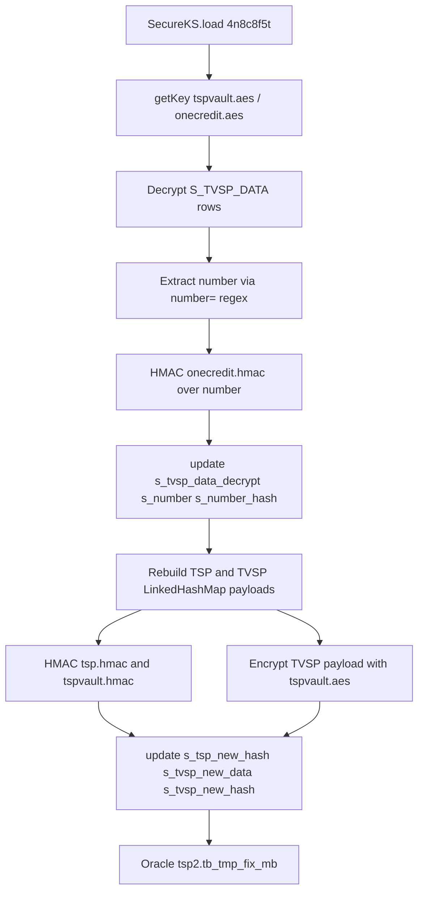
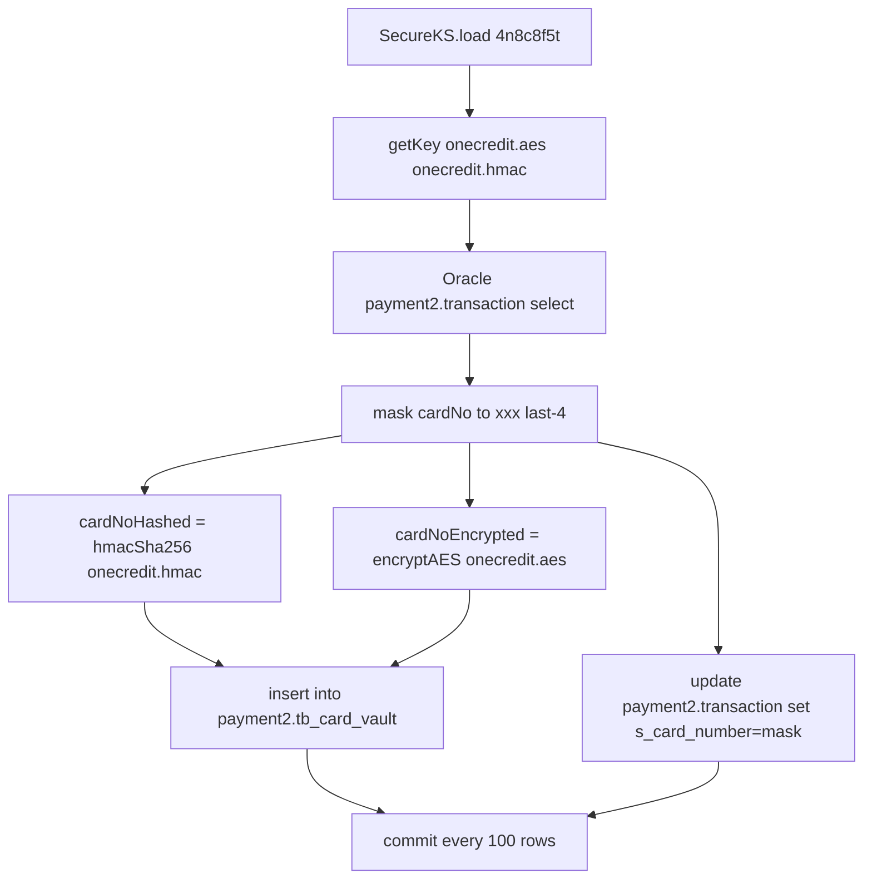

# Token Migration and Utility Tools

The `src/test/java` tree is **not** a JUnit test suite. All classes are standalone
imperative scripts launched through `main()` and skipped by the build
(`<skipTests>true</skipTests>`). They are operator utilities that reuse the same
production library as the HTTP service — `Crypto` for AES/HMAC/SHA primitives and
`SecureKS` for JCEKS key resolution — to decrypt legacy ciphertext, verify card
and token payloads, generate and wrap key material, and migrate card numbers in
bulk against an Oracle database. Because they embed the keystore master key and
database credentials in source, they are high-risk operational scripts, not
repeatable tests.

Each utility boots the keystore the same way: `SecureKS.load("<masterKey>")`,
then `SecureKS.getKey("<alias>")` to pull the symmetric key used for decryption
or hashing. The aliases exercised here are `onecredit.aes`, `onecredit.hmac`,
`tspvault.aes`, `tspvault.hmac`, `tsp.hmac`, and `aes256` (see [key management](/openwiki/concepts/key-management.md)).
The primitives they call — implicit-IV `encryptAES`/`decryptAES`, the raw key+IV
AES variant, and `hmacSha256` — are documented in
[Crypto Operations](/openwiki/concepts/crypto-operations.md).

## Responsibilities

- **Decryption verification.** Single- and bulk-decrypt ciphertexts to confirm
  the stored format and payload (e.g. `{CardToken=…, CustomerID=…}`) matches the
  expected `LinkedHashMap.toString()` representation that token-migration logic
  relies on.
- **Key provisioning.** Generate fresh AES keys with a cryptographically secure
  RNG and wrap them under a derived or master key, printing hex for placement in
  the keystore or configuration.
- **Bulk card-vault migration.** Read plaintext card numbers from Oracle
  `payment2.transaction`, HMAC-hash and AES-encrypt them into
  `payment2.tb_card_vault`, and replace the stored number with a masked variant.
- **Token-data repair.** Decrypt `tsp2.tb_tmp_fix_mb.s_tvsp_data`, derive card
  numbers and both TSP and TVSP hashes, and write new hashed/encrypted rows to
  fix Mobile Banking tokens.
- **Throughput benchmark.** Measure AES round-trip speed for capacity planning.

## Shared dependencies and bootstrapping

All utilities link against `com.onepay.onesm.Crypto` and `com.onepay.onesm.SecureKS`
from `src/main/java`, so they exercise exactly the primitives the production
endpoints use. The two `SecureKS.load` passwords seen in this tree are:

- `4n8c8f5t` — used by `Decrypt`, `DecryptList`, `DecryptTVSP`,
  `DecryptTokenData`, and `EncryptOnecommCards`.
- `4n8c8f5tt5f8c8n4` — used by `TestCrypto` and referenced inside
  `GenerateKey.main1` when deriving the AES wrapping key.

`4n8c8f5t` is the same master key written into the deployment systemd/service
descriptors (`app.master_key`), so these scripts and the running service share the
same keystore unlock credential.

## Decryption verification utilities

### `Decrypt` — single-ciphertext verification

`Decrypt.main` loads `onecredit.aes` and decrypts a fixed URL-safe base64
ciphertext with `Crypto.decryptAES`, printing the recovered plaintext and its
length. Alternate `main1`/`main3` methods target the `tspvault.aes` alias: `main1`
decrypts a TVSP token payload, and `main3` re-encrypts a
`{CardToken=…, CustomerID=…}` payload with `Crypto.encryptAES` and prints the
URL-safe unpadded base64 result. The commented screenshot values confirm the
decrypted form `{CardToken=2665102981, CustomerID=USR_BlvCJCiVzsfeS-bVFNa5Mg}`
and its JSON equivalent, i.e. the token-data map serialization.

### `DecryptList` — bulk file decryption

`DecryptList.main` reads one URL-safe base64 ciphertext per line from a
hardcoded path, `src/test/resources/cards.txt` (resolved as
`/root/projects/onepay/onesm/onesm-server/src/test/resources/cards.txt`),
decrypts each with `onecredit.aes`, and prints all plaintexts joined with line
separators. A regex that would mask the middle digits of a card number
(`$1xxx$2`) is present but commented out, so the utility prints full card
numbers.

### `DecryptTVSP` — TVSP payload verification

`DecryptTVSP.main` loads `tspvault.aes` and decrypts a single hardcoded TVSP
ciphertext, printing the plaintext and its length — the same verification
pattern as `Decrypt` but using the token-vault key.

## `DecryptTokenData` — token-data hash verification and MB token repair

`DecryptTokenData` bundles two workflows, selected by commenting lines in
`main`:

- **`decrypt()` (default).** Decrypts a hardcoded `tspvault.aes` ciphertext and
  then reproduces the exact `s_data_hash` values that the migration must match.
  It builds a `LinkedHashMap` of instrument fields
  (`reference`, `type=card`, `name`, `number`, `month`, `year` — here
  `9704222068050608` / `2019`), serializes it with `toString()`, and HMAC-SHA256
  hashes the result with `tspvault.hmac`, printing
  `tvsp.tb_instrument.s_data_hash`. A second sample hashes a different card with
  `tsp.hmac`, printing `tsp2.tb_instrument.s_data_hash`. The exact byte ordering
  of the `LinkedHashMap.toString()` output is thus load-bearing for hash
  reproduction.
- **`fixMBTokenStep1()` / `fixMBTokenStep2()`.** A two-phase Mobile Banking token
  repair. Step 1 connects to Oracle
  (`jdbc:oracle:thin:@r:1112:orcl`, user `system` / password `o4n8c8f5t`), reads
  every row of `tsp2.tb_tmp_fix_mb`, decrypts `S_TVSP_DATA` with `tspvault.aes`,
  extracts the card number with a `number=(?<number>[0-9]+)` regex, HMAC-hashes
  it with `onecredit.hmac`, and writes back the plaintext, the extracted number,
  and its hash via an `update ... set s_tvsp_data_decrypt=?, s_number=?,
  s_number_hash=? where s_tsp_id=?` statement. Step 2 re-reads the repaired rows,
  rebuilds the TSP and TVSP `LinkedHashMap` payloads from the stored `S_NAME`,
  `S_NUMBER`, `S_MONTH`, `S_YEAR` columns, then updates each row with the new TSP
  hash (`tsp.hmac`), the TVSP payload re-encrypted with `tspvault.aes`, and the
  new TVSP hash (`tspvault.hmac`) via `update ... set s_tsp_new_hash=?,
  s_tvsp_new_data=?, s_tvsp_new_hash=? where s_tsp_id=?`. `main` has the two
  repair steps commented out, so only `decrypt()` runs by default.

Caption: DecryptTokenData's two-phase Mobile Banking token repair flow against
the Oracle repair table.

## `EncryptOnecommCards` — bulk card-vault migration

`EncryptOnecommCards` migrates live card numbers out of the transaction table
into a vault. In a static block it loads the keystore with `4n8c8f5t` and caches
`onecredit.aes` (encryption) and `onecredit.hmac` (hashing). `main` connects to
Oracle (`jdbc:oracle:thin:@r:1112:orcl`, user `payment2` / password
`payment2111`), disables auto-commit, selects transactions in a fixed date window
whose `s_card_number` matches `^\d{4,}$` (a commented-out query uses the last
~24 days; the active query is `01-06-2018` to `01-08-2018`), and per row:

1. Computes a masked number `cardNo.replaceFirst("^\\d*(\\d{4})$", "xxx$1")`.
2. Computes `cardNoHashed` via `Crypto.hmacSha256(cardNo, sha256Key)` encoded
   url-safe base64.
3. Computes `cardNoEncrypted` via `Crypto.encryptAES(cardNo, aesKey)` encoded
   url-safe base64.
4. Inserts `(n_transaction_id, s_card_no_hashed, s_card_no_encrypted)` into
   `payment2.tb_card_vault`.
5. Updates the transaction's `s_card_number` to the masked value, keyed by
   `n_transaction_id`.

It commits every 100 rows (and once more at the end), so a batch failure leaves
partial writes committed and no rollback path is taken. Each processed row is
printed to stdout with the txn id and all four card-number forms.

Caption: EncryptOnecommCards moving plaintext card numbers into the card vault.

## `GenerateKey` — AES key generation and wrapping

`GenerateKey` produces fresh AES keys with the JCE `KeyGenerator` backed by
`SecureRandom`. The default `main` simply prints one new key as hex via
`Crypto.toHexString`. The alternate `main1` documents the key-derivation and
wrapping scheme:

- It derives a 16-byte AES wrapping key
  `arraycopy(hmacSha256("4n8c8f5tt5f8c8n4", decodeHexa("F4786E60BF33118B2E376137033DBADF")), 0, key, 0, 16)`.
- It generates a random master key, prints it wrapped by the derived key using
  the raw key+IV AES variant (`Crypto.encryptAES(masterKey, key, key)` — the IV
  is derived from the same bytes), then wraps additional per-purpose keys
  (`onecredit`, `onecomm`, … AES and HMAC keys) under that master key.
- It also derives and prints `onecreditPass`/`onecommPass`/`portalPass`/`maPass`
  containing both the HMAC-SHA256 of the pass phrase under the master key and
  the raw phrase bytes.

This is the provisioning path for the aliases the server and the others tools
consume.

## `TestCrypto` — AES throughput benchmark

`TestCrypto.main` loads the keystore with `4n8c8f5tt5f8c8n4`, gets the `aes256`
key, then runs `Crypto.encryptAES` over a 16-byte plaintext 1,000,000 times,
reporting elapsed milliseconds, encrypts/second, the hex ciphertext, and one
round-trip decryption result. It is a performance probe, not an assertion-based
test.

## Input data — `cards.txt`

`src/test/resources/cards.txt` holds five URL-safe (unpadded) base64 AES
ciphertext lines fed to `DecryptList`. Each line is a separately encrypted card
number, so the file is the bulk-decryption fixture for the `onecredit.aes` key.

## Invariants and failure modes

- **Format coupling.** Hash/verify workflows depend on the exact
  `LinkedHashMap.toString()` serialization of instrument fields (insertion order,
  `=` and `, ` separators, no spaces inside braces beyond the standard `, `).
  Any reordering of the map or change to how the map is serialized invalidates
  every stored hash. Both `DecryptTokenData` and `EncryptOnecommCards` rebuild
  payloads in the same field order the production code must use.
- **URL-safe unpadded base64.** All ciphertext and hash interchange is
  URL-safe, unpadded base64 (`Base64.getUrlEncoder().withoutPadding()` /
  CBOR-compatible Apache Commons `encodeBase64URLSafeString` / Java
  `Base64.getUrlDecoder()`). Padding and dictionary mismatches break decryption.
- **Hardcoded secrets.** The keystore master key (`4n8c8f5t`,
  `4n8c8f5tt5f8c8n4`), the DB password for `system` (`o4n8c8f5t`), and the
  `payment2` password (`payment2111`) are committed in source. Anyone with repo
  read access can decrypt every ciphertext in `cards.txt` and the DB they can
  reach.
- **Non-transactional bulk writes.** `EncryptOnecommCards` uses
  `setAutoCommit(false)` but commits every 100 rows with no rollback, so an
  exception partway through leaves a partially migrated table without a recovery
  marker. `DecryptTokenData.fixMBTokenStep1/2` rely on the ordering of the
  `tb_tmp_fix_mb` table and `decrypt()` reading a hardcoded single value.
- **Absolute, machine-specific paths.** `DecryptList` hardcodes
  `/root/projects/onepay/onesm/onesm-server/src/test/resources/cards.txt`, so the
  bulk decrypt only runs on the developer box where that tree lives.
- **Selective execution via comments.** `Decrypt.main` toggles between three
  variants and `DecryptTokenData.main` toggles between `decrypt()` and the two
  repair steps by commenting lines; there is no CLI dispatch, increasing the risk
  of running the wrong block.

## Operational risk

These are destructive, credential-bearing scripts run manually by an operator,
not reviewable/repeatable tests. Running `EncryptOnecommCards` rewrites live
`payment2.transaction` rows (replacing full card numbers with `xxx…` masks) and
inserts vault rows; an incorrect hash/encryption key produces vault entries that
cannot be read back. `DecryptTokenData.fixMBTokenStep*` mutates
`tsp2.tb_tmp_fix_mb` and must be run as an ordered pair since step 2 reads the
columns step 1 wrote. Because the master key and DB credentials are in source,
the repository itself is a credential leak vector; these scripts should be
removed or re-parameterized (keys/credentials via environment or `SecureKS`
without embedding) before the code is shared.

## Relationship to the service code

The utilities share `Crypto` and `SecureKS` with production but never touch the
HTTP layer. They are the offline counterpart to the
[`/encryptions` and `/decryptions` endpoints](/openwiki/workflows/encryption-decryption-endpoints.md),
exercising the same primitives and key aliases for data conversion. The
hash-format and base64-encoding conventions they rely on are exactly those the
request-signing and token payload paths assume, so a change to `Crypto` or to the
field serialization must be validated against these scripts' expectations.
