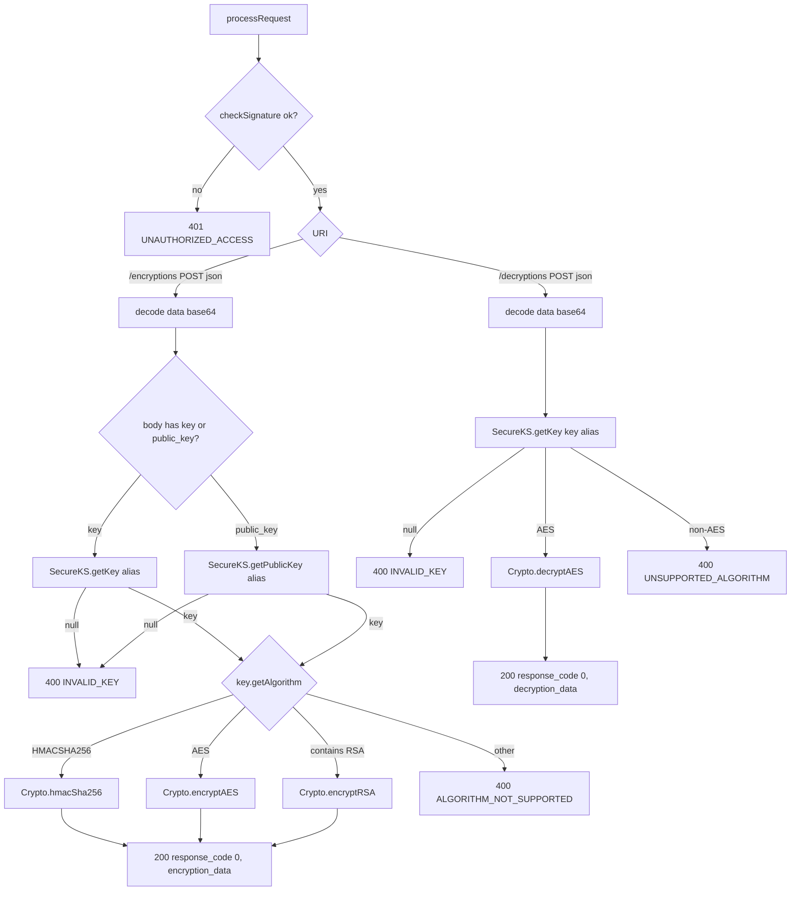

# Encryption and Decryption Endpoints

`com.onepay.onesm.http.HttpServerHandler`
(`src/main/java/com/onepay/onesm/http/HttpServerHandler.java`) is the Netty
`SimpleChannelInboundHandler` that implements the two crypto HTTP endpoints,
`/encryptions` and `/decryptions`, behind the HMAC request-authentication gate.
Every request is validated in `checkSignature` before routing; a request that
fails authentication is short-circuited to `401 UNAUTHORIZED_ACCESS` and never
reaches crypto dispatch. The primitives invoked here are documented in
[Crypto Operations](/openwiki/concepts/crypto-operations.md), and key/alias
resolution comes from `SecureKS` ([key management](/openwiki/concepts/key-management.md)).
The signature scheme that gates these routes is covered in
[HTTP request auth](/openwiki/workflows/http-request-auth.md).

## Responsibilities

- **Authenticate first, then dispatch**: `processRequest` calls
  `checkSignature` and returns `401 UNAUTHORIZED_ACCESS` on any signature
  failure; the crypto endpoints are unreachable without a valid signed request.
- **Serve `POST /encryptions`**: accept a JSON body, resolve a symmetric or
  public key by alias, dispatch on the key's algorithm, and return base64
  ciphertext/MAC in the `encryption_data` field.
- **Serve `POST /decryptions`**: accept a JSON body, resolve a symmetric key by
  alias, decrypt AES ciphertext, and return the plaintext in `decryption_data`.
- **Enforce the HTTP contract**: reject non-POST methods
  (`405 METHOD_NOT_ALLOWED`) and non-JSON content types
  (`415 UNSUPPORTED_MEDIA_TYPE`), and return `404 RESOURCE_NOT_FOUND` for any
  other URI; every failure is reported through the JSON error contract.
- **Sign responses**: every response is emitted through `writeResponse`, which
  sets `Content-Type: application/json`, `X-Date` (RFC-1123 GMT), and — when a
  client key was resolved — an `X-Secure-Hash` HMAC over the response.

## Request format

Both endpoints require `POST`, `Content-Type: application/json`, and a JSON
body parsed with Gson into a `HashMap`. The body fields are read from the map:

| Field | Type | Used by | Meaning |
|-------|------|---------|---------|
| `data` | string | both | Base64-encoded input bytes (`Base64.decodeBase64`) |
| `key` | string | both | `SecureKS` alias for a `Key` that `getKey` resolves |
| `public_key` | string | `/encryptions` | `SecureKS` alias for a certificate whose `getPublicKey` is used for RSA |

For `/encryptions`, exactly one of `key` or `public_key` selects the signing or
wrapping key (HMAC shared secret / AES key via `key`, RSA public key via
`public_key`). For `/decryptions` only `key` is read; the resolved key must be
AES. `data` is decoded from base64 into raw bytes before any crypto call.

## Key resolution and algorithm dispatch

`/encryptions` resolves the key first. If the body contains `key`, it calls
`SecureKS.getKey(alias)`; otherwise, if it contains `public_key`, it calls
`SecureKS.getPublicKey(alias)` (`HttpServerHandler.java#L147-L153`). A `null`
key (missing alias from the keystore) produces `400 INVALID_KEY` with `details`
of `"<alias> key is not existed"`.

When a key resolves, the handler dispatches on `key.getAlgorithm()`:

| `getAlgorithm()` | Primitive | Wrapper |
|------------------|-----------|---------|
| `HMACSHA256` (case-insensitive) | `Crypto.hmacSha256(data, key.getEncoded())` | uses the raw key bytes as the HMAC secret |
| `AES` (case-insensitive) | `Crypto.encryptAES(data, (SecretKey) key)` | implicit-IV AES/CBC/PKCS5 |
| contains `RSA` | `Crypto.encryptRSA(data, (PublicKey) key)` | RSA/ECB/PKCS1 via the certificate public key |
| anything else | — | `400 ALGORITHM_NOT_SUPPORTED` |

`/decryptions` supports **only AES**. It resolves the key with
`SecureKS.getKey(keyLabel)`; a `null` key yields `400 INVALID_KEY`; a non-AES
key yields `400 UNSUPPORTED_ALGORITHM`; an AES `SecretKey` drives
`Crypto.decryptAES(data, (SecretKey) key)`.


Caption: Endpoint dispatch flow for /encryptions and /decryptions after signature verification.

## Success response

On success the handler writes `200 OK` with an `application/json` body:

```json
{ "response_code": 0, "encryption_data": "<base64url>" }
```

for `/encryptions` and

```json
{ "response_code": 0, "decryption_data": "<base64url>" }
```

for `/decryptions`. The crypto output is encoded with Apache Commons Codec
`Base64.encodeBase64URLSafeString`, producing unpadded, url-safe base64. For
AES the returned bytes carry the IV prepended to the ciphertext, so the output
is self-describing for later decryption.

## Error contract

All failures flow through `writeErrorResponse(status, errorName, message,
infoLink, details)`, which serializes a four-field JSON object
(`HttpServerHandler.java#L282-L290`):

```json
{
  "name": "<errorName>",
  "message": "<message>",
  "information_link": "<infoLink>",
  "details": "<details>"
}
```

| Condition | HTTP status | `name` | Notes |
|-----------|-------------|--------|-------|
| Bad request signature | `401` | `UNAUTHORIZED_ACCESS` | gate before routing |
| Unknown URI / wrong method | `404` | `RESOURCE_NOT_FOUND` | only for `/encryptions`/`/decryptions` pre-checks are unsatisfied |
| Non-POST method | `405` | `METHOD_NOT_ALLOWED` | on a recognized URI |
| Non-`application/json` content type | `415` | `UNSUPPORTED_MEDIA_TYPE` | JSON body parse await |
| Unresolvable key alias | `400` | `INVALID_KEY` | `details` names the alias (encryptions) |
| Unsupported key algorithm | `400` | `ALGORITHM_NOT_SUPPORTED` | `/encryptions` non-HMAC/AES/RSA |
| Non-AES key on decryption | `400` | `UNSUPPORTED_ALGORITHM` | `/decryptions` |
| Malformed JSON body | `400` | `INVALID_CONTENT_FORMAT` | `JsonSyntaxException` from `gson.fromJson` |
| Any other exception | `500` | `INTERNAL_SERVER_ERROR` | `message` embeds `Exception: <cause>` |

The whole `processRequest` body is wrapped in try/catch: a
`JsonSyntaxException` maps to `400 INVALID_CONTENT_FORMAT`, and any other
`Exception` (for example a JCE `BadPaddingException` during AES decryption of
tampered or mis-keyed data) maps to `500 INTERNAL_SERVER_ERROR` with the
exception message surfaced in `message`.

## Control flow and integration

The handler accumulates the request body in a `StringBuilder` across
`HttpContent` chunks and parses the URI query string with `QueryStringDecoder`.
Response emission always routes through `writeResponse`, which:

- sets `Content-Type: application/json` and `X-Date`
  (`formatRFC1123Date`),
- adds an `X-Secure-Hash` header calculated by `signResponse` over the request
  signature, status, date, content type, and body SHA-256, using the same client
  key that authenticated the request — but only when `clientKey` was resolved,
- honors `keep-alive` by setting `Content-Length` and `Connection: keep-alive`
  rather than closing the channel.

`SecureKS` supplies both the client authentication keys (`getHttpClientKey`)
and the crypto key material (`getKey`/`getPublicKey`) resolved by the aliases in
the request body. The handler itself performs no crypto; it decodes base64,
resolves keys, and delegates each algorithm to the corresponding `Crypto`
primitive, then re-encodes the result.

## Invariants and failure semantics

- **Authentication is mandatory**: no request reaches an endpoint without a
  valid matching `X-Secure-Hash`/`Authorization` signature; failures are
  indistinguishable at the route layer from any other unauthenticated call.
- **One algorithm per resolved key**: dispatch is driven entirely by
  `key.getAlgorithm()`, not by the body — so passing `public_key` with an AES
  certificate alias would resolve to an AES path and cast the key to
  `SecretKey`; the documented contract expects `key` for HMAC/AES and
  `public_key` for RSA.
- **Decryption accepts only AES**: `/decryptions` has no RSA or HMAC path; all
  other algorithms are rejected with `400 UNSUPPORTED_ALGORITHM`.
- **AES is implicit-IV**: `encryptAES`/`decryptAES` prepend the random IV to the
  ciphertext, so ciphertext shorter than one AES block cannot be decrypted and
  surfaces as a `500` via the catch-all.
- **Whitespace/content negotiation is strict**: content type must literally
  equal `application/json` (`APPLICATION_JSON` constant); anything else is a
  `415`.

## Tests and operational notes

There is no JUnit suite for the HTTP layer (the build runs
`<skipTests>true</skipTests>`). The crypto primitives and key resolution behind
these endpoints are exercised by the standalone `main()` utilities in
`src/test/java` (see [Token Migration and Utility Tools](/openwiki/testing/token-migration-tools.md)),
which reuse the same `Crypto` calls and `SecureKS` aliases — for example
`EncryptOnecommCards`, `DecryptTokenData`, and `TestCrypto` drive
`encryptAES`/`decryptAES`/`hmacSha256` offline with the same key aliases the
HTTP endpoints accept (such as `onecredit.aes` and `tsp.hmac`).
