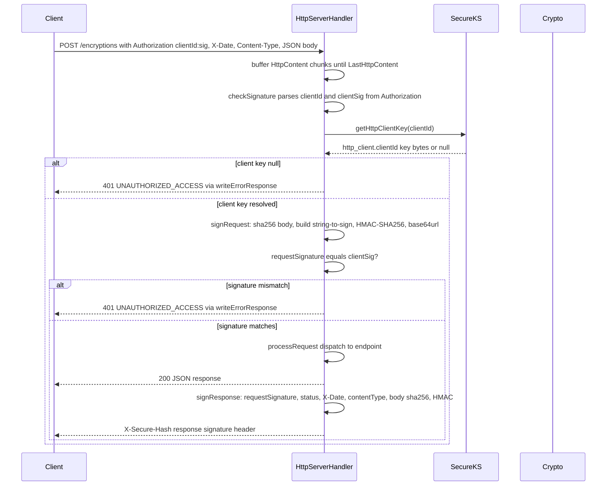

# HTTP Request and Response Signing

`com.onepay.onesm.http.HttpServerHandler`
(`src/main/java/com/onepay/onesm/http/HttpServerHandler.java`) authenticates
every incoming HTTP request with a custom HMAC-SHA256 signature scheme before
any endpoint logic runs. The scheme uses a shared symmetric secret per client,
resolved from a keystore alias, and signs the request's method, path, date,
content type, and body hash. Responses are likewise signed with an
`X-Secure-Hash` header whose string-to-sign is bound to the request signature,
status code, date, content type, and response body hash, so a client can verify
both the authenticity of the caller and the integrity of the reply.

The client keys come from `SecureKS.getHttpClientKey` reading the
`http_client.<clientId>` aliases in the JCEKS keystore
([key management](/openwiki/concepts/key-management.md)). The endpoints this
gate protects are documented in
[encryption and decryption endpoints](/openwiki/workflows/encryption-decryption-endpoints.md).

## Responsibilities

- **Authenticate every request before dispatch**: `processRequest` calls
  `checkSignature(authorization, method, uri, date, contentType, body)` first;
  a failure short-circuits to `401 UNAUTHORIZED_ACCESS` before any crypto route
  is reached.
- **Parse per-client credentials**: extract `clientId` and the client-provided
  signature from the `Authorization` (or `X-Authorization`) header using the
  pattern `^[^ ]+ +([^:]+):(.+)$`.
- **Resolve client keys**: look up the request-signing secret by the parsed
  client id via `SecureKS.getHttpClientKey(clientId)`, which reads the
  `http_client.<clientId>` keystore alias.
- **Build and verify the request signature**: recompute the HMAC-SHA256 over the
  canonical string-to-sign and compare it to the client-supplied signature.
- **Sign responses**: emit `X-Secure-Hash` over the request signature, HTTP
  status, date, content type, and response body hash, using the same client key.

## Header extraction

`channelRead0` captures the relevant headers when it first sees the `HttpRequest`
(`HttpServerHandler.java#L98-L119`):

| Semantic | Preferred header | Fallback header |
|----------|------------------|-----------------|
| Per-client credentials | `X-Authorization` | `Authorization` |
| Request date | `X-Date` | `Date` |
| Body type | `Content-Type` | — |

The header constants are declared at `HttpServerHandler.java#L37-L43`
(`X_SECURE_HASH`, `X_DATE`, `DATE`, `X_AUTHORIATION`, `AUTHORIATION`,
`CONTENT_TYPE`, `APPLICATION_JSON`). Dates are formatted and parsed using the
RFC-1123 / HTTP-date profile (`EEE, dd MMM yyyy HH:mm:ss z`, `GMT` time zone)
via `formatRFC1123Date` / `parseRFC1123Date` (`HttpServerHandler.java#L49-L63`).

The body is buffered across `HttpContent` chunks into a `StringBuilder` until
`LastHttpContent`, at which point `processRequest()` runs with the full content
(`HttpServerHandler.java#L121-L133`).

## Request signature verification

`checkSignature(...)` (`HttpServerHandler.java#L222-L254`) performs the
authentication:

1. **Parse the Authorization header**. The header is matched against
   `pAuthorization = "^[^ ]+ +([^:]+):(.+)$"`. Group 1 is the `clientId`, group 2
   is the client-supplied signature (`clientSig`). An unparseable header yields
   `false`.
2. **Resolve the client key**. `clientKey =
   SecureKS.getHttpClientKey(clientId)` reads the `http_client.<clientId>`
   alias directly from the keystore (not the shared cache). `null` (unknown
   client id) fails authentication.
3. **Recompute and compare**. `requestSignature = signRequest(clientKey, method,
   uri, dateHeader, contentType, body)`. The request is authenticated only when
   `requestSignature.equals(clientSig)` — an exact, case-sensitive string
   comparison.

Any failure at any step returns `false`, and `processRequest` maps that to
`401 UNAUTHORIZED_ACCESS` with `name=UNAUTHORIZED_ACCESS` and message
`"You don't have permission to access this resource."` (`HttpServerHandler.java#L212-L214`).

## Request string-to-sign

`signRequest(key, method, path, dateHeader, contentType, body)`
(`HttpServerHandler.java#L303-L310`) builds the canonical string and HMAC:

```text
<HTTP method>\n<request path>\n<date header>\n<content type>\n<body SHA-256>
```

Specifically:

- **Line 1** — the HTTP method verb (e.g. `POST`).
- **Line 2** — the request path as received on the wire (`uri`), including any
  query string (the handler uses the raw `uri` string, not the path component).
- **Line 3** — the `X-Date` (or `Date`) header value verbatim; an absent date
  contributes an empty string.
- **Line 4** — the `Content-Type` header value verbatim; absent contributes an
  empty string.
- **Line 5** — the SHA-256 of the UTF-8 body bytes, encoded as unpadded
  url-safe base64 (`Crypto.sha256Base64`). An empty/absent body contributes an
  **empty string** (no hash), not a base64 encoding of an empty digest.

The canonical string is then signed with
`Crypto.hmacSha256(stringToSign.getBytes(), key)` — a standard
`Mac` `HMACSHA256` over the raw key bytes — and the result is encoded with
`Base64.encodeBase64URLSafeString` (unpadded, url-safe base64). That url-safe
base64 string is what the client must place in the Authorization header and what
the server compares against.

### Client signing recipe

A client therefore computes its `Authorization` header as:

```
Authorization: <scheme> <clientId>:<HMAC-SHA256(stringToSign, http_client.<clientId> key) base64url>
```

The `<scheme>` token is matched but otherwise ignored by the parser — the regex
consumes `"<anything not space> +"` before the colon-separated pair. `clientId`
must be the alias suffix matching `http_client.<clientId>` in the keystore.

## Response signing

Every response — success or error — is emitted through `writeResponse(status,
body)` (`HttpServerHandler.java#L256-L280`), which sets:

- `Content-Type: application/json`
- `X-Date` — the current time in RFC-1123 GMT
- `X-Secure-Hash` — added via `response.headers().add(...)` **only when
  `clientKey` was resolved** (that is, only when the caller authenticated);
  absent on the `100 Continue` control message and on the `UNAUTHORIZED_ACCESS`
  rejection that follows a failed lookup.

`signResponse(key, requestSignature, statusCode, dateHeader, contentType, body)`
(`HttpServerHandler.java#L312-L319`) builds the response string-to-sign:

```text
<request signature>\n<HTTP status code>\n<response date header>\n<content type>\n<response body SHA-256>
```

- **Line 1** — the recomputed request signature from `checkSignature`. This
  binds the response to the specific request that produced it.
- **Line 2** — the HTTP status code as an integer (e.g. `200`); note this is
  `status.code()`, not a status string.
- **Line 3** — the response `X-Date` value (RFC-1123 GMT).
- **Line 4** — the response content type (`application/json`).
- **Line 5** — the SHA-256 of the UTF-8 response body bytes (url-safe base64),
  or an empty string for an empty body.

The HMAC uses the **same client key** that authenticated the request. The
result is again url-safe base64 and is placed in the `X-Secure-Hash` response
header, so the client can recompute and verify it with the same shared secret.

## End-to-end flow


Caption: Request authentication and response signing flow for a single HTTP call.

## Control flow and integration

- **Gate position**: `checkSignature` is the first action in `processRequest`
  (`HttpServerHandler.java#L139`). No header or body access, key resolution, or
  crypto dispatch happens before the gate passes.
- **Date is not validated, only bound**: both the request and response
  string-to-sign include the date header, but the server does **not** check
  freshness or parse the date to reject replay/clock-drift; it treats the value
  as opaque and just binds it into the signature. `parseRFC1123Date` exists but
  is unused in the current auth path.
- **Client keys bypass the cache**: `SecureKS.getHttpClientKey` reads the
  `http_client.*` aliases directly via `ks.getKey`, with an **empty** keystore
  entry password, and does not go through the Guava `keysCache` that serves the
  `/encryptions` `/decryptions` crypto keys (see
  [key management](/openwiki/concepts/key-management.md)).
- **Response signing is best-effort tied to auth**: if the caller fails e.g.
  because an unknown client id yields `null` key, `clientKey` stays `null` and
  no `X-Secure-Hash` is computed for the `401`. Conversely, a successfully
  authenticated request always receives a signed response, including error
  responses for later routing failures.
- **Keep-alive handling**: `writeResponse` honors `HttpUtil.isKeepAlive`,
  setting `Content-Length` and `Connection: keep-alive` for keep-alive
  connections, otherwise closing after the write.

## Invariants and failure semantics

- **Authentication is all-or-nothing.** An unparseable `Authorization` header,
  an unknown `clientId`, a missing client key, or a signature mismatch all
  collapse to `false` and a `401 UNAUTHORIZED_ACCESS`; callers cannot distinguish
  which condition failed from the response.
- **Comparison is exact string equality.** `requestSignature.equals(clientSig)`
  is case-sensitive; both sides must produce the identical url-safe base64
  string for the authentication to pass. This makes the shared secret, the
  canonical string layout, and the exact header values (including any query
  string, date text, and content-type casing) all part of the wire contract.
- **The scheme is HMAC-SHA256 only.** There is no RSA/ECDSA or TLS-mutual
  authentication path in the request/response signing layer; any endpoint is
  reachable only by holders of a matching `http_client.*` symmetric key.
- **No replay window.** The bound date participates in the signature but is not
  checked for freshness, so the scheme authenticates the caller and integrity of
  the message but does not itself defend against replay within the signing
  window.

## Configuration and operations

- The keystore master key, port, and logging are configured through the JVM
  system properties described in
  [deployment and startup](/openwiki/operations/deployment-and-startup.md); no
  per-scheme configuration option exists — the signing scheme is fixed in code.
- New clients are provisioned by adding an `http_client.<clientId>` secret-key
  entry to the JCEKS keystore (`/src/main/resources/keystore.jceks`) whose
  encoded bytes are the HMAC secret. The client id is whatever suffix string the
  client sends in the `Authorization` header.
- `X-Secure-Hash`, `X-Date`, `X-Authorization`, `Authorization`, and
  `Content-Type` header names are fixed constants, so integrators must match
  them exactly (the code also reads the misspelled constant name
  `AUTHORIATION` for historical reasons).

## Tests

There is no JUnit suite; the Maven build runs `<skipTests>true</skipTests>` and
the test sources under `src/test/java` are standalone `main()` utilities
(`TestCrypto`, `TestBase64`, and the token-migration tools). None of them
exercise `checkSignature`, `signRequest`, or `signResponse` directly — the HTTP
signing path is only ever exercised through live HTTP calls to a running
`HttpServer`. The documented string-to-sign layout, therefore, is the sole
specification of the wire format for both clients and any future test coverage.
