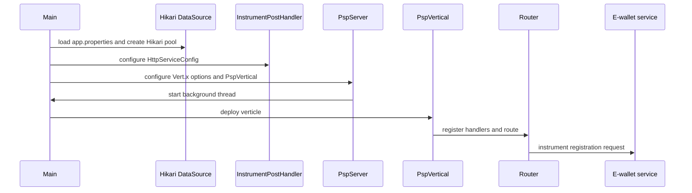

This page describes the architecture of `psp-connector-ewallet`, a Vert.x-based payment service connector in the `payment-platform` system. Backstage catalog metadata describes it as an e-wallet connector that handles e-wallet instrument registration (`Instruments`) and wallet mobile/email identity fields. The current implementation is focused on one public endpoint: instrument registration through an e-wallet partner API.

Related details:

- `/openwiki/architecture/package-map.md`
- `/openwiki/integrations/ewallet-service.md`
- `/openwiki/operations/configuration.md`
- `/openwiki/workflows/instrument-registration.md`

## Service shape and ownership

The repository contains a production Java service identified as `psp-connector-ewallet`, with the Maven coordinates `vn.onepay:psp-connector-ewallet`. Backstage assigns ownership to `group:default/team-payment` and places the component in the `payment-platform` system. The catalog also declares the `psp-connector-ewallet-api` OpenAPI surface and a dependent Oracle resource named `ewallet-oracle-db`, whose description is reconciliation and instrument-state data. The catalog is useful for service-level context, but runtime behavior in this page follows the current Java implementation.

The service uses Vert.x `3.5.4`, Vert.x Web routing, HikariCP, Oracle JDBC, Jackson, Log4j2, and the OnePAY `vn.onepay:ows` signature library. The Maven build packages the application around the `vn.onepay.psp.Main` entrypoint; there is currently no `src/test` tree or focused test suite in the repository.

## Startup and runtime topology

`Main` loads `app.properties`, creates an Oracle HikariCP pool, assembles an `HttpServiceConfig` for the e-wallet service, and configures `InstrumentPostHandler` before starting `PspServer`. The Hikari pool uses `oracle.jdbc.pool.OracleDataSource`, property-driven sizing and timeouts, pool name `PSP_EWALLET_DB_POOL`, and MBean registration. `PspServer.init()` starts a background thread, builds a Vert.x instance from worker/event-loop/thread-check settings, and deploys one `PspVertical` verticle.



The runtime is a single-service HTTP process:

1. `Main` owns configuration loading, database-pool creation, outbound-service configuration, and server setup.
2. `PspServer` owns Vert.x construction and verticle deployment.
3. `PspVertical` owns the HTTP server, inbound routing, and shared HTTP clients.
4. Business handlers own request validation, outbound calls, and response staging.

The Hikari pool is created eagerly during startup. A database-connection failure during construction can therefore fail startup before the HTTP listener is created. Conversely, the current instrument endpoint does not consult the pool in its request path, so catalog mentions of Oracle reconciliation and instrument state remain an integration boundary rather than a verified local request dependency.

## Package boundaries and responsibilities

The code follows a small layered structure under `vn.onepay.psp`:

- `Main` is the process entrypoint and composition root.
- `server.vertical` contains the Vert.x lifecycle and shared HTTP clients.
- `server.handler.common` contains cross-cutting request logging, authorization, exception mapping, and response emission.
- `server.handler.instrument` contains the business handler for the instrument-registration endpoint.
- `common.util` contains configuration, routing-context accessors, request construction, parameter names, and constants.
- `common.error` and `common.exception` define the service's error vocabulary and typed failures.
- `common.service` contains older shared service classes and helpers that are not part of the current instrument route.

The current architecture deliberately keeps routing, authentication, business transformation, and response handling as separate stages. This makes the endpoint path easy to follow: common route handlers validate and authorize each request, the instrument handler transforms the request, the e-wallet client signs and sends it, and common response handlers normalize the result.

## Inbound routing and request lifecycle

`PspVertical.start()` creates two static Vert.x HTTP clients: a normal client with a maximum pool size of 100 and an SSL client with `setSsl(true)` and `setTrustAll(true)` and the same pool limit. It then creates the router and installs the following route order:

1. `BodyHandler.create()`
2. `ResponseTimeHandler.create()`
3. `TimeoutHandler.create(connectionTimeOut)`
4. `RequestLoggingHandler::handle`
5. `ClientAuthorizationHandler::handle`
6. `POST {server.api.prefix}/instruments -> InstrumentPostHandler::handle`
7. `route().failureHandler(ExceptionHandler::handle)`
8. `route().last().handler(ResponseHandler::handle)`

The effective public path is `POST /psp-connector-ewallet/api/v1/instruments`, assembled from `server.api.prefix` and `/instruments`. The route is explicitly registered after the common authorization handler, so the business endpoint is protected by the same signature checks as future routes placed in the same chain. The final `ResponseHandler` runs after a successful endpoint path, while failures are handled by `ExceptionHandler`.

### Client authorization

`ClientAuthorizationHandler` requires JSON `Accept` and `Content-Type` headers, `X-OP-Date`, a positive `X-OP-Expires`, and `X-OP-Authorization`. It extracts the client id from the authorization credential, validates service region, service name, authorization terminator, and algorithm, then recomputes the signature from the request method, path, query parameters, signed headers, and request body. The client id is stored on the routing context, and a mismatched or expired signature raises `AuthorizationException`, which the exception handler maps to HTTP 401. Header and payload failures before business routing are generally rejected by this common handler before `InstrumentPostHandler` runs.

### Successful response path

On success, `InstrumentPostHandler` stores `response_code`, `response_desc`, and `response_data` in the routing context. `ResponseHandler` then defaults to HTTP 404 if those values are absent, otherwise uses the staged values, sets JSON content type and content length, logs the response body through `AppUtil.instrumentLogFilter`, and writes the final JSON response from a blocking worker context.

### Failure path

`ExceptionHandler` maps typed exceptions to status codes:

- `AuthorizationException` -> HTTP 401
- `BadRequestException` -> HTTP 400
- `ResourceConflictException` -> HTTP 409
- `ResourceNotFoundException` -> HTTP 404
- `HttpServiceException` -> status and reason from the exception's `SystemError`
- other `SystemException` values -> HTTP 500
- unexpected throwables -> HTTP 500 with `INTERNAL_SERVER_ERROR`

The resulting JSON body contains `name`, `message`, `details`, and `information_link`. This gives callers a stable error envelope even when validation, authentication, or outbound service behavior fails.

## The single business endpoint

The service exposes exactly one business route today:

```text
POST /psp-connector-ewallet/api/v1/instruments
```

`InstrumentPostHandler` validates the request body in a blocking worker context. An empty body produces `INVALID_REQUEST_BODY`; missing or empty `user_id`, `mobile`, or `email` produces `VALIDATION_ERROR`. The handler reads optional `first_name`, `last_name`, and `address`, injects `group_id` from `ewallet.service.group`, and forwards the transformed JSON as a POST to the e-wallet service path `/instruments`.

The outbound call uses `HttpClientUtil.createHttpRequest`, which selects `PspVertical.httpsClient` when the configured service URL uses HTTPS and otherwise uses `PspVertical.httpClient`. It sets an absolute URL from `ewallet.service.base.url` plus `/instruments`, applies the configured request timeout, signs the outgoing request with `Authorization`, and sends JSON headers plus the transformed body. The handler accepts a successful upstream status only when it is HTTP 201; any other upstream status is treated as `HttpServiceException` and passed to `ExceptionHandler`. On HTTP 201, the upstream JSON body is staged as the connector response data and returned to the caller as HTTP 201 through `ResponseHandler`.

The current code does not perform local instrument persistence, idempotency lookup, or duplicate-registration protection. It validates the connector-facing request, transforms the payload, calls the e-wallet service, and relays the upstream result. Any Oracle reconciliation or instrument-state behavior declared in the catalog is therefore outside the verified local request path of this implementation.

## Configuration and operational controls

All runtime configuration is loaded from `src/main/resources/app.properties` through `Main.p`. The main operational groups are:

- Server: `server.host`, `server.port`, `server.api.prefix`, worker/event-loop pool sizes, thread-check interval, connection keep-alive, connection timeout, idle timeout, and maximum worker/event-loop execution time.
- Database: Oracle JDBC URL, username/password, pool sizing, idle/validation/connection timeouts, and connection test query.
- E-wallet service: service name, region, group, base URL, authorization id/type/algorithm/key, and request timeout.
- Access keys: `access_key.<clientId>` properties are looked up by `ClientAuthorizationHandler` when validating inbound OWS signatures.

The checked-in properties show defaults such as `server.port=12190`, `server.api.prefix=/psp-connector-ewallet/api/v1`, an Oracle URL, an e-wallet base URL, and one `access_key.TSP` entry. Treat these as deployment examples rather than security guidance: credentials and service endpoints are environment-specific and must be supplied securely in production. Detailed configuration and deployment topics belong in `/openwiki/operations/configuration.md`.

## Failure and lifecycle invariants

Several invariants are important when changing this service:

- The public route is defined by `server.api.prefix` plus the handler path, not by a separate route catalog.
- Inbound requests must pass the common JSON-header and OWS authorization checks before the instrument handler runs.
- Outbound instrument calls are signed with the configured e-wallet `HttpServiceConfig` and are considered successful only on upstream HTTP 201.
- The shared Vert.x HTTP clients are static fields on `PspVertical`; changes to client configuration affect every request that selects them.
- A failure during Hikari pool creation is a startup failure; failures during request handling are converted by the common failure handler when possible.
- The process has one deployed verticle and one HTTP listener in the current codebase. Scaling, clustering, or multi-instance behavior is not established by the implementation shown here.

## Extension points

The architecture supports extensions in a few localized ways:

- Add another `server.handler.*` package and register its handler in `PspVertical` after the common route chain.
- Reuse `HttpClientUtil` and `HttpServiceConfig` for other signed outbound services by changing service properties and the `InstrumentPostHandler.setServiceConfig` wiring pattern.
- Add new typed failures under `common.exception` and map them in `ExceptionHandler` when a new failure mode needs a distinct HTTP status.
- Extend `common.util` parameter constants only when new request or upstream payload fields are actually used.
- Introduce focused tests under a future `src/test` tree for router ordering, authorization rejection, body validation, upstream 201 relaying, and non-201 failure mapping.

A concrete extension should preserve the current invariants: keep common authorization ahead of business handlers, stage successful responses through the routing context, and map failures through the shared exception envelope.

## Current verification gaps

The repository currently has no test classes or integration-test sources, so claims about test coverage cannot be verified from repository evidence. The Backstage catalog declares an Oracle dependency and describes reconciliation/instrument-state concerns, but the current `InstrumentPostHandler` does not call the Hikari pool during the instrument request. The catalog description also mentions wallet mobile/email identity processing more broadly than the single implemented route. When documenting operations or workflows, follow the implementation first and treat catalog-level integration claims as adjacent system context unless newer code supports them.

## Evidence

- Component identity, API declaration, and Oracle dependency: `repo://catalog-info.yaml#L1-L95`
- Process startup, configuration loading, Hikari pool, and server composition: `repo://src/main/java/vn/onepay/psp/Main.java#L16-L70`
- Vert.x lifecycle and verticle deployment: `repo://src/main/java/vn/onepay/psp/server/vertical/PspServer.java#L9-L68`
- HTTP server, shared clients, route order, and instrument route: `repo://src/main/java/vn/onepay/psp/server/vertical/PspVertical.java#L19-L93`
- Instrument validation, transformation, outbound call, and upstream 201 handling: `repo://src/main/java/vn/onepay/psp/server/handler/instrument/InstrumentPostHandler.java#L26-L97`
- Inbound OWS authorization and signature verification: `repo://src/main/java/vn/onepay/psp/server/handler/common/ClientAuthorizationHandler.java#L29-L158`
- Successful response staging and emission: `repo://src/main/java/vn/onepay/psp/server/handler/common/ResponseHandler.java#L21-L76`
- Typed exception mapping and error envelope: `repo://src/main/java/vn/onepay/psp/server/handler/common/ExceptionHandler.java#L23-L117`
- Outbound request construction and signing: `repo://src/main/java/vn/onepay/psp/common/util/HttpClientUtil.java#L22-L87`
- Server, database, e-wallet, and access-key configuration defaults: `repo://src/main/resources/app.properties#L1-L46`
- Maven runtime dependencies and service artifact identity: `repo://pom.xml#L1-L108`
- Request logging and response/body filtering: `repo://src/main/java/vn/onepay/psp/server/handler/common/RequestLoggingHandler.java#L15-L34`
- Routing-context accessors used by response handlers: `repo://src/main/java/vn/onepay/psp/common/util/ContextUtil.java#L13-L123`
- Error vocabulary used by the common exception path: `repo://src/main/java/vn/onepay/psp/common/error/SystemError.java#L6-L97`
