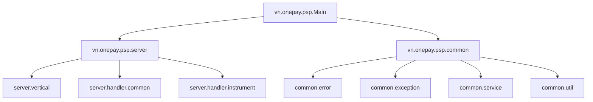

This page maps the Java packages under `vn.onepay.psp` in `psp-connector-ewallet`. It describes ownership boundaries rather than repeating the end-to-end request narrative; for route order, authorization behavior, and instrument registration flow, see `/openwiki/architecture/overview.md`.

## Package topology

The production tree contains one entrypoint class, one server/runtime subpackage, one shared `common` tree, and no `src/test` sources. The structure is small but not uniform: some utilities are actively used by the current HTTP path, while several service, constant, and card-processing helpers are retained legacy code that no current handler invokes.

This diagram shows package ownership only; runtime control flow follows the shared router chain described in `/openwiki/architecture/overview.md`.

## Entrypoint package: `vn.onepay.psp`

`vn.onepay.psp` contains the process entrypoint and composition root, not business logic.

`Main` loads `app.properties` into the public static `Main.p` field, creates the Oracle HikariCP pool, assembles `HttpServiceConfig` for the downstream e-wallet service, injects that config into `InstrumentPostHandler`, and configures `PspServer` with a `PspVertical` instance before `init()` starts Vert.x deployment.

The Hikari pool is created eagerly as `PSP_EWALLET_DB_POOL` using `oracle.jdbc.pool.OracleDataSource`. A database failure during pool construction can therefore prevent HTTP startup, even though the current instrument request path does not use the pool. The services that would consume the pool live in `common.service` and are not wired by `Main`.

## Server/runtime package: `vn.onepay.psp.server`

`server.vertical` owns Vert.x lifecycle and shared runtime resources.

- `PspServer` builds Vert.x from worker/event-loop/thread-check settings, deploys one `PspVertical`, and starts that work on a background thread.
- `PspVertical` owns HTTP listener creation, the static outbound clients `httpClient` and `httpsClient`, and router construction.

The router chain is ordered as body handling, response timing, timeout, request logging, client authorization, the business route `POST {server.api.prefix}/instruments`, failure handling, and final response emission. Because `ClientAuthorizationHandler` is installed before `InstrumentPostHandler`, all inbound requests pass common OWS checks before business routing runs.

`server.handler.common` owns cross-cutting HTTP stages:

- `RequestLoggingHandler` logs selected request headers and a filtered request body.
- `ClientAuthorizationHandler` validates JSON headers, OWS1 credentials, expiry, region/service/algorithm fields, and the recomputed HMAC signature. It stores the extracted client id on the routing context.
- `ExceptionHandler` maps typed failures to HTTP status codes and emits the common JSON error envelope.
- `ResponseHandler` emits staged `response_code`, `response_desc`, and `response_data` values from the routing context, defaulting to HTTP 404 when no business handler staged them.

`server.handler.instrument` contains the only business handler currently registered in the router. `InstrumentPostHandler` validates the instrument body in a worker context, transforms it into the e-wallet payload, and invokes the signed outbound POST helper.

## Shared error and exception package: `vn.onepay.psp.common.error`

`common.error` defines the service's error vocabulary in `SystemError`. Constants carry a public error name, message, details, and information link; `HttpServiceException` additionally uses a constructor that also supplies an HTTP `code` and `reason` taken from downstream response data.

These constants are the names and messages the HTTP error contract exposes. Adding a failure mode generally requires both a `SystemError` value and a handler-side mapping or typed exception.

## Typed failures: `vn.onepay.psp.common.exception`

`common.exception` defines the runtime exception hierarchy used by request handling:

- `SystemException` is the base runtime exception carrying a `SystemError`.
- `AuthorizationException`, `BadRequestException`, `ResourceConflictException`, and `ResourceNotFoundException` are specializations mapped by `ExceptionHandler`.
- `HttpServiceException` represents an upstream HTTP failure and carries status/reason plus downstream error-map data.
- `OracleException` is a separate `RuntimeException` used by the dormant `common.service` classes, not by the active instrument route.

`ExceptionHandler` treats any unexpected non-`SystemException` throwable as an internal server error, while `SystemException` subtypes drive the status mapping.

## Shared services: `vn.onepay.psp.common.service`

`common.service` contains Oracle-backed service facades for older payment-platform concerns:

- `AuthorizationService`: `get`, `search`, `insert`, and `update` over `PKG_AUTHORIZATION` procedures.
- `PaymentService`: payment insert/update, payment formatting, amount/currency presentation, and state handling over `PKG_PAYMENT`.
- `UserService`: VCB-user insert, state update, delete, get, and usage-code update over `PKG_VCB_USER`.

Each service holds a public static `DataSource` field and delegates to `DBProcedureUtil` with procedure strings from `ProcedurePool`. Result codes are interpreted as HTTP-like statuses; non-success codes raise `OracleException`.

These classes are not part of the current instrument route. `Main` creates a Hikari pool but does not assign it to any service `dataSource`, and no current handler calls these service methods. The package is therefore best understood as retained database/service infrastructure rather than active e-wallet registration logic.

## Shared utilities: `vn.onepay.psp.common.util`

`common.util` provides configuration-independent helpers and constants used across handlers.

### Request and response helpers

- `ContextUtil` reads typed values and staged maps from a Vert.x `RoutingContext`; `ResponseHandler` relies on it for `response_code`, `response_desc`, and `response_data`.
- `ParamUtil` reads typed values from request/response maps; `InstrumentPostHandler` uses it for body fields and the optional `address` object, and `HttpServiceException` uses it to extract downstream error fields.
- `GetterUtil` performs lenient value conversion and defaults used by header parsing and parameter extraction.
- `AppUtil` supplies response content-length calculation, JSON error helpers, instrument-number masking, and `instrumentLogFilter`, which redacts card-like or CVV-like values in request, response, and outbound logs.

### Outbound HTTP configuration

- `HttpServiceConfig` is a fluent value object for downstream service name, region, group, base URL, OWS auth id/type/key/algorithm, and request timeout. `Main` builds it and `InstrumentPostHandler` holds the static instance.
- `HttpClientUtil.createHttpRequest` selects `PspVertical.httpClient` or `PspVertical.httpsClient` from the configured service URL scheme, builds the absolute request URI, applies the service timeout, and signs the outbound request with OWS1 headers and body.

### Constants and identifiers

- `AppConstants` defines shared content-type and signature regex constants plus a GMT date formatter.
- `AppParams` is the large parameter-name catalog for headers, request fields, response staging keys, error envelope fields, and database column aliases.
- `AuthorizationTypes`, `CurrencyCodes`, `PaymentTypes`, `ResourceStates`, and `ProcedurePool` define domain labels, currency codes, payment/resource states, and Oracle procedure call strings.
- `TokenCvvGenerator` implements HMAC-SHA256 dynamic CVV generation for tokenized cards.

Several of these helpers are legacy or currently unused by the active route. `AuthorizationTypes`, `PaymentTypes`, `TokenCvvGenerator`, `AppUtil.isInternationalCreditCard`, and `AppUtil.generateRandomNumber` have no current Java callers outside their definitions. That does not remove their historical role in the broader payment-platform connector family, but it does mean the current instrument flow does not depend on them.

### Database utilities

`DBProcedureUtil` executes Oracle callable statements with typed in/out parameters, registers out parameters by index, reads result cursors, and converts procedure results into maps. It is the shared DB bridge for the dormant `common.service` classes rather than for the current HTTP handler path.

## Invariants and change boundaries

When changing this repository, preserve these package-level boundaries:

- `Main` owns configuration loading and composition; business handlers should not re-create the e-wallet `HttpServiceConfig` or server settings.
- `server.vertical` owns router order; common authorization must remain ahead of business handlers, and failure/response handlers must remain route-wide.
- `server.handler.common` owns the stable inbound contract: OWS validation, response staging keys, and the JSON error envelope.
- `server.handler.instrument` owns only instrument-registration transformation and upstream status interpretation.
- `common.exception` and `common.error` own the typed failure vocabulary; new HTTP-visible failures should be modeled there and mapped consistently in `ExceptionHandler`.
- `common.service` remains outside the active instrument path unless `Main` is changed to wire a `DataSource` into those services.

The repository currently has no focused test sources or integration-test tree. Any future test package should therefore be introduced deliberately rather than assumed to exist.

## Focused tests that would matter

Because no current test suite exists, the highest-value future coverage would focus on package contracts rather than on incidental symbols:

- Router ordering and shared-handler placement in `PspVertical`.
- `ClientAuthorizationHandler` rejection of missing headers, expired credentials, wrong region/service/algorithm, and invalid signatures.
- `InstrumentPostHandler` empty-body and missing-field validation, outbound payload transformation, HTTP 201 relaying, and non-201 upstream failures.
- `ExceptionHandler` mapping of `AuthorizationException`, `BadRequestException`, `ResourceConflictException`, `ResourceNotFoundException`, `HttpServiceException`, and unexpected throwables.
- `ResponseHandler` success staging defaults and `AppUtil.instrumentLogFilter` redaction behavior.

## Evidence

- Process composition root and startup wiring: `repo://src/main/java/vn/onepay/psp/Main.java#L16-L70`
- Vert.x lifecycle and verticle deployment: `repo://src/main/java/vn/onepay/psp/server/vertical/PspServer.java#L9-L68`
- Router order, shared clients, and instrument route registration: `repo://src/main/java/vn/onepay/psp/server/vertical/PspVertical.java#L60-L93`
- Common request logging, inbound OWS authorization, response staging, and exception mapping: `repo://src/main/java/vn/onepay/psp/server/handler/common/ClientAuthorizationHandler.java#L29-L159`, `repo://src/main/java/vn/onepay/psp/server/handler/common/ExceptionHandler.java#L23-L118`, `repo://src/main/java/vn/onepay/psp/server/handler/common/ResponseHandler.java#L21-L77`, `repo://src/main/java/vn/onepay/psp/server/handler/common/RequestLoggingHandler.java#L15-L35`
- Instrument business handler validation, transformation, and upstream status handling: `repo://src/main/java/vn/onepay/psp/server/handler/instrument/InstrumentPostHandler.java#L26-L98`
- Error vocabulary and typed failure hierarchy: `repo://src/main/java/vn/onepay/psp/common/error/SystemError.java#L6-L145`, `repo://src/main/java/vn/onepay/psp/common/exception/SystemException.java#L9-L20`, `repo://src/main/java/vn/onepay/psp/common/exception/HttpServiceException.java#L13-L22`
- Oracle-backed service facades and unused current-path boundary: `repo://src/main/java/vn/onepay/psp/common/service/AuthorizationService.java#L22-L210`, `repo://src/main/java/vn/onepay/psp/common/service/PaymentService.java#L20-L244`, `repo://src/main/java/vn/onepay/psp/common/service/UserService.java#L19-L177`
- Shared utility responsibilities: `repo://src/main/java/vn/onepay/psp/common/util/ContextUtil.java#L13-L124`, `repo://src/main/java/vn/onepay/psp/common/util/ParamUtil.java#L12-L138`, `repo://src/main/java/vn/onepay/psp/common/util/AppUtil.java#L16-L157`, `repo://src/main/java/vn/onepay/psp/common/util/HttpClientUtil.java#L22-L88`, `repo://src/main/java/vn/onepay/psp/common/util/HttpServiceConfig.java#L6-L114`
- Constants, database procedure catalog, and legacy helper boundaries: `repo://src/main/java/vn/onepay/psp/common/util/AppConstants.java#L9-L22`, `repo://src/main/java/vn/onepay/psp/common/util/AppParams.java#L6-L256`, `repo://src/main/java/vn/onepay/psp/common/util/ProcedurePool.java#L6-L34`, `repo://src/main/java/vn/onepay/psp/common/util/TokenCvvGenerator.java#L13-L60`
- Runtime configuration defaults consumed by `Main` and handlers: `repo://src/main/resources/app.properties#L1-L46`
- Maven artifact identity and runtime dependencies: `repo://pom.xml#L1-L100`
- Related architecture and workflow context: `repo://openwiki/architecture/overview.md`
