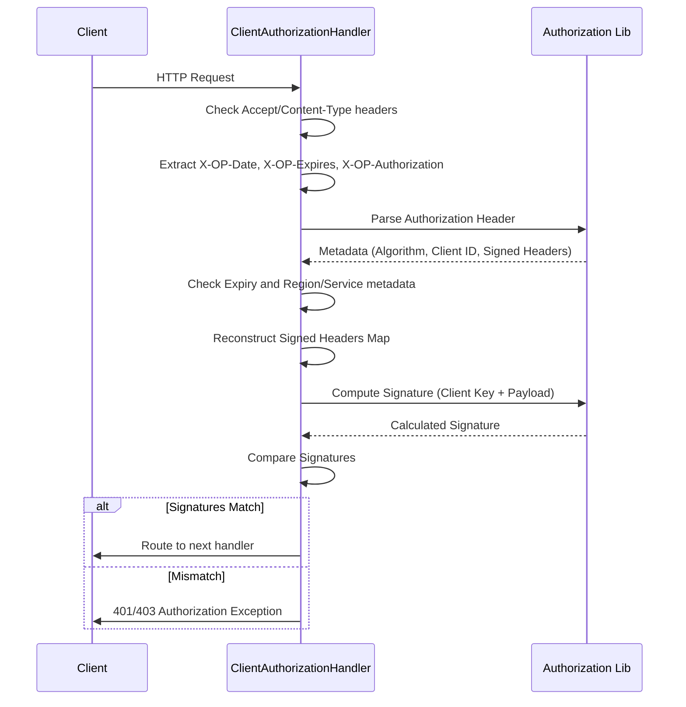
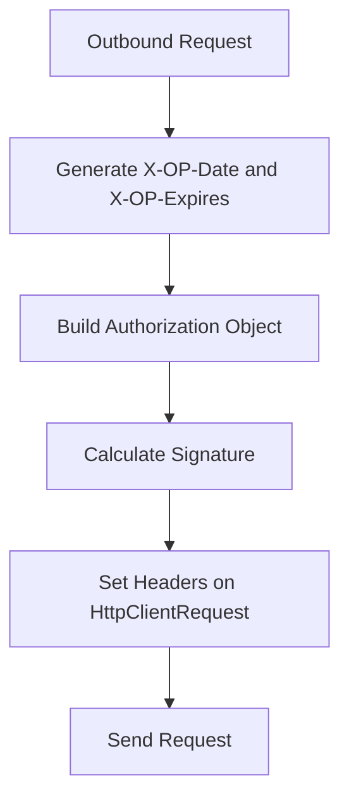

# Security and signatures

The PSP connector uses the **OWS1** (OnePAY Web Service v1) signature scheme for both inbound and outbound HTTP requests. This provides request integrity, authenticity, and replay protection using HMAC-SHA256.

## Inbound Request Verification

When the connector receives a request from an upstream client, it validates the request headers and signature in `ClientAuthorizationHandler`.

### Validation Steps

1.  **Header Presence**: Checks for `Accept`, `Content-Type`, `X-OP-Date`, `X-OP-Expires`, and `X-OP-Authorization`.
2.  **Authorization Parsing**: The `Authorization` class (from the `vn.onepay:ows` library) parses the `X-OP-Authorization` header.
3.  **Metadata Verification**: Verifies `Algorithm` (must be `OWS1-HMAC-SHA256`), `Region` (must be `onepay`), and `Service` (must be `psp-connector-vietcombank`).
4.  **Expiry Check**: Ensures the request timestamp plus the `X-OP-Expires` duration has not passed.
5.  **Signature Re-computation**: Rebuilds the signature using the shared `access_key` stored in `app.properties` (keyed by Client ID) and compares it with the provided signature.

## Outbound Request Signing

When calling the downstream ewallet service (e.g., VietComBank TSP), the connector signs the outgoing request in `HttpClientUtil`.

### Signing Process

1.  **Timestamps**: Generates a fresh `X-OP-Date` (UTC timestamp) and sets `X-OP-Expires`.
2.  **Header Construction**: Gathers query parameters, signed headers, and the request body.
3.  **Signature Generation**:
    *   The `Authorization` object is instantiated with:
        *   `serviceAuthId` and `serviceAuthKey` (from configuration).
        *   HTTP method and request URI.
        *   Signed headers and request body bytes.
    *   It computes the HMAC-SHA256 signature.
4.  **Header Injection**: Adds `X-OP-Date`, `X-OP-Expires`, and the `Authorization` header containing the signature.

### Configuration

Key credentials are stored in `app.properties`:

*   `access_key.<ClientID>`: Keys for inbound verification.
*   `ewallet.service.authorization.id`: The connector's identity when calling downstream.
*   `ewallet.service.authorization.key`: The shared secret for outbound signing.

