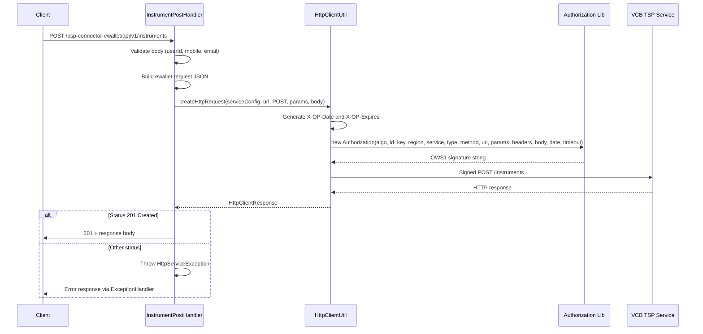

# Ewallet downstream integration

The PSP connector forwards instrument (and potentially other payment-related) requests to a downstream **VietComBank (VCB) TSP (Token Service Provider)** ewallet service over HTTP. The outbound call is constructed in [`InstrumentPostHandler`](repo://src/main/java/vn/onepay/psp/server/handler/instrument/InstrumentPostHandler.java) and [`HttpClientUtil`](repo://src/main/java/vn/onepay/psp/common/util/HttpClientUtil.java), and is signed using the OWS1 scheme described in [[/openwiki/concepts/security-and-signatures.md]].

## Downstream service identity

The connector targets the VCB TSP API, configured in [`app.properties`](repo://src/main/resources/app.properties) and loaded into an [`HttpServiceConfig`](repo://src/main/java/vn/onepay/psp/common/util/HttpServiceConfig.java) during application bootstrap in [`Main`](repo://src/main/java/vn/onepay/psp/Main.java):

| Property | Example value | Purpose |
|---|---|---|
| `ewallet.service.name` | `tsp` | Logical service name used in OWS1 signing |
| `ewallet.service.region` | `vcb` | Region identifier for signing |
| `ewallet.service.group` | `onepay` | Group injected into outbound request body |
| `ewallet.service.base.url` | `http://127.0.0.1:9443/tsp/api/v1` | Base URL of the TSP service |
| `ewallet.service.authorization.type` | `ows1_request` | Signing algorithm type |
| `ewallet.service.authorization.algorithm` | `OWS1-HMAC-SHA256` | HMAC algorithm used for outbound signatures |
| `ewallet.service.authorization.id` | `ONEPAY` | Connector identity (`serviceAuthId`) sent in the signature |
| `ewallet.service.authorization.key` | `KEY_ON8OJNFANNNSQWPNQHYGUQ` | Shared secret (`serviceAuthKey`) used to generate the outbound HMAC |
| `ewallet.service.request.timeout` | `60000` | HTTP request timeout in milliseconds |

The [`HttpServiceConfig`](repo://src/main/java/vn/onepay/psp/common/util/HttpServiceConfig.java) object encapsulates all of these fields and is passed to [`HttpClientUtil.createHttpRequest()`](repo://src/main/java/vn/onepay/psp/common/util/HttpClientUtil.java#L24-L85) for every outbound call.

## Outbound request flow

The current codebase exposes a single downstream endpoint, `POST /instruments`, used to register an ewallet instrument. The end-to-end flow is:

### Request shape

The outbound JSON body is assembled from the upstream request in [`InstrumentPostHandler.handle()`](repo://src/main/java/vn/onepay/psp/server/handler/instrument/InstrumentPostHandler.java#L33-L74):

| Field | Source | Description |
|---|---|---|
| `id` | `user_id` from upstream body | The user's identifier |
| `group_id` | `ewallet.service.group` from properties | Always `onepay` in the default configuration |
| `first_name` | `first_name` from upstream body | User's first name |
| `last_name` | `last_name` from upstream body | User's last name |
| `mobile` | `mobile` from upstream body | User's mobile number |
| `email` | `email` from upstream body | User's email address |
| `address` | `address` from upstream body (map) | Nested address object |

The request is POSTed to the path `/instruments` appended to the base URL, resulting in a full URL like `http://127.0.0.1:9443/tsp/api/v1/instruments`.

### HTTP headers

[`HttpClientUtil`](repo://src/main/java/vn/onepay/psp/common/util/HttpClientUtil.java#L71-L76) attaches the following headers to every outbound request:

| Header | Value |
|---|---|
| `Accept` | `application/json` |
| `Content-Type` | `application/json` |
| `Content-Length` | UTF-8 byte length of the request body |
| `X-OP-Date` | UTC timestamp in `yyyyMMdd'T'HHmmss'Z'` format |
| `X-OP-Expires` | Timeout value from service configuration |
| `X-OP-Authorization` | OWS1 HMAC-SHA256 signature string |

The signature is computed by the `vn.onepay:ows` library (`Authorization` class) using the service credentials, HTTP method, request URI, signed headers, query parameters, and the request body bytes. See [[/openwiki/concepts/security-and-signatures.md]] for details.

### HTTP client selection

[`HttpClientUtil`](repo://src/main/java/vn/onepay/psp/common/util/HttpClientUtil.java#L39-L49) inspects the URL scheme of the configured `serviceURL`:

- **`http`** — uses `PspVertical.httpClient` (plain TCP pool).
- **`https`** — uses `PspVertical.httpsClient` (SSL-enabled pool with `trustAll=true`).

Both client pools are initialized with a maximum of 100 connections in [`PspVertical.start()`](repo://src/main/java/vn/onepay/psp/server/vertical/PspVertical.java#L63-L64).

## Response expectations

The connector expects a **`201 Created`** response from the TSP service for a successful instrument registration. This is checked in [`InstrumentPostHandler.ewalletPostResponseHandler()`](repo://src/main/java/vn/onepay/psp/server/handler/instrument/InstrumentPostHandler.java#L76-L95):

- The response body is parsed as JSON.
- If the HTTP status code is not `201`, an `HttpServiceException` is thrown, which propagates to the [`ExceptionHandler`](repo://src/main/java/vn/onepay/psp/server/handler/common/ExceptionHandler.java) and is returned to the upstream client using the status code and message from the TSP response.
- On success, the TSP response body is forwarded as `response_data` in the connector's response to the upstream client, with a `201 Created` status.

## Failure and error handling

| Scenario | Behavior |
|---|---|
| TSP returns non-201 status | `HttpServiceException` is thrown with the TSP's status code, message, and parsed response body. The upstream client receives the TSP error details. |
| Empty or invalid upstream request body | `BadRequestException` with `INVALID_REQUEST_BODY` (400 Bad Request). |
| Missing required fields (`user_id`, `mobile`, `email`) | `BadRequestException` with `VALIDATION_ERROR` (400 Bad Request). |
| HTTP connection failure or timeout | The Vert.x exception handler calls `ctx.fail(ex)`, resulting in a 500 Internal Server Error via `ExceptionHandler`. The timeout is set to `ewallet.service.request.timeout` (default 60 seconds). |
| Malformed TSP response JSON | Caught by the generic exception handler in `ewalletPostResponseHandler`, resulting in a 500 Internal Server Error. |

The [`HttpServiceException`](repo://src/main/java/vn/onepay/psp/common/exception/HttpServiceException.java) extracts `name`, `message`, `details`, and `information_link` from the TSP error response body (if present), or falls back to standard HTTP status descriptions. The [`ExceptionHandler`](repo://src/main/java/vn/onepay/psp/server/handler/common/ExceptionHandler.java#L61-L63) renders the upstream response using the TSP's own status code and reason, not generic 500.

## Configuration and operations

- The `HttpServiceConfig` is wired once at application startup in [`Main.main()`](repo://src/main/java/vn/onepay/psp/Main.java#L43-L53) and injected into `InstrumentPostHandler` via a static setter.
- Connection pool sizes, keep-alive, and idle timeout for the outbound HTTP clients are controlled by `server.*` properties in `app.properties` and applied in [`PspVertical`](repo://src/main/java/vn/onepay/psp/server/vertical/PspVertical.java#L63-L64).
- All outbound requests are logged at `INFO` level via `HttpClientUtil`, and the request body is sanitized through `AppUtil.instrumentLogFilter()` to mask card numbers and sensitive data before appearing in logs.
- There are no automated tests in the repository for the ewallet integration.
