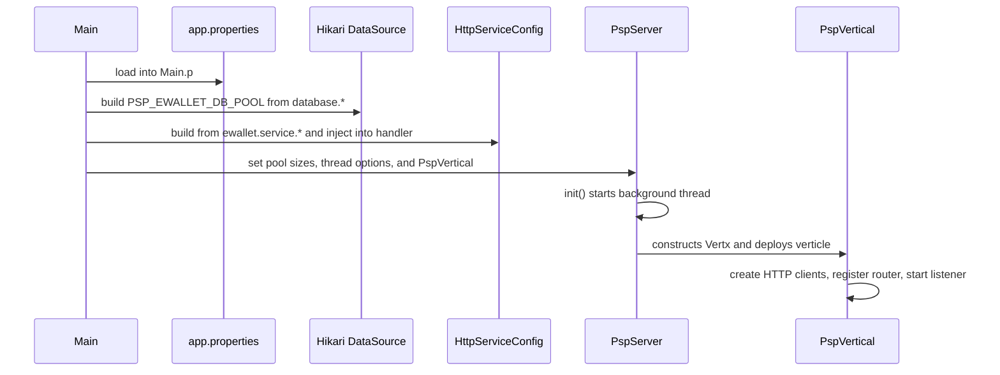

# Configuration and startup

This page documents how `psp-connector-ewallet` is configured and started. All runtime configuration is loaded from `src/main/resources/app.properties`, which is parsed once at process startup by the `vn.onepay.psp.Main` composition root and then distributed to the Vert.x server, the Oracle HikariCP pool, and the outbound ewallet `HttpServiceConfig`. The checked-in property values are deployment examples for a default development configuration; production secrets and endpoints must be supplied per environment.

Related details:

- `/openwiki/architecture/overview.md` — service startup flow and runtime topology
- `/openwiki/integrations/ewallet-service.md` — outbound ewallet service consumption of these settings
- `/openwiki/operations/error-model.md` — error vocabulary surfaced by failure paths

## Configuration source and loading

`Main.main()` loads `app.properties` from the classpath into the public static `Main.p` field during startup:

```java
p = new Properties();
p.load(Main.class.getClassLoader().getResourceAsStream("app.properties"));
```

`Main.p` is a process-wide static store. It is read directly by `ClientAuthorizationHandler` (for `access_key.<clientId>` inbound keys) and by `InstrumentPostHandler` (for `ewallet.service.group`). Every other setting is consumed once during startup to build the Hikari pool, the `HttpServiceConfig`, and the `PspServer`/`PspVertical` chain. Nothing watches the file for changes; configuration is fixed at process start unless the process is restarted.

The property groups are:

- `service.*` — service identity used by inbound OWS validation.
- `server.*` — HTTP listener and Vert.x thread-pool settings.
- `database.*` — Oracle connection and pool settings.
- `ewallet.service.*` — the outbound VCB TSP client identity, base URL, and timeout.
- `access_key.<clientId>` — shared secrets for verifying inbound OWS signatures.

## Startup sequence

`Main.main()` runs a fixed startup order; a failure in any earlier step prevents later steps from running:

1. Load `app.properties` into `Main.p`.
2. Build the Oracle HikariCP pool `PSP_EWALLET_DB_POOL` from `database.*` properties. This is eager and synchronous: a database-connection failure during pool construction fails process startup before the HTTP listener is created.
3. Build the ewallet `HttpServiceConfig` from `ewallet.service.*` properties and inject it into `InstrumentPostHandler` via `setServiceConfig`.
4. Configure `PspServer` (Vert.x thread options) and `PspVertical` (HTTP listener options), then call `init()`.

`PspServer.init()` starts a dedicated background thread that constructs the `Vertx` instance from the worker/event-loop/thread-check options and deploys the single `PspVertical` verticle. `PspVertical.start()` creates the shared outbound HTTP clients, builds the router with the common handler chain, and starts the HTTP server, logging success or failure at `serverHost:serverPort`.



## Server settings

The `server.*` properties are consumed by `PspServer` (Vert.x thread options) and `PspVertical` (HTTP listener options) in `Main.main()`.

### Vert.x thread and blocking settings (`PspServer`)

`PspServer` maps these property values directly onto the `VertxOptions` passed to `Vertx.vertx(...)`:

| Property | Default | Vert.x option | Meaning |
|---|---|---|---|
| `server.worker.poolsize` | `10` | `setWorkerPoolSize` | Number of worker threads for blocking code |
| `server.eventloop.poolsize` | `1` | `setEventLoopPoolSize` | Number of event-loop threads |
| `server.thread.checkinterval` | `50000` | `setBlockedThreadCheckInterval` | Interval (ms) for blocked-thread checks |
| `server.max.worker.execute.time` | `10000` | `setMaxWorkerExecuteTime` | Max worker thread execution time (ms) |
| `server.max.eventloop.execute.time` | `10000` | `setMaxEventLoopExecuteTime` | Max event-loop execution time (ms) |

Because `PspServer` on any `Exception` only logs a SEVERE message inside `run()` and does not rethrow, a Vert.x construction or deployment failure does not propagate a failure to the calling thread.

### HTTP listener settings (`PspVertical`)

`PspVertical` applies the remaining `server.*` settings to the `HttpServerOptions` and the router:

| Property | Default | Meaning |
|---|---|---|
| `server.host` | `0.0.0.0` | Bind address for the HTTP listener |
| `server.port` | `12190` | Listen port |
| `server.api.prefix` | `/psp-connector-ewallet/api/v1` | Route prefix; the full public route is this prefix plus `/instruments` |
| `server.connection.keepalive` | `true` | TCP keep-alive on the listener |
| `server.connection.timeout` | `180000` | Router `TimeoutHandler` value (ms); also drives expiry semantics via the common handler chain |
| `server.connection.idle.timeout` | `120` | Idle timeout applied to the listener via `setIdleTimeout` |

The `server.api.prefix` plus `/instruments` defines the single business route registered in `PspVertical.start()`: `POST /psp-connector-ewallet/api/v1/instruments`.

## Oracle database pool settings

The HikariCP pool is created in `Main.main()` using `com.zaxxer.hikari.HikariConfig` with the JDBC data source class `oracle.jdbc.pool.OracleDataSource`. It is eagerly created at startup and named `PSP_EWALLET_DB_POOL`.

| Property | Default | Hikari config | Meaning |
|---|---|---|---|
| `database.url` | `jdbc:oracle:thin:@r:17493:orcl` | Data source property `url` | Oracle JDBC URL |
| `database.username` | `psp_connector` | Data source property `user` | Database user |
| `database.password` | `psp_connector` | Data source property `password` | Database password |
| `database.min.pool.size` | `1` | `setMinimumIdle` | Minimum idle connections |
| `database.max.pool.size` | `2` | `setMaximumPoolSize` | Maximum pool size |
| `database.idle.timeout` | `30000` | `setIdleTimeout` | Idle timeout (ms) |
| `database.validation.timeout` | `1000` | `setValidationTimeout` | Validation timeout (ms) |
| `database.connection.timeout` | `10000` | `setConnectionTimeout` | Connection-acquisition timeout (ms) |
| `database.connection.testquery` | `select null from dual` | `setConnectionTestQuery` | Query used to test connections |

The pool also calls `setRegisterMbeans(true)`, exposing Hikari metrics via JMX. The commented-out `setInitializationFailFast`/`setInitializationFailTimeout` lines in the source indicate the fail-fast behavior was deliberated but is left at Hikari defaults.

Important operational note: the current instrument request path does not consult this pool. `Main` creates the pool but does not assign its `HikariDataSource` to any `common.service` `dataSource` field, and no active handler borrows a connection. The pool therefore exists as startup infrastructure (and a potential startup failure point) rather than as a dependency of the live instrument endpoint. The Oracle-backed services that would use it live in `common.service` and are not wired.

## Outbound ewallet service client settings

The ewallet `HttpServiceConfig` is built in `Main.main()` from `ewallet.service.*` properties and injected into `InstrumentPostHandler` once at startup. `HttpClientUtil.createHttpRequest` then consumes it for every outbound instrument call.

| Property | Default | HttpServiceConfig field | Meaning |
|---|---|---|---|
| `ewallet.service.name` | `tsp` | `serviceName` | Logical service name used in OWS signing |
| `ewallet.service.region` | `vcb` | `serviceRegion` | Region used in OWS signing |
| `ewallet.service.group` | `onepay` | `serviceGroup` | Group injected into the outbound request body as `group_id` |
| `ewallet.service.base.url` | `http://127.0.0.1:9443/tsp/api/v1` | `serviceURL` | Base URL of the TSP service; `/instruments` is appended |
| `ewallet.service.authorization.type` | `ows1_request` | `serviceAuthType` | Signing type |
| `ewallet.service.authorization.algorithm` | `OWS1-HMAC-SHA256` | `serviceAuthAlgorithm` | HMAC algorithm for outbound signatures |
| `ewallet.service.authorization.id` | `ONEPAY` | `serviceAuthId` | Connector identity used in outbound signatures |
| `ewallet.service.authorization.key` | `KEY_ON8OJNFANNNSQWPNQHYGUQ` | `serviceAuthKey` | Shared secret for outbound HMAC signing |
| `ewallet.service.request.timeout` | `60000` | `serviceTimeOut` | HTTP request timeout (ms), also the outbound `X-OP-Expires` value |

`HttpClientUtil` selects `PspVertical.httpClient` or `PspVertical.httpsClient` based on the configured base URL scheme (`http` vs `https`), and applies `serviceTimeOut` both as the Vert.x request timeout and as the `X-OP-Expires` signed header value. Both shared clients are configured with a max pool size of 100 in `PspVertical.start()`.

## Service identity and inbound access keys

The `service.*` group identifies the connector to the OWS inbound verification path. `ClientAuthorizationHandler` validates inbound requests against static service values:

| Constant | Default value |
|---|---|
| `serviceName` (static in handler) | `psp-connector-vietcombank` |
| `serviceRegion` (static in handler) | `onepay` |
| `serviceAuthType` (static in handler) | `ows1_request` |
| `serviceAuthAlgorithm` (static in handler) | `OWS1-HMAC-SHA256` |

Note that these inbound validation constants are hard-coded in `ClientAuthorizationHandler`, not read from `app.properties`. The property file carries a `service.*` group (`service.name=psp`, `service.region=onepay`, `service.authorization.type=ows1_request`, `service.authorization.algorithm=OWS1-HMAC-SHA256`) that is not consumed by the current inbound validation code.

For each caller, a shared secret is configured as `access_key.<clientId>`. `ClientAuthorizationHandler` looks up `Main.p.getProperty("access_key." + clientId, "")` to recompute and compare the inbound HMAC signature. The checked-in file contains one example: `access_key.TSP=KEY_39A3F6ED80483B135471CC080865`.

## Logging configuration

`src/main/resources/log4j2.xml` defines the logging runtime. It is centered on a `RollingFile` appender whose file path comes from the `log` system property (`${sys:log}`) and rolls daily with gzip compression. `vn.onepay` and `com.onepay` loggers are asynchronous at `debug` level; the async root logger defaults to `info`. There is no console appender, so logging output goes to the file configured by the `log` system property. All request, response, and outbound bodies are filtered through `AppUtil.instrumentLogFilter` before logging to mask card/CVV-like values.

## Startup summary and defaults

The checked-in `app.properties` provides a runnable default configuration: the connector binds `0.0.0.0:12190` under prefix `/psp-connector-ewallet/api/v1`, maintains an Oracle Hikari pool `PSP_EWALLET_DB_POOL` on `r:17493:orcl`, and targets the VCB TSP ewallet service at `http://127.0.0.1:9443/tsp/api/v1` with a 60-second request timeout. Treat all credentials and endpoints as per-environment examples, not security guidance.

## Operational invariants

- Configuration is read once at startup into `Main.p`; there is no reload mechanism.
- The Hikari pool is created eagerly; a pool-construction failure fails startup before the HTTP listener starts.
- `PspServer.run()` swallows exceptions (only logs SEVERE), so Vert.x startup/deployment failures do not propagate to `Main.main()`.
- The public route is `PspVertical`'s `server.api.prefix` plus the handler path `/instruments`.
- Outbound signing uses the ewallet `HttpServiceConfig`; inbound verification uses hard-coded service identity plus the `access_key.<clientId>` lookup.
- The instrument request path does not use the Oracle pool; changing pool settings affects startup health and any future `common.service` wiring but not the live instrument request today.

## Focused checks that would matter

There is no test suite in this repository. The highest-value future coverage for configuration would verify:

- That `Main` reads every required property and that missing or malformed numeric properties (e.g. a non-integer `server.port`) are surfaced distinctly.
- That the Hikari `PSP_EWALLET_DB_POOL` is configured with the exact data-source class, pool name, sizing, and timeouts from `database.*`.
- That `HttpServiceConfig` carries the exact `ewallet.service.*` values consumed by outbound signing.
- That `ClientAuthorizationHandler` resolves `access_key.<clientId>` from `Main.p` and rejects requests for unknown client ids.

## Evidence

- Configuration source and startup composition: `repo://src/main/java/vn/onepay/psp/Main.java#L16-L70`
- Vert.x thread-pool and deployment options: `repo://src/main/java/vn/onepay/psp/server/vertical/PspServer.java#L9-L68`
- HTTP listener options, shared clients, and route prefix: `repo://src/main/java/vn/onepay/psp/server/vertical/PspVertical.java#L19-L93`
- Server, database, ewallet, and access-key defaults: `repo://src/main/resources/app.properties#L1-L46`
- Outbound service config object: `repo://src/main/java/vn/onepay/psp/common/util/HttpServiceConfig.java#L6-L114`
- Outbound request construction and signing: `repo://src/main/java/vn/onepay/psp/common/util/HttpClientUtil.java#L22-L88`
- Inbound access-key lookup and OWS validation: `repo://src/main/java/vn/onepay/psp/server/handler/common/ClientAuthorizationHandler.java#L29-L159`
- Group injection into outbound payload: `repo://src/main/java/vn/onepay/psp/server/handler/instrument/InstrumentPostHandler.java#L33-L74`
- Logging configuration: `repo://src/main/resources/log4j2.xml#L1-L22`
- Runtime dependencies and versions: `repo://pom.xml#L1-L108`
