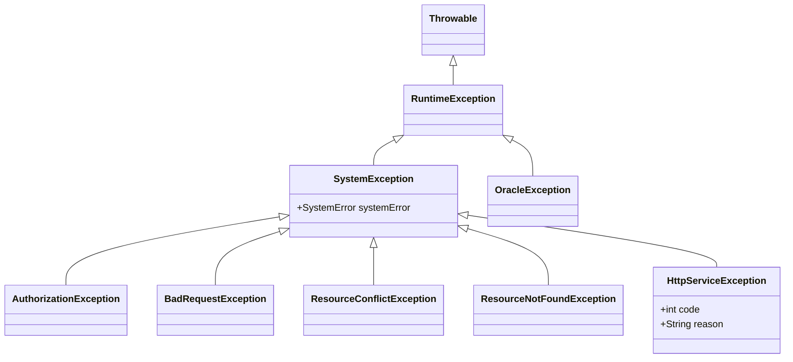
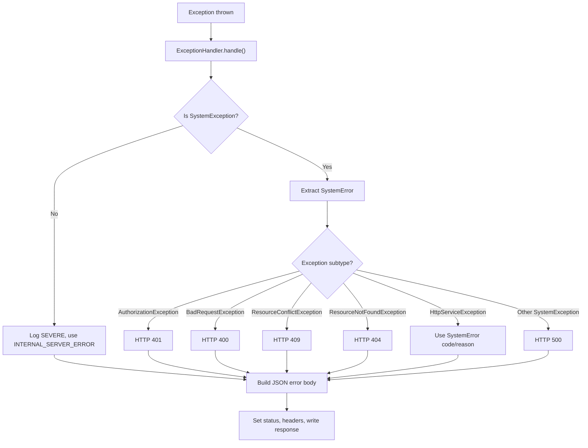

# Error model

This page explains how `psp-connector-ewallet` translates internal failures into a uniform JSON error envelope. The error contract is built on three layers: a catalog of semantic `SystemError` constants, a typed exception hierarchy that tags failures with their intended HTTP category, and a central `ExceptionHandler` that resolves the exception type into a concrete HTTP status code and writes the final response body.

Related details:

- `/openwiki/architecture/overview.md` — failure path summary
- `/openwiki/architecture/package-map.md` — error and exception package responsibilities
- `/openwiki/operations/configuration.md` — operational context

## Semantic error vocabulary: `SystemError`

`SystemError` is a plain value object that carries four fields: a machine-readable `name`, a human-facing `message`, optional `details`, and an `informationLink` pointing at developer documentation. These constants define every public failure name the service can return.

The constants fall into two groups by the HTTP semantics they imply:

| Group | Typical usage | Representative constants |
|---|---|---|
| **Validation / authorization** | Failures detected before or during inbound request validation | `INVALID_REQUEST_BODY`, `INVALID_X_OP_DATE`, `INVALID_ACCESS_KEY`, `INVALID_SERVICE_SIGNATURE`, `INVALID_USER_ID`, `INVALID_AMOUNT`, `UNSUPPORTED_CONTENT_TYPE` |
| **Processing / upstream** | Failures detected during outbound calls or generic processing | `PSP_CONNECTION_ERROR`, `INVALID_PSP_SERVICE_RESPONSE`, `PAYMENT_PROCESSING_ERROR`, `INTERNAL_SERVER_ERROR` |

Constants are shared stateless singletons. Adding a new failure mode requires defining a new `SystemError` constant and pairing it with the correct exception subclass or handler-side mapping so `ExceptionHandler` emits the right HTTP status.

Evidence: `repo://src/main/java/vn/onepay/psp/common/error/SystemError.java`

## Exception hierarchy

The service uses a small Java exception hierarchy rooted at `SystemException`. Each subclass carries an implicit HTTP category that `ExceptionHandler` resolves:



Each exception type implies a specific HTTP status mapping:

| Exception | HTTP Status | Meaning |
|---|---|---|
| `AuthorizationException` | 401 Unauthorized | Signature mismatch, expired credential, missing or invalid access key |
| `BadRequestException` | 400 Bad Request | Missing headers, invalid body, validation failures |
| `ResourceConflictException` | 409 Conflict | State or idempotency conflicts |
| `ResourceNotFoundException` | 404 Not Found | Missing resources or invalid search results |
| `HttpServiceException` | Dynamic (`code` / `reason` from `SystemError`) | Upstream HTTP failure relayed with its original status |
| Other `SystemException` | 500 Internal Server Error | Unmapped system failures |
| Any non-`SystemException` throwable | 500 Internal Server Error with `INTERNAL_SERVER_ERROR` | Unexpected runtime errors |

`HttpServiceException` is the only subtype that carries its own HTTP status. It is constructed by `InstrumentPostHandler` when the upstream e-wallet service returns anything other than HTTP 201, forwarding the upstream status code and message directly.

Evidence: `repo://src/main/java/vn/onepay/psp/common/exception/SystemException.java`, `repo://src/main/java/vn/onepay/psp/common/exception/HttpServiceException.java`, `repo://src/main/java/vn/onepay/psp/common/exception/AuthorizationException.java`, `repo://src/main/java/vn/onepay/psp/common/exception/BadRequestException.java`, `repo://src/main/java/vn/onepay/psp/common/exception/ResourceNotFoundException.java`, `repo://src/main/java/vn/onepay/psp/common/exception/ResourceConflictException.java`

## Central exception resolution: `ExceptionHandler`

`ExceptionHandler` is the Vert.x failure handler installed at the end of the router chain. It receives any throwable from `rc.failure()`, resolves the HTTP status, builds the JSON error body, and writes the response.

The resolution logic proceeds in this order:

1. **Is it a `SystemException`?** Extract the `systemError` and check the exception subtype to determine the status code.
2. **Is it a specific subtype?** Map `AuthorizationException` to 401, `BadRequestException` to 400, `ResourceConflictException` to 409, `ResourceNotFoundException` to 404, `HttpServiceException` to its dynamic code/reason.
3. **Is it an unknown `SystemException`?** Default to 500 Internal Server Error.
4. **Is it a non-`SystemException` throwable?** Log it at SEVERE level and default to 500 with `INTERNAL_SERVER_ERROR`.

The resulting JSON body contains four fields:

```json
{
  "name": "INVALID_REQUEST_BODY",
  "message": "Request body empty. Please check it up and try again.",
  "details": "",
  "information_link": "http://developer.onepay.vn/errors/400.html"
}
```

This envelope is the stable contract callers rely on. All error responses, whether from validation, authorization, upstream failures, or unexpected exceptions, use this same structure.

Evidence: `repo://src/main/java/vn/onepay/psp/server/handler/common/ExceptionHandler.java`

## How errors are raised in practice

The following table summarizes where each exception type is raised in the current codebase:

| Exception type | Raised in | Trigger |
|---|---|---|
| `BadRequestException` | `ClientAuthorizationHandler` | Missing `Accept`, `Content-Type`, `X-OP-Date`, `X-OP-Expires`, or `X-OP-Authorization` headers |
| `AuthorizationException` | `ClientAuthorizationHandler` | Missing access key, expired credential, mismatched region/service/algorithm, or signature mismatch |
| `BadRequestException` | `InstrumentPostHandler` | Empty request body or missing required fields (`user_id`, `mobile`, `email`) |
| `HttpServiceException` | `InstrumentPostHandler` | Upstream e-wallet service returns non-201 status |
| `ResourceNotFoundException` | `UserService` (dormant) | Zero-record result from Oracle query |

The common authorization handler raises most failures before any business logic runs, ensuring that invalid or unauthorized requests never reach `InstrumentPostHandler`.

Evidence: `repo://src/main/java/vn/onepay/psp/server/handler/common/ClientAuthorizationHandler.java#L46-L109`, `repo://src/main/java/vn/onepay/psp/server/handler/instrument/InstrumentPostHandler.java#L38-L48`, `repo://src/main/java/vn/onepay/psp/server/handler/instrument/InstrumentPostHandler.java#L84`

## Exception-to-status mapping summary

The following diagram shows the end-to-end error flow from exception throw to HTTP response:



## Design invariants

- **Uniform envelope**: Every error response uses the same four-field JSON structure (`name`, `message`, `details`, `information_link`), regardless of the failure cause.
- **Status determined by exception type**: The exception class hierarchy, not the `SystemError` constant, determines the HTTP status (except for `HttpServiceException`).
- **Authorization before business logic**: `ClientAuthorizationHandler` rejects invalid requests before `InstrumentPostHandler` runs, so the business handler only sees authorized requests.
- **Upstream status forwarding**: `HttpServiceException` preserves the upstream HTTP status code, giving callers visibility into the external service's failure category.
- **Catch-all default**: Any unexpected throwable that is not a `SystemException` maps to HTTP 500 with `INTERNAL_SERVER_ERROR`, ensuring no exception escapes without a response.
- **No retry semantics**: The error model does not distinguish transient from permanent failures; callers must implement their own retry logic based on the `name` field.
