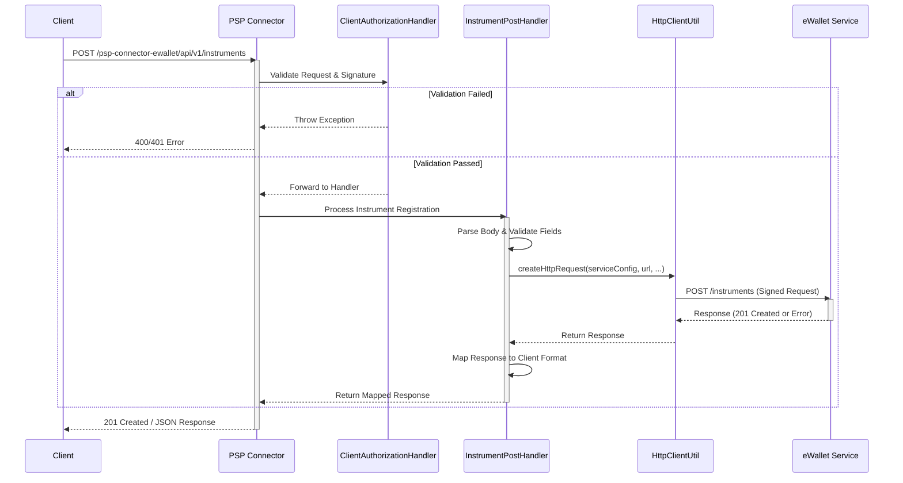

# Instrument Registration Workflow

The Instrument Registration Workflow defines the process for creating a new payment instrument (e.g., a linked bank account or card) by forwarding a client request to an upstream eWallet service. This flow is handled by the PSP Connector, which acts as a secure gateway between the client and the eWallet provider.

## Overview

The workflow follows a request-response pattern where a client submits instrument details, which are then validated, signed, and forwarded to the eWallet service. The response from the eWallet is mapped back to the client.

## Detailed Steps

1.  **Request Reception**:
    *   The client sends a `POST` request to `/psp-connector-ewallet/api/v1/instruments` with a JSON body containing instrument details.
    *   The request is handled by the Vert.x router in `PspVertical`.

2.  **Authorization & Validation**:
    *   `ClientAuthorizationHandler` intercepts the request to validate headers (`Accept`, `Content-Type`, `X-OP-Date`, `X-OP-Expires`, `X-OP-Authorization`).
    *   It verifies the signature using the `vn.onepay.ows.Authorization` class and the configured access key.
    *   If validation fails, an `AuthorizationException` or `BadRequestException` is thrown, leading to an error response.

3.  **Business Logic Processing**:
    *   `InstrumentPostHandler` takes over if authorization succeeds.
    *   It parses the request body and extracts required fields: `user_id`, `mobile`, `email`.
    *   It constructs a new map for the eWallet service, adding the `group_id` from configuration.
    *   It prepares the request URL (`/instruments`) and delegates the HTTP call to `HttpClientUtil`.

4.  **Upstream Communication**:
    *   `HttpClientUtil.createHttpRequest` builds the HTTP request.
    *   It signs the request headers and body using the eWallet service credentials (configured in `HttpServiceConfig`).
    *   It sends the request to the eWallet base URL (configured in `app.properties`).

5.  **Response Mapping**:
    *   The eWallet service response is handled in `ewalletPostResponseHandler`.
    *   If the response code is `201`, the body is mapped to the client response format.
    *   If the response code is not `201`, an `HttpServiceException` is thrown.
    *   The final response is sent back to the client via `ResponseHandler`.

## Configuration

Key configurations for this workflow are defined in `app.properties` and injected into `HttpServiceConfig`:

*   **Service URL**: `ewallet.service.base.url`
*   **Authorization ID**: `ewallet.service.authorization.id`
*   **Authorization Key**: `ewallet.service.authorization.key`
*   **Timeout**: `ewallet.service.request.timeout`

These configurations ensure the PSP Connector can securely communicate with the specific eWallet provider instance.

## Error Handling

*   **Validation Errors**: Result in `400 Bad Request` with specific error codes (e.g., `INVALID_REQUEST_BODY`, `VALIDATION_ERROR`).
*   **Authorization Errors**: Result in `401 Unauthorized` (e.g., `INVALID_SERVICE_SIGNATURE`).
*   **Upstream Errors**: If the eWallet service returns a non-success code, `HttpServiceException` propagates the error details back to the client.
*   **System Errors**: Unexpected exceptions are caught and result in a `500 Internal Server Error`.
