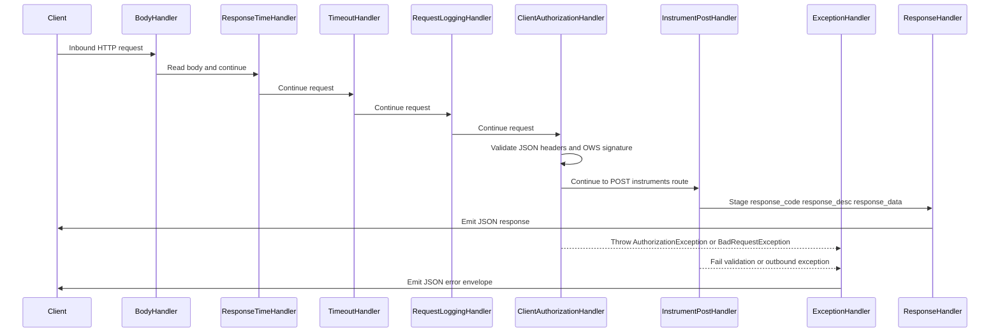

# HTTP request pipeline

`psp-connector-ewallet` exposes a single Vert.x HTTP router. Every inbound request shares the same cross-cutting stages before a business route can run. The pipeline is installed once in `PspVertical.start()` and uses handlers from `vn.onepay.psp.server.handler.common` together with Vert.x Web handlers.

The current router order is:

1. `BodyHandler.create()`
2. `ResponseTimeHandler.create()`
3. `TimeoutHandler.create(connectionTimeOut)`
4. `RequestLoggingHandler::handle`
5. `ClientAuthorizationHandler::handle`
6. Business route: `router.post(apiPrefix + "/instruments") -> InstrumentPostHandler::handle`
7. Route-wide failure handler: `ExceptionHandler::handle`
8. Final response handler on `router.route().last()`: `ResponseHandler::handle`

The effective public path is assembled as `server.api.prefix + /instruments`. With the checked-in default prefix `/psp-connector-ewallet/api/v1`, that is:

```text
POST /psp-connector-ewallet/api/v1/instruments
```



The diagram shows the normal Vert.x continuation path through `rc.next()` and the two failure exits that route work to `ExceptionHandler`.

## Shared runtime and configuration

`Main` loads `src/main/resources/app.properties` and configures `PspVertical` before `PspServer` deploys the verticle. Pipeline-relevant settings include:

| Setting | Property | Pipeline role |
| --- | --- | --- |
| `apiPrefix` | `server.api.prefix` | Prefix for the business route |
| `serverHost` / `serverPort` | `server.host`, `server.port` | HTTP listener bind address |
| `connectionKeepAlive` | `server.connection.keepalive` | TCP keep-alive for the HTTP server |
| `connectionTimeOut` | `server.connection.timeout` | Value passed to `TimeoutHandler` |
| `connectionIdleTimeOut` | `server.connection.idle.timeout` | Vert.x HTTP server idle timeout |
| `workerPoolSize` | `server.worker.poolsize` | Vert.x worker pool used by `executeBlocking` paths |
| `eventLoopPoolSize` | `server.eventloop.poolsize` | Vert.x event-loop pool |

`PspVertical` also creates two static HTTP clients during verticle startup:

- `PspVertical.httpClient`: normal Vert.x `HttpClient` with `maxPoolSize=100`
- `PspVertical.httpsClient`: SSL client with `setSsl(true)`, `setTrustAll(true)`, and `maxPoolSize=100`

These clients are outbound resources, not stages of the inbound router. They become important later when `InstrumentPostHandler` calls `HttpClientUtil`, because that utility selects one of these static clients based on the downstream service URL scheme.

## Pipeline stages

### Body handling and response timing

`BodyHandler.create()` is installed before logging and authorization. It populates the request body on the `RoutingContext`, which later stages read through `rc.getBody()`, `rc.getBodyAsString()`, or `rc.getBodyAsJson()`. This is required because inbound signature verification uses the raw request body bytes.

`ResponseTimeHandler.create()` measures request processing time in the Vert.x routing context. It is installed for observability and does not validate headers or business data.

### Timeout handling

`TimeoutHandler.create(connectionTimeOut)` is installed before the common handlers and before business routing. It uses the configured `server.connection.timeout` value from `Main`. The pipeline treats this as a request timeout guard, not as application-level validation.

### Request logging

`RequestLoggingHandler.handle` logs the HTTP method and URI, selected headers, and the request body.

The header log is intentionally narrow. It only logs values whose header names are present in the internal `REQUIRED_HEADERS` list:

- `Accept`
- `Content-Type`
- `X-OP-Date`
- `X-OP-Expires`
- `X-OP-Authorization`

The request body is logged through `AppUtil.instrumentLogFilter`, which redacts patterns that look like card numbers, CVV values, and related sensitive values. After logging, the handler calls `rc.next()`, so the request proceeds to authorization.

A practical consequence is that malformed requests can fail in the common authorization stage rather than in the business handler. A request without the required OWS headers is rejected before `InstrumentPostHandler` can parse or forward a payload.

### Client authorization

`ClientAuthorizationHandler.handle` is the main security gate for every route currently registered on the router. It performs header validation, OWS metadata validation, and signature recomputation.

The handler first requires JSON `Accept` and `Content-Type` headers, then requires `X-OP-Date`, positive `X-OP-Expires`, and `X-OP-Authorization`.

It extracts the client id from the authorization credential with:

```text
Credential=([^/|?]+)/
```

and stores the result on the routing context under `client_id`. If the extracted client id is empty, the handler raises `AuthorizationException(INVALID_ACCESS_KEY)`.

The handler expects this service identity:

| Field | Expected value |
| --- | --- |
| `serviceRegion` | `onepay` |
| `serviceName` | `psp-connector-vietcombank` |
| `serviceAuthType` | `ows1_request` |
| `serviceAuthAlgorithm` | `OWS1-HMAC-SHA256` |

Those constants are defined on `ClientAuthorizationHandler` itself. The current inbound route is therefore bound to the connector's OWS service metadata rather than to the downstream e-wallet service identity used for outbound calls.

The handler loads the inbound access key with:

```text
access_key.<clientId>
```

from `Main.p`. It then reconstructs a server-side `Authorization` object from the request method, path, query parameters, signed headers, and body bytes. The client signature is compared with the server signature. A mismatch raises `AuthorizationException(INVALID_SERVICE_SIGNATURE)`; an expired request raises `AuthorizationException(OPERATION_EXPIRED)`.

The signature check is not a simple body hash. It includes the HTTP method, request path, query parameters, selected signed headers, and the body, so changing any of those components after signing invalidates the request.

### Business routing

The only business route currently registered is:

```text
router.post(apiPrefix + "/instruments").handler(InstrumentPostHandler::handle)
```

The route is registered after the common authorization handler. In Vert.x routing terms, common route handlers match all requests, while the instrument route matches only the configured POST path. The ordering means that a request can reach the instrument handler only after the shared body, logging, timeout, and authorization stages have already run.

For the instrument workflow, the business handler validates required fields, transforms the client payload into an e-wallet payload, and calls the downstream e-wallet service through `HttpClientUtil`. That business flow is documented separately in `/openwiki/workflows/instrument-registration.md`.

### Failure handling

`ExceptionHandler::handle` is registered with `router.route().failureHandler(...)`. It runs whenever the routing context fails, including failures thrown from common handlers, business handlers, or the response-emission stage.

The handler maps the failure to an HTTP status and a stable JSON error envelope.

| Failure type | HTTP status |
| --- | --- |
| `AuthorizationException` | `401 Unauthorized` |
| `BadRequestException` | `400 Bad Request` |
| `ResourceConflictException` | `409 Conflict` |
| `ResourceNotFoundException` | `404 Not Found` |
| `HttpServiceException` | status and reason from the exception's `SystemError` |
| Other `SystemException` values | `500 Internal Server Error` |
| Unexpected non-`SystemException` throwables | `500 Internal Server Error` |

The JSON error body is always assembled from these fields:

- `name`
- `message`
- `details`
- `information_link`

For `HttpServiceException`, the status and reason are taken from the downstream response data captured in the exception's `SystemError`. This preserves downstream failure details instead of collapsing every upstream failure into a generic connector error.

### Response emission

`ResponseHandler::handle` is registered as the final route handler through `router.route().last()`. It is responsible for emitting the successful response after a business handler has staged response data on the routing context.

The handler reads these context keys:

- `response_code`: integer HTTP status; defaults to `404` when absent
- `response_desc`: status message; defaults to `"Not Found"` when absent
- `response_data`: response map; defaults to an empty map when absent

It then sets the response status, JSON content type, content length, and writes the encoded JSON body from a blocking worker context via `rc.vertx().executeBlocking(...)`. It also logs the response status and body through `AppUtil.instrumentLogFilter`.

The success path therefore depends on the business handler staging values before `ResponseHandler` runs. For the instrument route, `InstrumentPostHandler` stores upstream response data under `response_code`, `response_desc`, and `response_data` only after receiving HTTP `201` from the e-wallet service. All other failures take the exception path instead.

## State carried through the pipeline

The Vert.x `RoutingContext` is the per-request state carrier. The current pipeline uses it in three important ways.

First, `BodyHandler` places the raw request body on the context. Later handlers consume it both for logging and for inbound signature verification.

Second, `ClientAuthorizationHandler` stores the extracted inbound client id as `client_id`. That value is available to later handlers and logs.

Third, business handlers stage successful response values as `response_code`, `response_desc`, and `response_data`. `ResponseHandler` reads those keys and emits the client-facing JSON response.

The routing context is request-scoped. It is not a shared application-state store. The shared mutable state used by the pipeline is mainly the static HTTP clients on `PspVertical` and the property map in `Main.p`.

## Control-flow invariants

Several invariants matter when changing the pipeline:

- Common route handlers run before business routes because of registration order in `PspVertical.start()`.
- `ClientAuthorizationHandler` must run after `BodyHandler`, because signature verification depends on request body bytes.
- Business handlers do not bypass the shared logging or authorization stages under the current router registration.
- `ExceptionHandler` is route-wide, not limited to one business route.
- `ResponseHandler` is the final handler, so a successful request cannot bypass response emission unless the request fails earlier and takes the exception path.
- Successful business responses must stage `response_code`, `response_desc`, and `response_data` before `ResponseHandler` runs.
- The outbound e-wallet service identity used by `InstrumentPostHandler` is separate from the inbound authorization constants in `ClientAuthorizationHandler`.
- `PspVertical.httpClient` and `PspVertical.httpsClient` are static shared resources; changing them affects every outbound call that selects them.

## Extension points

The pipeline is designed so future endpoints can reuse the same common stages.

To add a new business endpoint, register another route after the common handlers and before the failure/final handlers, for example:

```java
router.post(apiPrefix + "/another-resource").handler(AnotherHandler::handle);
```

If the endpoint uses the same OWS inbound contract, no change to `ClientAuthorizationHandler` is required. If the endpoint has different required headers or signature rules, the common authorization stage must be adjusted carefully because it currently applies to all routes.

To add a new HTTP-visible failure mode, add or reuse a typed `SystemException` subclass, define the corresponding `SystemError`, and add a mapping branch in `ExceptionHandler` if the status differs from the current defaults.

To support another downstream signed service, follow the existing pattern used for instrument registration: build a service-specific `HttpServiceConfig`, inject it into the business handler, and call `HttpClientUtil.createHttpRequest`. The outbound signing and HTTP-client selection logic can then be reused without changing the inbound pipeline stages.

When changing the pipeline, preserve the ordering constraints above. In particular, keep body handling before signature verification, keep common authorization before business routing, and keep failure/response handlers route-wide.

## Focused tests that would matter

The repository currently has no `src/test` tree, so the following are the highest-value focused tests to introduce for this pipeline:

- Router-order tests proving that `ClientAuthorizationHandler` runs before `InstrumentPostHandler`.
- Header-rejection tests for missing or non-JSON `Accept`, `Content-Type`, `X-OP-Date`, `X-OP-Expires`, and `X-OP-Authorization`.
- Signature tests for expired requests, wrong region/service/algorithm metadata, wrong client id, and invalid signatures.
- `ResponseHandler` default tests proving that absent `response_code` and `response_data` produce HTTP `404` and an empty JSON body.
- `ExceptionHandler` mapping tests for `AuthorizationException`, `BadRequestException`, `ResourceConflictException`, `ResourceNotFoundException`, `HttpServiceException`, and unexpected throwables.
- Logging-redaction tests for `AppUtil.instrumentLogFilter` on request and response bodies.
- End-to-end tests for the successful instrument route, including downstream HTTP `201` relaying and non-201 failure conversion to `HttpServiceException`.

A focused Vert.x test router would be more valuable here than broad unit tests of individual helper classes, because the important behavior is the order and interaction of the pipeline stages.

## Related pages

- `/openwiki/architecture/overview.md`
- `/openwiki/architecture/package-map.md`
- `/openwiki/concepts/security-and-signatures.md`
- `/openwiki/workflows/instrument-registration.md`

## Evidence

- Shared router order, HTTP server settings, and static outbound clients: `repo://src/main/java/vn/onepay/psp/server/vertical/PspVertical.java#L19-L93`
- Request logging stage and filtered header/body logging: `repo://src/main/java/vn/onepay/psp/server/handler/common/RequestLoggingHandler.java#L15-L35`
- Inbound OWS authorization, header validation, client-id extraction, and signature recomputation: `repo://src/main/java/vn/onepay/psp/server/handler/common/ClientAuthorizationHandler.java#L29-L158`
- Typed exception mapping and JSON error envelope: `repo://src/main/java/vn/onepay/psp/server/handler/common/ExceptionHandler.java#L23-L117`
- Successful response staging defaults and final JSON emission: `repo://src/main/java/vn/onepay/psp/server/handler/common/ResponseHandler.java#L21-L76`
- Business route registration and instrument handler delegation: `repo://src/main/java/vn/onepay/psp/server/handler/instrument/InstrumentPostHandler.java#L26-L97`
- Pipeline-related server and timeout configuration: `repo://src/main/resources/app.properties#L9-L21`
- Content-type constant and authorization credential regex: `repo://src/main/java/vn/onepay/psp/common/util/AppConstants.java#L9-L22`
- Routing-context keys used by the pipeline: `repo://src/main/java/vn/onepay/psp/common/util/AppParams.java#L8-L15`
- Process startup wiring for `PspVertical`: `repo://src/main/java/vn/onepay/psp/Main.java#L19-L69`
- Request and response logging redaction behavior: `repo://src/main/java/vn/onepay/psp/common/util/AppUtil.java#L77-L120`
- Typed failure hierarchy used by `ExceptionHandler`: `repo://src/main/java/vn/onepay/psp/common/exception/SystemException.java#L9-L21`, `repo://src/main/java/vn/onepay/psp/common/exception/HttpServiceException.java#L13-L22`
