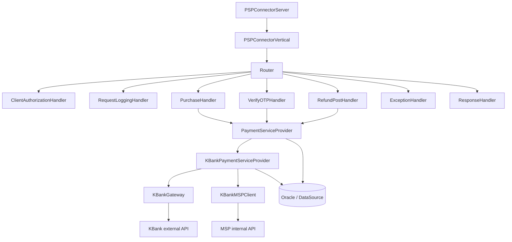
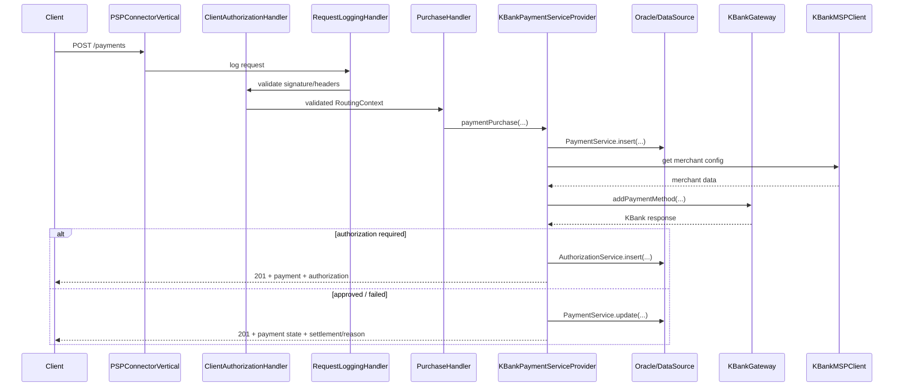

# System Components

This page describes the main functional units of the PSP Connector for KBank and how they interact to expose a REST-like payment API, persist payment state, and drive KBank gateway interactions.

## Overview

The system is built on Vert.x and organized into four logical layers:

1. **Server** — bootstrap and HTTP server/verticle.
2. **Server handlers** — cross-cutting concerns and per-operation endpoints.
3. **Services** — persistence and orchestration for payments, refunds, captures, voids, authorizations, and operational metadata.
4. **Provider** — pluggable PSP-facing logic; the repository contains a KBank implementation.

Configuration is centralized in `app.properties` and wired in `Main.java`.

## Component Map

Caption: A[PSPConnectorServer] --> B[PSPConnectorVertical]

## Server

**File:** `src/main/java/vn/onepay/pspconnector/server/PSPConnectorServer.java`

`PSPConnectorServer` is a `Runnable` that starts a Vert.x instance and deploys the application verticle. It exposes pool sizes, thread-check intervals, and blocked-thread timeouts, then delegates runtime behavior to `PSPConnectorVertical`.

**File:** `src/main/java/vn/onepay/pspconnector/server/vertical/PSPConnectorVertical.java`

`PSPConnectorVertical` configures HTTP server behavior and mounts the request pipeline:

- Creates a shared Vert.x `WebClient` with SSL and a large connection pool.
- Mounts global handlers: `BodyHandler`, `ResponseTimeHandler`, `TimeoutHandler`, request logging, and client authorization.
- Registers operation-specific handlers for purchases, OTP verification, and refunds.
- Uses `RoutePool` constants for API paths.

**File:** `src/main/java/vn/onepay/pspconnector/server/routing/RoutePool.java`

`RoutePool` centralizes route templates such as `/payments`, `/authorizations`, `/refunds2`, `/captures`, `/voids`, and KBank-specific VNPT Money routes.

## Request Handlers

Handlers are lightweight Vert.x route handlers. They validate input minimally, then delegate to `PaymentServiceProvider`. Shared cross-cutting handlers run first; a failure handler and a terminal response handler run last.

### Cross-cutting

**File:** `src/main/java/vn/onepay/pspconnector/server/handler/common/ClientAuthorizationHandler.java`

`ClientAuthorizationHandler` validates inbound caller identity before any business logic. It checks required headers (`Accept`, `X-Op-Date`, `X-Op-Expires`, `X-Op-Authorization`), extracts the client id from the authorization header, and recomputes a signature using shared client keys from properties. If validation fails, the request short-circuits through the failure handler.

**File:** `src/main/java/vn/onepay/pspconnector/server/handler/common/RequestLoggingHandler.java`

`RequestLoggingHandler` logs request metadata and body. An older implementation inserted client activity records into the database; the current active implementation logs the request and continues.

**File:** `src/main/java/vn/onepay/pspconnector/server/handler/common/ExceptionHandler.java`

`ExceptionHandler` converts caught exceptions into structured JSON error responses with HTTP status codes derived from exception type: authorization errors become `401`, bad-request errors become `400`, conflict errors become `409`, not-found errors become `404`, and HTTP service exceptions use their configured system error code. Unexpected exceptions return `500`.

**File:** `src/main/java/vn/onepay/pspconnector/server/handler/common/ResponseHandler.java`

`ResponseHandler` writes successful responses from routing-context attributes (`responseCode`, `responseDesc`, `responseData`) as JSON, and logs the final response body with instrument/field filtering.

### Business handlers

**File:** `src/main/java/vn/onepay/pspconnector/server/handler/payment/PurchaseHandler.java`

`PurchaseHandler` handles `POST` and `PUT` to `/payments`. It checks that the request body is present and that `merchantId`, `amount`, and `currency` are valid, then calls `paymentServiceProvider.paymentPurchase(...)`.

**File:** `src/main/java/vn/onepay/pspconnector/server/handler/verifyOTP/VerifyOTPHandler.java`

`VerifyOTPHandler` handles `/verify-otp`, `/verify-otp2`, and PATCH `/authorizations/:id`. It delegates to `paymentServiceProvider.verifyOtp(...)` or `paymentServiceProvider.verifyOtp2(...)` depending on route.

**File:** `src/main/java/vn/onepay/pspconnector/server/handler/refund/RefundPostHandler.java`

`RefundPostHandler` handles `POST` to `/refunds2`. It branches on a `command` field: `capture_refund` routes to `paymentCaptureRefund2(...)`, otherwise to `paymentRefund2(...)`.

## Services

Services are static, database-backed utility classes. They use Oracle stored procedures via `DBProcedureUtil` and operate on a `DataSource` injected at bootstrap.

**File:** `src/main/java/vn/onepay/pspconnector/common/service/PaymentService.java`

`PaymentService` owns the canonical payment record. It inserts a payment with masked instrument data, updates payment state after PSP responses, and formats records for API responses. State transitions are reflected through `state`, `responseTime`, `responseCode`, `responseDesc`, `responseData`, and `partnerTxnId`.

**File:** `src/main/java/vn/onepay/pspconnector/common/service/AuthorizationService.java`

`AuthorizationService` manages approval/OTP authorization records. It inserts authorizations with approval URLs, methods, content, and expiry times; updates authorization state; and formats authorization payloads with `links.approval`.

**File:** `src/main/java/vn/onepay/pspconnector/common/service/RefundService.java`

`RefundService` manages refund records. It inserts refunds against a payment, updates refund state, and formats refund response payloads including settlement/reason data.

**File:** `src/main/java/vn/onepay/pspconnector/common/service/CaptureService.java`

`CaptureService` manages capture records. It inserts captures against a payment, queries captures, and updates capture state and response data.

**File:** `src/main/java/vn/onepay/pspconnector/common/service/VoidService.java`

`VoidService` manages void records. It supports `insert`, `query`, and `update` with similar state/response semantics as capture and refund.

**File:** `src/main/java/vn/onepay/pspconnector/common/service/ClientActivityService.java`

`ClientActivityService` stores request/response activity metadata. Current logging code paths do not actively write activity records, but the service still exists and exposes `insert` and `update` against an activity table.

**File:** `src/main/java/vn/onepay/pspconnector/common/service/ConnectorMsgService.java`

`ConnectorMsgService` persists connector message envelopes with request and response content for audit or replay use cases.

**File:** `src/main/java/vn/onepay/pspconnector/common/service/ClientService.java`

`ClientService` looks up client secrets or keys by client id. It is used during authorization validation to recover the secret access key for signature verification.

**File:** `src/main/java/vn/onepay/pspconnector/common/service/ErrorService.java`

`ErrorService` translates partner-specific error codes into canonical connector error descriptions using error mapping records.

## Provider Abstraction

**File:** `src/main/java/vn/onepay/pspconnector/provider/PaymentServiceProvider.java`

`PaymentServiceProvider` is the strategy interface between handlers and PSP-specific logic. Handlers hold a static `paymentServiceProvider` reference assigned in `Main.java`. The abstract class declares operation methods for purchase, refund, capture, void, OTP verification, authorization updates, instrument management, and user operations. Default methods throw `METHOD_NOT_SUPPORTED`, so each concrete provider must override operations it supports.

## KBank Provider

The KBank provider is the only concrete implementation in this repository.

**File:** `src/main/java/vn/onepay/pspconnector/provider/kbank/KBankPaymentServiceProvider.java`

`KBankPaymentServiceProvider` implements the core payment flows. It does not delegate directly from handlers in a single path; instead, it uses Vert.x `execBlocking(...)` chains to sequence database persistence, merchant discovery, KBank gateway calls, response mapping, and optional authorization insertion.

Responsibilities:

- `paymentPurchase(...)` — creates a local payment, resolves merchant MSP data, calls `KBankGateway.addPaymentMethod(...)`, then updates payment state and optionally inserts an `AuthorizationService` record when KBank returns `AUTHORIZATION_REQUIRED`.
- `paymentRefund2(...)` — validates an approved purchase payment, creates a refund record, calls `KBankGateway.refund(...)`, verifies signature via `Util.checkSignature(...)`, and updates refund state.
- `verifyOtp(...)` and `verifyOtp2(...)` — OTP completion flows. They fetch payment details, verify OTP with KBank, request payment registration, execute payment, and either patch MSP settlement records or return settlement payloads depending on outcome.

**File:** `src/main/java/vn/onepay/pspconnector/provider/kbank/KBankGateway.java`

`KBankGateway` is the outbound KBank client. It builds encrypted payloads with `KBankSecurity`, signs requests, sends HTTP calls, checks response signatures, and translates KBank responses into provider-facing JSON results. It exposes operations such as `addPaymentMethod`, `sendOTP`, `verifyOtp`, `payment`, `refund`, and `getDeepLink`.

**File:** `src/main/java/vn/onepay/pspconnector/provider/kbank/KBankMSPClient.java`

`KBankMSPClient` handles communication with the internal MSP API. It enriches OTP requests with customer payment data, patches MSP authorization and settlement records, and generates standardized settlement responses for successful, failed, and error outcomes.

**File:** `src/main/java/vn/onepay/pspconnector/provider/kbank/KBankSecurity.java`

`KBankSecurity` performs request encryption, signature generation, and public-key operations using configured key paths from `app.properties`.

**File:** `src/main/java/vn/onepay/pspconnector/provider/kbank/Util.java`

`Util` is a KBank-specific helper for request building, MSP HTTP helpers (`mspGet`, `mspPatch`), signature checking, error mapping, and date formatting.

**File:** `src/main/java/vn/onepay/pspconnector/provider/kbank/KBankHandler.java`

`KBankHandler` contains older placeholder KBank endpoint handlers; it is not wired into the active router.

## Bootstrap and Configuration

**File:** `src/main/java/vn/onepay/pspconnector/Main.java`

`Main` is the entrypoint. It loads `app.properties`, configures a HikariCP Oracle datasource, injects the datasource into services and `DB`, assigns the concrete `KBankPaymentServiceProvider` into handler statics, configures authorization handler metadata, loads KBank host/path/token/security settings, and starts `PSPConnectorServer`.

**File:** `src/main/resources/app.properties`

Key configuration areas include:

- service identity and authorization algorithm.
- Vert.x thread pools, HTTP timeouts, keepalive, and API prefix.
- Oracle database pool settings.
- client access keys for signature verification.
- KBank host, path, partner credentials, encryption keys, and MSP connection settings.

## Request Lifecycle Example

Caption: C->>S: POST /payments

A refund flow follows the same handler/provider pattern, but `RefundPostHandler` delegates to `paymentRefund2(...)`, which creates a refund record, invokes `KBankGateway.refund(...)`, verifies the response signature, and updates refund state.

## Invariants, Failures, and Operations

- All business handlers delegate to a single static `PaymentServiceProvider`; changing PSP behavior requires swapping or replacing that provider instance.
- Database interactions call Oracle stored procedures through `DBProcedureUtil`; Oracle exceptions propagate as `OracleException` and become `500` responses unless mapped.
- Authorization validation is centralized; invalid or expired requests never reach business handlers.
- KBank outbound calls depend on encrypted request/response signing; signature validation failures are explicitly detected and mapped to failed payment or refund states.
- OTP flows are multi-step async chains; failures in any step produce failed payment or settlement states rather than generic server errors when possible.
- The active `RequestLoggingHandler` no longer persists activity records, but `ClientActivityService` remains available if logging behavior is restored.
- `KBankHandler` is present but not mounted in the router, so it does not affect runtime behavior.
