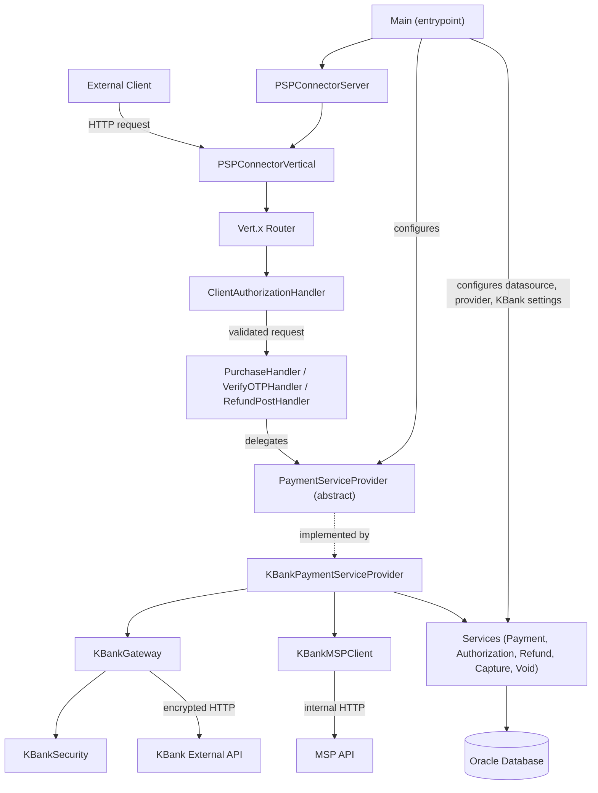

# Architecture Overview

The PSP Connector for KBank is a Vert.x-based payment service that mediates between internal OnePay systems and the external KBank payment gateway. It exposes a REST-like HTTP API, persists payment lifecycle state in an Oracle database, and translates between OnePay's canonical payment model and KBank's proprietary encrypted gateway protocol.

## Design Goals

The system is designed around three primary concerns:

- **Protocol mediation** — translating between OnePay's standard payment request/response format and KBank's signed, encrypted gateway protocol.
- **Payment lifecycle management** — persisting payments, authorizations, refunds, captures, and voids as first-class database records with explicit state transitions.
- **Provider extensibility** — isolating PSP-specific logic behind an abstract `PaymentServiceProvider` so that integrating additional payment providers does not require changes to the HTTP server, routing, or cross-cutting handlers.

## High-Level Component Map

Caption: Client[External Client]

*Figure: Component relationship diagram showing how client requests flow through the system to the KBank gateway and Oracle database.*

## Entrypoint and Bootstrap

**`Main.java`** is the application entrypoint. It performs all wiring at startup:

1. Loads `app.properties` from the classpath.
2. Creates a HikariCP connection pool backed by Oracle.
3. Injects the datasource into all static service classes (`PaymentService`, `AuthorizationService`, `RefundService`, `CaptureService`, `VoidService`) and into the KBank `DB` helper.
4. Instantiates `KBankPaymentServiceProvider` and assigns it to the static `paymentServiceProvider` field on `PurchaseHandler`, `VerifyOTPHandler`, and `RefundPostHandler`.
5. Configures `ClientAuthorizationHandler` with service identity, region, and algorithm metadata.
6. Loads KBank gateway host, path, token, partner ID, and encryption key paths into `KBankGateway` and `KBankSecurity`.
7. Constructs `PSPConnectorServer` with thread pool settings and deploys `PSPConnectorVertical` with HTTP server configuration (host, port, API prefix, keepalive, timeouts).

The bootstrap is strictly sequential and single-threaded; the Vert.x event loop starts only after all configuration is complete.

## Server and Verticle

**`PSPConnectorServer`** is a `Runnable` that creates a new `Vertx` instance with configured pool sizes and blocked-thread thresholds, then deploys the application verticle. It runs on its own thread, keeping the main thread available for JVM shutdown hooks.

**`PSPConnectorVertical`** is the Vert.x `AbstractVerticle` that owns the HTTP server lifecycle:

- Creates a shared `WebClient` with SSL enabled, trust-all mode, and a 300-connection pool for outbound HTTP calls to KBank and MSP.
- Mounts a Vert.x `Router` with global middleware and operation-specific route handlers.
- Starts an `HttpServer` on the configured host and port with TCP keepalive and idle timeout.

## Request Pipeline

Every inbound HTTP request passes through a linear middleware chain before reaching a business handler. The pipeline is configured in `PSPConnectorVertical.start()`:

Caption: In[Incoming Request]

*Figure: The ordered middleware pipeline applied to every request.*

### Global Middleware

| Handler | Responsibility |
|---------|---------------|
| `BodyHandler` | Parses request body into a buffer accessible via `rc.body()`. |
| `ResponseTimeHandler` | Adds `X-Response-Time` header to the response. |
| `TimeoutHandler` | Fails the request if processing exceeds the configured connection timeout. |
| `RequestLoggingHandler` | Logs the HTTP method, URI, required headers (`Accept`, `Content-Type`, `X-Op-Date`, `X-Op-Expires`, `X-Op-Authorization`), and the filtered request body. |
| `ClientAuthorizationHandler` | Validates client identity and request integrity (see below). |

### Client Authorization

`ClientAuthorizationHandler` is the security gate for all requests. It:

1. Validates that `Accept: application/json` is present.
2. Checks that `X-Op-Date`, `X-Op-Expires`, and `X-Op-Authorization` headers exist and are well-formed.
3. Extracts the client ID from the `X-Op-Authorization` header using a regex.
4. Parses the authorization header into an `Authorization` object (from the `ows` library) and checks expiry, region, service name, terminator, and algorithm.
5. Recomputes the signature using the client's access key (looked up from `app.properties` by client ID) and compares it to the request signature.
6. On any validation failure, throws an `AuthorizationException` or `BadRequestException` that the `ExceptionHandler` converts to a `401` or `400` response.

### Route Registration

Routes are registered in `PSPConnectorVertical` using constants from `RoutePool`. The active routes are:

| Method | Path | Handler |
|--------|------|---------|
| `POST` | `{apiPrefix}/payments` | `PurchaseHandler` |
| `PUT` | `{apiPrefix}/payments/:id` | `PurchaseHandler` |
| `POST` | `{apiPrefix}/verify-otp` | `VerifyOTPHandler.handle` |
| `POST` | `{apiPrefix}/verify-otp2` | `VerifyOTPHandler.handle2` |
| `PATCH` | `{apiPrefix}/authorizations/:id` | `VerifyOTPHandler.handle` |
| `POST` | `{apiPrefix}/refunds2` | `RefundPostHandler` |

A terminal `ResponseHandler` handles successful responses, and `ExceptionHandler` handles failures.

### Business Handlers

Business handlers are thin adapters between the Vert.x routing context and the provider abstraction:

- **`PurchaseHandler`** — validates that the request body contains `merchantId`, `amount > 0`, and `currency`, then delegates to `paymentServiceProvider.paymentPurchase(rc, reqMap)`.
- **`VerifyOTPHandler`** — validates that a body is present, then delegates to `verifyOtp(rc, verifyMap)` or `verifyOtp2(rc, verifyMap)` depending on the route.
- **`RefundPostHandler`** — validates the body, then inspects a `command` field: if `"capture_refund"`, it calls `paymentCaptureRefund2(rc, reqMap)`; otherwise it calls `paymentRefund2(rc, reqMap)`.

All handlers catch exceptions and forward them via `rc.fail(e)`, which routes to the `ExceptionHandler`.

### Response and Error Handling

**`ResponseHandler`** reads `responseCode`, `responseDesc`, and `responseData` from the routing context (set by the provider during processing), serializes them as JSON, and writes the HTTP response.

**`ExceptionHandler`** catches exceptions from any pipeline stage and maps them to HTTP status codes:

| Exception Type | HTTP Status |
|---------------|-------------|
| `AuthorizationException` | 401 |
| `BadRequestException` | 400 |
| `ResourceConflictException` | 409 |
| `ResourceNotFoundException` | 404 |
| `HttpServiceException` | Custom from `SystemError` |
| Other / unexpected | 500 |

The error response body follows a standard JSON structure with `name`, `message`, `details`, and `informationLink` fields.

## Provider Abstraction

**`PaymentServiceProvider`** is an abstract class that defines the contract between the HTTP layer and PSP-specific logic. It declares methods for the full payment lifecycle: purchase, refund, capture, void, OTP verification, authorization management, instrument management, and user operations. Default implementations throw `RuntimeException("METHOD_NOT_SUPPORTED")`, so concrete providers only need to override the operations they support.

This abstraction is the primary extensibility point: adding a new payment provider means creating a new `PaymentServiceProvider` subclass and wiring it in `Main.java`. The handlers, middleware, services, and routing remain unchanged.

## KBank Provider

The KBank provider is the only concrete implementation in the repository. It consists of several tightly coupled classes:

### KBankPaymentServiceProvider

The main provider implementation. It implements the core operations as asynchronous chains using Vert.x `execBlocking(...)`:

- **`paymentPurchase`** — inserts a local payment record, resolves merchant configuration from MSP, calls `KBankGateway.addPaymentMethod(...)`, and either updates the payment state or inserts an authorization record depending on the KBank response.
- **`paymentRefund2`** — validates that the referenced payment is approved, inserts a refund record, calls `KBankGateway.refund(...)`, verifies the response signature, and updates refund state.
- **`verifyOtp` / `verifyOtp2`** — fetches payment details, verifies the OTP with KBank, requests payment registration, executes the payment, and patches MSP settlement records.

### KBankGateway

The outbound HTTP client for the KBank external API. It:

- Builds request payloads using `KBankSecurity` for encryption.
- Signs requests and verifies response signatures.
- Sends HTTP requests via the shared `WebClient`.
- Translates KBank responses into provider-facing JSON structures.

### KBankMSPClient

Handles communication with the internal MSP (Merchant Service Provider) API. It enriches OTP requests with customer payment data, patches MSP authorization and settlement records, and generates standardized settlement responses.

### KBankSecurity

Performs cryptographic operations: request encryption, signature generation, and public-key operations using RSA keys loaded from file paths configured in `app.properties`.

### Util

A collection of KBank-specific helper methods for request building, MSP HTTP helpers (`mspGet`, `mspPatch`), signature checking, error code mapping, and date formatting.

## Services Layer

Services are static utility classes that encapsulate Oracle database interactions. Each service:

- Receives a `DataSource` reference injected at bootstrap in `Main.java`.
- Uses `DBProcedureUtil` to call Oracle stored procedures.
- Manages a specific entity type (payments, authorizations, refunds, captures, voids).
- Provides `insert`, `update`, and `query` operations with state/response semantics.

| Service | Entity | Key Operations |
|---------|--------|----------------|
| `PaymentService` | Payments | Insert with masked instrument data, update state after PSP response, format for API response. |
| `AuthorizationService` | Authorizations | Insert with approval URL/method/content/expiry, update state, format with `links.approval`. |
| `RefundService` | Refunds | Insert against a payment, update state, format with settlement/reason data. |
| `CaptureService` | Captures | Insert against a payment, query, update state. |
| `VoidService` | Voids | Insert, query, update with similar state/response semantics. |
| `ClientActivityService` | Activity logs | Insert/update activity metadata (currently not actively written). |
| `ConnectorMsgService` | Message envelopes | Persist request/response content for audit. |
| `ClientService` | Client secrets | Look up access keys by client ID for signature verification. |
| `ErrorService` | Error mappings | Translate partner-specific error codes to canonical descriptions. |

## Database

The system uses Oracle as its primary datastore, accessed via HikariCP connection pooling. All database interactions go through stored procedures rather than direct SQL, providing a layer of abstraction between the application and the database schema.

Key database configuration (from `app.properties`):
- `database.url`, `database.username`, `database.password` — connection credentials.
- `database.min.pool.size`, `database.max.pool.size` — HikariCP pool bounds.
- `database.idle.timeout`, `database.validation.timeout`, `database.connection.timeout` — pool tuning.

## Configuration

All configuration is centralized in `app.properties`, loaded at startup by `Main.java`. Configuration areas include:

- **Server** — host, port, API prefix, thread pools, timeouts, keepalive.
- **Database** — Oracle connection URL, credentials, pool settings.
- **Service identity** — name, region, authorization type and algorithm.
- **Client access keys** — per-client secrets for signature verification (`access_key.{clientId}`).
- **KBank gateway** — host, path, token, code, partner ID, language.
- **KBank security** — encryption key file paths, private/public key references.
- **MSP** — URL, timeout, region, service, access key ID, secret access key.

The `Config.java` class provides typed accessor methods for a subset of these properties (MSP settings, KBank partner UID, default URL), though `Main.java` reads most configuration directly from the `Properties` object.

## Cross-Cutting Concerns

### Logging

The system uses `java.util.logging` throughout. Request logging captures method, URI, headers, and filtered body content. Response logging captures status code, message, and filtered body. The `AppUtil.instrumentLogFilter(...)` method sanitizes sensitive instrument data (card numbers, tokens) before logging.

### Exception Propagation

Exceptions bubble up through the Vert.x pipeline. Business logic throws typed exceptions (`BadRequestException`, `AuthorizationException`, etc.) that extend `SystemException`. The `ExceptionHandler` at the end of the pipeline catches all failures, maps them to appropriate HTTP status codes, and writes structured JSON error responses.

### Static Wiring

The system relies heavily on static field injection at bootstrap. Handler classes (`PurchaseHandler`, `VerifyOTPHandler`, `RefundPostHandler`) hold a static `paymentServiceProvider` reference. Service classes hold static `dataSource` references. `KBankGateway` and `KBankSecurity` hold static configuration fields. This pattern means the system is single-tenant per JVM and does not support dynamic reconfiguration without restart.

## Extension Points

1. **New payment provider** — implement `PaymentServiceProvider` and wire it in `Main.java`.
2. **New route** — add a route constant to `RoutePool`, register it in `PSPConnectorVertical`, and create a handler that delegates to the provider.
3. **New service** — create a static service class with `DataSource` injection and Oracle stored procedure calls.
4. **New middleware** — add a handler to the router chain in `PSPConnectorVertical.start()`.

## Limitations

- **Single provider per JVM** — the static wiring pattern means only one `PaymentServiceProvider` instance is active at a time.
- **No dynamic configuration** — all settings are read from `app.properties` at startup; changes require restart.
- **Synchronous database calls within blocking chains** — services use blocking JDBC calls inside Vert.x `execBlocking(...)`, which limits scalability under high concurrency.
- **KBankHandler is inactive** — `KBankHandler.java` exists in the provider package but is not mounted in the router.
- **Activity logging is disabled** — `RequestLoggingHandler` and `ResponseHandler` contain commented-out code paths that would persist activity records via `ClientActivityService`.
