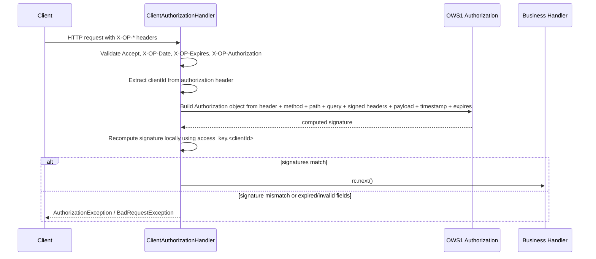
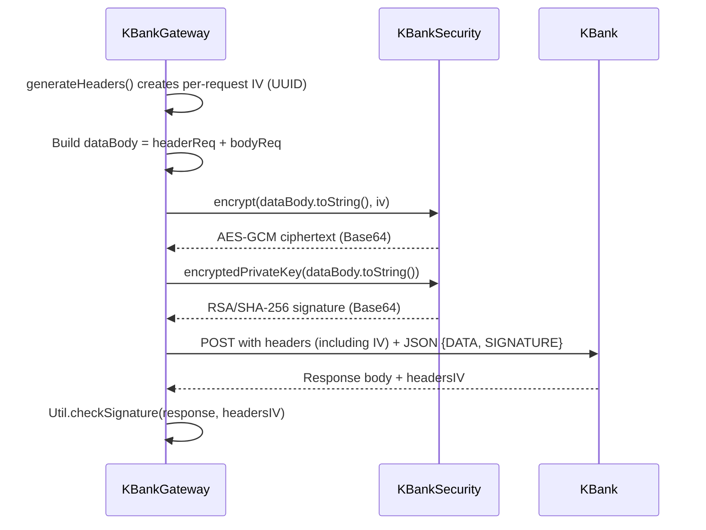

# Security & Encryption

This page explains the two security boundaries in the connector: inbound client authorization for the internal API, and outbound payload protection for KBank partner calls. It covers the algorithms, key material, request/response flow, failure handling, and operational constraints.

## Inbound client authorization

The connector exposes an HTTP API built on Vert.x. Every request passes through `ClientAuthorizationHandler.handle`, which enforces the OWS1 signing scheme before the request reaches a business handler.

Caption: Client->>ClientAuthorizationHandler: HTTP request with X-OP-* headers

### Required headers

The handler expects the following headers on every request:

- `Accept: application/json`
- `X-OP-Date`: request timestamp in `yyyyMMdd'T'HHmmss'Z'` format
- `X-OP-Expires`: integer seconds indicating signature validity window
- `X-OP-Authorization`: the OWS1 authorization string containing credential scope, signed headers, and signature

### Validated claims

The handler checks, in order:

1. `Accept` must equal `APPLICATION_JSON`. Missing or mismatched values raise `BadRequestException(INVALID_ACCEPT_HEADER)`.
2. `X-OP-Date` must be present and non-empty.
3. `X-OP-Expires` must be a positive integer.
4. `X-OP-Authorization` must be present and non-empty.
5. `clientId` is extracted from the authorization header via regex `SIGNATURE_HEADER_CHANNEL_ID_EXTRACT_REGEX`.
6. The authorization must not be expired according to `Authorization.isExpired()`.
7. `region`, `service`, `terminator`, and `algorithm` from the header must match the static server configuration:
   - `service.region`
   - `service.name`
   - `service.authorization.type` (`ows1_request`)
   - `service.authorization.algorithm` (`OWS1-HMAC-SHA256`)

### Signature recomputation

If the structural fields are valid, the handler rebuilds the canonical request locally:

- HTTP method
- URI path
- Query parameters, sorted
- Selected request headers, lowercased and trimmed, sorted case-insensitively
- SHA-256 hex digest of the raw payload bytes

It then computes an HMAC-SHA256 signing key derived from the configured secret access key prefixed with `OWS1`, dated, regionalized, and service-scoped. The final signature must equal the client-provided `X-OP-Signature`. A mismatch raises `AuthorizationException(INVALID_SERVICE_SIGNATURE)`.

## Outbound KBank payload protection

Outbound calls to KBank use a separate RSA/AES security stack. Each KBank request body is encrypted with AES-GCM and signed with RSA/SHA-256; KBank responses are expected back in the same encrypted/signed envelope.

Caption: Gateway->>Gateway: generateHeaders creates per-request IV UUID

### AES-GCM encryption

`KBankSecurity.encrypt` encrypts the plaintext JSON with:

- Cipher: `AES/GCM/NoPadding`
- Key: `SecretKeySpec` loaded from the filesystem path configured in `kbank.encryption_path`
- IV/parameters: `GCMParameterSpec(128, iv.getBytes())` where `iv` is the UUID passed in the request header `IV`

`decrypt` reverses the operation. Both methods throw `RuntimeException` on failure, which propagates up to the caller handler.

### RSA signature

`encryptedPrivateKey` creates a signature over the plaintext JSON by:

1. Computing `SHA-256` of the plaintext bytes via `AuthorizationV0.sha256Hash`
2. Encrypting the hash with RSA using `RSA/ECB/PKCS1Padding` and the static private key `kbank.onepay_private`
3. Base64-encoding the result

`decryptedPublicKey` verifies a KBank response by decrypting the provided signature with `RSA/ECB/PKCS1Padding` and the static public key `kbank.kbank_public`. The caller compares the recovered hash against its own SHA-256 of the response body.

### IV handling

The initialization vector is not a static secret. It is generated per request as a random UUID in `KBankGateway.generateHeaders`, sent in the `IV` header, and reused as the AES-GCM parameter for that request only. KBank is expected to echo the same IV in the response headers so the connector can decrypt the response payload.

### Key material

Both RSA keys and the AES key file path are loaded at startup from `app.properties`:

- `kbank.encryption_path` -> `KBankSecurity.ENCRYPTION_PATH`
- `kbank.onepay_private` -> `KBankSecurity.ONEPAY_PRIVATE`
- `kbank.kbank_public` -> `KBankSecurity.KBANK_PUBLIC`

These values are static for the process lifetime; there is no key rotation or reload mechanism in the current codebase.

## Configuration and operational behavior

Relevant security properties are documented in the [Configuration & Setup](/openwiki/concepts/configuration.md) page, under:

- Service identity and authorization (`service.name`, `service.region`, `service.authorization.type`, `service.authorization.algorithm`)
- Access keys (`access_key.<clientId>` mapped to static client authorization secrets)
- KBank integration properties (`kbank.encryption_path`, `kbank.onepay_private`, `kbank.kbank_public`, `kbank.token`, `kbank.code`, `kbank.partner_id`)

### Failure modes and invariants

- **Expired or missing authorization headers**: rejected immediately with `BadRequestException` or `AuthorizationException`; downstream handlers are never invoked.
- **Signature mismatch**: rejected with `AuthorizationException(INVALID_SERVICE_SIGNATURE)`. No audit trail of the mismatch is persisted; only a debug-level log of the canonical request and signing key derivation is emitted.
- **Encryption or signing failure on outbound KBank calls**: `KBankSecurity` wraps checked exceptions in `RuntimeException`. Callers in `KBankGateway` catch these and fail the Vert.x `Future` or invoke `sendErrorResponse`, which returns an internal-server-error response.
- **Invalid response signature**: `Util.checkSignature` marks the response with `errorsig`. Higher-level handlers treat this as `KBANK_RES_SIGNATURE_INVALID` and route the payment to `failed` state.
- **Static secrets in properties**: `app.properties` stores encryption paths, RSA key material, and partner credentials in plaintext. The application does not read these from environment variables, vaults, or keystores.

### Extension points

- New client authorization algorithms or header schemes would require replacing or wrapping `ClientAuthorizationHandler.handle` and the underlying `Authorization` class from the `ows` library.
- Different KBank payload encryption schemes would require changes in `KBankSecurity` and all `KBankGateway` methods that build `{DATA, SIGNATURE}` envelopes.
- Response verification logic is centralized in `Util.checkSignature`; response handling changes can be made there without modifying each gateway method.

### Focused tests

The repository contains only a trivial Base64 decode test:

- `repo:///test/java/TestDecodeBAse64.java`

There are no unit tests for `KBankSecurity`, `ClientAuthorizationHandler`, or KBank response signature verification in the current codebase. Security-sensitive flows should be covered by integration tests because they depend on shared `Properties` and static field initialization in `Main`.
