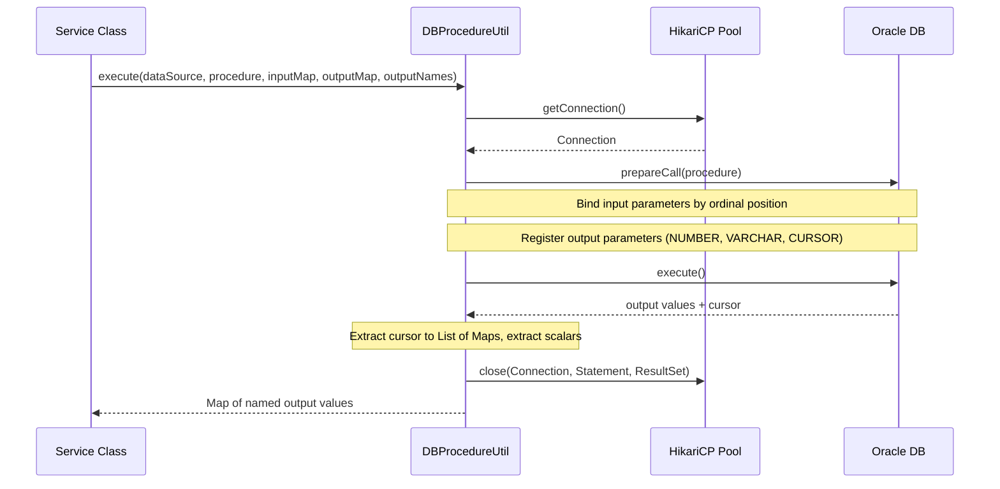
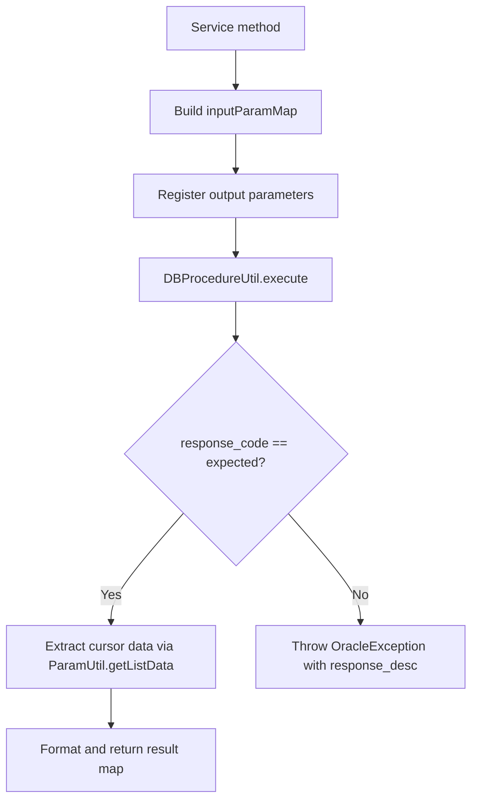

# Database Integration

The application persists and retrieves data exclusively through Oracle stored procedures. There are no ORM frameworks, no direct SQL queries, and no generated data-access layer. A single `HikariCP` connection pool backs every persistence path at runtime.

## Connection Pool

A `HikariDataSource` named `PSP_DB_POOL` is created at startup from `database.*` properties and shared across all service-layer singletons and the KBank provider database class.

Key pool configuration:

| Property | Default | Purpose |
| --- | --- | --- |
| `database.url` | `jdbc:oracle:thin:@db.onepay.vn:1521:orcl` | Oracle JDBC URL |
| `database.username` | `psp_connector` | Database user |
| `database.min.pool.size` | `0` | Minimum idle connections |
| `database.max.pool.size` | `5` | Maximum pool size |
| `database.idle.timeout` | `30000` | Idle connection timeout (ms) |
| `database.connection.timeout` | `60000` | Acquisition timeout (ms) |
| `database.connection.testquery` | `select null from dual` | Oracle keepalive query |

Initialization fail-fast is disabled (`initializationFailTimeout = -1`), so the application starts even if the database is temporarily unreachable; errors surface at query time.

**Wiring** (`repo://src/main/java/vn/onepay/pspconnector/Main.java#L37-L76`):

```java
HikariDataSource pspConnectorDataSource = new HikariDataSource(hikariConfig);

PaymentService.dataSource = pspConnectorDataSource;
AuthorizationService.dataSource = pspConnectorDataSource;
RefundService.dataSource = pspConnectorDataSource;
CaptureService.dataSource = pspConnectorDataSource;
VoidService.dataSource = pspConnectorDataSource;
DB.setDataSource(pspConnectorDataSource);
```

The same pool backs payment, authorization, refund, capture, void, and KBank persistence operations in the main startup flow. Additional services (`ClientService`, `ConnectorMsgService`, `ErrorService`, `ClientActivityService`) also declare `setDataSource` methods but are not wired from `Main.java`; their datasource injection is handled by a separate mechanism or is currently unused.

## Data-Access Layer

### DBProcedureUtil

`DBProcedureUtil` is the central database execution engine. Every stored procedure call in the common service layer flows through its single `execute` method.

**Location**: `repo://src/main/java/vn/onepay/pspconnector/common/util/DBProcedureUtil.java#L20-L148`

#### Execution Lifecycle



Caption: Caller->>Util: executedataSource, procedure, inputMap, outputMap, outputNames

1. **Connection acquisition** from the `DataSource` (HikariCP pool).
2. **Input parameter binding** using an `Integer→Object` map, binding by ordinal position with type-specific `CallableStatement.set*` calls (int, long, float, double, boolean, String, Timestamp, Date, or NULL for unrecognized types).
3. **Output parameter registration** using an `Integer→Integer` map to register Oracle output types (`OracleTypes.NUMBER`, `OracleTypes.VARCHAR`, `OracleTypes.CURSOR`).
4. **Execution** via `callableStatement.execute()`.
5. **Output extraction**: For `CURSOR` parameters, reads the `ResultSet` into a `List<Map<String, Object>>` with column names as keys, converting Oracle `TIMESTAMP` types to `java.util.Date`. For scalar types, extracts directly.
6. **Resource cleanup**: Closes `ResultSet`, `CallableStatement`, and `Connection` in a `finally` block.

#### Input/Output Map Convention

Services prepare three maps for each call:

| Map | Type | Purpose |
| --- | --- | --- |
| `inputParamMap` | `Integer→Object` | Ordinal-positioned input values |
| `outputParamMap` | `Integer→Integer` | Ordinal-positioned Oracle output types |
| `outputParamName` | `Integer→String` | Ordinal-to-logical-name mapping |

The standard output naming convention assigns:

| Ordinal | Logical Name | Oracle Type | Meaning |
| --- | --- | --- | --- |
| N | `response_code` | `NUMBER` | HTTP-style status (200 OK, 201 Created) |
| N+1 | `response_desc` | `VARCHAR` | Error description (empty on success) |
| N+2 | `response_data` | `CURSOR` | Result set with business data |

Services interpret `response_code` to determine success or throw `OracleException`.

**Reference**: `repo://src/main/java/vn/onepay/pspconnector/common/util/DBProcedureUtil.java#L82-L140`

### ProcedurePool

`ProcedurePool` centralizes all stored procedure call strings, organized by Oracle package:

| Domain | Package | Procedures |
| --- | --- | --- |
| Payment | `PKG_PAYMENT` | `payment_insert`, `payment_update`, `payment_update_amigo_ipn`, `payment_get_2`, `payment_get_amigo` |
| Authorization | `PKG_AUTHORIZATION` | `auth_get`, `auth_search`, `auth_insert`, `auth_insert_with_id`, `auth_update` |
| Refund | `PKG_REFUND` | `refund_insert`, `refund_update`, `refund_get` |
| Capture | `PKG_CAPTURE` | `capture_insert`, `capture_update`, `capture_get` |
| Void | `PKG_VOID` | `void_insert`, `void_update`, `void_get` |
| Messages | `PKG_MSG` | `msg_get`, `msg_insert`, `msg_update_req`, `msg_update_res` |
| Errors | `PKG_ERROR` | `error_get` |
| Client | `PKG_CLIENT` | `client_get_key` |
| Client Activity | `PKG_CLIENT_ACTIVITY` | `activity_insert`, `activity_update` |

**Location**: `repo://src/main/java/vn/onepay/pspconnector/common/util/ProcedurePool.java#L1-L47`

The BNPL (Buy Now Pay Later) flow uses separate procedure variants: `payment_update_amigo_ipn` and `payment_get_amigo`, which handle the additional `partner_txn_id` field and dual-cursor result sets.

## Service Layer

All nine service classes follow an identical pattern:

1. Build an ordinal-positioned `inputParamMap` from business parameters.
2. Register output parameters (response_code, response_desc, response_data cursor).
3. Call `DBProcedureUtil.execute(dataSource, procedureName, inputParamMap, outputParamMap, outputParamName)`.
4. Check `response_code`: if it matches the expected HTTP status (e.g., 200 for OK, 201 for CREATED), extract the cursor data via `ParamUtil.getListData` and format the result. Otherwise, throw `OracleException` with the `response_desc`.



Caption: A[Service method] --> B[Build inputParamMap]

### Service Responsibilities

| Service | Operations | Source |
| --- | --- | --- |
| `PaymentService` | `insert`, `update`, `get` | `repo://src/main/java/vn/onepay/pspconnector/common/service/PaymentService.java#L24-L248` |
| `AuthorizationService` | `get`, `search`, `insert`, `insertWithId`, `update` | `repo://src/main/java/vn/onepay/pspconnector/common/service/AuthorizationService.java#L25` |
| `CaptureService` | `insert`, `query`, `update` | `repo://src/main/java/vn/onepay/pspconnector/common/service/CaptureService.java#L26` |
| `RefundService` | `insert`, `query`, `update` | `repo://src/main/java/vn/onepay/pspconnector/common/service/RefundService.java#L26` |
| `VoidService` | `insert`, `query`, `update` | `repo://src/main/java/vn/onepay/pspconnector/common/service/VoidService.java#L26` |
| `ConnectorMsgService` | `get`, `insert`, `updateRequest`, `updateResponse` | `repo://src/main/java/vn/onepay/pspconnector/common/service/ConnectorMsgService.java#L20` |
| `ErrorService` | `get` | `repo://src/main/java/vn/onepay/pspconnector/common/service/ErrorService.java#L20` |
| `ClientService` | `getKey` | `repo://src/main/java/vn/onepay/pspconnector/common/service/ClientService.java#L20` |
| `ClientActivityService` | `insert`, `update` | `repo://src/main/java/vn/onepay/pspconnector/common/service/ClientActivityService.java#L17` |

### PaymentService Specifics

`PaymentService.insert` masks instrument (card) numbers before persisting, replacing middle digits with `xxxxxxxxxx` to enforce PCI-DSS-like data protection at the storage layer:

```java
inputParamMap.put(13, AppUtil.getInstrumentMask(instrumentNumber));
```

`PaymentService.update` uses a BNPL-specific procedure (`PAYMENT_UPDATE_BNPL`) that accepts payment state, KBank payment ID, response time, response code, description, and response data — distinct from the generic `PAYMENT_UPDATE`.

`PaymentService.get` returns a formatted response with currency-aware amount formatting (integer for VND, decimal for USD), settlement details for approved payments, and reason details for failed payments.

**Instrument masking reference**: `repo://src/main/java/vn/onepay/pspconnector/common/util/AppUtil.java#L61-L74`

## KBank Provider Database Access

The KBank provider's `DB` class provides provider-scoped queries that bypass the generic `DBProcedureUtil` pattern:

- **`getOnecreditMerchant`**: Retrieves OneCredit merchant credentials (`access_code`, `hash_code`) by merchant ID using `{? = call get_onecredit_merchant(?)}`.
- **`getAuthorIdByMerTxnRefAndPartTxnId`**: Retrieves linked payment and authorization records for BNPL flows using `PAYMENT_GET_BNPL`, returning joined `PaymentDTO` and `AuthorizationDTO` objects with dual-cursor extraction.

These methods use direct JDBC `CallableStatement` calls with manual resource cleanup and result-set-to-DTO mapping, providing more structured return types (typed DTOs) than the generic `Map`-based results from `DBProcedureUtil`.

**Location**: `repo://src/main/java/vn/onepay/pspconnector/provider/kbank/DB.java#L14-L220`

## Error Handling

Database errors are handled at two levels:

1. **Procedure-level**: Services throw `OracleException` (a `RuntimeException`) when the stored procedure returns a non-success `response_code`. The exception message is the `response_desc` from the procedure. The `ExceptionHandler` at the HTTP layer catches these and returns structured error responses.
2. **Utility-level**: `DBProcedureUtil.execute` catches all exceptions during JDBC operations, logs them at SEVERE level, and returns an empty result map. Callers then find a missing or zero `response_code` and respond accordingly.

**Exception class**: `repo://src/main/java/vn/onepay/pspconnector/common/exception/OracleException.java#L6-L10`

## Dependencies

The Oracle JDBC driver (`ojdbc8` version 19.7.0.0) and `HikariCP` (version 3.4.5) are declared in the project POM. No other database libraries (e.g., JPA, Hibernate, MyBatis) are used.

**POM reference**: `repo://pom.xml#L15-L81`

## Configuration

Database connection properties are defined in `app.properties` and loaded at startup. The related configuration page documents the full property set and startup wiring:

**Configuration reference**: `repo://concepts/configuration.md`

## Limitations and Design Notes

- **No ORM or query builder**: All data access is procedure-based; schema changes require coordinated Oracle package updates.
- **Static singletons**: Service classes use `public static DataSource` fields rather than dependency injection, making unit testing with mock data sources straightforward but coupling initialization to startup order.
- **Connection lifecycle**: `DBProcedureUtil` acquires and releases connections per call; there is no long-lived transaction or session management within the Java layer.
- **Type coercion**: `DBProcedureUtil` handles a limited set of Java types; unrecognized types are set as SQL NULL, which may silently drop data for unexpected parameter types.
- **Cursor-to-Map conversion**: Result sets are materialized into `List<Map<String, Object>>` using raw column names (e.g., `S_ID`, `N_AMOUNT`), with no automatic DTO mapping except in the KBank provider's `DB` class.
- **Mixed wiring patterns**: Some services are wired via static field assignment (`PaymentService.dataSource = ...`), while others use setter methods (`DB.setDataSource(...)`). The `ClientService`, `ConnectorMsgService`, `ErrorService`, and `ClientActivityService` datasources are not wired in `Main.java`.
- **Test coverage**: The `pom.xml` disables test execution (`<skipTests>true</skipTests>`), and no database-related test classes exist in the test directory.
