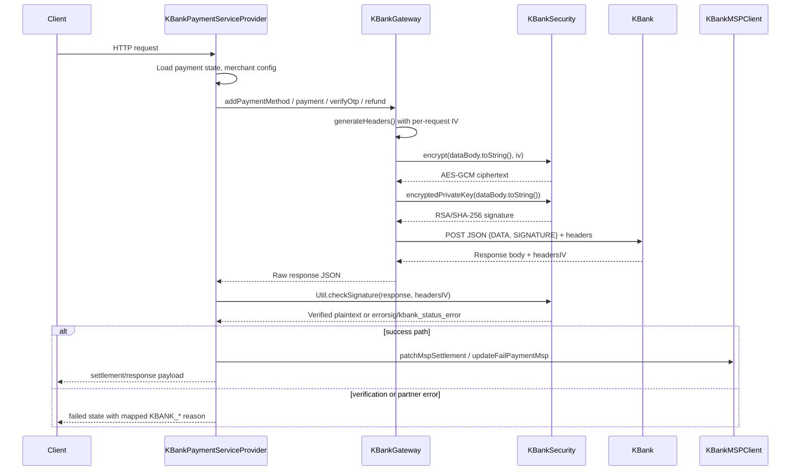

# KBank Gateway Integration

This page explains how the KBank provider integration maps the connector's internal payment, OTP verification, and refund operations onto KBank's external APIs. It covers the outbound request contract, the per-request cryptographic envelope, the supported KBank endpoints, response verification, and the orchestration layer that owns payment lifecycle state transitions.

## Architecture overview

The KBank integration is split across three major responsibilities:

- `KBankGateway` builds per-request headers, encrypts/signs payloads, and executes HTTP calls to KBank.
- `KBankSecurity` performs AES-GCM payload encryption and RSA/SHA-256 signing/verification.
- `KBankPaymentServiceProvider` and `KBankMSPClient` translate internal payment states into KBank API calls and persist results.

Inbound client authorization for the connector's own API is handled separately in [Security & Encryption](/openwiki/concepts/security.md); this page focuses on the outbound KBank boundary only.



Caption: Client->>PSP: HTTP request

## Entrypoints

`KBankGateway` exposes the following static operations used by the provider layer:

- `addPaymentMethod(...)` initiates payment instrument registration and branches into OTP or deep-link flows.
- `addPaymentMethodRequest(...)` executes the add-payment-method POST to KBank.
- `sendOTP(...)` requests an OTP for the customer.
- `verifyOtp(...)` validates an OTP with KBank.
- `payment(...)` completes the payment using an account token.
- `getDeepLink(...)` generates a KBank deep-link for customer interaction.
- `refund(...)` issues a cancellation/refund request.

Provider-side callers in `KBankPaymentServiceProvider` include:

- `paymentPurchase(...)` for purchase/payment authorization flows.
- `verifyOtp(...)` and `verifyOtp2(...)` for OTP-based authorization completion.
- `paymentRefund2(...)` for refund processing.

These provider methods maintain internal payment/refund state through `PaymentService` and `RefundService`, and synchronize merchant-side state via `KBankMSPClient`.

## Endpoints and request envelope

KBank URLs are composed from static `host` and `path` values loaded at startup from `app.properties`:

- `host`: `kbank.host`
- `path`: `kbank.path`

The concrete KBank endpoints invoked are:

- `/generate-deeplink`
- `/add-payment-method`
- `/send-otp`
- `/check-otp`
- `/payment`
- `/cancellation`

### Shared request structure

Every outbound KBank request uses the same envelope. The plaintext JSON body is:

```text
{
  "headerReq": { ... },
  "bodyReq": {
    "data": { ... }
  }
}
```

This plaintext is encrypted into `DATA`, and an RSA signature over the plaintext is placed in `SIGNATURE`. The exact HTTP JSON sent to KBank is:

```json
{
  "data": "<AES-GCM ciphertext Base64>",
  "signature": "<RSA/SHA-256 signature Base64>"
}
```

### Request headers

`KBankGateway.generateHeaders()` creates per-request metadata, including a random UUID used as the AES-GCM IV for both request encryption and expected response decryption. Headers include:

- `token`: `kbank.token`
- `requestUID`: `{partnerId}_{yyyyMMdd}_{OP}_{epochMillis}`
- `requestDateTime`: Unix epoch seconds
- `partnerID`: `kbank.partner_id`
- `code`: `kbank.code`
- `Accept-Language`: `kbank.language`
- `IV`: random UUID

The same UUID is embedded in the encrypted payload's `headerReq.requestUID` structure via `generateReqHeaders(iv)` and is expected back from KBank in response headers.

## Add payment method flow

`KBankPaymentServiceProvider.paymentPurchase(...)` first inserts a local payment record, then resolves the client merchant identifier via `getMerchantMsp(...)`. If merchant configuration is missing, the flow short-circuits to `failed` with reason `KBANK_MERCHANT_NOT_CONFIG`.

Otherwise, it calls `KBankGateway.addPaymentMethod(...)` with customer identity fields and order context. The gateway builds the KBank request body with `phoneNo`, `fullName`, `cardID`, and `partnerUID` mapped from `merchTxnRef`, then encrypts and signs it.

`KBankGateway.addPaymentMethod(...)` handles KBank response codes:

- `001`: KBank requires OTP verification. The gateway calls `sendOTP(...)`. On `000` from `/send-otp`, it returns `authorization_required` with an authorization block containing `opt_required` state and a 5-minute expiry.
- `002`: KBank indicates customer phone/info validation issues. The gateway additionally calls `getDeepLink(...)`. If KBank returns success on the deep-link request, the payment response includes a `deep_link` object with `code="KB-02"`, a fallback/default URL behavior via `Config.getDefaultURL()`, and expiry metadata.
- Other response codes: mapped to `failed` using KBANK_* error codes.

## OTP verification flow

Two provider entrypoints exist for OTP verification:

- `verifyOtp(...)` is invoked from the internal OTP handler path. It loads payment context, fetches additional payment data from MSP via `KBankMSPClient.getInfoPaymentMsp(...)`, verifies OTP through `/check-otp`, and on success re-calls `/add-payment-method` to obtain an `accToken`. It then calls `/payment` to finalize authorization, and on success updates settlement through MSP. Successful refund/cancel response code `018` is treated as approved for refunds.
- `verifyOtp2(...)` is an MSP-facing verification path that follows the same OTP/add-payment/payment chain but returns settlement data directly to MSP.

Both flows validate every KBank response through `Util.checkSignature(...)` before acting on body fields. Signature failure or HTTP-level partner errors immediately transition the payment to `failed` and update MSP.

## Refund flow

`KBankPaymentServiceProvider.paymentRefund2(...)` only allows refunds against approved purchase payments. It reads the partner transaction identifier stored as `partner_txn_id`, then calls `KBankGateway.refund(...)` against `/cancellation` with `paymentId` mapped to the KBank `paymentId`.

Refund state is derived from:

- signature or HTTP-level errors -> `failed`
- response codes `000` or `018` -> `approved`
- other KBank response codes -> `failed` with mapped reason

## Security model

Payload protection for KBank is implemented in `KBankSecurity`:

- Encryption: `AES/GCM/NoPadding` with `GCMParameterSpec(128, iv)`, where `iv` is the per-request UUID passed in the `IV` header.
- Key loading: AES key bytes are read from the filesystem path configured in `kbank.encryption_path` and wrapped in `SecretKeySpec`.
- Outbound signature: plaintext JSON is SHA-256 hashed, then encrypted with RSA using `RSA/ECB/PKCS1Padding` and the static private key `kbank.onepay_private`.
- Response verification: `KBankSecurity.decryptedPublicKey(signature)` decrypts the response signature with `RSA/ECB/PKCS1Padding` and `kbank.kbank_public`; `Util.checkSignature(...)` compares the recovered Base64 SHA-256 hash against its own hash of decrypted response data.

Static key material and endpoint credentials are loaded once at startup in `Main` from `app.properties`:

- `kbank.host`
- `kbank.path`
- `kbank.token`
- `kbank.code`
- `kbank.partner_id`
- `kbank.language`
- `kbank.encryption_path`
- `kbank.onepay_private`
- `kbank.kbank_public`

### Response handling rules

All provider-level KBank interactions treat response verification as a first-class check:

- If `Util.checkSignature(...)` returns `errorsig`, the flow records reason `KBANK_RES_SIGNATURE_INVALID` and moves to `failed`.
- If KBank's HTTP status or body indicates a partner error, `kbank_status_error` is attached and mapped through `mapPingStatusCodeKbank(...)`.
- Business response codes are translated via `mapPingErrorCodeKBank(...)` into canonical `KBANK_*` reason codes, including OTP states, token expiry, credit limit, refund acceptance, and permission errors.

## Lifecycle and state mapping

From the connector's perspective, a KBank-backed payment typically transitions through:

1. `purchase` -> local payment record created.
2. `authorization_required` -> KBank `001` or successful OTP send path.
3. `approved` -> successful `/payment` or refund `018`.
4. `failed` -> signature error, invalid credentials/OTP/status, or merchant misconfiguration.

Provider methods update local `PaymentService` and `RefundService` records with KBank response codes, descriptions, raw encrypted response bodies, and partner payment identifiers. Merchant settlement state is synchronized through `KBankMSPClient`.

## Failure modes and invariants

- Missing merchant configuration short-circuits purchase before any KBank call.
- Encryption/signing exceptions in `KBankSecurity` are wrapped in `RuntimeException`; `KBankGateway` catches them and fails the Vert.x handler with `sendErrorResponse(...)`.
- KBank HTTP/transport failures are propagated as failed futures and mapped to `500`-level internal server responses unless a prior payment record exists.
- Signature verification failure is never retried transparently; it immediately produces `failed` with `KBANK_RES_SIGNATURE_INVALID`.
- There is no runtime key reload or rotation; changing RSA/AES material requires restart.

## Configuration and operations

Operational configuration is concentrated in `app.properties` under KBank-prefixed keys and is wired in `Main` into static fields on `KBankGateway` and `KBankSecurity`. Endpoint host/path, partner identity, language, and cryptographic material are all externally configured.

Operators should ensure:

- `kbank.encryption_path` points to a readable AES key file.
- `kbank.onepay_private` and `kbank.kbank_public` contain valid Base64 RSA key material.
- `kbank.host`, `kbank.path`, `kbank.token`, `kbank.code`, and `kbank.partner_id` match the KBank environment.

## Related pages

- [Security & Encryption](/openwiki/concepts/security.md)
- [Configuration & Setup](/openwiki/concepts/configuration.md)
