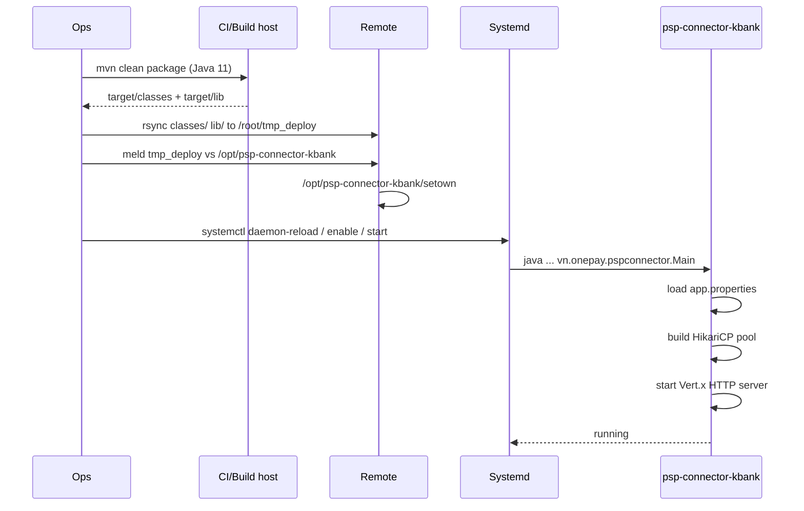

# Deployment & Operations

This page covers how to build the service, what artifacts are produced, how to push them to a remote host, and how the service is managed on target machines.

## Prerequisites

- Java 11 toolchain for building. The provided sync scripts build under `env JAVA_HOME=/usr/java/jdk-11`.
- Maven 3.x.
- Remote SSH access to the target host as `root` (the sync scripts perform `rsync` over SSH and run `meld` plus `setown` remotely).
- `meld` installed on the remote host if you use the provided diff-based sync flow.
- Sufficient OS limits for the service user.

## Build

Build the project with Maven from the repository root:

```bash
env JAVA_HOME=/usr/java/jdk-11 mvn clean
env JAVA_HOME=/usr/java/jdk-11 mvn -U package
```

By default, tests are skipped in the build (`skipTests` is set in the POM). The dependency plugin copies runtime dependencies into `target/lib`, and resources are copied into `target/classes`. The final deployable layout is therefore rooted at `target/`.

Relevant build wiring is defined in:

- `repo://pom.xml#L101-L145`

## Deployable artifacts

The package phase produces two paths that are required at runtime:

- `target/classes` - compiled classes and copied resources, including `app.properties`
- `target/lib/*` - runtime dependency JARs

This is not a fat JAR distribution. The service is started with an explicit classpath that expects these two locations to be present on the target host.

## Systemd service unit

A unit file for systemd is checked into the repository:

- `repo://service/psp-connector-kbank.service`

Install it on the target host as `/etc/systemd/system/psp-connector-kbank.service` and reload systemd:

```bash
systemctl daemon-reload
systemctl enable psp-connector-kbank
```

Key unit fields:

- **Main class:** `vn.onepay.pspconnector.Main`
- **Working directory:** `/opt/psp-connector-kbank`
- **User/Group:** `tsp/tsp`
- **JVM:** The checked-in unit references `/usr/java/jdk1.8.0_131/bin/java`. The project POM compiles for Java 11; ensure the JVM on the target host matches the build target or update `ExecStart` accordingly.
- **File limit:** `LimitNOFILE=20000`
- **Required system property:** `-Dlog=/var/log/psp-connector-kbank/psp-connector-kbank.log` so Log4j2 can route logs to the expected file path.

The unit starts the application using the deployed classpath layout:

```text
/opt/psp-connector-kbank/classes:/opt/psp-connector-kbank/lib/*
```

## Runtime directory layout

On a deployed host, the expected layout under `/opt/psp-connector-kbank` is:

```text
/opt/psp-connector-kbank/
  classes/
    app.properties
    ...compiled classes and resources...
  lib/
    ...runtime dependency JARs...
  psp-connector-kbank.service
  setown
```

The application does not create these directories itself. They are populated by the deployment step.

## Remote update workflow

The repository includes sync scripts for dev, staging, and production. All of them follow the same pattern:

1. Build under Java 11.
2. Rsync only `target/classes` and `target/lib` to a staging path on the remote host.
3. Diff the staging path against the live `/opt/psp-connector-kbank` with `meld`.
4. Run `/opt/psp-connector-kbank/setown` to finalize ownership/permissions after the diff.

### Sync scripts

| Script | Target host hint |
| --- | --- |
| `repo://sync_dev` | dev environment |
| `repo://sync_stg` | staging environment |
| `repo://sync_prod_100` | production environment 1 |
| `repo://sync_prod_101` | production environment 2 |

Example dev sync flow:

```bash
env JAVA_HOME=/usr/java/jdk-11 mvn clean
env JAVA_HOME=/usr/java/jdk-11 mvn -U package

rsync -av --progress --delete --delete-excluded --rsh='ssh -p7100' \
  --include=classes \
  --include=lib \
  --include=classes/** \
  --include=lib/* \
  --exclude=* \
  target/ root@dev:/root/tmp_deploy/psp-connector-kbank/
```

Example prod/stage flow:

```bash
env JAVA_HOME=/usr/java/jdk-11 mvn clean
env JAVA_HOME=/usr/java/jdk-11 mvn -U package

rsync -av --progress --delete --delete-excluded --rsh='ssh -p7101' \
  --include=classes \
  --include=lib \
  --include=classes/** \
  --include=lib/* \
  --exclude=* \
  target/ root@dc:/root/tmp_deploy/psp-connector-kbank/

ssh root@dc -p 7101 -X 'meld /root/tmp_deploy/psp-connector-kbank/ /opt/psp-connector-kbank/ && /opt/psp-connector-kbank/setown'
```

The `meld` step is a manual visual diff between the staged upload and the live install. After accepting the diff, `setown` is run. The exact logic in `setown` is not in this repository, but it is the post-deploy ownership/permission hook for `/opt/psp-connector-kbank`.

## Configuration at runtime

The service reads its configuration from a single classpath properties file:

- `repo://src/main/resources/app.properties`

Loaded at startup in `vn.onepay.pspconnector.Main.main`. The properties file is expected to be present under `/opt/psp-connector-kbank/classes/app.properties` after deployment.

Operators should treat `app.properties` as sensitive. It contains database credentials, MSP secrets, KBank gateway credentials, and PEM-encoded key material. Production values should not be checked into source control.

In addition to the properties file, the logging subsystem expects:

- environment variable `app`
- system property `log`

These are consumed by Log4j2 configuration in `repo://src/main/resources/log4j2.xml`. If they are missing, log routing falls back to unresolved placeholders.

## Service lifecycle



Caption: Ops->>CI: mvn clean package Java 11

## Operational considerations

- **Java version mismatch:** The systemd unit references JDK 8, while the build is configured for Java 11. Ensure the runtime JVM matches the compiled bytecode, or update `ExecStart`.
- **Tests:** Tests are skipped by default in the POM. If you need to run tests, invoke Maven with `-DskipTests=false` or use a dedicated profile.
- **Fail-fast behavior:** Database initialization is configured with `initializationFailTimeout=-1`, so the application can start even if Oracle is unreachable. Query failures will appear later under load.
- **Log file path:** The service expects `/var/log/psp-connector-kbank/psp-connector-kbank.log` to be writable by the `tsp` user.
- **Network ports:** Defaults come from `app.properties`, typically binding to `0.0.0.0:28680`. Firewall and load-balancer rules must account for this.
- **File descriptors:** The unit sets `LimitNOFILE=20000`. Ensure the host kernel allows this for the `tsp` user.
- **No containerization:** There is no Dockerfile or Kubernetes manifest in the repository. Deployment is host-based with systemd.
