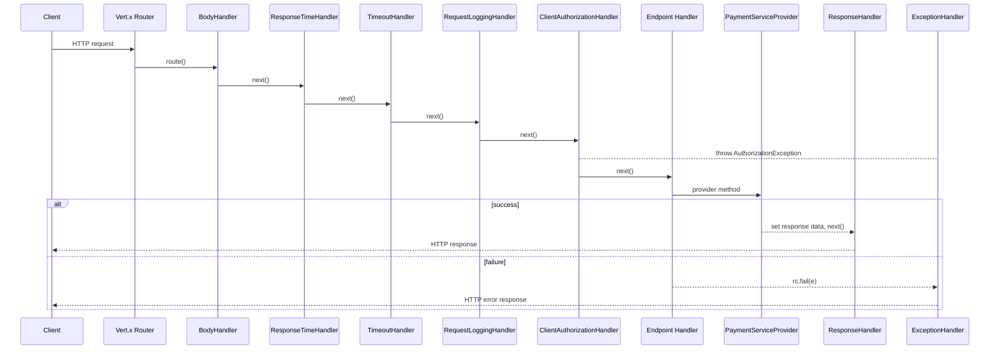

The PSP Connector server routes incoming HTTP requests through a chain of handlers defined in the Vert.x router. These handlers are categorized into **common handlers**, which process every request to perform cross-cutting tasks like logging and authentication, and **endpoint handlers**, which implement specific business logic for API operations.

## Common Handlers

These handlers form the request processing pipeline and are registered on the router before any endpoint-specific routes.

### ClientAuthorizationHandler

The `ClientAuthorizationHandler` is responsible for verifying the authenticity and integrity of incoming requests. It implements a signature-based authentication mechanism.

**Responsibilities:**
*   Validates required HTTP headers: `Accept`, `Content-Type`, `X-OP-Date`, `X-OP-Expires`, and `X-OP-Authorization`.
*   Extracts the client ID from the `X-OP-Authorization` header.
*   Validates the request expiration and checks if the service region and name match the server configuration.
*   Computes a signature based on the request method, path, query parameters, signed headers, and body using the client's access key.
*   Compares the computed signature with the provided signature to verify identity.
*   Stores the `client_id` in the routing context for downstream handlers.

If validation fails, it throws an `AuthorizationException` or `BadRequestException`.

### RequestLoggingHandler

The `RequestLoggingHandler` logs details of every incoming request for debugging and auditing purposes.

**Responsibilities:**
*   Logs the HTTP method and URI.
*   Logs selected request headers (`Accept`, `Content-Type`, `X-OP-Date`, `X-OP-Expires`, `X-OP-Authorization`).
*   Logs the request body (with sensitive data filtered via `AppUtil.instrumentLogFilter`).

### ResponseHandler

The `ResponseHandler` is the last handler in the successful request processing chain. It serializes the response prepared by the endpoint handler and sends it back to the client.

**Responsibilities:**
*   Retrieves the response code, description, and data from the `RoutingContext`.
*   Constructs a JSON response body.
*   Sets the HTTP status code and headers (`Content-Type`, `Content-Length`).
*   Logs the response status and body.

### ExceptionHandler

The `ExceptionHandler` acts as a failure handler for the router. It catches any exceptions thrown during the request processing lifecycle (including `SystemException` subclasses) and formats a standardized error response.

**Responsibilities:**
*   Intercepts exceptions (`rc.failure()`).
*   Maps `SystemException` types to specific HTTP status codes and error messages defined in `SystemError`.
*   Handles unknown exceptions by returning a generic 500 Internal Server Error.
*   Returns a JSON error body with `name`, `message`, `details`, and `information_link`.

## Endpoint Handlers

These handlers implement the core business logic for specific API resources. They typically perform input validation and then delegate the actual processing to a `PaymentServiceProvider` implementation.

### User Handlers

Manage user-related operations.

*   **UserGetHandler**: Searches for user information based on `channel_id`, `channel_user_id`, and `reference`.
*   **UserRegistrationHandler**: Registers a new user after validating required fields (`reference`, `name`, `mobile`).
*   **UserUpdateHandler**: Updates user information. Requires a valid `user_id` path parameter.
*   **UserDeleteTokenHandler**: Deletes a specific token (instrument) linked to a user, identified by `user_id` and `token_id`.

### Instrument Handlers

Manage payment instruments (e.g., credit cards, bank accounts).

*   **InstrumentRegistrationHandler**: Registers a new payment instrument for a user. It requires a `user_id` in the request body.

### Payment Handlers

Handle payment-related transactions.

*   **PurchaseHandler**: Processes payment purchase requests. It validates the presence of `merchant_id`, `amount`, `currency`, and `instrument` information before proceeding.
*   **SettlementHandler**: Handles payment settlement requests. It validates `merchant_id`, `terminal_id`, and `batch_no` in the request body. Note that this handler currently only performs validation; it does not delegate to the provider or set a response, so the request is passed through to the `ResponseHandler`.

### Refund Handlers

Handle refund requests.

*   **RefundPostHandler**: Processes a standard refund request. Validates the request body and delegates to the payment service provider.
*   **RefundPostHandler2**: Handles a secondary or alternative refund flow, similar to `RefundPostHandler`.

### Authorization Handlers

Manage authorization states for payments.

*   **AuthorizationPatchHandler**: Updates the state of an authorization (e.g., confirming or canceling). It checks the current authorization state (must be `created` or `pending`) before allowing updates, loading existing authorization info from `AuthorizationService` and delegating to the provider's `authorizationPatch`. It also exposes a `handleNew` variant that only accepts authorizations in the `created` state.

## Request Processing Pipeline

All HTTP requests pass through the common handlers in sequence before reaching an endpoint handler, and are finalized by either the `ResponseHandler` (success) or the `ExceptionHandler` (failure).

Caption: C->>R: HTTP request

Caption: Sequence of handlers invoked for each HTTP request and the success versus failure response path.

## Handler Injection and Configuration

Endpoint handlers that delegate to a payment provider hold a static `paymentServiceProvider` field. The `Main` entry point wires this field to a concrete `OnecommPaymentServiceProvider` instance (along with `ClientAuthorizationHandler` service properties loaded from `app.properties`) before the server starts. This near-static wiring means there is a single provider per server instance and it is configured once at startup.

## Route Mapping

The `RoutePool` class defines the URL constants used to register these handlers in the Vert.x router.

| Route Constant | Path Pattern | Handler(s) |
| :--- | :--- | :--- |
| `USERS` | `/users` | `UserGetHandler` (GET), `UserRegistrationHandler` (POST) |
| `USERS_WITH_ID` | `/users/:id` | `UserUpdateHandler` (PATCH) |
| `USERS_WITH_TOKEN_ID` | `/users/:user_id/tokens/:token_id` | `UserDeleteTokenHandler` (DELETE) |
| `INSTRUMENTS` | `/instruments` | `InstrumentRegistrationHandler` (POST) |
| `PAYMENTS` | `/payments` | `PurchaseHandler` (POST, PUT) |
| `AUTHORIZATIONS` | `/authorizations` | `AuthorizationPatchHandler` (PATCH) |
| `SETTLEMENT` | `/settlements` | `SettlementHandler` (POST) |
| `REFUNDS` | `/refunds` | `RefundPostHandler` (POST) |
| `REFUNDS2` | `/refunds2` | `RefundPostHandler2` (POST) |
