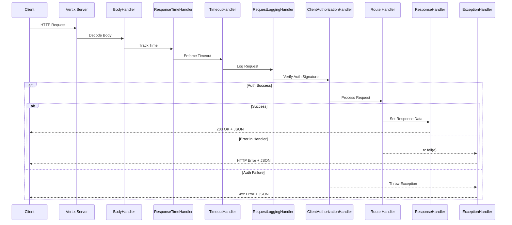

The PSP Connector server is built on the Vert.x toolkit, providing a non-blocking, event-driven architecture for handling HTTP API requests. The server setup is split into two primary components: `PSPConnectorServer`, which manages the Vert.x instance lifecycle and configuration, and `PSPConnectorVertical`, which defines the application logic, routing, and request handling pipeline.

## Server Initialization and Startup

The entry point for the application is the `Main` class, which configures dependencies (database, payment provider) and initializes the Vert.x server.

1.  **Configuration**: The server reads configuration from `app.properties` (e.g., host, port, pool sizes, timeouts).
2.  **Dependencies**: It sets up the database connection pool (HikariCP) and the specific payment service provider (`OnecommPaymentServiceProvider`).
3.  **Server Instantiation**: `Main` creates a `PSPConnectorServer` instance, configures it with pool and timeout settings, and assigns a `PSPConnectorVertical` instance configured with server-specific settings (host, port, API prefix).
4.  **Deployment**: Calling `init()` starts a new thread that creates a `Vertx` instance and deploys the `PSPConnectorVertical` verticle.

### Vert.x Configuration

`PSPConnectorServer` accepts configuration for the Vert.x instance itself:
*   `workerPoolSize`: Size of the worker thread pool.
*   `eventLoopPoolSize`: Number of event loop threads.
*   `threadCheckInterval`: Interval for checking blocked threads.
*   `maxWorkerExecuteTime`: Max time a worker thread can run.
*   `maxEventLoopExecuteTime`: Max time an event loop thread can run.

## Vertical Lifecycle and Setup

`PSPConnectorVertical` extends `AbstractVerticle` and contains the `start()` method where the HTTP server and router are initialized.

1.  **Client Initialization**: Creates HTTP, HTTPS, and Net clients for outbound connections.
2.  **Router Setup**: Creates a Vert.x `Router` and attaches the request processing handlers.
3.  **Route Definitions**: Maps API endpoints to specific handlers using route constants from `RoutePool`.
4.  **Server Creation**: Binds the HTTP server to the configured host and port and attaches the router as the request handler.

## Request Processing Pipeline

Every incoming request passes through a series of common handlers (middleware) before reaching the specific endpoint handler. This pipeline ensures consistent behavior for logging, security, and error handling.

The sequence of execution is:
`BodyHandler` -> `ResponseTimeHandler` -> `TimeoutHandler` -> `RequestLoggingHandler` -> `ClientAuthorizationHandler` -> `Route Handler` -> `ResponseHandler` (or `ExceptionHandler` on failure).

Caption: C->>S: HTTP Request

Caption: Request processing pipeline showing the flow through middleware and handlers.

### Handler Responsibilities

*   **BodyHandler**: Buffers the request body so it can be read multiple times.
*   **ResponseTimeHandler**: Tracks the time taken to process the request.
*   **TimeoutHandler**: Terminates the request if processing exceeds the configured timeout (`connectionTimeOut`).
*   **RequestLoggingHandler**: Logs the HTTP method, URI, selected headers, and body for auditing.
*   **ClientAuthorizationHandler**: Verifies the client's identity and request integrity using HMAC signature validation. It checks headers (`X-OP-Date`, `X-OP-Expires`, `X-OP-Authorization`) and validates the signature against the computed one.

### Response Handling

*   **ResponseHandler**: On success, retrieves the response code, message, and data from the routing context and sends a JSON response.
*   **ExceptionHandler**: Catches any exceptions thrown during processing (including `SystemException`) and returns a standardized JSON error response with status code and details.

## API Routes

The server exposes the following endpoints, defined in `RoutePool` and registered in `PSPConnectorVertical`:

| Resource | Method | Path | Handler |
| :--- | :--- | :--- | :--- |
| **Users** | GET | `/users` | `UserGetHandler` |
| | POST | `/users` | `UserRegistrationHandler` |
| | PATCH | `/users/:id` | `UserUpdateHandler` |
| | DELETE | `/users/:user_id/tokens/:token_id` | `UserDeleteTokenHandler` |
| **Instruments** | POST | `/instruments` | `InstrumentRegistrationHandler` |
| **Payments** | POST | `/payments` | `PurchaseHandler` |
| | PUT | `/payments/:id` | `PurchaseHandler` |
| **Authorizations** | PATCH | `/authorizations/:id` | `AuthorizationPatchHandler` |
| **Settlements** | POST | `/settlements` | `SettlementHandler` |
| **Refunds** | POST | `/refunds` | `RefundPostHandler` |
| | POST | `/refunds2` | `RefundPostHandler2` |

*Note: The base path is prefixed by `server.api.prefix` (e.g., `/psp-connector-onecomm-apple/api/v1`).*

## Endpoint Handler Implementation

Domain handlers generally follow a pattern of validating input parameters and then delegating the actual business logic to a `PaymentServiceProvider` instance.

*   **Validation**: Handlers like `PurchaseHandler` and `UserRegistrationHandler` explicitly check for required fields (e.g., `merchant_id`, `amount`, `reference`) and throw `BadRequestException` if missing.
*   **Provider Delegation**: Once validated, the handler calls the appropriate method on the static `paymentServiceProvider` instance (e.g., `paymentPurchase`, `userRegistration`).
*   **Error Propagation**: Exceptions are caught and passed to `rc.fail(e)`, which triggers the `ExceptionHandler`.

## Configuration

Key configuration properties (from `app.properties`):

*   `server.host` / `server.port`: Network binding address.
*   `server.api.prefix`: Base path for all API routes.
*   `server.worker.poolsize` / `server.eventloop.poolsize`: Thread pool sizing.
*   `server.connection.timeout`: Request timeout in milliseconds.
*   `server.connection.keepalive`: Enables TCP keep-alive.
