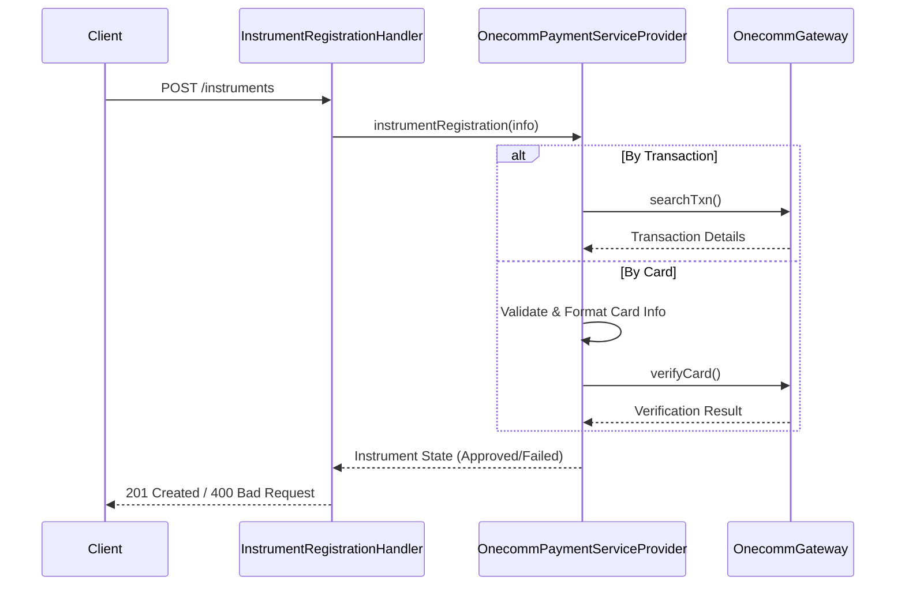

# Instrument Management

An **Instrument** in the PSP Connector system represents a payment method, most commonly a credit card or bank account, used to execute transactions.

## Instrument Registration

The registration process handles the capture and validation of instrument details before they can be used for purchases.

### Registration Flow

The entry point for instrument registration is the `InstrumentRegistrationHandler`, which processes HTTP requests (POST to `/instruments`). It delegates to the active `PaymentServiceProvider` implementation, such as `OnecommPaymentServiceProvider`.

1.  **Request Handling**: `InstrumentRegistrationHandler` validates the presence of `user_id` and the request body.
2.  **Provider Delegation**: Calls `instrumentRegistration` on the `PaymentServiceProvider`.
3.  **Two Registration Modes**:
    *   **By Transaction**: If the request contains a `transaction` object (referencing a previous successful transaction), the system looks up the transaction details via `OnecommGateway.searchTxn`.
    *   **By Card**: If no transaction is provided, the system validates the card details directly.

### Card Validation & Bank Logic

When registering a card directly (`instrumentRegistrationByCard`), the system performs specific logic for different instrument types:

*   **Oceanbank Cards (`oceanbank_card`)**:
    *   Sets `card_type` to "ATM".
    *   Sets `auth_method` to "SMS".
*   **VPBank Cards (`vpb_card`)**:
    *   Extracts the mobile number from `channel_user_id`.
    *   Normalizes the number by removing the leading "84" and replacing it with "0".

### Gateway Verification

The system interacts with the Onecomm Gateway (`OnecommGateway`) to verify the card details.
1.  **Bank Identification**: The system identifies the issuing bank based on the card number prefix (BIN).
2.  **Merchant Verification**: A low-value or token authorization request is sent to the bank via the gateway to verify the card's validity (`VERIFY_MERCHANT`).
3.  **State Management**: The instrument is marked with a state (e.g., `APPROVED` or `FAILED`) based on the gateway's response.

Caption: Client->>Handler: POST /instruments

## Core Components

*   **`InstrumentRegistrationHandler`**: The HTTP handler that receives registration requests.
*   **`OnecommPaymentServiceProvider`**: The core provider implementation containing the business logic for instrument validation and registration.
*   **`OnecommGateway`**: Handles communication with the external payment network, including card verification and bank selection.

## Data Model

Key fields in an Instrument:
*   `type`: The instrument type (e.g., `oceanbank_card`, `vpb_card`, `card`, `account`).
*   `number`: The card or account number.
*   `name`: The cardholder's name.
*   `month`, `year`: Expiration date components.
*   `cvv`: The Card Verification Value.
*   `mobile_number`: The registered mobile number (critical for OTP/SMS auth flows).

## See Also

*   [Provider System](/openwiki/concepts/provider.md)
*   [Onecomm Gateway Integration](/openwiki/integrations/gateway.md)
