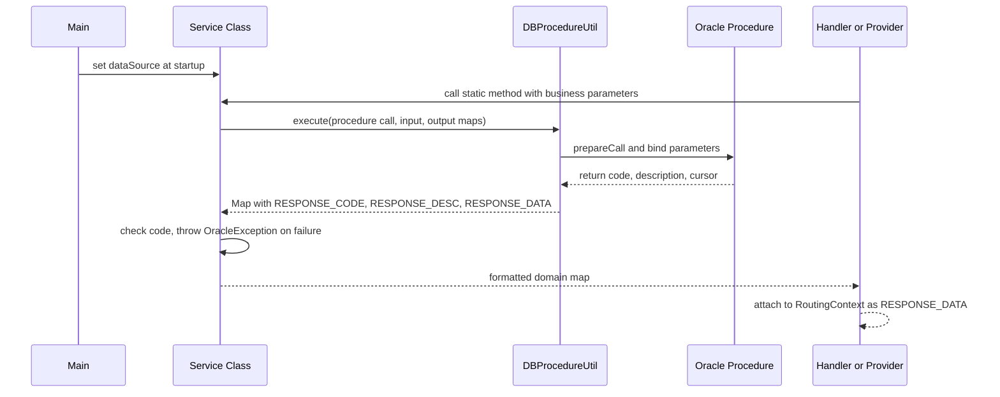

The PSP Connector service layer provides a thin stateless façade over the Oracle database. Each service class is a collection of `static` methods that accept simple maps or primitives, call a stored procedure through `DBProcedureUtil`, interpret the response code, and return formatted domain maps that handlers and providers can attach to the routing context.

## Responsibilities

- **Persistence abstraction**: Every domain operation (insert, update, get, search) maps to exactly one Oracle stored procedure call. Services never open their own JDBC connections or `CallableStatement`s; they delegate to `DBProcedureUtil.execute`.
- **Result normalization**: The raw `Map` returned by the database utility is translated into a JSON-friendly map whose keys match the public API schema defined in `AppParams`. Fields like amounts are formatted by currency, sensitive numbers are masked, and nested structures such as `settlement` or `reason` are unwrapped when the PSP response contains them.
- **Error propagation**: If the stored procedure's output code does not match the expected HTTP status (200 or 201), the service throws an `OracleException` carrying the procedure's description string, which the `ExceptionHandler` later maps to the appropriate error response.

## DataSource Injection

All services require a `DataSource` reference before any method can execute. The `Main` entry point creates a single `HikariDataSource` backed by an Oracle URL and injects it directly into the public `dataSource` fields of `PaymentService`, `AuthorizationService`, `RefundService`, and into `DB` via `DB.setDataSource`. Some services (`ClientActivityService`, `ConnectorMsgService`, `ClientService`, `ErrorService`) expose a `setDataSource` method instead of a public field, but the injection still happens at startup before the HTTP server begins accepting requests.

Caption: M->>S: set dataSource at startup

Caption: Data flow from handler through service to stored procedure and back.

## Core Domain Services

### PaymentService

`PaymentService` manages the payment lifecycle with three operations.

- **`insert`**: Creates a new payment record. It builds an input map with merchant details, instrument information (the card/account number is masked via `AppUtil.getInstrumentMask` before storage), amount, currency, and order info. The procedure `PKG_PAYMENT.payment_insert` generates the payment ID and returns the created row. Callers must supply a payment type constant from `PaymentTypes` (currently `PURCHASE` is the only defined value).
- **`update`**: Records the PSP response for an in-flight payment. It receives the payment state (`APPROVED`, `FAILED`, `CANCELED`, `AUTHORIZATION_REQUIRED`, etc.), the response time, and the raw PSP response body. The procedure `PKG_PAYMENT.payment_update` persists these fields.
- **`get`**: Retrieves a single payment by its connector-generated ID via `PKG_PAYMENT.payment_get`.

The private `format` method in `PaymentService` transforms raw database columns (prefixed `S_`, `N_`, `D_`) into the API-facing map. It converts amounts based on currency code (integer for VND, two-decimal for USD), and for approved payments it flattens the nested `settlement` object from the PSP response so that its top-level keys sit directly under the `settlement` key of the returned map. For failed payments the same flattening is applied to the `reason` object.

### AuthorizationService

`AuthorizationService` supports the multi-step authorization flows required by 3-D Secure and similar challenge mechanisms.

- **`get`**: Retrieves an authorization record by connector ID via `PKG_AUTHORIZATION.auth_get`.
- **`search`**: Finds authorizations by parent type and parent ID, useful for looking up the authorization tied to a specific payment.
- **`insert`**: Two overloads exist. The standard version lets the database generate the authorization ID; the `insert-with-id` version allows the caller to supply a specific ID (used when the PSP returns an authorization ID that must be preserved for later updates). Both procedures are in `PKG_AUTHORIZATION`.
- **`update`**: Sets the authorization's state to reflect the outcome of the challenge (typically `approved` or `failed`).

The `format` method builds a `links.approval` structure containing the `href`, HTTP `method`, and optional `content` body that the client must use to complete the authorization. The approval URL defaults to `/authorizations/{id}` and the method to `PATCH` when the PSP omits these values.

### RefundService

`RefundService` handles refund creation and state tracking.

- **`insert`**: Creates a refund record linked to a payment. The procedure `PKG_REFUND.refund_insert` receives the parent payment ID, merchant ID, amount, currency, client ID, and client reference.
- **`update`**: Updates the refund state based on the PSP refund response. The mapping of PSP status codes to connector states happens in the calling provider (`OnecommPaymentServiceProvider`): code 200 maps to `FAILED`, code 300 to `PENDING`, and code 400 to `APPROVED`.

The `format` method places the PSP response data into either the `settlement` key (for approved refunds) or the `reason` key (for failed or pending refunds), mirroring the payment convention.

## Auxiliary Services

### ClientService

`ClientService` provides a single `getKey` operation that retrieves the secret access key for a given client ID. This is used during request authentication to verify the HMAC signature. The key is returned as a plain string rather than a formatted map.

### ClientActivityService

`ClientActivityService` records client request and response activity for auditing. It offers `insert` (called by `RequestLoggingHandler` when activity logging is enabled) and `update` (for recording the response, currently commented out in `ResponseHandler`). The `requestInfo` and `responseInfo` fields are truncated to 4000 characters to match database column limits. Note that activity logging is disabled in the current `Main` configuration (the `setDataSource` call is commented out), so this service is effectively dormant.

### ConnectorMsgService

`ConnectorMsgService` manages connector message records that track the full lifecycle of external bank communication. It supports `get`, `insert`, `updateRequest`, and `updateResponse` operations, each mapping to a procedure in `PKG_MSG`. The `format` method translates database column names to API fields like `request_content` and `response_content`. This service is used by provider-specific implementations (such as VCB message handling) that need to persist raw request/response payloads.

### ErrorService

`ErrorService` translates partner-specific error codes to connector-internal error representations. It looks up error definitions by `partnerId`, `partnerCode`, and `partnerErrorName` via `PKG_ERROR.error_get` and returns a map containing both the partner error fields and the corresponding connector error fields (`mpay_error_name`, `mpay_error_message`, `mpay_error_desc`).

## Database Interaction Pattern

All services follow the same procedure-call pattern, which is documented in detail on the [Database Procedure Execution](/openwiki/concepts/database.md) page. The pattern is:

1. Build an ordered `LinkedHashMap` of input parameters where the key is the 1-based parameter index.
2. Declare output parameters: typically index 1 is the response code (`OracleTypes.NUMBER`), index 2 is the description (`OracleTypes.VARCHAR`), and index 3 is the data cursor (`OracleTypes.CURSOR`).
3. Map the output indices to logical names (`RESPONSE_CODE`, `RESPONSE_DESC`, `RESPONSE_DATA`) for the result map.
4. Call `DBProcedureUtil.execute(dataSource, procedureCallString, inputMap, outputMap, outputNameMap)`.
5. Extract `RESPONSE_CODE`, compare against the expected HTTP status code, and throw `OracleException` on mismatch.
6. Extract `RESPONSE_DATA` (a `List<Map>` from the cursor), take the first row if present, and run it through a private `format` method.

This uniform structure makes the service layer predictable: adding a new domain operation means writing one method that follows these six steps and adding the corresponding procedure constant to `ProcedurePool`.

## State Constants

Services rely on state constants from `ResourceStates` to populate and check the `state` field of domain objects. The full set includes `CREATED`, `PENDING`, `APPROVED`, `FAILED`, `CANCELED`, `EXPIRED`, `AUTHORIZATION_REQUIRED`, and others. The `format` methods use these constants to decide whether to populate `settlement` or `reason` sections of the response.
