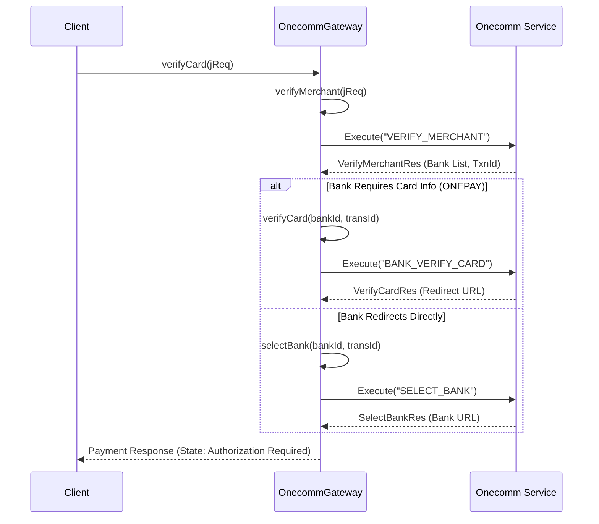

The Onecomm Gateway integration implements the communication between the PSP Connector and the external Onecomm payment service. It handles payment verification, authorization, and refunds using a binary protocol over HTTP/HTTPS.

## Communication Protocol

The integration communicates with the Onecomm service using the **Hessian binary serialization protocol** over HTTP/HTTPS. This is a lightweight RPC protocol designed for sending binary data between web services.

### Request/Response Format

1.  **Request Encoding**: Request objects are serialized using a custom `encodeHessian` method, which wraps Java `ObjectOutputStream` data with a specific Hessian header (magic bytes, version, and method name "execute").
    *   Header: `0x63 0x02 0x00 0x6d 0x00 0x07 "execute"` followed by length and the serialized payload.
2.  **Response Decoding**: Responses are deserialized using `decodeHessian`, which strips the header and reconstructs the Java object from the stream.
3.  **Content-Type**: Requests are sent with `Content-Type: x-application/hessian`.
4.  **Timeout**: The connection timeout is configurable (default 60s) via `onecomm_service_timeout`.

### Service Endpoint

The base URL is configured via `onecomm_service_url` (default: `http://localhost/onecomm-payservice-apple/execute`).

## Sequence Diagram

The following diagram illustrates the typical flow for a card verification request (`verifyCard`), which is the entry point for creating a payment authorization.

Caption: Client->>OnecommGateway: verifyCardjReq

## Processing Flow

### 1. Card Verification (Verify Card)

The `verifyCard` method is the primary entry point for initiating a purchase.

*   **Verify Merchant**: First, the gateway validates the merchant and creates a preliminary transaction with the Onecomm service to get a `transaction_id` and a list of supported banks.
*   **Bank Selection**: Based on the card number and type, the system identifies the issuing bank ID.
    *   **ONEPAY Banks**: For banks where card details are captured at OnePAY (e.g., Vietcombank, TPBank, VIB), the flow proceeds to `verifyCard` to send card details.
    *   **BANK Redirect**: For other banks (e.g., Techcombank, DongA), the system calls `selectBank` to get a redirect URL directly to the bank's payment page.

### 2. Authorization Update (Update Auth)

The `updateAuth` method handles subsequent steps in the payment lifecycle, such as:

*   **OTP Submission**: Submitting One-Time Passwords for banks requiring two-factor authentication.
*   **Bank Callbacks**: Processing redirect parameters when the user returns from the bank's site.
*   **Confirmation**: Finalizing the transaction via `ConfirmAuthenticationReq`.

### 3. Refund Processing

Two refund methods are supported:
*   **Refund**: Standard refund operation.
*   **Refund2**: Enhanced refund supporting dispute handling and direct refund commands.

## Error Handling and Mapping

The gateway translates Onecomm response codes into standard internal states and error reasons.

*   **Status Mapping**:
    *   `1` (Success) → Success (in gateway context, usually means bank accepted request).
    *   `2` (Fraud) → `FAILED` with `FRAUD` reason.
    *   Other codes (e.g., `7`, `8`, `9`) are mapped to specific reasons (e.g., `DECLINED`, `INVALID_INSTRUMENT_NUMBER`) using a property file lookup (`onecomm.status.*`).

*   **System States**:
    *   `AUTHORIZATION_REQUIRED`: The transaction is pending user action (OTP or 3D Secure).
    *   `APPROVED`: Transaction successfully completed.
    *   `FAILED`: Transaction failed.
    *   `CANCELED`: Transaction canceled by user.

## Configuration

Key configuration properties (system properties or `app.properties`):

*   `uri_prefix`: API path prefix (default `/psp/api/v1`).
*   `onecomm_service_url`: The URL of the Onecomm execution service.
*   `onecomm_service_timeout`: Timeout in milliseconds for gateway requests.

## Security

*   **Request Signing**: All verification requests are signed using HMAC-SHA256. The signature is calculated over sorted `vpc_*` and `user_*` parameters, concatenated as key-value pairs, and appended as `vpc_SecureHash`.
*   **Encryption**: Sensitive data like card numbers may be masked in logs (e.g., `6868xxxxxxx5021`).
