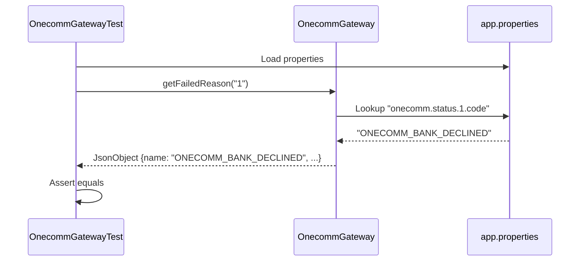

The PSP Connector uses a lightweight testing approach centered on **JUnit 4** for unit validation of core business logic. The current test suite focuses on verifying the translation layer between gateway response codes and internal error representations.

## Testing Framework

The project is built with **Java 11** and uses **JUnit 4.12** as its primary testing framework, declared as a test-scoped dependency in the Maven POM.

### Configuration
- **JUnit Version**: 4.12
- **Test Scope**: `test` (Maven standard)
- **Default Behavior**: Tests are skipped by default (`<skipTests>true</skipTests>`) in the POM configuration to speed up standard builds.

## Test Structure

Tests are located in the standard Maven directory structure:
```
src/test/java/vn/onepay/pspconnector/
```

Currently, there is a single primary test class:
- `OnecommGatewayTest`: Validates the mapping of Onecomm gateway response codes to internal error reasons.

## OnecommGatewayTest

This test class focuses on the `OnecommGateway.getFailedReason` method, which is critical for translating external payment gateway errors into standardized internal error objects.

### Responsibilities
- **Response Code Mapping**: Verifies that specific numeric response codes from the Onecomm gateway are correctly mapped to specific error name constants (e.g., `"1"` -> `"ONECOMM_BANK_DECLINED"`).
- **Configuration Loading**: Demonstrates the test setup requirement to load application properties, which is necessary because the error mapping logic reads from `Main.p` (a `Properties` object).

### Test Coverage
The single test method `testGetFailedReason_WithoutBank` covers a wide range of response codes, ensuring that the mapping logic handles various scenarios correctly:

- **Standard Errors**: Bank declines (`1`), timeouts (`3`), and validation errors (`4`, `5`, `6`).
- **Card Specific Errors**: Invalid cards (`10`), unregistered cards (`11`), date issues (`12`).
- **Account/OTP Errors**: Insufficient funds (`21`), locked accounts (`23`), invalid/expired OTPs (`25`, `26`).
- **System/Time Errors**: Internal server errors (`7`, `254`), transaction timeouts (`253`).
- **User Actions**: User cancellations (`99`), authentication cancellations (`98`).
- **Fallback**: Unmapped codes (tested via code `100`) are verified to return `"ONECOMM_RESPONSE_CODE_NOT_MAP"`.



Caption: Test->>Props: Load properties

Caption: Verification of response code mapping from gateway to internal error representation.

## Test Configuration

The test setup relies on `Main.p`, a static `Properties` object. This indicates that tests for business logic that depends on configuration must manually load the properties file before execution.

```java
p.load(Main.class.getClassLoader().getResourceAsStream("app.properties"));
```

This pattern ensures tests are self-contained and do not depend on a running server or external resources, as the property file is bundled within the application.

## Writing and Running Tests

### Prerequisites
- **Java 11** or higher
- **Maven** build tool

### Running Tests
Since tests are skipped by default in the `pom.xml` configuration, you must explicitly enable them to run:

```bash
mvn test -DskipTests=false
```

### Writing New Tests
1. **Location**: Place new test classes in `src/test/java/vn/onepay/pspconnector/` in a package mirroring the source structure.
2. **Naming**: Follow the standard naming convention: `[ClassName]Test.java`.
3. **Dependencies**: JUnit 4 is already configured. Use `@Test` annotation for test methods.
4. **Setup**: If your logic depends on `Main.p`, ensure you load `app.properties` as shown in `OnecommGatewayTest`.
5. **Focus**: Prioritize testing pure logic and translation layers (like `OnecommGateway.getFailedReason`) over testing framework integration or simple data transfer objects.

## Future Considerations

The current test suite is minimal, focusing on a single utility method. To improve robustness, future testing efforts could include:
- **Integration Tests**: Verifying database interactions for service classes.
- **Provider Tests**: Mocking the Onecomm HTTP client to test `OnecommPaymentServiceProvider` payment flows without hitting real endpoints.
- **Handler Tests**: Using `Vert.x` testing utilities to simulate HTTP requests and verify the full request lifecycle.
