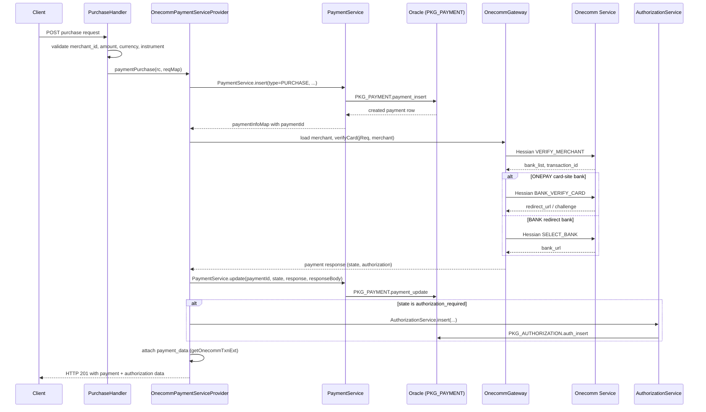

The payment purchase workflow starts when a merchant-facing client submits a purchase request to the PSP Connector. The request flows from the HTTP handler through the provider and the Oracle database into the external Onecomm Gateway, then returns an approval or authorization state back to the caller. This page traces the full lifecycle.

## Entry Point

The flow is triggered by the `PurchaseHandler`, which is the Vert.x route handler registered for the purchase endpoint. `PurchaseHandler.handle` performs basic request validation against the parsed JSON body:

- The body must not be empty (otherwise `BadRequestException(INVALID_REQUEST_BODY)`).
- `merchant_id` must be present.
- `amount` must be greater than zero.
- `currency` must be present.
- `instrument` (a nested object) must be present.

If validation passes, the handler delegates to `paymentServiceProvider.paymentPurchase(rc, reqMap)`, where `paymentServiceProvider` is a `PaymentServiceProvider` implementation injected at startup. Failure at any validation step is raised as a `BadRequestException` and propagated through `rc.fail(e)` to the router's `ExceptionHandler`.

## Provider: OnecommPaymentServiceProvider

The only concrete `PaymentServiceProvider` implementation is `OnecommPaymentServiceProvider.paymentPurchase`, which implements the purchase flow in two phases: a database insert phase and a gateway interaction phase.

### Database Insert Phase

Before contacting the gateway, the provider persists a pending purchase record by calling `PaymentService.insert(id, PaymentTypes.PURCHASE, ...)`. This call:

- Passes the connector-side `payment_id` (from the request path parameter), the payment type constant `PURCHASE`, the client/channel reference, the merchant reference, instrument details (the card/account number is masked via `AppUtil.getInstrumentMask`), amount, currency, and order information.
- Invokes the Oracle stored procedure `PKG_PAYMENT.payment_insert` through `DBProcedureUtil.execute` using a pooled `DataSource` (`PaymentService.dataSource`, injected at startup by `Main`).
- Returns the database-generated payment row; the provider extracts `paymentId` from the result.

If the stored procedure's response code is not HTTP 201 (Created), `PaymentService.insert` throws an `OracleException` carrying the procedure's description, and the purchase fails before the gateway is contacted.

### Gateway Interaction Phase

After the pending payment row exists, the provider builds a `JsonObject` request payload with:

- `amount`, `currency`, `merchant_id`, `merchant_txn_ref`.
- `terminal` with a hard-coded IP of `127.0.0.1`.
- `reference` set to the connector `paymentId`.
- `order.information` set to the order info.
- `instrument` copied from the request instrument map.
- `return_url` (defaulting to `http://mpay.return.url` when absent or not an `http(s)` URL).
- Optional `customer` block (`id`, `name`, `email`, `phone`).
- A `state` of `"canceled"` is forwarded through to the request when the caller passes it (the request body can carry a `state` field to signal the caller's intent).

The provider then loads the merchant's Onecomm credentials (`accessCode`, `hashCode`) via `DB.getOnecommMerchant(merchantId)` from the Oracle function `get_onecomm_merchant`, and calls `OnecommGateway.verifyCard(rc, jReq, merchant, responseHandler)`.

## OnecommGateway Integration

The gateway class `OnecommGateway` is the client adapter to the external Onecomm payment service. It communicates over the Hessian binary protocol over HTTP/HTTPS (`Config.getOnecommServiceUrl()`, default `http://localhost/onecomm-payservice-apple/execute`, timeout from `onecomm_service_timeout`, default 60000 ms).

### verifyMerchant

`verifyCard` first delegates to `verifyMerchant`, which:

- Builds the `vpc_*` parameter map (merchant, amount scaled by 100, currency, merchant transaction ref, order info, return URL, client IP, locale `vn`, version `2`).
- Computes a `vpc_SecureHash` via `Util.createGatewayHash(fields, merchant.getHashCode())` — an HMAC-SHA256 over the lexicographically sorted `vpc_`/`user_` fields using the merchant's hash code.
- Sends a `VERIFY_MERCHANT` request through `requestOnecommService`.

A failed verification produces a `FAILED` payment response with a mapped failure reason. On success, the response carries a `bank_list`, the resolved `bankId` (derived from the instrument type and number by `getBankId`), and a `transaction_id`.

### Bank card-site branch

Based on the bank's card site:

- **ONEPAY banks** (e.g., Vietcombank, TPBank, VIB, plus Napas banks) continue into the internal `verifyCard(bankId, transId)` step, which sends the bank-specific verify-card request (`REQUEST_TYPE_VALUES[bankId]`, e.g., `VCB_VERIFY_CARD`, `TPB_VERIFY_CARD`, or `*_NAPAS_VERIFY_CARD`) with the card number, card date, card type, card name, and auth method.
- **BANK redirect banks** (e.g., Techcombank, DongA, CUP, Vietbank, ViettelPay) go through `selectBank`, which sends a `SELECT_BANK` request and returns a direct redirect URL to the bank.

Both branches produce a gateway payment response object carrying at least `state`, `id` (form `pay;D;<merchantId>;<merchTxnRef>`), the amount/currency, the instrument, and links.

### Response states and the provider callback

The gateway response handler in `OnecommPaymentServiceProvider` runs inside another `execBlocking`:

1. Formats the response time and records the outcome via `PaymentService.update(paymentId, pspPaymentState, responseTime, "201", "Created", responseBody.encode())`, invoking `PKG_PAYMENT.payment_update`.
2. If the PSP state is `authorization_required`, it extracts the authorization block (id `aut;D;<merchantId>;<merchTxnRef>`, state, `links.approval` href/method/content, expire time) and persists it via `AuthorizationService.insert`, then attaches the authorization map to the payment result.
3. If the PSP state is `canceled`, the payment's `links` block is attached.
4. It loads the Onecomm extended transaction row via `DB.getOnecommTxnExt(merchantId, merchantTxnRef)` and attaches it as `payment_data` (including any SHB challenge code / mobile number / bank version 2 from the gateway response).
5. The handler completes positively: `rc.put(RESPONSE_CODE, 201)`, `rc.put(RESPONSE_DESC, "Created")`, `rc.put(RESPONSE_DATA, resPaymentInfoMap)`, then `rc.next()`.

The overall gateway interaction is asynchronous: `requestOnecommService` sends the Hessian-encoded request via a Vert.x `HttpClient` and invokes the callback when the body arrives. Errors during the gateway call are forwarded to `rc.fail`.

## Database Transaction Steps (Oracle)

The purchase flow performs two persisted Oracle transactions on the connector side:

1. **`PKG_PAYMENT.payment_insert`** — creates the pending payment row. Inputs include the request-provided `id` (or a generated one), payment type, channel reference, merchant reference, instrument number (masked), amount, currency, order info, batch (`"0"`), trace number (`0`), and empty invoice reference. Outputs are the response code, description, and a cursor with the created row.
2. **`PKG_PAYMENT.payment_update`** — after the gateway responds, updates the same payment row with the PSP state (`approved`, `failed`, `canceled`, `authorization_required`, ...), the response time, the HTTP response code/description, and the raw PSP JSON response body.
3. **`PKG_AUTHORIZATION.auth_insert`** (when the payment reaches `authorization_required`) — persists the authorization record linking the payment id with the PSP authorization id, approval URL/method/content, and expire time.

All JDBC access is funneled through `DBProcedureUtil.execute`, which uses the injected `HikariDataSource`, prepares a `CallableStatement`, binds input parameters by index, registers output parameters (`NUMBER`, `VARCHAR`, `CURSOR`), and closes the connection in a `finally` block. Services throw `OracleException` when the procedure response code does not match the expected HTTP status.

## Full Sequence Diagram

Caption: C->>H: POST purchase request

Caption: End-to-end purchase flow from handler validation through database persistence to the Onecomm gateway and back.

## State Model

The purchase (a `PaymentTypes.PURCHASE` row) ends in one of these states once the gateway returns:

- `authorization_required` — the transaction needs user action (OTP / 3-D Secure / bank redirect). A linked authorization record is created with an approval URL; the client must later call `authorizationPatch` to finish.
- `approved` — the bank accepted and settled the payment; the response carries a `settlement` object with reference and amount.
- `canceled` — the caller signaled `state = "canceled"` and the gateway accepted; the payment's `links` are returned.
- `failed` — the bank declined or the gateway rejected the request; the response carries a `reason` object mapped from the Onecomm response code via the `onecomm.status.*` properties.

## Configuration

The gateway communication depends on these system properties:

- `onecomm_service_url` — Onecomm Hessian endpoint (default `http://localhost/onecomm-payservice-apple/execute`).
- `onecomm_service_timeout` — gateway HTTP timeout in milliseconds (default `60000`).
- `uri_prefix` — prefix used in HATEOAS links (default `/psp/api/v1`).
- `onecomm.status.<code>.code` / `onecomm.status.<code>.desc` — mapping of Onecomm response codes to failure reason names/messages (via `Main.p`).

The merchant's `accessCode` and `hashCode` (used for the `vpc_SecureHash`) are stored in Oracle and fetched by `DB.getOnecommMerchant`.

## Related Pages

- [Request Handlers](/openwiki/architecture/handlers.md) — the handler pipeline that routes purchases.
- [Service Layer](/openwiki/concepts/services.md) — `PaymentService` and `AuthorizationService` persistence semantics.
- [Onecomm Gateway Integration](/openwiki/integrations/gateway.md) — the Hessian wire protocol and request types.
