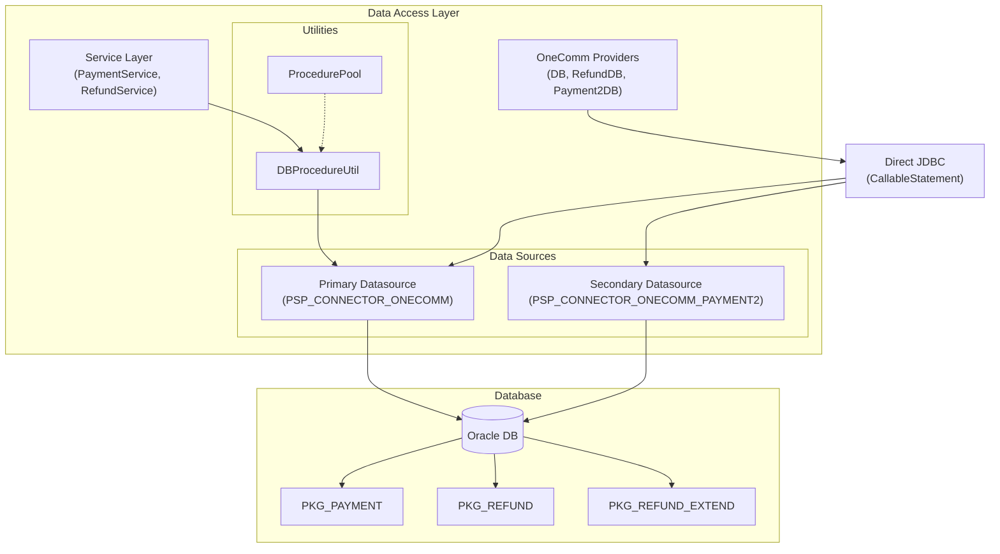

# Database & Persistence

This section documents the persistence layer of the PSP Connector application. The system relies on an Oracle database for storing transaction, payment, refund, and merchant data.

## 1. Connection Management

The application manages database connections using HikariCP, a high-performance JDBC connection pool. Configuration is handled in `Main.java`, where two distinct data sources are initialized:

1.  **Primary Data Source (`pspConnectorDataSource`)**:
    *   Used for general application data (merchants, clients, authorizations, messages, errors).
    *   Configured via `database.*` properties in `app.properties`.
    *   Injected into `DB`, `RefundDB`, `OnecommDB`, `PspConnectorDB`, `AuthorizationService`, `PaymentService`, and `RefundService`.

2.  **Payment2 Data Source (`payment2DataSource`)**:
    *   A secondary data source, likely for a specific payment partition or schema.
    *   Configured via `database.payment2.*` properties.
    *   Injected specifically into `Payment2DB`.

### Multi-Datasource Architecture

The application separates concerns by using two datasources. Most services use the primary datasource, while `Payment2DB` handles queries against a secondary payment database (likely a sharded or partitioned table structure).

## 2. Core Utilities

### `DBProcedureUtil`

`DBProcedureUtil` (repo://src/main/java/vn/onepay/pspconnector/common/util/DBProcedureUtil.java) is a generic utility for executing Oracle stored procedures. It acts as a low-level wrapper around JDBC `CallableStatement`.

**Key Responsibilities:**
*   **Dynamic Parameter Binding**: Accepts input parameters as a `Map<Integer, Object>`, automatically binding types (Integer, Long, Float, Double, Boolean, String, Timestamp, Date) to SQL parameters.
*   **Output Parameter Registration**: Registers output parameters via `Map<Integer, Integer>` (index to SQL type).
*   **Result Handling**: Processes output parameters:
    *   **Cursors**: Converts `OracleTypes.CURSOR` result sets into a `List<Map<String, Object>>`, allowing generic access to row data.
    *   **Scalars**: Returns scalar values (Number, Varchar) directly.
*   **Lifecycle Management**: Ensures proper closing of `ResultSet`, `CallableStatement`, and `Connection`.

### `ProcedurePool`

`ProcedurePool` (repo://src/main/java/vn/onepay/pspconnector/common/util/ProcedurePool.java) is a constant repository for stored procedure call strings. It centralizes the PL/SQL package and procedure names, ensuring consistency across the application.

**Stored Procedure Packages:**
*   `PKG_CLIENT`: Client management.
*   `PKG_CLIENT_ACTIVITY`: Activity logging.
*   `PKG_AUTHORIZATION`: Authorization handling.
*   `PKG_PAYMENT`: Payment processing.
*   `PKG_MSG`: Connector messaging.
*   `PKG_ERROR`: Error logging.
*   `PKG_REFUND`: Refund processing.

## 3. Service Layer Integration

The service classes (`PaymentService`, `RefundService`, etc.) act as an intermediate layer between the application logic and the database utilities.

### `PaymentService`
*   **Insert**: Creates a new payment record. It constructs a parameter map, calls `PKG_PAYMENT.payment_insert`, and processes the returned cursor to populate a `PaymentDTO` (or map).
*   **Update**: Updates payment status and response details using `PKG_PAYMENT.payment_update`.
*   **Get**: Retrieves a payment record by ID using `PKG_PAYMENT.payment_get`.

### `RefundService`
*   **Insert**: Creates a refund request. Calls `PKG_REFUND.refund_insert`.
*   **Update**: Updates refund status (e.g., from PENDING to APPROVED/FAILED) using `PKG_REFUND.refund_update`.

## 4. Provider-Specific Access (`vn.onepay.pspconnector.provider.onecomm`)

While the common services use the generic `DBProcedureUtil`, the provider-specific classes in the `onecomm` package often use direct JDBC calls via their own static `DataSource` references. This suggests a legacy or provider-specific implementation pattern.

### `DB` (OneComm)
*   **Static DataSource**: Injected at startup.
*   **Operations**:
    *   `getOnecommMerchant`: Retrieves merchant credentials (Access Code, Hash Code).
    *   `getOnecommTxn`: Fetches basic transaction details.
    *   `getOnecommTxnExt`: Fetches extended transaction details (including `S_DATA` for custom JSON).
    *   `checkBankOff`: Checks if a specific bank is offline.
    *   `getOnecommTxnRefundExt`: Fetches extended refund transaction details.

### `RefundDB` (OneComm)
*   **Static DataSource**: Injected at startup.
*   **Operations**:
    *   `insert`: Inserts a refund record using `PKG_REFUND_EXTEND.refund_insert`.
    *   `update`: Updates a refund record using `PKG_REFUND_EXTEND.refund_update`.
    *   `select`: Queries a refund record using `PKG_REFUND_EXTEND.refund_select`.
    *   This class handles the mapping of the `RefundDTO` to/from result sets.

### `Payment2DB` (OneComm)
*   **Static DataSource**: Uses the secondary `payment2DataSource`.
*   **Operations**:
    *   `GetTransactionByReferenceAndMerchantId`: Queries a transaction in the secondary database. This implies the secondary database holds historical or partitioned transaction data needed for operations like refunds (to find the original transaction ID).

### `OnecommDB` (OneComm)
*   **Static DataSource**: Uses the primary datasource.
*   **Operations**:
    *   `refundInsert`, `refundSelect`, `refundUpdate`: Operate on the `TB_REFUND_CONFIRM` table (inferred from comments/logic) via `PKG_REFUND_EXTEND`. This seems to track the *confirmation* or *settlement* side of the refund, distinct from the initial refund request.

## 5. Data Access Flow

1.  **Request Handling**: A handler (e.g., `RefundPostHandler`) receives a request.
2.  **Service Call**: It calls a service (e.g., `OnecommRefundServiceProvider`) which orchestrates the logic.
3.  **Data Persistence**:
    *   The service may call `RefundService` (using `DBProcedureUtil`) to record the request in the main schema.
    *   It may call `RefundDB` (direct JDBC) to interact with provider-specific tables (e.g., `PKG_REFUND_EXTEND`).
    *   It may call `Payment2DB` to verify the original transaction exists in the payment partition.
4.  **Result**: The service returns a DTO or Map to the handler for response generation.

## 6. Key Entities

*   **Payment**: Represents a successful purchase transaction. Contains instrument details, amounts, and settlement info.
*   **Refund**: Represents a request to return funds. Linked to a Payment. Has states (PENDING, APPROVED, FAILED).
*   **Transaction (OneComm)**: Internal representation of a transaction in the OneComm system, often used to bridge with the Payment Service Provider (PSP) gateway.

## 7. Configuration

Database connection properties are externalized in `app.properties` (and templated via `app.properties` and `TemplateProcessor`).

Key properties:
*   `database.url`: JDBC URL (supports multiple hosts for failover).
*   `database.username`, `database.password`: Credentials.
*   `database.*.pool.size`, `database.*.timeout`: HikariCP tuning parameters.
*   `database.payment2.*`: Configuration for the secondary datasource.

Caption: ServiceLayer[Service Layer\nPaymentService, RefundService]
