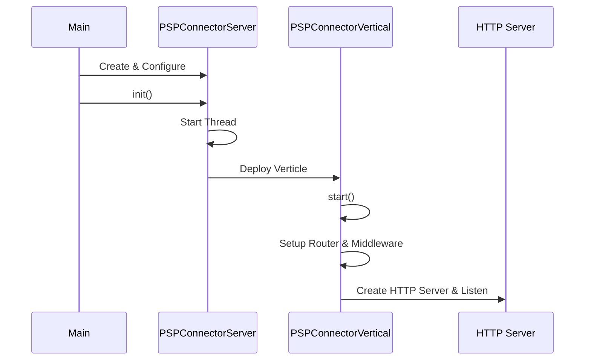
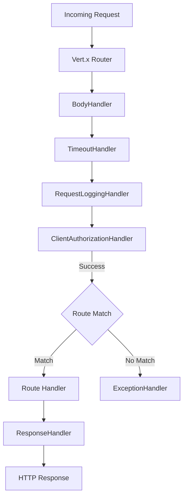

# HTTP Server & Routing

The PSP-Connector application exposes its functionality through an HTTP server built on Eclipse Vert.x. This page documents the server initialization, request routing pipeline, global middleware, and the handler-based request processing model.

## Server Initialization

The server startup sequence begins in `Main.java`, which configures and launches the `PSPConnectorServer`.

1.  **Configuration Loading**: The application loads configuration from `app.properties` and injects environment-specific values.
2.  **Server Instantiation**: `Main` creates a `PSPConnectorServer` instance and configures its threading model (worker pool, event loop) and network settings (host, port).
3.  **Deployment**: `PSPConnectorServer.init()` starts a new thread that deploys the `PSPConnectorVertical` verticle into a Vert.x instance.

Caption: M->>S: Create & Configure

*Figure 1: Server startup and deployment sequence.*

## Router Wiring & Middleware

The `PSPConnectorVertical.start()` method initializes the Vert.x `Router` and registers a chain of global handlers that process every incoming request before reaching specific route handlers.

### Global Middleware Chain

1.  **`BodyHandler`**: Parses the request body (JSON, form data) and makes it available via `RoutingContext.getBody()`.
2.  **`ResponseTimeHandler`**: Adds a `X-Response-Time` header to the response, measuring the processing duration.
3.  **`TimeoutHandler`**: Terminates the request if processing exceeds a configured timeout (`connectionTimeOut`), returning a 408 Request Timeout.
4.  **`RequestLoggingHandler`**: Logs the incoming request method, URI, and filtered body content for audit and debugging.
5.  **`ClientAuthorizationHandler`**: Validates the request signature and credentials. It checks:
    *   Required headers (`Accept`, `Content-Type`, `X-OP-Date`, `X-OP-Expires`, `X-OP-Authorization`).
    *   Request expiration and service region/name.
    *   Signature verification using a shared secret (Access Key) derived from the Client ID.

## Route Registration

Routes are defined in `PSPConnectorVertical` using the `RoutePool` constants for path prefixes and resource names. The system uses two configurable API prefixes (`apiPrefix` and `apiPrefix2`) to version or segregate endpoints.

### Key API Groups

*   **Users**: `GET`, `POST`, `PATCH` for user management (`/users`).
*   **Instruments**: `POST` for instrument registration (`/instruments`).
*   **Payments**: `POST`, `PUT`, `GET` for purchase creation and retrieval (`/payments`).
*   **Apple Pay**: Specialized `PUT` handler for Apple Pay NAPAS transactions (`/applepay-payments`).
*   **Authorizations**: `PATCH` for authorization updates (`/authorizations`).
*   **Settlements**: `POST` for settlement processing (`/settlements`).
*   **Refunds**: `POST` for standard refunds and complex refund workflows involving merchant-specific logic (`/refunds`, `/merchant/:id/refunds`).

### Route Registration Flow

Routes are statically mapped to handler classes (e.g., `PurchaseHandler::handle`). Each handler is responsible for:
1.  Extracting and validating input from the `RoutingContext`.
2.  Delegating business logic to the appropriate Service Provider (e.g., `PaymentServiceProvider`).
3.  Setting the response status and data in the context.

Caption: Request[Incoming Request] --> Router[Vert.x Router]

*Figure 2: Request processing pipeline.*

## Request Lifecycle & Response

After the global middleware chain, the request reaches a specific handler. Handlers interact with services to perform operations (database calls, external API calls) and store the result in the `RoutingContext`.

*   **`ResponseHandler`**: Registered as the last handler (`router.route().last()`), it retrieves the response data from the context and serializes it into the final JSON response.
*   **`ExceptionHandler`**: Registered as the failure handler (`router.route().failureHandler()`), it catches any exceptions thrown during the pipeline (including validation errors from `ClientAuthorizationHandler`) and formats a structured JSON error response.

## Configuration

Server behavior is driven by properties passed during initialization:

| Property | Description |
| :--- | :--- |
| `server.host` | Bind address for the HTTP server. |
| `server.port` | Listening port. |
| `server.api.prefix` | Primary URL prefix for API routes. |
| `server.api.prefix2` | Secondary URL prefix for newer or segregated routes. |
| `server.worker.poolsize` | Number of threads in the Vert.x worker pool. |
| `server.eventloop.poolsize` | Number of threads in the Vert.x event loop. |
| `server.connection.timeout` | Global request timeout in milliseconds. |
| `server.connection.keepalive` | Enable TCP keep-alive. |
| `server.connection.idle.timeout` | Idle connection timeout. |

## Extension Points

The architecture is extensible via:

*   **New Handlers**: Adding a new handler class and registering it in `PSPConnectorVertical.start()`.
*   **Service Providers**: Handlers delegate to provider interfaces (`PaymentServiceProvider`, `RefundServiceProvider`), allowing different backend implementations (e.g., Onecomm) to be swapped or configured.
*   **Middleware**: Additional global logic can be inserted into the router chain in `PSPConnectorVertical`.

## Related Pages

*   [Provider SPI](provider-spi.md): Details the Service Provider interfaces used by handlers.
