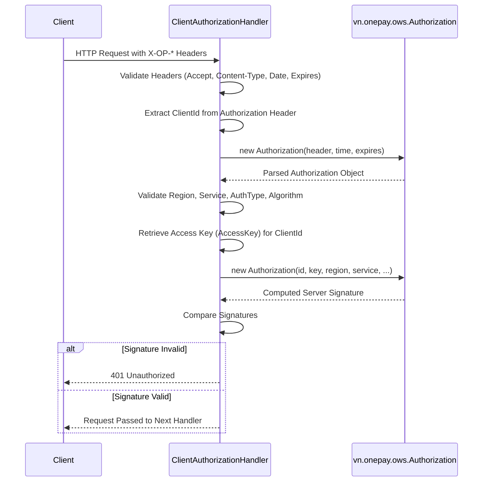

# Request Authentication (OWS1)

The PSP Connector authenticates incoming API requests using the **OWS1 (OnePay Web Service 1)** signature protocol. This mechanism ensures the integrity, authenticity, and freshness of every request received by the server.

## Overview

Authentication is handled by the `ClientAuthorizationHandler`, a Vert.x routing handler that intercepts all incoming requests before they reach the business logic. It verifies:
1.  **Request Freshness**: Ensures the request is not stale or replayed.
2.  **Service Identity**: Validates the target service, region, and authorization type.
3.  **Client Identity & Credentials**: Extracts the Client ID and retrieves the corresponding Access Key.
4.  **Signature Validity**: Recomputes the HMAC signature using the request details and compares it with the signature provided by the client.

## Authentication Flow

Caption: Client->>Handler: HTTP Request with X-OP-* Headers

## Required Headers

Every request must include the following HTTP headers:

| Header | Description | Example |
| :--- | :--- | :--- |
| `Accept` | Must be `application/json`. | `application/json` |
| `Content-Type` | Must be `application/json`. | `application/json` |
| `X-OP-Date` | Request timestamp in `yyyyMMdd'T'HHmmss'Z'` format. | `20231027T143000Z` |
| `X-OP-Expires` | Request expiration time (seconds). | `300` |
| `X-OP-Authorization` | The OWS1 authorization string containing the signature. | `Credential=.../...` |

## Configuration

The handler reads its configuration from `app.properties` (loaded via `Main.java`) to establish the expected service parameters:

*   `service.name`: The name of the service (e.g., `psp-connector-onecomm`).
*   `service.region`: The service region (e.g., `onepay`).
*   `service.authorization.type`: The expected authorization type (e.g., `ows1_request`).
*   `service.authorization.algorithm`: The expected algorithm (e.g., `OWS1-HMAC-SHA256`).
*   `access_key.<clientId>`: The secret access key used to verify the signature for a specific client.

## Error Handling

The handler throws specific exceptions for different failure scenarios:

*   `BadRequestException`: Thrown for missing or invalid headers (`INVALID_ACCEPT_HEADER`, `UNSUPPORTED_CONTENT_TYPE`, `INVALID_X_OP_DATE`, etc.).
*   `AuthorizationException`: Thrown for authentication failures (`INVALID_ACCESS_KEY`, `OPERATION_EXPIRED`, `INVALID_SERVICE_SIGNATURE`, etc.).

## Security Considerations

*   **Clock Skew**: While not explicitly handled in the basic validation, the `X-OP-Expires` header provides a window for request validity.
*   **Key Management**: Access keys are stored in the properties file and retrieved by Client ID. Ensure these keys are managed securely in production environments.
*   **Signature Algorithm**: The server strictly enforces the use of `OWS1-HMAC-SHA256` for signature generation.

## Implementation Details

*   **Entry Point**: `ClientAuthorizationHandler.handle(RoutingContext rc)` is registered as a global route handler in `PSPConnectorVertical`.
*   **Client ID Extraction**: The Client ID is extracted from the `X-OP-Authorization` header using the regex `Credential=([^/|?]+)/`.
*   **Signature Verification**: The server reconstructs the signature string using the request method, path, query parameters, signed headers, and body, then signs it with the retrieved Access Key.
