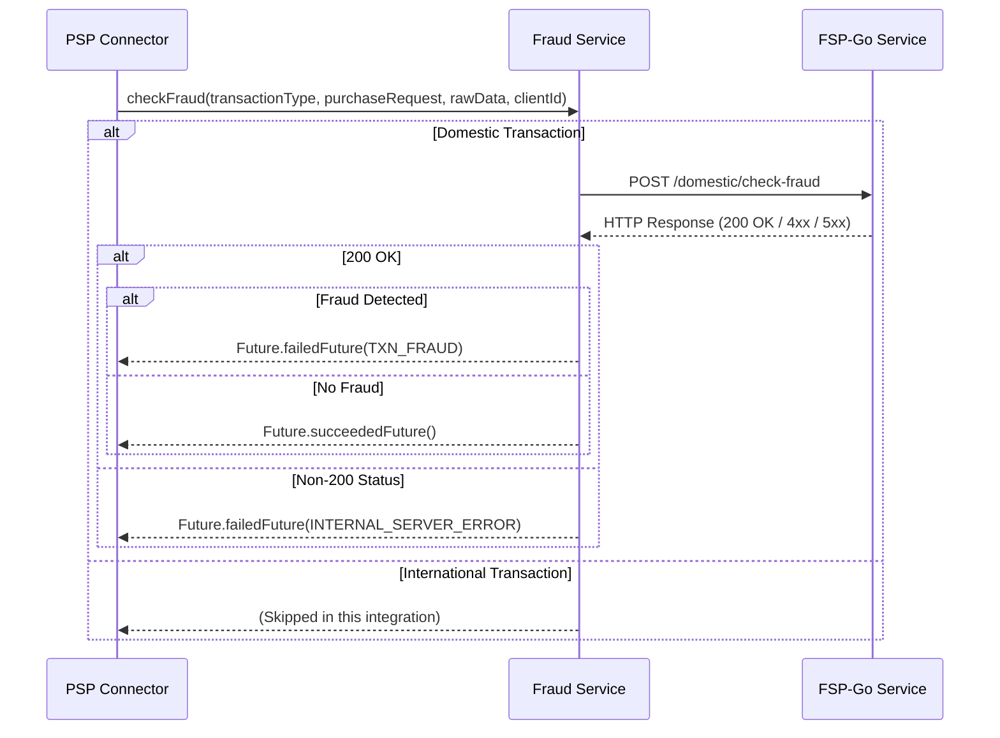

# Fraud Check Integration (FSP-Go)

## Overview

The fraud check integration with FSP-Go (Fraud Service Platform - Go) provides domestic transaction fraud detection within the PSP-Connector. The integration is implemented in `vn.onepay.pspconnector.provider.onecomm.Fraud` and configured via system properties in `vn.onepay.pspconnector.provider.onecomm.Config`.

## Responsibilities

1.  **Transaction Classification**: Determine if a transaction is eligible for fraud checking based on instrument type and brand ID.
2.  **Request Construction**: Assemble a detailed JSON payload containing transaction, customer, and instrument information.
3.  **Service Invocation**: Send authenticated HTTP requests to the FSP-Go service.
4.  **Response Handling**: Process the service response to either approve the transaction or flag it as fraudulent.

## Integration Flow



Caption: PSP->>Fraud: checkFraudtransactionType, purchaseRequest, rawData, clientId

## Configuration

The FSP-Go integration is configured via system properties, providing flexibility for different environments.

### Service Properties

| Property | Default Value | Description |
| :--- | :--- | :--- |
| `fsp-go.service.url` | `http://localhost/fsp/api/v2` | Base URL of the FSP-Go service |
| `fsp-go.service.check_fraud_method` | `POST` | HTTP method for fraud check requests |
| `fsp-go.service.timeout` | `60000` | Request timeout in milliseconds |

### Authentication Properties

| Property | Default Value | Description |
| :--- | :--- | :--- |
| `fsp-go.service.auth_client_id` | `PSP-CONNECTOR-ONECOMM` | Client ID for service authentication |
| `fsp-go.service.auth_client_key` | `98552C...` | Secret key for signing requests |
| `fsp-go.service.auth_region` | `onepay` | Region identifier |
| `fsp-go.service.auth_service` | `fsp-go` | Service identifier |

## Request Construction

### Domestic Transaction Payload

For domestic transactions, the system builds a comprehensive JSON payload containing:

-   **Payment Information**: Payment ID, merchant ID, transaction references, amount, currency, and status.
-   **Instrument Details**: Masked card number, card hash, card verification data, and instrument type.
-   **Customer Information**: Customer ID, name, email, phone, and IP address (extracted from raw data).
-   **Banking Data**: Bank ID, card verification codes, and authentication details.
-   **Raw Data**: Optional raw data from the original request (e.g., `vpc_TicketNo`, `vpc_Customer_Id`).

### Request Formatting

The request body is constructed using `JsonObjectBuilder` with the following structure:

```json
{
  "paymentId": "...",
  "merchantId": "...",
  "merchantTransRef": "...",
  "amount": 10000,
  "cardNo": "****1234",
  "cardNoHash": "hash...",
  "ipAddress": "...",
  "customerName": "...",
  "data": {
    "rawData": { ... }
  },
  "clientId": "...",
  "insType": "card"
}
```

## Request Handling

### HTTP Request Details

The `requestHttp` method handles the low-level HTTP communication:

1.  **URL Construction**: Combines base URL, path, and query parameters.
2.  **Headers**: Adds standard headers (`Content-Type`, `Accept`, `X-Op-Date`, `X-Op-Expires`).
3.  **Authentication**: Signs requests using `Authorization` with client ID, key, region, and service.
4.  **Execution**: Uses Vert.x `HttpClient` with configurable timeouts.

## Response Handling

### Decision Logic

The response handling is based on HTTP status codes and content:

| Status Code | Content Condition | Result | Action |
| :--- | :--- | :--- | :--- |
| 200 OK | `fraud` field length > 0 | **Fraud Detected** | `Future.failedFuture(TXN_FRAUD)` |
| 200 OK | `fraud` field empty or null | **No Fraud** | `Future.succeededFuture()` |
| Non-200 | N/A | **Service Error** | `Future.failedFuture(INTERNAL_SERVER_ERROR)` |

### Error Handling

-   **Network/Timeout**: Exceptions are caught and result in `INTERNAL_SERVER_ERROR`.
-   **Fraud Detected**: Transaction is rejected with a specific fraud error code.
-   **Service Unavailable**: Non-200 status codes trigger an internal server error response.

## Usage

The integration is invoked from `OnecommPaymentServiceProvider` during payment purchase operations.

### Invocation Points

1.  **Standard Purchase**: `paymentPurchase()` for card/NP_CARD ATM transactions.
2.  **Apple Pay Napas**: `applePayNapasPaymentPurchase()` for Apple Pay transactions via Napas.

### Integration Logic

```java
if (Fraud.isDomesticTransaction(instType, brandId)) {
    Promise<Void> pFraud = Promise.promise();
    Fraud.checkFraud("domestic", purchaseRequestMap, jRawData, clientId, pFraud);
    
    pFraud.future().onComplete(rs -> {
        if (rs.succeeded()) {
            // Proceed with card verification
            onecommVerifyCard(rc, jReq, merchant, paymentId, ...);
        } else {
            // Handle fraud or error
            throw new ErrorException(400, "FRAUD", "Txn is fraud", "", "");
        }
    });
}
```

## Related Pages

- [Purchase Workflow](/openwiki/workflows/purchase.md)
- [Authentication](/openwiki/concepts/authentication.md)
- [Error Handling](/openwiki/concepts/error-handling.md)
