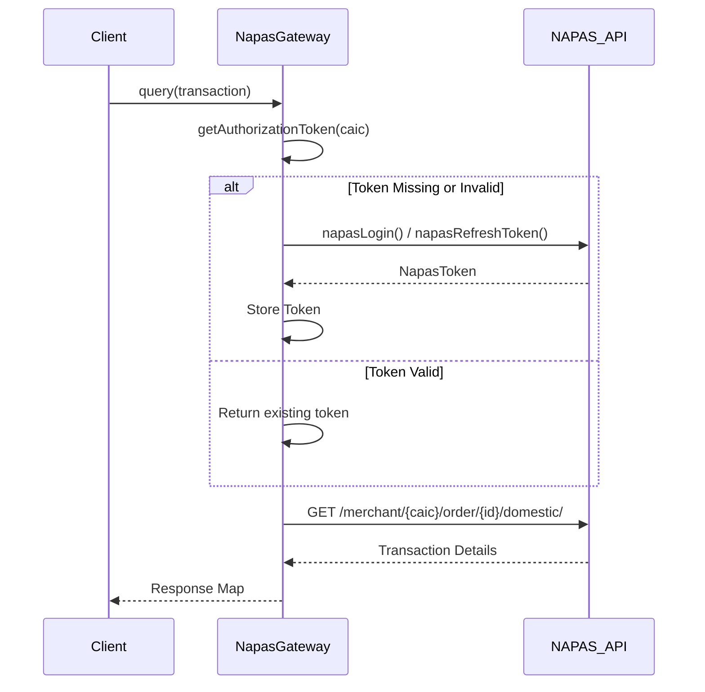

# NAPAS Gateway Integration

The NAPAS Gateway integration provides a direct interface to the NAPAS payment system for transaction querying and status resolution. It handles OAuth2 authentication, including login and token refresh flows, and manages the lifecycle of these tokens per merchant. Additionally, the gateway translates NAPAS-specific response and error codes into internal system statuses.

## Responsibilities

- **Authentication**: Manages OAuth2 login and token refresh processes to maintain valid sessions with the NAPAS API.
- **Token Management**: Securely stores and caches tokens per merchant CAIC, validating their expiry before use.
- **Transaction Querying**: Retrieves transaction details from NAPAS using merchant and order identifiers.
- **Error Handling**: Maps NAPAS response codes to internal status codes to ensure consistent transaction processing.

## Token Lifecycle

The gateway maintains a per-merchant token cache (`ConcurrentHashMap<String, NapasToken>`) to avoid redundant authentication calls. Before making an API request, it checks the validity of the existing token by decoding its JWT payload to verify the expiration time.

Caption: Client->>NapasGateway: querytransaction

## Error Mapping

NAPAS responses include specific `gatewayCode` strings that identify the nature of errors or statuses. `NapasGateway` translates these codes into internal status constants using pattern matching against predefined lists of error strings.

| Category | Example Codes | Internal Status |
|---|---|---|
| System Error | `BANK_ERROR`, `OTHER_ERROR` | `SYSTEM_ERROR` |
| Limit Exceeded | `CARD_LIMIT_EXCEEDED` | `LIMITED_AMOUNT` |
| Invalid Data | `INVALID_OTP`, `INVALID_CARDNAME` | `INVALID_OTP`, `INVALID_CARD_NAME` |
| Timeout | `EXPIRED_SESSION` | `TXN_TIMEOUT` |

## Implementation Details

The integration relies on the `NapasToken` class, which wraps the raw OAuth2 response and provides a helper method to check access token validity by parsing the JWT payload without external library dependencies.

### Usage in Payment Flow

The `NapasGateway` is invoked during transaction queries (e.g., in `OnecommPaymentServiceProvider.query`) to verify the final status of a transaction with the issuing bank (NAPAS), especially for Apple Pay and domestic card transactions where end-to-end status confirmation is required.
