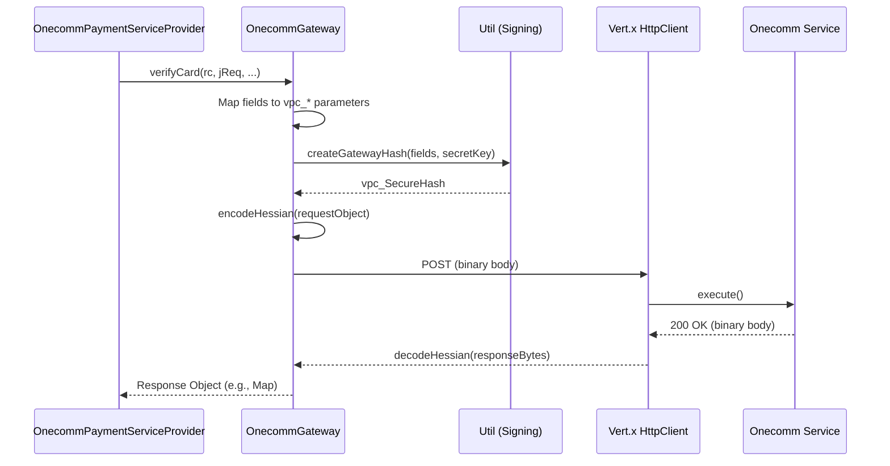

# Onecomm Gateway Integration

The Onecomm Gateway module is the transport and protocol layer between PSP-Connector and the downstream **Onecomm** payment service. It is responsible for:

*   **Service Communication**: Sending structured requests to the Onecomm backend and deserializing responses.
*   **Request Signing**: Generating HMAC-SHA256 security hashes (`SecureHash`) to authenticate requests.
*   **Protocol Encoding**: Marshalling Java objects into Hessian binary format for transmission.
*   **API Surface**: Exposing high-level static methods (`verifyCard`, `updateAuth`, `refund`) that abstract the raw HTTP details from the business logic in `OnecommPaymentServiceProvider`.

## Configuration

The gateway is configured via system properties (typically loaded from `app.properties`) defined in `vn.onepay.pspconnector.provider.onecomm.Config`.

| Property | Default | Description |
|---|---|---|
| `onecomm_service_url` | `http://localhost/onecomm-payservice/execute` | Base URL for the Onecomm payment service execution endpoint. |
| `onecomm_service_timeout` | `60000` | Timeout in milliseconds for service calls. |
| `uri_prefix` | `/psp/api/v1` | URI prefix for building PSP-Connector's own API links. |

**Evidence:** `repo://src/main/java/vn/onepay/pspconnector/provider/onecomm/Config.java#L12-L18`

## Request Signing

To ensure request integrity and authenticity, the gateway signs payment parameters using a shared merchant secret key.

1.  **Field Collection**: Relevant parameters (Access Code, Amount, Command, etc.) are collected into a map.
2.  **Sorting**: Fields are sorted alphabetically by key.
3.  **Concatenation**: Non-empty values are joined in the format `key=value&key=value`.
4.  **HMAC Generation**: The concatenated string is signed using **HMAC-SHA256** with the merchant's `hash_code`.
5.  **Attachment**: The resulting hex string is added to the request as `vpc_SecureHash`.

```java
// Simplified from Util.createGatewayHash
String data = sortedFields.stream()
    .filter(e -> e.getValue() != null)
    .map(e -> e.getKey() + "=" + e.getValue())
    .collect(Collectors.joining("&"));

Mac mac = Mac.getInstance("HMACSHA256");
mac.init(new SecretKeySpec(parseHexBinary(secretKey), "HMACSHA256"));
return printHexBinary(mac.doFinal(data.getBytes(UTF_8)));
```

**Evidence:** `repo://src/main/java/vn/onepay/pspconnector/provider/onecomm/Util.java#L56-L80`

## Transport Protocol

The gateway uses a custom binary protocol based on **Hessian** for communication with the Onecomm service, rather than standard REST/JSON.

*   **Request**: Java objects (e.g., `Map`, `RefundRequest`) are serialized using `ObjectOutputStream` and wrapped with a specific Hessian header structure (`0x63 0x02 ...`).
*   **Response**: The HTTP response body is deserialized back into Java objects using `ObjectInputStream`.
*   **HTTP Client**: Uses the Vert.x `HttpClient` (or `HttpsClient` based on URI scheme).



Caption: Provider->>Gateway: verifyCardrc, jReq, ...

## Core API Surface

The gateway exposes static methods that serve as the entry points for the provider layer.

### Card Verification & Authorization

*   **`verifyCard`**: Initiates a card verification transaction. It determines the bank ID, constructs the request, and handles the response which includes:
    *   **Redirect URLs**: For 3-D Secure or OTP validation.
    *   **Direct Approval**: For specific banks/methods.
    *   **Bank Selection**: Redirects to bank sites for banks not supported directly.
    *   **Apple Pay**: Special handling for `APPLEPAY_NAPAS` instrument types.
*   **`updateAuth`**: Completes an authorization challenge (e.g., submitting an OTP). It parses the verification code, confirms the transaction with Onecomm, and finalizes the payment state.
*   **`confirm`**: Internal method used to finalize authentication after valid challenge completion.

### Refunds

*   **`refund`**: Processes standard refunds.
*   **`refundExtend`**: Handles extended refund operations (often for auto-refunds with additional data).
*   **`refundNP`**: Handles NAPAS-specific refund requests.
*   **`refundApple`**: Dedicated method for Apple Pay refunds, using `AppleRefundConfirmReq`.

## Error Handling

The gateway translates Onecomm status codes into meaningful internal states:

*   **Success**: Status `1` usually indicates success, but context matters (e.g., `verifyMerchant` success leads to `verifyCard`).
*   **Fraud**: Status `2` is treated as a hard failure.
*   **Status Codes**: Numeric codes (e.g., `200`, `300`, `400`) from refund responses are mapped to `FAILED`, `PENDING`, or `APPROVED` by the calling provider.
*   **Exceptions**: Network errors or decoding failures throw `INTERNAL_SERVER_ERROR`. Bank-specific errors are mapped to generic PSP errors (e.g., `DECLINED`, `INVALID_OTP`).

**Evidence:** `repo://src/main/java/vn/onepay/pspconnector/provider/onecomm/OnecommGateway.java#L120-L160`
