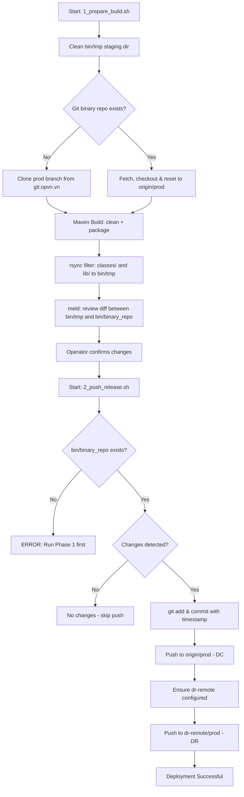

## Overview

The **Build & Release** pipeline for `psp-connector-onecomm` consists of two sequential shell scripts that compile the project with Maven, filter the resulting artifacts, and push the binary distribution to a Git-based repository for deployment to both Data Center (DC) and Disaster Recovery (DR) environments.

The process is split into two phases to allow manual verification between build preparation and release push:

1. **Phase 1 – Prepare Build** (`1_prepare_build.sh`)
2. **Phase 2 – Push Release** (`2_push_release.sh`)

---

## Phase 1: Prepare Build (`1_prepare_build.sh`)

This script handles cleaning, cloning/updating the binary repository, executing the Maven build, and staging artifacts for release.

### Steps

| Step | Action |
|------|--------|
| 1 | Clean and recreate the temporary staging directory (`bin/tmp`). |
| 2 | Clone or update the Git binary repository (`bin/binary_repo`) on the `prod` branch. If already cloned, fetches latest and resets to `origin/prod`. |
| 3 | Execute `mvn clean` followed by `mvn -U package` using JDK 11 (`JAVA_HOME=/usr/java/jdk-11`). |
| 4 | Use `rsync` to filter artifacts from `target/` into the staging directory, keeping only `classes/` and `lib/` directories. |
| 5 | Open `meld` (visual diff tool) to compare staging directory with the Git binary repository, allowing the operator to review changes before release. |

### Key Directories

- **`bin/tmp`** – Temporary staging directory for filtered build artifacts.
- **`bin/binary_repo`** – Local clone of the Git binary repository targeting the `prod` branch.
- **`target/`** – Maven build output directory containing compiled classes and dependencies.

### Artifact Filtering

The `rsync` command in step 4 selectively copies only runtime artifacts:

- `target/classes/` → compiled `.class` files and copied resources
- `target/lib/` → all runtime dependency JARs (copied by `maven-dependency-plugin`)

All other Maven build artifacts (source files, POM metadata, etc.) are excluded from the distribution.

---

## Phase 2: Push Release (`2_push_release.sh`)

This script commits the staged artifacts and pushes them to the primary and disaster recovery Git remotes.

### Steps

| Step | Action |
|------|--------|
| 1 | Verify that the binary Git repository directory exists (fails if Phase 1 has not been run). |
| 2 | Check `git status` for changes; reports if nothing is new. |
| 3 | Stage all changes (`git add .`) and commit with a timestamped message. |
| 4 | Push to `origin/prod` (primary Data Center). |
| 5 | Ensure the `dr-remote` is configured, then push to `dr-remote/prod` (Disaster Recovery site). |

### Remote Configuration

| Remote | URL Pattern |
|--------|-------------|
| `origin` | `git.opvn.vn/deploy/psp-connector-onecomm.git` (set during clone in Phase 1) |
| `dr-remote` | `git-dr.opvn.vn/deploy/psp-connector-onecomm.git` (managed by this script) |

The `dr-remote` is automatically created if missing, or updated if the URL has changed.

---

## Maven Build Configuration (`pom.xml`)

The project is built with Maven using JDK 11, with tests skipped (`<skipTests>true</skipTests>`).

### Build Plugins

| Plugin | Purpose |
|--------|---------|
| `maven-dependency-plugin` (3.1.1) | Copies runtime dependencies to `target/lib/` during `prepare-package` phase. |
| `maven-resources-plugin` (3.1.0) | Copies resources from `src/main/resources/` to `target/classes/` during `compile` phase. |

### Notable Dependencies

| Dependency | Version | Purpose |
|------------|---------|---------|
| `vn.onepay:error` | 1.0.20191105 | OnePAY error handling |
| `vn.onepay:dbcm-sdk` | 1.0.20260728 | Database connection management |
| `com.oracle.database.jdbc:ojdbc8` | 19.7.0.0 | Oracle JDBC driver |
| `org.apache.logging.log4j:*` | 2.25.4 | Logging framework |
| `io.vertx:vertx-web` | 3.9.4 | Vert.x web server |
| `io.vertx:vertx-mail-client` | 3.9.4 | Vert.x email client |
| `io.netty:netty-all` | 4.1.53.Final | Network framework |
| `com.fasterxml.jackson.core:*` | 2.11.3 | JSON processing |
| `vn.onepay:ows` | 1.0.20180528 | OnePAY Web Services / Signature |
| `vn.onepay:secure-config-lib` | 1.0.20250925 | Secure configuration library |

---

## Release Flow Diagram

Caption: A[Start: 1_prepare_build.sh] --> B[Clean bin/tmp staging dir]

---

## Operational Notes

- **Manual gating**: The `meld` step in Phase 1 provides a visual review point before artifacts are committed and pushed.
- **Target branch**: Both scripts target the `prod` branch exclusively.
- **Test execution**: Unit tests are skipped during the build (`<skipTests>true</skipTests>`).
- **JDK requirement**: The build requires JDK 11 at `/usr/java/jdk-11`.
- **Idempotency**: Phase 1 safely handles both fresh clones and existing repository states; Phase 2 gracefully reports when no changes are detected.
- **Error handling**: Both scripts exit with status 1 on critical failures (clone errors, push failures) and print diagnostic messages.
