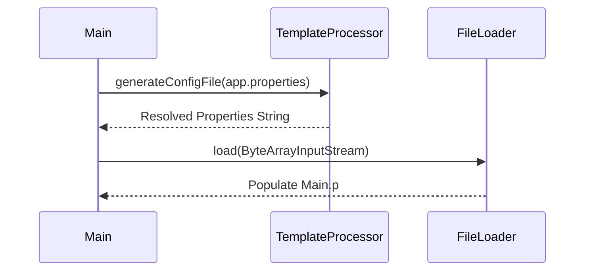

# Configuration & Properties

The PSP Connector OneComm service relies on a two-tier configuration strategy: a templated properties file for static and secret values, and a static facade class for runtime-adjustable provider endpoints.

## Startup Configuration Loading

At startup, the application reads the primary configuration file, `src/main/resources/app.properties`. Because this file contains sensitive credentials, it is not loaded directly. Instead, `Main.java` utilizes a `TemplateProcessor` to resolve secure placeholders before populating the global `Main.p` properties object.

Caption: Main->>TemplateProcessor: generateConfigFileapp.properties

*The startup sequence for loading and resolving configuration.*

## Secure Templating

Secrets are referenced in `app.properties` using the Mustache-like syntax `{{ path/to/secret }}`. This allows the repository to store non-sensitive configuration structure while deferring secret injection to a secure deployment environment.

Examples of templated values include:
- **Database Credentials**: `{{ psp-connector-onecomm/config/database_username }}`
- **Service Keys**: `{{ psp-connector-onecomm/config/onesm_service_client_key }}`
- **Access Tokens**: `{{ psp-connector-onecomm/config/access_key_tsp }}`

## Provider-Specific Configuration

While `Main.p` holds the bulk of the application settings, the `vn.onepay.pspconnector.provider.onecomm.Config` class provides a specialized facade for the OneComm provider. This class reads values from Java **System Properties**, allowing runtime overrides without modifying the properties file.

| Config Method | System Property | Default Value |
| :--- | :--- | :--- |
| `getUriPrefix()` | `uri_prefix` | `/psp/api/v1` |
| `getOnecommServiceUrl()` | `onecomm_service_url` | `http://localhost/onecomm-payservice/execute` |
| `getOnecommServiceTimeout()` | `onecomm_service_timeout` | `60000` |
| `getFspGoUrl()` | `fsp-go.service.url` | `http://localhost/fsp/api/v2` |
| `getFspGoAuthClientId()` | `fsp-go.service.auth_client_id` | `PSP-CONNECTOR-ONECOMM` |

## Configuration Domains

The application configuration is organized into several logical domains:

- **Server**: Network binding, port, and thread pool settings (e.g., `server.host`, `server.port`).
- **Database**: Oracle JDBC URLs and HikariCP pool settings (e.g., `database.url`, `database.max.pool.size`).
- **OneComm Statuses**: A mapping of numeric response codes to internal status names and descriptions (e.g., `onecomm.status.1.code`).
- **Refund Rules**: Bank-specific refund processing modes (`auto`, `manual`, `not_support`).
- **Napas**: Integration settings for the Napas payment gateway, including OAuth credentials.
