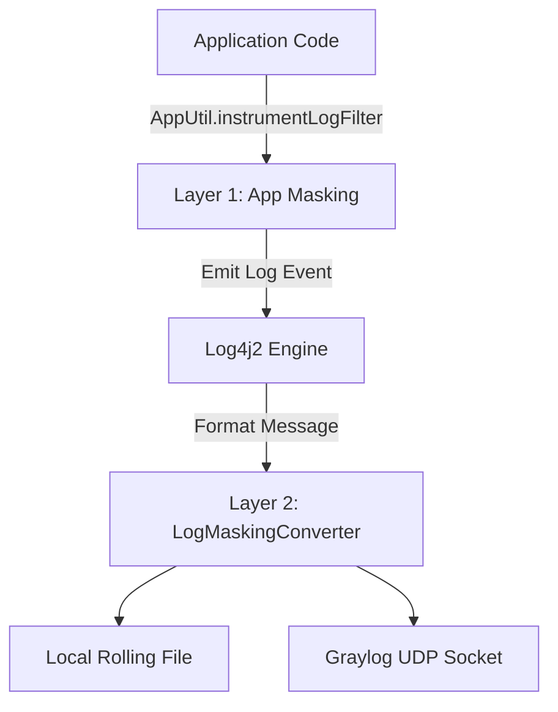

# Logging & Masking

The PSP Connector OneComm service implements a comprehensive logging strategy that ensures operational visibility while strictly adhering to security standards for handling sensitive payment data. The system combines centralized configuration, automated data masking at the application level, and integration with both local files and a centralized log aggregation service (Graylog).

## Architecture Overview

The logging architecture is built upon **Log4j2** (v2.25.4) and features a two-layer masking approach:
1.  **Application-Level Masking**: Programmatically applied via `AppUtil.instrumentLogFilter` in Java code before log statements are emitted.
2.  **Conversion-Level Masking**: Applied via a custom Log4j2 converter (`LogMaskingConverter`) that processes the final message string just before output.

Caption: App[Application Code] -->|AppUtil.instrumentLogFilter| Mask1[Layer 1: App Masking]

*The dual-layer masking flow ensuring data protection before log emission.*

## Log4j2 Configuration

The central configuration resides in `src/main/resources/log4j2.xml`. It defines the logging rules, appenders (outputs), and logger hierarchies.

### Appenders

The application uses three distinct appenders:

1.  **Console**: Used for development/debugging (currently commented out in the root logger).
    *   **Target**: `SYSTEM_OUT`
    *   **Format**: `%d{HH:mm:ss.SSS} [%t] %-5level %logger{36} - %spi%n`
2.  **RollingFile**: The primary persistence mechanism for application logs.
    *   **Target**: File path defined by the `log` system property (`${sys:log}`).
    *   **Policy**: Time-based rotation (daily).
    *   **Format**: Includes Thread Name (`%t`), Level, Logger, and Trace Context (`[%X{trace_id}-%X{span_id}-%X{trace_flags}]`) for distributed tracing support.
3.  **Graylog**: A Socket appender for centralized log aggregation.
    *   **Target**: UDP connection to `${graylog_ip}:1518`.
    *   **Format**: CSV-like structured format optimized for GELF ingestion, including `server_ip` and environment variables (`${env:app}`).

### Logger Configuration

*   **AsyncRoot**: Configured at `info` level.
*   **AsyncLoggers**: Explicit loggers for `vn.onepay` and `com.onepay` packages at `info` level to ensure high-throughput asynchronous logging.

## Data Masking Strategies

Sensitive data protection is achieved through two complementary mechanisms.

### 1. Programmatic Masking (`AppUtil`)

The `AppUtil.instrumentLogFilter` method is called explicitly in critical code paths (Request/Response handlers, Gateway integrations) to sanitize payloads *before* they are passed to the logger.

*   **Location**: `vn.onepay.pspconnector.common.util.AppUtil`
*   **Scope**: Masks specific patterns in JSON payloads, specifically targeting:
    *   Account numbers (e.g., `accountNumber`)
    *   Card numbers (e.g., `card_no`, `vpc_CardNum`)
    *   Card expiration dates
    *   CVV codes

### 2. Log Pattern Masking (`LogMaskingConverter`)

The `LogMaskingConverter` acts as a safety net, intercepting the final log message and applying regex-based masking. This is configured via the `%spi` and `%trscId` pattern keys in `log4j2.xml`.

*   **Location**: `vn.onepay.pspconnector.LogMaskingConverter`
*   **Mechanism**: A custom Log4j2 `PatternConverter` plugin.
*   **Capabilities**: Extensive regex coverage for various sensitive fields including:
    *   **Payment Instruments**: Card numbers, CVV (CVC), ICVV, Token Numbers, Primary Account Numbers (PAN).
    *   **Personal Identifiable Information (PII)**: Email addresses, Phone numbers.
    *   **Security Codes**: Expiration dates, Account numbers.

## Log Flow Execution

1.  **Event Emission**: An application component (e.g., `PurchaseHandler`) calls `logger.info(...)`.
2.  **Masking Check**: If `AppUtil.instrumentLogFilter` was used, the message is already partially sanitized.
3.  **Conversion**: When Log4j2 processes the pattern, it invokes `LogMaskingConverter` via the `%spi` token.
    *   The converter's `format()` method retrieves the message.
    *   It applies the `mask()` method, which runs a chain of `replaceAll` operations using complex regex patterns to identify and redact sensitive data fields (e.g., replacing middle digits of card numbers with `*`).
4.  **Dispatch**: The fully masked message is dispatched to the configured appenders (File, Graylog, Console).

## Security & Compliance

*   **PCI DSS Alignment**: The masking logic specifically targets card data (PAN, CVV, Track Data equivalents) to reduce the scope of cardholder data environments.
*   **Regex Precision**: The masking patterns are tuned to recognize various key-value formats (JSON, query parameters, XML attributes) to ensure data is masked regardless of the message format.
*   **Traceability**: Despite masking, logs retain sufficient context (trace IDs, operation names, masked partial values) for debugging and auditing without exposing raw secrets.
