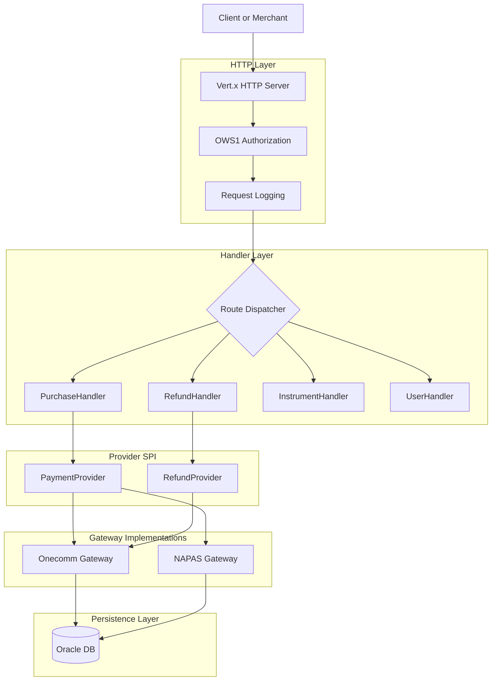

# Quickstart

PSP-Connector is a Java application that serves as a bridge between merchants and payment service providers (PSPs). It handles payment processing, instrument registration, refunds, and user management, exposing a secure RESTful API.

## System Overview

The system is built on **Eclipse Vert.x**, providing a high-performance, non-blocking HTTP server. It uses an **Oracle database** for persistence and supports a pluggable architecture for integrating with different payment gateways (currently **Onecomm** and **NAPAS**).

### Key Capabilities

*   **Payment Processing**: Supports purchase transactions, including standard card payments and Apple Pay via NAPAS.
*   **Instrument Management**: Handles card registration and verification.
*   **Refund Workflows**: Supports multiple refund types (standard, manual, automatic, NAPAS-specific).
*   **User Management**: User registration and token management.
*   **Security**: Requests are authenticated using the OWS1 signature protocol.

## Runtime Architecture

The application follows a layered architecture:

1.  **HTTP Layer**: Vert.x HTTP server with global middleware for security, logging, and request processing.
2.  **Handler Layer**: Stateless handlers that validate input and delegate to the provider SPI.
3.  **Provider SPI**: Abstract interfaces (`PaymentServiceProvider`, `RefundServiceProvider`) that decouple the handlers from specific gateway implementations.
4.  **Service Layer**: Database services that manage persistence via stored procedures.
5.  **Provider Implementations**: Concrete implementations (e.g., `OnecommPaymentServiceProvider`) that interact with specific payment gateways (Onecomm, NAPAS, FSP-Go).



Caption: Client[Client or Merchant] --> HTTP[Vert.x HTTP Server]

Caption: Layered runtime flow from the client HTTP request through authorization, handlers, provider SPI, and gateway implementations into the Oracle database.

## Navigation Paths

Based on your interest, you can dive deeper into specific areas:

*   **Architecture**:
    *   [HTTP Server & Routing](architecture/server.md): How the Vert.x server is set up and requests are routed.
    *   [Database & Persistence](architecture/data-access.md): Oracle database layer and stored procedures.
    *   [Provider SPI](architecture/provider-spi.md): How the payment provider abstraction works.
*   **Concepts**:
    *   [Request Authentication](concepts/authentication.md): OWS1 signature verification.
    *   [Error Handling](concepts/error-handling.md): Global exception handling and error models.
*   **Integrations**:
    *   [Onecomm Gateway](integrations/onecomm-gateway.md): Integration with the Onecomm payment gateway.
    *   [NAPAS Gateway](integrations/napas-gateway.md): Integration with the NAPAS payment network.
*   **Workflows**:
    *   [Purchase](workflows/purchase.md): End-to-end purchase flow.
    *   [Refund](workflows/refund.md): Different refund flows (standard, manual, NAPAS).
*   **Operations**:
    *   [Configuration](operations/configuration.md): Environment properties and setup.
    *   [Logging & Masking](operations/logging.md): Logging setup and sensitive data masking.

## Build & Run

The application is built using **Maven**. The entry point is `vn.onepay.pspconnector.Main`.

```bash
# Build the application
mvn clean package

# Run the application
java -jar target/psp-connector-onecomm.jar
```

Refer to the [Build & Release](operations/build-and-release.md) page for detailed instructions.
