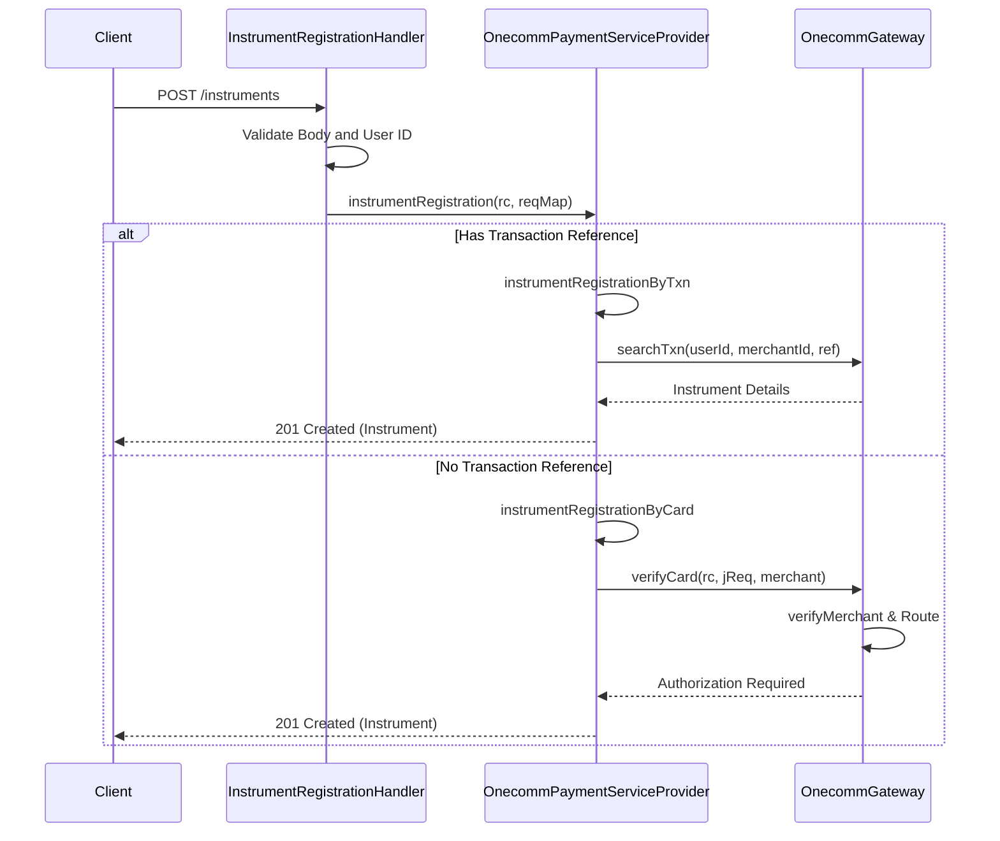
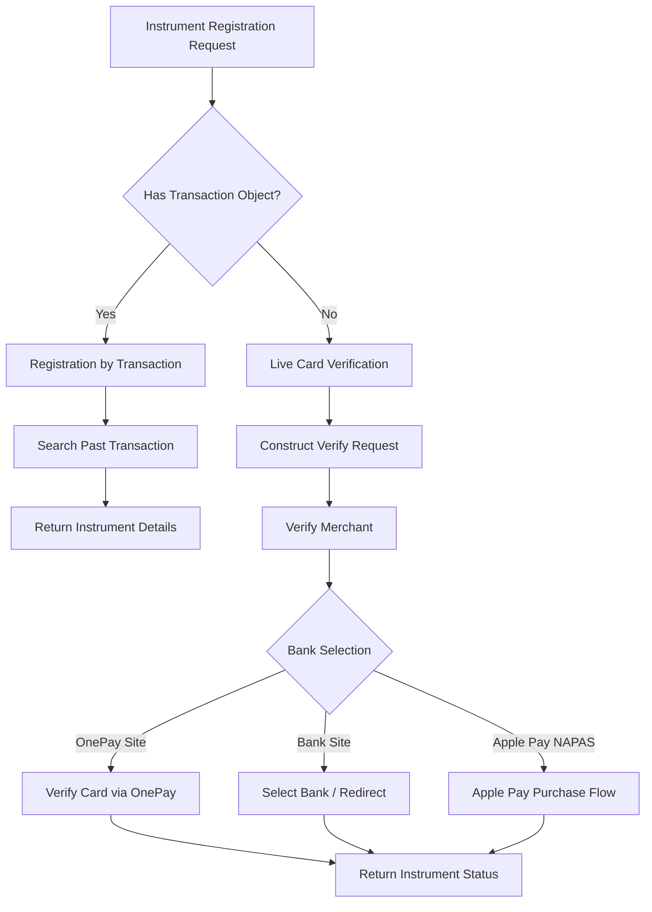

# Instrument Verification Workflow

This page documents the end-to-end flow for verifying and registering payment instruments in the PSP-Connector system. The workflow handles two primary paths: registering instruments via a successful past transaction or performing a live card verification (including Apple Pay) through the Onecomm gateway.

## Entry Points

The process is initiated via an HTTP `POST` request to the `/instruments` endpoint, handled by `InstrumentRegistrationHandler`.

### 1. Request Validation

`InstrumentRegistrationHandler` extracts the request body and delegates to `OnecommPaymentServiceProvider.instrumentRegistration`.

-   **User ID**: Required.
-   **Request Body**: Must not be empty.

Caption: Client->>Handler: POST /instruments

**Evidence:**
- `repo://src/main/java/vn/onepay/pspconnector/server/handler/instrument/InstrumentRegistrationHandler.java#L21-L34`
- `repo://src/main/java/vn/onepay/pspconnector/server/routing/PSPConnectorVertical.java#L111`

## Flow Branching

`OnecommPaymentServiceProvider` inspects the request payload to determine the registration strategy:

1.  **Lookup by Transaction**: If a `transaction` object is present, the system retrieves instrument details from an existing successful payment.
2.  **Live Verification**: If no transaction reference is provided, the system proceeds with a live card verification flow involving a nominal (5000 VND) test transaction.

Caption: A[Instrument Registration Request] --> B{Has Transaction Object?}

## 1. Registration by Transaction

This path uses data from a previously completed transaction to populate the instrument details.

1.  **Search**: Calls `OnecommGateway.searchTxn` to find the transaction by `merchantId` and `merchantTxnRef`.
2.  **Validation**:
    *   The transaction must exist.
    *   The transaction state must be `APPROVED` (status 300 or 400).
3.  **Mapping**:
    *   Extracts `instrument` details (Type, Number, Expiry Year) from the payment record.
    *   Normalizes the expiry year format (e.g., `25` -> `2025`).
4.  **Response**: Returns a `201 Created` response with the instrument details and status.

**Evidence:**
- `repo://src/main/java/vn/onepay/pspconnector/provider/onecomm/OnecommPaymentServiceProvider.java#L80-L126`
- `repo://src/main/java/vn/onepay/pspconnector/provider/onecomm/OnecommGateway.java#L1200-L1217`

## 2. Live Card Verification

This path validates the card details by initiating a small transaction with the Onecomm gateway.

### 2.1 Request Construction

The provider constructs a verification request (`jReq`) with:
-   **Amount**: Fixed at `5000` (representing 50.00 VND nominal charge for verification).
-   **Instrument**: Card details (Type, Number, Name, Expiry, CVV).
-   **Return URL**: A dummy URL (`http://mpay.return.url`), as this is a background verification.

Special handling exists for specific banks:
-   **Oceanbank**: Forces `ATM` card type and `SMS` authorization.
-   **VPBank**: Updates the mobile number to a specific format.

**Evidence:**
- `repo://src/main/java/vn/onepay/pspconnector/provider/onecomm/OnecommPaymentServiceProvider.java#L130-L167`

### 2.2 Merchant Verification (Gateway Layer)

`OnecommGateway.verifyMerchant` performs the initial security and bank eligibility check.

1.  **Signing**: Generates a `SecureHash` using HMAC-SHA256.
2.  **Service Call**: Sends a `VERIFY_MERCHANT` request to Onecomm.
3.  **Bank ID Resolution**: Maps the instrument type and number to a specific `bankId` using a large bank registry logic.
4.  **Eligibility Check**: Ensures the `bankId` is in the merchant's allowed bank list.

**Evidence:**
- `repo://src/main/java/vn/onepay/pspconnector/provider/onecomm/OnecommGateway.java#L57-L159`

### 2.3 Routing Logic

Based on the `bankId` and `cardSite` determined during merchant verification:

-   **OnePay Site**: If `cardSite` is "ONEPAY" (default for most banks), the verification continues through `OnecommGateway.verifyCard`. This flow is used when card details are entered on OnePay's platform.
-   **Bank Site**: If `cardSite` is "BANK" (e.g., Techcombank, DongABank, CUP, VietBank, ViettelPay), `OnecommGateway.selectBank` is called, which returns a redirect URL to the issuing bank's verification page.
-   **Apple Pay NAPAS**: Special handling for Apple Pay tokens via the `applePayPurchase` flow.

**Evidence:**
- `repo://src/main/java/vn/onepay/pspconnector/provider/onecomm/OnecommGateway.java#L140-L158`
- `repo://src/main/java/vn/onepay/pspconnector/provider/onecomm/OnecommGateway.java#L1641-L1643`

### 2.4 Card Verification Result

`OnecommGateway.verifyCard` processes the verification response from the bank/Onecomm.

-   **Success / Authorization Required**: Marks the instrument as `APPROVED` (state = `AUTHORIZATION_REQUIRED`).
    *   **OTP Handling**: Sets the authorization state to `created` or `pending` based on whether OTP is entered on OnePay or the bank site.
-   **Fraud / Error**: Marks the instrument as `FAILED` with a reason code.

The final status is returned to `OnecommPaymentServiceProvider`, which updates the instrument state and responds to the client.

**Evidence:**
- `repo://src/main/java/vn/onepay/pspconnector/provider/onecomm/OnecommGateway.java#L239-L400`
- `repo://src/main/java/vn/onepay/pspconnector/provider/onecomm/OnecommPaymentServiceProvider.java#L170-L186`

## Response Handling

Both paths conclude with a response containing the instrument state:

-   **APPROVED**: The instrument is successfully verified/registered.
-   **FAILED**: Verification failed due to invalid details, bank errors, or fraud detection.

The response includes the masked card number (e.g., `123456xxxxxxx789`) for secure display.
