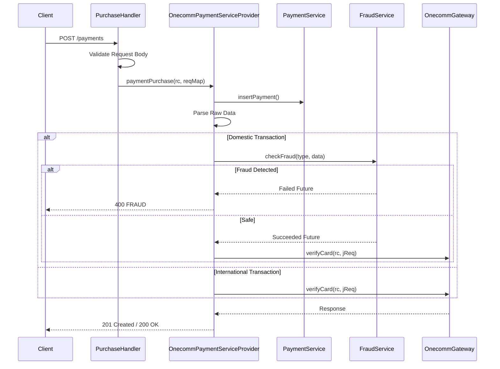
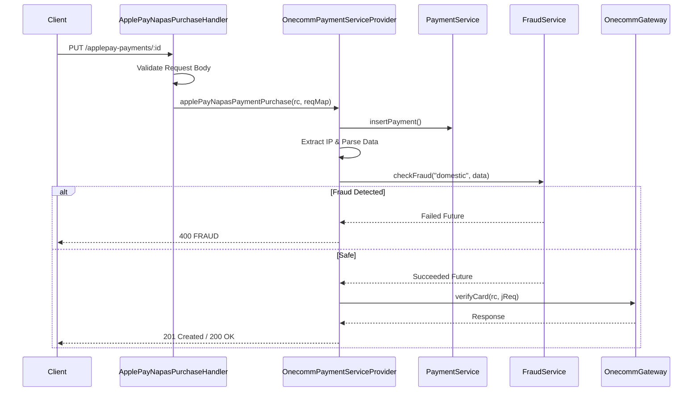

# Purchase Workflow

The purchase workflow handles payment initiation requests within the PSP-Connector. It supports two primary flows:

1.  **Standard Card Payments**: For traditional card transactions (domestic and international).
2.  **Apple Pay NAPAS**: For Apple Pay transactions processed via the NAPAS payment gateway.

Both flows share a common entry point pattern: **HTTP Handler -> Validation -> Service Provider Delegation -> Fraud Check (Conditional) -> Gateway Interaction -> Response**.

## Standard Card Purchase Flow

### Entry Point

Standard purchase requests are routed to `PurchaseHandler` via the `POST /payments` or `PUT /payments/:id` endpoints.

**Route Registration:**
```java
router.post(apiPrefix + PAYMENTS).handler(PurchaseHandler::handle);
router.put(apiPrefix + PAYMENTS + "/:id").handler(PurchaseHandler::handle);
```

### Request Validation

The `PurchaseHandler` validates the incoming request body for:
*   **Non-empty body**: Ensures request data exists.
*   **Merchant ID**: Must be present.
*   **Amount**: Must be greater than zero.
*   **Currency**: Must be present.
*   **Instrument**: Payment instrument details must be present.

### Processing Logic

Once validated, the handler delegates to `OnecommPaymentServiceProvider.paymentPurchase()`.

**Key Steps:**
1.  **Parameter Extraction**: Extracts merchant, user, instrument, and transaction details from the request.
2.  **Instrument Normalization**: Applies specific fixes for certain banks (e.g., OceanBank, VPBank) to ensure correct instrument types and mobile number formats.
3.  **Payment Record Creation**: Inserts a new payment record into the local database via `PaymentService.insert()`.
4.  **Raw Data Handling**: Decodes and parses raw data (potentially Base64 encoded) for fraud analysis.
5.  **Fraud Check**:
    *   Determines if the transaction is "domestic" based on `instType` and `brandId`.
    *   If domestic, invokes `Fraud.checkFraud()` asynchronously.
    *   If fraud is detected, the transaction is rejected immediately.
    *   If no fraud, proceeds to verification.
6.  **Gateway Verification**: Calls `OnecommGateway.verifyCard()` to initiate the transaction with the upstream PSP (OneComm).



Caption: Client->>Handler: POST /payments

## Apple Pay NAPAS Purchase Flow

### Entry Point

Apple Pay NAPAS requests are routed to `ApplePayNapasPurchaseHandler` via the `PUT /applepay-payments/:id` endpoint.

**Route Registration:**
```java
router.put(apiPrefix + APPLE_PAYMENTS + "/:id").handler(ApplePayNapasPurchaseHandler::handle);
```

### Request Validation

The handler validates:
*   **Non-empty body**.
*   **Merchant ID**.
*   **Amount**: Greater than zero.
*   **Currency**.
*   **Instrument**: Specifically checks for Apple Pay instrument data.

### Processing Logic

Delegates to `OnecommPaymentServiceProvider.applePayNapasPaymentPurchase()`.

**Key Steps:**
1.  **Parameter Extraction**: Similar to standard purchase, but includes Apple Pay specific fields like `payment_method` and `payment_data_decrypt`.
2.  **IP Address Extraction**: Extracts the client IP (`vpc_TicketNo`) from the raw data.
3.  **Payment Record Creation**: Creates a local payment record.
4.  **Mandatory Fraud Check**: Unlike standard purchases, Apple Pay NAPAS transactions **always** undergo fraud checking via `Fraud.checkFraud("domestic", ...)`.
5.  **Gateway Verification**: Calls `OnecommGateway.verifyCard()` with the Apple Pay specific payload.



Caption: Client->>Handler: PUT /applepay-payments/:id

## Component Responsibilities

### Handlers
*   **PurchaseHandler**: Entry point for standard card purchases. Validates request and delegates.
*   **ApplePayNapasPurchaseHandler**: Entry point for Apple Pay NAPAS. Validates request and delegates.
*   **PurchaseGetHandler**: Handles `GET /payments/:id` to retrieve payment status/details.

### Service Provider
*   **OnecommPaymentServiceProvider**: Orchestrates the purchase logic. Manages payment creation, fraud check coordination, and gateway communication.
    *   `paymentPurchase()`: Standard card flow.
    *   `applePayNapasPaymentPurchase()`: Apple Pay NAPAS flow.

### Gateways
*   **OnecommGateway**: Communicates with the OneComm PSP backend for payment verification and authorization.
*   **Fraud Service**: External service integration for detecting fraudulent transactions.

### Database
*   **PaymentService**: Manages payment records (CRUD operations).
*   **DB**: Handles retrieval of merchant configurations and transaction extensions.

## Failure Handling

*   **Validation Errors**: Handlers throw `BadRequestException` with specific error codes (e.g., `INVALID_MERCHANT`, `INVALID_AMOUNT`).
*   **Fraud Detection**: Transactions identified as fraudulent are rejected with a `FRAUD` error code.
*   **Gateway Errors**: Upstream errors from OneComm are propagated back to the client, often wrapped in `SystemException` or `ErrorException`.
*   **Database Errors**: Handled by global exception handlers, returning generic internal server errors.

## Configuration

Key configuration properties are loaded from `app.properties` (processed by `TemplateProcessor`):
*   `onepay.psp.id`: The PSP ID used for OneComm.
*   `verify_card.merchant_id`: Merchant ID used for card verification.
*   `verify_card.access_code`: Access code for verification merchant.
*   `verify_card.hash_code`: Hash code for verification merchant.

## Related Pages

*   [Fraud Check Integration](/openwiki/integrations/fraud-check.md)
*   [Instrument Verification](/openwiki/workflows/instrument-verification.md)
