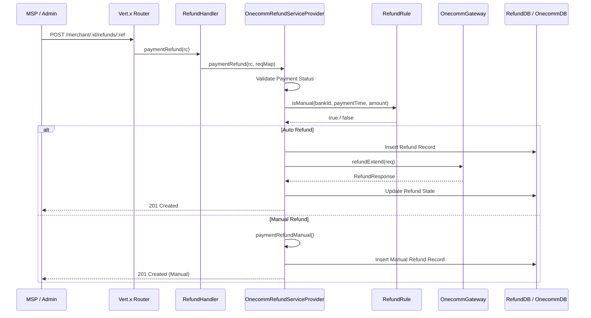

# Refund Workflow

The refund workflow manages the reversal of payment transactions within the PSP-Connector. It supports multiple processing modes (Standard, NAPAS, Manual, Auto, and Apple Pay) and interacts with downstream banking systems via the OneComm gateway.

## Overview

Refunds are initiated via HTTP endpoints and handled by the `RefundHandler` and `AppleRefundPostHandler`. The core logic resides in `OnecommRefundServiceProvider`, which determines whether a refund can be processed automatically or requires manual intervention based on bank-specific rules.

## Flows

1.  **Standard Refund**: The primary flow for most domestic and international banks. It checks eligibility (timeframe, previous refunds) via `RefundRule` and routes to either Auto or Manual processing.
2.  **NAPAS Refund**: A specialized flow for NAPAS-connected banks, using the `refundNP` gateway method.
3.  **Apple Pay Refund**: Handles refunds for Apple Pay transactions via the `applePaymentRefund` method.
4.  **Manual Refund**: A fallback flow for transactions that cannot be automated (e.g., expired timeframes, unsupported auto-refund banks).

## Routing

Refund endpoints are registered in `PSPConnectorVertical`:

Caption: Client->>Router: POST /merchant/:id/refunds/:ref

## Entry Points

### Standard Refund (RefundHandler)

*   **Route**: `POST /merchant/:merchant_id/refunds/:merch_txn_ref`
*   **Handler**: `RefundHandler::paymentRefund`
*   **Logic**: The main entry point for standard refunds. It delegates to `OnecommRefundServiceProvider.paymentRefund()`.

### NAPAS Refund

*   **Route**: `POST /refund_napas`
*   **Handler**: `RefundHandler::paymentNPRefund`
*   **Logic**: Specifically for NAPAS transactions. Validates the bank ID against the NAPAS bank list in configuration and calls `OnecommGateway.refundNP()`.

### Manual Refund

*   **Route**: `POST /merchant/:merchant_id/refunds_manual/:merch_txn_ref`
*   **Handler**: `RefundHandler::paymentRefundManual`
*   **Logic**: Directly processes a refund as "Manual", bypassing the auto-check logic. This is often used when the MSP has already handled the bank interaction externally.

### Auto Refund

*   **Route**: `POST /merchant/:merchant_id/refunds_auto/:merch_txn_ref`
*   **Handler**: `RefundHandler::paymentRefundAuto`
*   **Logic**: Forces an automatic refund attempt. Fails if the bank is not configured for auto refunds.

### Update Refund (Status Update)

*   **Route**: `PATCH /merchant/:merchant_id/refunds/:merch_txn_ref`
*   **Handler**: `RefundHandler::updateRefund`
*   **Logic**: Updates the status of an existing refund (e.g., from `Pending` to `Approved` or `Failed`). Used when manual processing is completed or to correct status.

### Apple Pay Refund

*   **Route**: `POST /refunds2` (or similar configured path)
*   **Handler**: `AppleRefundPostHandler::handle`
*   **Logic**: Delegates to `OnecommPaymentServiceProvider.applePaymentRefund()`. Uses `OnecommGateway.refundApple()`.

## Core Components

### RefundRule

Determines whether a refund is eligible for automatic processing (`Auto`) or requires manual intervention (`Manual`).

*   **File**: `vn/onepay/pspconnector/common/rulerefund/RefundRule.java`
*   **Method**: `isManual(...)`
*   **Logic**:
    *   Checks `refund.bank.{bankId}` configuration.
    *   **BIDV (Bank ID 19)**: Auto if refund is within 180 days; otherwise Manual.
    *   **MBBank (Bank ID 8)**: Checks for `mbbank_txn_info` in `jData` to determine eligibility.
    *   **AnBinhBank (15), BacABank (22), DongABank (6)**: Specific rules for 24h cutoff or single-refund limits.
    *   **NAPAS Banks**: Auto if within 300 days.
    *   **VNPT Money (80) / VietinBank (4)**: Auto if within 90 days.
    *   **Default**: Uses the `refund.bank.{bankId}` property (`auto` or `manual`).

### OnecommRefundServiceProvider

The central service implementation orchestrating the refund lifecycle.

*   **File**: `vn/onepay/pspconnector/provider/onecomm/OnecommRefundServiceProvider.java`
*   **Responsibilities**:
    *   Validates payment existence and state (must be `Approved` and `Purchase`).
    *   Evaluates `RefundRule` to decide Auto/Manual path.
    *   Persists refund records via `RefundDB`.
    *   Calls `OnecommGateway` methods (`refundExtend`, `refundNP`).
    *   Updates refund status based on gateway response codes (200=Fail, 300=Pending, 400=Approved).

### Persistence

*   **RefundDB**: Handles the local PSP-Connector database operations for `RefundDTO` (insert, update, select).
*   **OnecommDB**: Handles operations for the downstream Onecomm transaction log (`OnecommRefundTxnLogDTO`), used for reconciliation and manual tracking.

## Data Flow & State

1.  **Request**: Client submits refund request with `paymentId`, `amount`, `bankId`.
2.  **Validation**: System ensures the original payment is valid.
3.  **Eligibility**: `RefundRule` checks bank constraints (time, count, config).
4.  **Processing**:
    *   **Auto**: Sends request to Bank via OneComm. State transitions: `Pending` -> `Approved/Failed`.
    *   **Manual**: Records a local manual entry. State is typically set to `Approved` immediately (simulating success) or `Pending` (if waiting for admin confirmation).
5.  **Response**: Returns the refund status and details to the MSP.

## Configuration

Refund behavior is heavily driven by `app.properties`:

*   `refund.bank.{bankId}`: Sets default mode (`auto` or `manual`) for a bank.
*   `napas.bank`: Comma-separated list of Bank IDs processed via NAPAS.
*   Time limits (e.g., 180 days for BIDV) are hardcoded in `RefundRule`.
