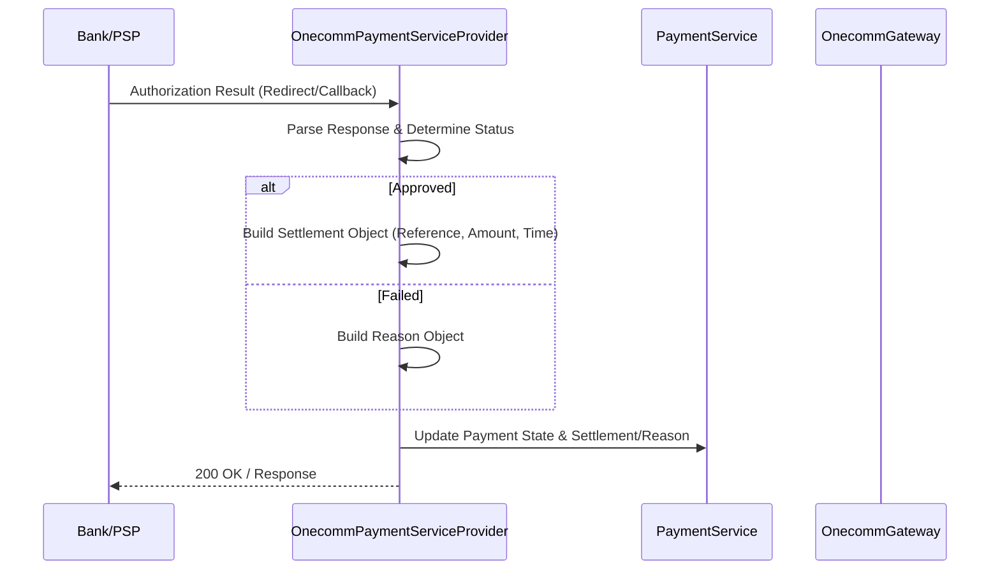
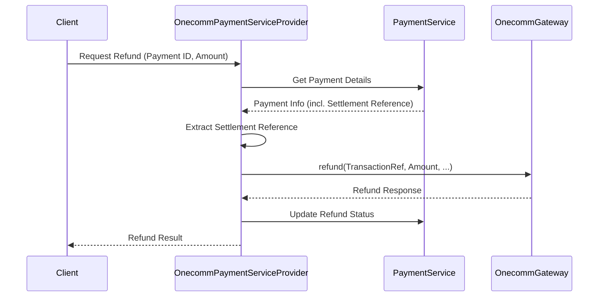

# Settlement Workflow

The settlement workflow in the PSP-Connector handles the finalization of payment transactions, specifically focusing on the capture or settlement of authorized payments. It also plays a crucial role in the refund process by providing the original transaction details required for refund initiation.

## Overview

Settlement requests are routed to `SettlementHandler` via the `POST /settlements` endpoint. The handler validates the request parameters and currently acts as a validator for incoming settlement requests. However, the core settlement logic is deeply integrated into the payment authorization lifecycle and refund processing flows within `OnecommPaymentServiceProvider`.

## Request Validation

The `SettlementHandler` validates incoming requests for the following required fields:
*   **Non-empty body**: Ensures request data exists.
*   **Merchant ID**: Must be present (`MERCHANT_ID`).
*   **Terminal ID**: Must be present (`TERMINAL_ID`).
*   **Batch No**: Must be a positive integer (`BATCH_NO`).

If validation fails, the handler throws a `BadRequestException` with the appropriate error code (e.g., `INVALID_MERCHANT`, `INVALID_TERMINAL`).

**Route Registration:**
```java
router.post(apiPrefix + SETTLEMENT).handler(SettlementHandler::handle);
```

## Integration with Authorization and Payment Lifecycle

While `SettlementHandler` validates the explicit settlement request, the system primarily updates settlement details during the authorization result processing.

When an authorization result is received (e.g., from a bank redirect or a synchronous response), `OnecommPaymentServiceProvider` processes the response:
1.  **Determine Status**: Checks if the transaction was `approved` or `failed`.
2.  **Construct Settlement Object**: If approved, a `settlement` object is created containing:
    *   `reference`: The transaction ID from the upstream PSP (OneComm).
    *   `amount`: The transaction amount.
    *   `currency`: The currency code (typically VND).
    *   `settlement_time`: The timestamp of the settlement.
    *   `review_fraud`: (Conditional) Added for specific merchants (e.g., Samsung) requiring external fraud review.
3.  **Update Payment**: The payment record is updated with the new state and settlement details via `PaymentService.update()`.



Caption: Bank->>Provider: Authorization Result Redirect/Callback

## Role in Refund Processing

Settlement data is critical for processing refunds. When a refund is initiated:
1.  **Retrieve Payment**: `PaymentService.get()` fetches the original payment details, including the `settlement` object.
2.  **Extract Reference**: The `reference` field from the `settlement` object (which corresponds to the PSP Transaction ID) is extracted.
3.  **Initiate Refund**: This reference is used to construct the refund request sent to the upstream PSP via `OnecommGateway.refund()`.



Caption: Client->>Provider: Request Refund Payment ID, Amount

## Database Interaction

### Settlement Data Storage

Settlement details are stored within the `S_RESPONSE_DATA` column of the payment record as a JSON object.

**DTO:** `OnecommTxnSettlementDTO`
Represents the settlement record in the database.
*   `transactionId`: Unique transaction identifier.
*   `settlementDate`: Date of settlement.
*   `status`: Settlement status.
*   `description`: Additional description.
*   `transactionDate`: Original transaction date.
*   `bankId`: Bank identifier.

**Procedure:**
`pkg_refund_extend.txn_settlement_select`: Retrieves settlement details based on a transaction ID.

### Payment Update

The `PaymentService` manages the state of payments, including the settlement information.
*   **Insert**: `PaymentService.insert()` or `insertFull()` creates the initial payment record.
*   **Update**: `PaymentService.update()` modifies the payment state and `S_RESPONSE_DATA` (which contains the settlement object) upon authorization completion.

## Component Responsibilities

### Handlers
*   **SettlementHandler**: Validates incoming explicit settlement requests. Currently primarily serves as a validation checkpoint.

### Service Providers
*   **OnecommPaymentServiceProvider**:
    *   Processes authorization results and constructs the settlement data.
    *   Uses settlement data to initiate refunds.
*   **OnecommRefundServiceProvider**: Utilizes settlement references to execute refunds against the upstream PSP.

### Gateways
*   **OnecommGateway**: Communicates with the OneComm PSP. Receives settlement details in authorization responses and sends refund requests using settlement references.

### Database
*   **PaymentService**: Persists payment and settlement data.
*   **OnecommDB**: Retrieves settlement records (`OnecommTxnSettlementDTO`) via stored procedures.
*   **OnecommTxnSettlementDTO**: Data Transfer Object for settlement records.

## Failure Handling

*   **Validation Errors**: `SettlementHandler` throws `BadRequestException` for missing or invalid fields.
*   **Processing Errors**: Exceptions during settlement processing or refund initiation are caught and propagated, often resulting in system errors or specific failure states for the transaction.
*   **Fraud Review**: For specific scenarios (e.g., Samsung transactions), a `review_fraud` flag is set in the settlement object, indicating a pending external check.

## Configuration

Key configuration parameters are defined in `AppParams`:
*   `SETTLEMENT`: Key for the settlement object in JSON payloads.
*   `SETTLEMENT_TIME`: Key for the settlement timestamp.
*   `BATCH_NO`: Key for the batch number in settlement requests.
*   `MERCHANT_ID`: Key for the merchant identifier.
*   `TERMINAL_ID`: Key for the terminal identifier.
