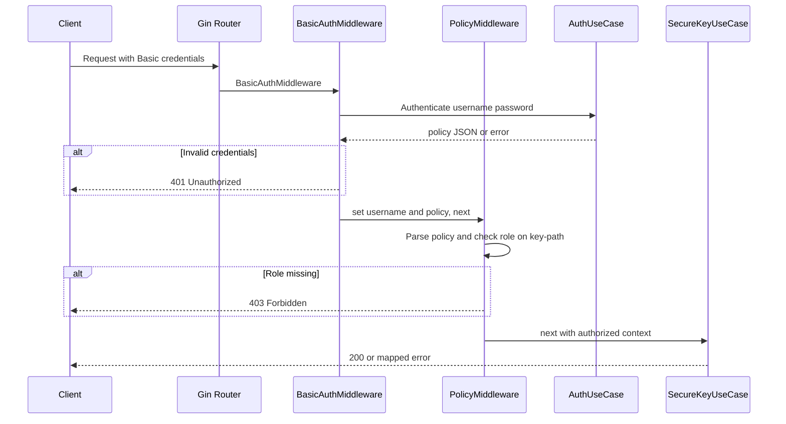

## Overview

The SCSP service exposes its driving adapter in `internal/adapters/driving/rest/handler.go`. A single Gin-based `Handler` owns the route table, middleware chain, request validation, and mapping of domain errors to HTTP status codes. `cmd/server/main.go` wires the handler with the `SecureKeyUseCase`, `AuthUseCase`, configured prefix URI, tracer service name, and logger, then serves the router on `server.port`.

## Route table and configuration

The API group is mounted under `server.prefixURI` from `config.yaml` (currently `/scsp/api/v1`; default `/api/v1` when unset). Every route in the group passes through `BasicAuthMiddleware`, then a `PolicyMiddleware` role check, then the endpoint handler:

| Method and path | Policy role | Handler | Purpose |
| --- | --- | --- | --- |
| `POST /key/*key-path` | `create` | `CreateKeyOrSubkeyHandler` | Encrypt and store a key or subkey |
| `PUT /key/*key-path` | `update` | `UpdateKeyOrSubkeyHandler` | Update an existing key or subkey |
| `GET /key/*key-path` | `read` | `ReadKeyOrSubkeyHandler` | Decrypt and return one key or subkey |
| `DELETE /key/*key-path` | `delete` | `DeleteKeyOrSubkeyHandler` | Delete one key or subkey |
| `GET /keys/*key-path` | `read` | `ReadAllSubkeysHandler` | Return values for all subkeys under a path |
| `LIST /keys/*key-path` | `list` | `ListSubkeysHandler` | Return metadata for all subkeys under a path |
| `DELETE /keys/*key-path` | `delete` | `DeletePathHandler` | Delete every key under a path |

## Middleware chain

At engine level, Gin Recovery runs first, followed by the OpenTelemetry Gin middleware (`otelgin.Middleware`) and a custom JSON access logger that injects trace context. The API group then applies, in order:

1. `BasicAuthMiddleware` — reads the request's Basic credentials, authenticates via `AuthUseCase.Authenticate`, and stores `username` and the raw `policy` JSON string in the Gin context. Failures return `401` with `WWW-Authenticate: Basic realm="Restricted"` and a generic `{"error": "Unauthorized"}` body; the underlying failure is logged internally but never disclosed to the client.
2. `PolicyMiddleware(requiredRole)` — unmarshals the policy JSON from the context and walks its `{path, roles}` entries. A request is allowed when some policy's `Path` is a prefix of the request `key-path` (after normalizing it to start with `/`) and that policy's `Roles` list contains the required role. Missing username yields `401`; missing or unparsable policy yields `403` or `500`; insufficient role yields `403 {"error": "Forbidden: Insufficient permissions"}` with a warn log naming the denied user, role, and path.
3. The endpoint handler.

## Key-path and subkey parsing

`parseKeyPathSubkey` interprets the trailing `/*key-path` parameter as either a directory path or a `path/subkey` pair:

- A value ending in `/` is treated as a pure key path; it must match `^/[-0-9a-zA-Z_/]+/$`, otherwise `400`.
- A value without a trailing `/` is split on `/`; the last segment becomes the subkey and the remainder becomes the key path (with leading and trailing `/`). It requires at least two segments, a matching key-path regex, and a subkey matching `^[-0-9a-zA-Z_]+$`.
- `ReadAllSubkeysHandler`, `ListSubkeysHandler`, and `DeletePathHandler` validate only the key-path regex against the wildcard parameter.

## Response and error contract

Handlers translate domain errors (`port.ErrKeyAlreadyExists`, `port.ErrKeyNotFound`, `port.ErrVersionConflict`) into HTTP responses, returning `409 Key already exists`, `404 Key not found` / `404 No keys found for path`, and `409 Version conflict` respectively. Any other use-case failure maps to `500` with a generic message, and the specific error is logged. Successful creates and updates return `200` with `version`, `custom_metadata`, and `created_time` (RFC3339Nano). Reads return `200` with `value`, `custom_metadata`, `version`, and `created_time`. Read-all returns `200` with a `data` array of `{value, key, custom_metadata, created_time}`; list returns `200` with `data` entries of `{key, custom_metadata, created_time}`. Deletes return `204` with no body. Malformed request bodies and failing path validation produce `400` with a descriptive error such as `"Invalid request body"` or the applicable regex message.

## Authenticated request flow

The diagram shows the middleware sequence for any authenticated request.
