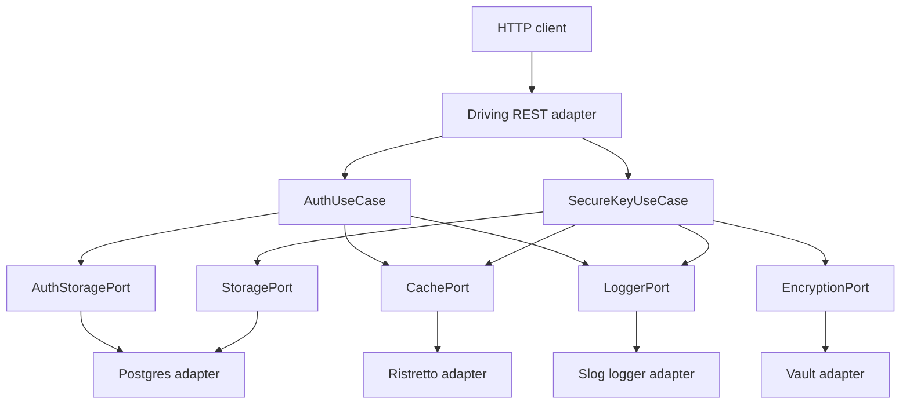

## Overview

The SCSP service is a Go application organized as a hexagonal (ports-and-adapters) system. The driving side exposes an HTTP API through a Gin REST adapter in `internal/adapters/driving/rest`. The domain layer defines usecases and abstract ports in `internal/domain/usecase` and `internal/domain/port`. The driven side implements those ports through PostgreSQL persistence, Vault transit encryption, and in-process Ristretto caching in `internal/adapters/driven`. Startup wiring, observability, and graceful shutdown live in `cmd/server/main.go`.

Dependencies point inward: REST handlers call usecases; usecases depend only on domain ports; adapters implement ports and are injected from `main`. Domain code never imports concrete adapters.

## Components and request path

The diagram shows the architectural request path: the driving REST adapter invokes domain usecases, usecases depend on ports, and driven adapters supply those ports. In production wiring, the Postgres adapter also supplies `AuthStoragePort`, and the Vault adapter supplies `EncryptionPort`.

### Driving adapter

`internal/adapters/driving/rest/handler.go` owns the HTTP surface. It maps routes, parses and validates `key-path`/subkey values, applies Basic authentication and path-role policy checks, translates domain errors to HTTP status codes, and calls usecases through interfaces rather than concrete implementations.

The API group is mounted under the configured prefix (`server.prefixURI`) and protected by `BasicAuthMiddleware`, `PolicyMiddleware`, route-specific role checks, Recovery, OpenTelemetry Gin instrumentation, and custom JSON access logging.

### Domain layer

`internal/domain/usecase` contains the application orchestration:

- `AuthUseCase.Authenticate` authenticates a user and returns the policy string used for authorization.
- `SecureKeyUseCase` owns secure key lifecycle operations: `Create`, `Update`, `Read`, `FindByPath`, `ListSubkeys`, `DeleteKey`, and `DeleteByPath`.

`internal/domain/port` defines the contracts the domain requires:

| Port | Responsibility |
| --- | --- |
| `StoragePort` | Save, update, find, list, and delete key records |
| `AuthStoragePort` | Retrieve a user's password hash and policy string |
| `EncryptionPort` | Encrypt plaintext and decrypt ciphertext |
| `CachePort` | Get, TTL set, delete, and clear cached values |
| `LoggerPort` | Context-aware logging, including OTel trace fields |

The port package also defines shared domain errors and `KeyData`, the metadata shape returned by storage operations.

### Driven adapters

- `internal/adapters/driven/postgres` implements `StoragePort` and `AuthStoragePort` using PostgreSQL and `pgx`.
- `internal/adapters/driven/vault` implements `EncryptionPort` using Vault transit encryption, with AppRole or static-token authentication.
- `internal/adapters/driven/cache` implements `CachePort` using Ristretto.
- `internal/logger` implements `LoggerPort` with `slog`, injecting `trace_id` and `span_id` when an active OpenTelemetry span is present.

## Startup wiring

`cmd/server/main.go` assembles the application in a fixed order:

1. Initialize the `slog` logger.
2. Load configuration with Viper through `config.Load`.
3. Initialize the OpenTelemetry tracer and retain its shutdown function.
4. Initialize the Vault adapter.
5. Initialize the Postgres adapter.
6. Initialize the Ristretto cache adapter.
7. Create `SecureKeyUseCase` with Vault, Postgres, cache, logger, and cache TTL.
8. Create `AuthUseCase` with Postgres, cache, logger, and cache TTL.
9. Create the REST handler and build the Gin router.
10. Start `http.Server` on `server.port`.
11. Wait for `SIGINT` or `SIGTERM`, then shut down HTTP and deferred adapter resources.

This wiring keeps infrastructure construction in `main` and keeps the domain layer free of adapter types.

## Request flow

For a typical authenticated key read, the request enters through the Gin router, passes Basic authentication through `AuthUseCase.Authenticate`, passes path-policy authorization, and reaches `SecureKeyUseCase.Read`. The usecase checks the cache, consults storage on a miss, decrypts through the encryption port, and caches the plaintext result for subsequent reads. The REST handler then serializes the response and maps domain errors to HTTP statuses.

For a create, the usecase encrypts through Vault, stores ciphertext in Postgres through `StoragePort`, and returns metadata to the HTTP handler. On update and delete paths, successful storage mutation invalidates the cached entry; path-wide delete clears the cache because the cache implementation has no prefix-deletion operation.

## Lifecycle and shutdown

The process lifecycle is designed for ordered initialization and graceful termination:

- Startup failures are fatal: configuration, tracer, Vault, Postgres, or cache initialization errors stop the process.
- HTTP serving happens in a goroutine; `main` blocks on OS shutdown signals.
- On `SIGINT` or `SIGTERM`, the HTTP server receives a five-second shutdown timeout.
- Deferred shutdown closes the Postgres pool, cache, Vault token-renewal context, and flushes the OpenTelemetry tracer provider.

Vault AppRole authentication can start a background token-renewal goroutine; cancellation of that context stops renewal during shutdown.

## Configuration and observability behavior

Configuration is loaded from YAML with `SCSP_`-prefixed environment overrides. Defaults cover server port and prefix, Postgres connection fields, Vault host/key/transit/auth fields, cache sizing and TTL, and tracer endpoint/service metadata.

Observability is cross-cutting:

- The tracer initializes an OTLP gRPC exporter and global OpenTelemetry provider.
- Gin requests are instrumented by `otelgin`.
- The REST handler and domain usecases log through `LoggerPort`; context-aware log calls attach OTel trace IDs.
- Gin's internal debug/error output is redirected into the same JSON logger.

## Invariants and failure semantics

Several architectural invariants matter when changing this system:

- Domain usecases depend on ports, not adapters.
- Concrete adapters are selected only during startup wiring in `cmd/server/main.go`.
- Key mutations version-check updates and map storage failures to domain errors such as `ErrKeyNotFound` and `ErrVersionConflict`.
- Caching is an optimization: cache read failures fall through to storage, and cache write failures do not fail otherwise-successful operations.
- Authentication and authorization failures remain generic at the HTTP boundary while internal logging retains detail.

## Extension points

The architecture supports replacement or extension by adding implementations of existing ports and changing startup wiring:

- Add another storage adapter by implementing `StoragePort` and `AuthStoragePort`, then inject it in `main`.
- Add another encryption backend by implementing `EncryptionPort`.
- Add another cache implementation by implementing `CachePort`.
- Add another logger by implementing `LoggerPort`.
- Add another driving adapter by calling the same usecase interfaces.

The main extension boundary is the domain port set; adapter internals do not need to change to add a new integration if the port contract still fits.

## Focused verification

Repository tests that matter for this architecture are primarily adapter and handler behavior tests under `internal/adapters`. The current tree contains no test files beside production code, so architecture-sensitive behavior should be verified with focused tests when adapters or wiring change: adapter interface conformance, usecase cache fallback semantics, domain-error mapping at the HTTP boundary, and startup/shutdown wiring.

## Related pages

- [HTTP API Surface](/openwiki/architecture/http-api.md)
<!-- openwiki: broken internal link [/openwiki/architecture/persistence-and-encryption.md] file "/openwiki/architecture/persistence-and-encryption.md" does not exist. Fix the href or restore the target, then delete this comment. -->
- [Persistence and Encryption](/openwiki/architecture/persistence-and-encryption.md)
- [Key Read Caching](/openwiki/workflows/key-read-caching.md)
