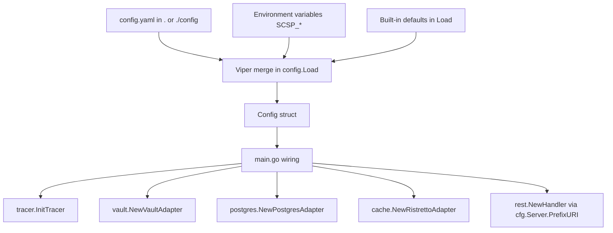

# Configuration and Environment

SCSP is configured through a single YAML file, environment variable overrides, and a set of built-in defaults. All three are merged in `config.Load` and then injected into the driving and driven adapters created in `main`. This page covers where configuration is loaded, how keys map to environment variables, defaults, TTL clamping, and which secrets must be supplied through the environment.

## Configuration flow

The diagram shows how Viper merges the file, environment, and defaults into one `Config`, which `main.go` then hands to each adapter.

## Loading and precedence

`config.Load` in `internal/config/config.go` initializes Viper to read `config.yaml` (`config` name, `yaml` type) from `.` and `./config`. If the file is missing, loading falls back to defaults and environment variables; a malformed file aborts startup. Environment variables use the `SCSP` prefix and a `.` to `_` key replacer via `AutomaticEnv`, so `SCSP_POSTGRES_PASSWORD` maps to `postgres.password`. Viper resolves values in the order: explicit `SetDefault` values < config file < environment variables, with environment overriding the file for the same key.

After building the `Config` struct, `Load` clamps `Cache.TTL`: non-positive values are reset to 300 seconds, and values above 86400 seconds are capped at one day.

## Keys, defaults, and SCSP_ overrides

| Config key | Default | SCSP_ env override | Where it is used |
| --- | --- | --- | --- |
| `server.port` | 8080 | `SCSP_SERVER_PORT` | HTTP listen address in `main.go` |
| `server.prefixURI` | `/api/v1` | `SCSP_SERVER_PREFIXURI` | REST router prefix |
| `grpc.port` | 50051 | `SCSP_GRPC_PORT` | gRPC server port (reserved) |
| `postgres.host` | `localhost` | `SCSP_POSTGRES_HOST` | Postgres DSN host |
| `postgres.port` | 5432 | `SCSP_POSTGRES_PORT` | Postgres DSN port |
| `postgres.user` | `scsp` | `SCSP_POSTGRES_USER` | Postgres DSN user |
| `postgres.password` | none | `SCSP_POSTGRES_PASSWORD` | Postgres DSN password |
| `postgres.dbName` | `scsp` | `SCSP_POSTGRES_DBNAME` | Postgres database name |
| `postgres.sslmode` | `disable` | `SCSP_POSTGRES_SSLMODE` | Postgres TLS mode |
| `vault.host` | `http://localhost:8200` | `SCSP_VAULT_HOST` | Vault client address |
| `vault.keyName` | none | `SCSP_VAULT_KEYNAME` | Transit key name |
| `vault.transit` | none | `SCSP_VAULT_TRANSIT` | Transit engine path |
| `vault.token` | none | `SCSP_VAULT_TOKEN` | Static token auth |
| `vault.roleId` | none | `SCSP_VAULT_ROLEID` | AppRole auth role ID |
| `vault.secretId` | none | `SCSP_VAULT_SECRETID` | AppRole auth secret ID |
| `cache.num_counters` | 10000000 | `SCSP_CACHE_NUM_COUNTERS` | Ristretto NumCounters |
| `cache.max_cost` | 1073741824 | `SCSP_CACHE_MAX_COST` | Ristretto MaxCost |
| `cache.buffer_items` | 64 | `SCSP_CACHE_BUFFER_ITEMS` | Ristretto BufferItems |
| `cache.ttl` | 300 | `SCSP_CACHE_TTL` | Default TTL, clamped to (0, 86400] |
| `tracer.endpoint` | `localhost:4317` | `SCSP_TRACER_ENDPOINT` | OTLP gRPC endpoint |
| `tracer.service_name` | `scsp` | `SCSP_TRACER_SERVICE_NAME` | Resource service name |
| `tracer.service_version` | `v1.0.0` | `SCSP_TRACER_SERVICE_VERSION` | Resource service version |
| `tracer.environment` | `prod` | `SCSP_TRACER_ENVIRONMENT` | Deployment environment attribute |

The deployed `config.yaml` at the repository root sets concrete values for most keys (e.g. server port 8015, prefix `/scsp/api/v1`, cache TTL 120), and intentionally leaves secret-bearing keys commented out.

## Secrets and authentication

Secrets must come from the environment, not from the committed YAML:

- `postgres.password` / `SCSP_POSTGRES_PASSWORD`
- `postgres.user` / `SCSP_POSTGRES_USER`
- `vault.token` / `SCSP_VAULT_TOKEN`
- `vault.roleId` / `SCSP_VAULT_ROLEID`
- `vault.secretId` / `SCSP_VAULT_SECRETID`

`vault.NewVaultAdapter` requires either AppRole credentials (`roleId` + `secretId`) or a static token; if both are absent it fails startup with `no authentication method provided`. With AppRole it starts a background token-renewal loop that refreshes at 80% of the lease duration. The production `config.yaml` documents the exact `SCSP_*` variable names in comments, and deployment scripts rsync a `config/` sibling directory next to the binary.

## Adapter responsibilities

- `tracer.InitTracer` dials the OTLP gRPC endpoint, sets the global tracer provider, and enables W3C TraceContext/Baggage propagation.
- `vault.NewVaultAdapter` builds the Transit client used for encryption and manages token renewal.
- `postgres.NewPostgresAdapter` builds a pgxpool DSN from the Postgres fields and returns errors on connection failure.
- `cache.NewRistrettoAdapter` sizes Ristretto from `num_counters`, `max_cost`, and `buffer_items`, and falls back to a 5-minute TTL if the configured TTL is non-positive.
- `rest.NewHandler` receives the server prefix URI and tracer service name from the loaded config.

## Failure modes and operational notes

- Missing config file is tolerated; missing secrets are not, because Vault auth or Postgres DSN construction will fail at startup.
- Invalid TTL values from the environment are normalized by the clamp in `Load`, so a zero or negative TTL cannot persist.
- The gRPC port is loaded but the current server only starts an HTTP listener.
- Use `make run` or `go run ./cmd/server` to start the server; environment overrides can be exported in the shell before launch.
